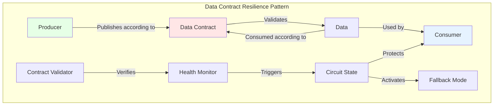
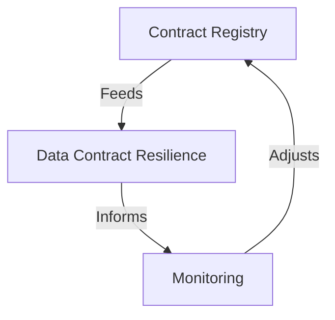

## The Data Contract Resilience Pattern

The Data Contract Resilience Pattern draws inspiration from the well-known Circuit Breaker pattern used in software development, but adapts it specifically to the context of data contracts. Its fundamental principle is to prevent the propagation of failures related to contract violations by quickly detecting and isolating problems.



This pattern operates at three distinct levels, all centered around the data contract:

1. **Contract Violation Detection**: Continuous monitoring of data compliance against established contracts (schema, quality, SLAs)
2. **Consumer Protection**: Rapid isolation of non-compliant data flows to prevent error propagation
3. **Controlled Adaptation**: Implementation of graceful degradation strategies defined in the contract itself

### The Circuit Breaker Applied to Data Contracts

The Circuit Breaker in this context works as follows:
- **Closed State**: Data flows normally, in accordance with the contract
- **Open State**: When too many contract violations are detected, the circuit opens to protect consumers
- **Half-Open State**: After a delay, the system tests if the problems are resolved before fully closing the circuit again

What distinguishes this pattern is that the rules for opening and closing the circuit are directly specified in the data contract, making the system self-adaptive.

### Fallback Mode as a Resilience Strategy

The Fallback Mode is a complementary strategy to the Circuit Breaker. When the circuit is open (indicating contract violations), instead of failing completely, the system can switch to a degraded but functional mode, also defined in the contract. For example:

- If real-time data doesn't meet the freshness contract, use the latest valid cached data
- If the complete schema cannot be validated, accept a minimal subset of critical fields defined in the contract
- If the primary producer is unavailable, switch to a secondary data source specified in the contract

Let's take a concrete retail example: the product recommendation system normally uses real-time customer navigation data, with a contract specifying the structure and freshness of the data. The contract also includes resilience rules:

```yaml
dataContractSpecification: 1.1.0
id: urn:datacontract:customer:behavior
info:
  title: "Customer Behavior Data"
  version: "1.0.0"
  description: "Real-time customer behavior data for recommendation engine"
  owner: "customer-analytics-team"
  contact:
    name: "Customer Analytics Team"
    email: "analytics@company.com"

models:
  CustomerBehavior:
    type: "object"
    description: "Customer behavior data model"
    fields:
      # Standard schema definition here...

# Resilience rules integrated into the contract
resilience:
  circuit_breaker:
    open_when:
      - "schema_validation_errors > 5%"
      - "data_freshness > 30min"
    recovery:
      retry_after: "5min"
      max_retries: 3
  
  fallback_modes:
    - level: "primary"
      source: "real_time_navigation"
      schema: "full_customer_behavior"
    - level: "fallback"
      source: "sales_history"
      schema: "minimal_product_data"
      activation_conditions:
        - "real_time_data_latency > 30s"
        - "schema_validation_errors > 5%"

terms:
  usage: "For recommendation engine use only"
  limitations: "Fallback mode limited to 24h continuous operation"
  noticePeriod: "P1D"

servicelevels:
  freshness:
    description: "Data freshness"
    threshold: "< 5min"
  completeness:
    description: "Data completeness"
    percentage: "> 95%"
```

This approach directly integrates resilience strategies into the data contract itself, creating a self-adaptive system capable of maintaining service, even in a degraded state, in the face of failures.

## The Proactive Monitoring Pattern 

## Pattern Orchestration

The true power of these patterns emerges from their harmonious orchestration. The Registry feeds the Data Contract Resilience Pattern with information about contract states, while monitoring provides an overview of system health. This synergy creates a self-regulating system capable of maintaining stability in the face of disruptions.



This orchestration enables dynamic management of data contracts, where each pattern plays a specific role in maintaining the quality and reliability of the overall system. 