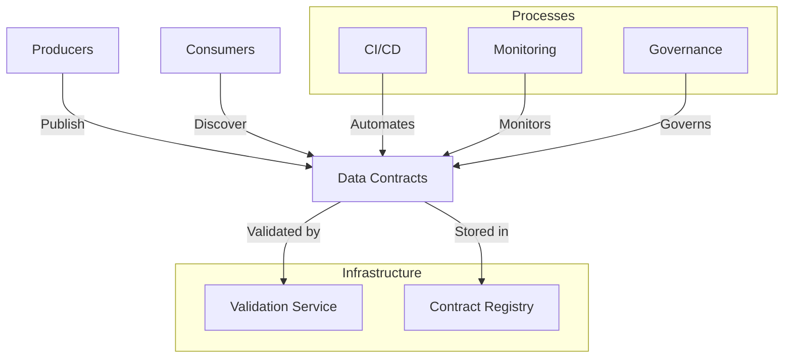

# Revolutionizing Data Management with Data Contracts

It's 3 AM. The support team receives a critical alert: the data pipeline feeding the real-time sales dashboard is down. Preliminary analysis reveals that the e-commerce team changed the order data format without notice. A required field was renamed, and now the entire processing chain is paralyzed. This situation, unfortunately too common, illustrates a frequently overlooked reality: data is not just an asset; it's a product that requires rigorous lifecycle management.

## The Daily Life Without Data Contracts

Imagine a growing e-commerce company. Several teams work in parallel on different parts of the system:

- The e-commerce team manages the sales platform and generates transaction data.
- The data science team develops recommendation models.
- The BI team produces reports for management.
- The marketing team leverages customer data for its campaigns.

On the surface, everything works. But beneath, it's chaos:

- Data engineers spend their days fixing broken pipelines because a field changed type or name.
- Data scientists find their models producing erroneous results due to silent changes in input data.
- The BI team constantly checks if metrics are still calculated the same way.

Meetings are filled with questions like: "Who changed this field?", "Why is the data different today?", "How are we supposed to use this column?"

## The Hidden Cost of No Contracts

This situation has a real, often underestimated cost:

- Business decisions made on incorrect data
- Hours lost in debugging and reconciliation
- Data projects falling behind schedule
- Loss of trust in data
- Stress and frustration within teams

This situation becomes even more critical in a Data Mesh context, where data responsibility is decentralized to business domains. Take the example of a bank I recently assisted in its Data Mesh transformation. Each domain - credit, savings, insurance - became responsible for its own data. Without data contracts, this decentralization initially amplified the problems: inconsistencies multiplied, traceability became a nightmare, and trust in data eroded.

On average, teams spend 40% of their time managing these coordination and quality issues. It's like building a house where each craftsman uses their own units of measure, but on the scale of an entire city.

## The Emergence of Data Contracts

The Data Mesh transformation represents a fundamental shift in how organizations manage their data. In this model, each business domain becomes responsible for its own data, whether it's credit, savings, or insurance data for a bank, or sales, logistics, or marketing data for a retailer. This decentralization promises better agility and greater alignment with business needs.

However, this increased autonomy of domains creates new challenges. Without an appropriate structure, coordination problems multiply. Teams can spend up to 40% of their time managing data consistency and quality issues, a hidden but significant cost. Data Contracts emerge as a structured response to these challenges.

Let's examine the typical architecture of a Data Contracts implementation:



This architecture illustrates the essential components of a Data Contracts system. The contract registry centralizes definitions, while the validation service ensures compliance. Integration with CI/CD processes allows automation, while monitoring ensures continuous quality. Governance, finally, provides the necessary framework for controlled evolution.

## Open Data Contract Standard (ODCS)

Faced with these challenges, a standard has emerged: the Open Data Contract Standard (ODCS). It's not just another technical specification; it's a common language that allows teams to clearly communicate their expectations and commitments regarding data. Let's take a concrete example of an ODCS contract for a customer data stream:

```yaml
odcs_version: "1.0.0"
id: "customer_profile"
version: "1.0.0"
domain: "customer"
owner: 
  team: "customer-data"
  contact: "customer-data@company.com"

interface:
  type: "batch"
  spec:
    format: "parquet"
    schema:
      type: "struct"
      fields:
        - name: "customer_id"
          type: "string"
          description: "Unique customer identifier"
          constraints:
            - type: "not_null"
        - name: "email"
          type: "string"
          constraints:
            - type: "email_format"

quality:
  rules:
    - name: "email_validity"
      severity: "critical"
    - name: "recent_data"
      severity: "warning"

operational:
  sla:
    freshness: "24h"
    availability: "99.9%"
```

Let's analyze each section of this contract in detail:

1. The contract header establishes its identity and governance. The `domain` field is not just a simple categorization - it explicitly links this data to a responsible business unit. The contact information is not an administrative formality; it's a commitment to responsibility.

2. The `interface` section goes beyond a simple technical description. The choice of Parquet format is not trivial - it reflects a compromise between read performance and schema flexibility. Each schema field is documented and constrained, creating a clear framework for data quality.

3. Quality rules establish a clear hierarchy of potential issues. An invalid email address is considered critical because it can directly impact customer communication, while data freshness is a warning that deserves attention without necessarily triggering an alarm.

4. Operational SLAs are not just goals - they represent a concrete service contract between the producer and its consumers. A freshness of 24h and an availability of 99.9% are measurable commitments that will guide architectural and operational choices.

## Implementation: From Concepts to Reality

Implementing data contracts in a datalake context is particularly relevant, especially in a medallion architecture (bronze, silver, gold). Let's take the example of the sales domain, where raw transaction data is progressively refined to feed critical analyses and dashboards.

The first established contract concerns the silver table of sales transactions. This table is a critical point: it cleans and standardizes raw data from the bronze layer and serves as the source of truth for creating gold layer aggregates.

```yaml
odcs_version: "1.0.0"
id: "sales_transactions_silver"
version: "1.0.0"
domain: "sales_analytics"
owner: 
  team: "data-engineering"
  contact: "data-engineering@retail.com"

interface:
  type: "batch"
  spec:
    format: "delta"
    schema:
      fields:
        - name: "transaction_id"
          type: "string"
          description: "Unique transaction identifier"
          constraints:
            - type: "not_null"
            - type: "unique"
            
        - name: "transaction_date"
          type: "date"
          description: "Transaction date"
          constraints:
            - type: "not_null"
            - type: "not_future"
            
        - name: "store_id"
          type: "string"
          description: "Unique store identifier"
          constraints:
            - type: "not_null"
            - type: "reference"
              table: "dim_stores"
              field: "store_id"
            
        - name: "product_id"
          type: "string"
          description: "Unique product identifier"
          constraints:
            - type: "not_null"
            - type: "reference"
              table: "dim_products"
              field: "product_id"
              
        - name: "quantity"
          type: "integer"
          description: "Quantity sold"
          constraints:
            - type: "positive"
            
        - name: "unit_price"
          type: "decimal"
          description: "Unit price at the time of sale"
          constraints:
            - type: "positive"
            
        - name: "total_amount"
          type: "decimal"
          description: "Total line amount"
          constraints:
            - type: "positive"

quality:
  rules:
    - name: "amount_consistency"
      description: "Check total amount"
      severity: "critical"
      check: >
        ABS(total_amount - (quantity * unit_price)) <= 0.01
        
    - name: "referential_integrity"
      description: "Check references"
      severity: "critical"
      check: >
        EXISTS(SELECT 1 FROM dim_stores s WHERE s.store_id = store_id) AND
        EXISTS(SELECT 1 FROM dim_products p WHERE p.product_id = product_id)
        
    - name: "deduplication"
      description: "Detect duplicates"
      severity: "warning"
      check: >
        COUNT(*) = COUNT(DISTINCT transaction_id)

processing:
  scheduling:
    frequency: "hourly"
    dependencies:
      - "sales_transactions_bronze"
      - "dim_stores"
      - "dim_products"
  expectations:
    volume:
      min_rows: 1000
      max_rows: 1000000
    latency: "30m"

operational:
  sla:
    freshness: "1h"
    availability: "99.9%"
  monitoring:
    metrics:
      - name: "quality_score"
        description: "Percentage of rows meeting all rules"
        threshold: 0.99
      - name: "processing_time"
        threshold: "15m"
      - name: "incremental_volume"
        description: "Number of new rows per run"
        alert:
          min: 100
          max: 100000
```

This contract introduces several fundamental concepts adapted to a medallion datalake context:

1. **Multi-level Quality Control**: Quality rules cover both data integrity (transaction uniqueness, amount consistency) and referential integrity with dimensions. This dual validation ensures the reliability of downstream analyses.

2. **Batch-Adapted SLAs**: Freshness and availability metrics are calibrated for hourly batch processing, with clear expectations on data volumes expected at each run.

3. **Data Engineering-Oriented Monitoring**: Monitoring integrates metrics specific to data processing, such as quality rate and volume variations, essential for detecting anomalies in the processing chain.

## Where to Start?

In a Data Mesh context, adopting data contracts must align with the maturity of domains as data producers. I've observed that organizations succeed better when they:

1. Identify a mature and motivated business domain to lead the initiative. In retail, the sales domain often plays this role, creating a concrete example for other domains.
2. Start with a critical data product with multiple consumers. The silver table of transactions is perfect: critical data for reporting, multiple analytical consumers, clear quality needs.
3. Establish a short feedback loop with consumers. Data scientists analyzing purchasing behaviors provide valuable feedback on necessary attributes and their quality constraints.
4. Gradually automate validations and monitoring, transforming the contract into a living tool rather than static documentation.
5. Document and share successes to create a snowball effect. When other domains see the reduction of incidents and the improvement of analysis reliability, they naturally adopt the approach.

The goal is not immediate perfection but to establish a new standard of collaboration around data. If you want the adoption of data contracts to be successful, everyone must be involved and adhere to the format, otherwise, your production deployment will fail.

## Conclusion

Data contracts in a datalake are not just documentation - they become the safeguard that ensures data quality and reliability at every transformation stage. By formalizing expectations and responsibilities, they create a framework of trust that allows building reliable analyses on quality data.

In the next article, we will explore how these contracts integrate into a comprehensive data governance strategy, focusing on the evolution and maintenance of contracts over time.

## Reference Implementation

The concepts presented in this article are implemented in the following files:

- [Basic Data Contract](../../../contracts/customer-domain/order_events.yaml) - Simple contract example
- [Advanced Data Contract](../../../contracts/customer-domain/customer_profile_events.yaml) - Contract with quality rules
- [Validation Tests](../../../validation/contract_tests.py) - Validation implementation

To get started with these examples, see the [quick start guide](../../../README.md#-quick-start). 