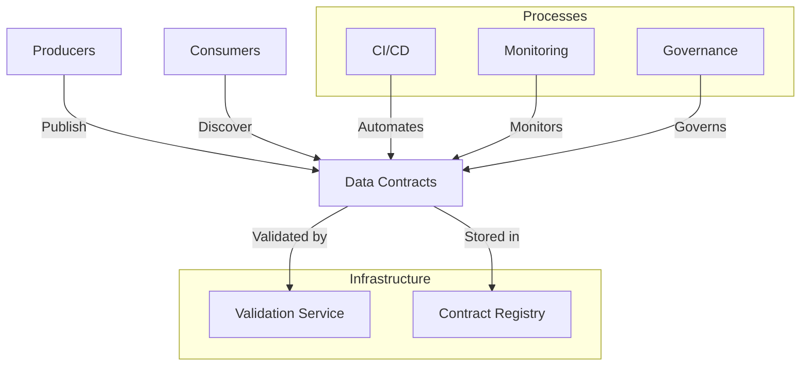

# Revolutionizing Data Management with Data Contracts

It's 3 AM. The support team receives a critical alert: the data pipeline feeding the real-time sales dashboard is down. Preliminary analysis reveals that the e-commerce team modified the order data format without notice. A required field was renamed, and now the entire processing chain is paralyzed. This situation, unfortunately too common, illustrates an often-neglected reality: data is not just an asset, it's a product that requires rigorous lifecycle management.

## Daily Life Without Data Contracts

Imagine a growing e-commerce company. Several teams work in parallel on different parts of the system:

- The e-commerce team manages the sales platform and generates transaction data
- The data science team develops recommendation models
- The BI team produces reports for management
- The marketing team uses customer data for campaigns

On the surface, everything works. But beneath, it's chaos:

- Data engineers spend their days fixing broken pipelines because a field changed type or name
- Data scientists discover their models are producing erroneous results due to silent changes in input data
- The BI team must constantly verify if metrics are still calculated the same way

Meetings are filled with questions like: "Who changed this field?", "Why is the data different today?", "How are we supposed to use this column?"

## The Hidden Cost of Missing Contracts

This situation has a real cost, often underestimated:

- Business decisions made on incorrect data
- Hours lost in debugging and reconciliation
- Delayed data projects
- Loss of trust in data
- Stress and frustration in teams

This situation becomes even more critical in a Data Mesh context, where data responsibility is decentralized to business domains. Take the example of a bank I recently assisted in its Data Mesh transformation. Each domain - credit, savings, insurance - became responsible for its own data. Without data contracts, this decentralization initially amplified the problems: inconsistencies multiplied, traceability became a nightmare, and trust in data eroded.

On average, teams spend 40% of their time managing these coordination and quality issues. It's like building a house where each craftsman would use their own units of measurement, but at the scale of an entire city.

## The Emergence of Data Contracts

The Data Mesh transformation represents a fundamental change in how organizations manage their data. In this model, each business domain becomes responsible for its own data, whether it's credit, savings, or insurance data for a bank, or sales, logistics, or marketing data for a retailer. This decentralization promises better agility and greater alignment with business needs.

However, this increased domain autonomy creates new challenges. Without proper structure, coordination problems multiply. Teams can spend up to 40% of their time managing data consistency and quality issues, a hidden but significant cost. Data Contracts emerge as a structured response to these challenges.

Let's examine the typical architecture of a Data Contracts implementation:



This architecture illustrates the essential components of a Data Contracts system. The contract registry centralizes definitions, while the validation service ensures their compliance. Integration with CI/CD processes enables automation, while monitoring ensures continuous quality. Governance, finally, provides the framework necessary for controlled evolution.

## Open Data Contract Standard (ODCS)

Facing these challenges, a standard has emerged: the Open Data Contract Standard (ODCS). This isn't just another technical specification - it's a common language that allows teams to clearly communicate their expectations and commitments regarding data. Here's a concrete example of an ODCS contract for a customer data stream:

```yaml
apiVersion: v3.0.0
kind: DataContract
id: urn:datacontract:customer:profile
domain: customer-domain
tenant: CustomerDataInc
name: Customer Profile
version: 1.0.0
status: active

description:
  purpose: "Provide standardized access to customer profile data"
  usage: "Internal use for customer analytics and personalization"
  limitations: "Contains PII data - special handling required"
  dataGranularityDescription: "One record per customer"

schema:
  - name: CustomerProfile
    physicalName: customer_profiles
    physicalType: table
    description: "Core customer profile information"
    tags: ["customer", "profile", "PII"]
    properties:
      - name: customer_id
        logicalType: string
        physicalType: text
        description: "Unique customer identifier"
        isNullable: false
        isUnique: true
        criticalDataElement: true
        examples: ["CUST-001", "CUST-002"]
        classification: "INTERNAL"
      - name: email
        logicalType: string
        physicalType: text
        description: "Customer email address"
        isNullable: false
        pattern: "^[A-Za-z0-9._%+-]+@[A-Za-z0-9.-]+\\.[A-Za-z]{2,}$"
        classification: "PII"
        examples: ["john.doe@email.com"]
      - name: first_name
        logicalType: string
        physicalType: text
        description: "Customer first name"
        isNullable: false
        classification: "PII"
        examples: ["John"]

quality:
  - rule: emailValidation
    description: "Email addresses must be properly formatted"
    dimension: validity
    severity: error
    businessImpact: critical
  - rule: uniqueCustomerId
    description: "Customer IDs must be unique"
    dimension: uniqueness
    severity: error
    businessImpact: critical

team:
  - username: jsmith
    role: Data Product Owner
    dateIn: "2023-01-01"
  - username: mwilson
    role: Data Steward
    dateIn: "2023-01-01"

support:
  - channel: "#customer-data-help"
    tool: slack
    url: https://company.slack.com/customer-data-help
  - channel: customer-data@company.com
    tool: email
    url: mailto:customer-data@company.com

servers:
  - server: prod
    type: postgresql
    format: sql
    url: postgresql://customer-db.prod.company.com:5432/customers
    description: "Production customer database"

slaProperties:
  - property: latency
    value: 1
    unit: h
  - property: retention
    value: 7
    unit: y
  - property: frequency
    value: 15
    unit: m

tags:
  - customer
  - profile
  - PII

customProperties:
  - property: dataDomain
    value: customer
  - property: retentionPolicy
    value: standard
  - property: piiData
    value: true
```

Let's analyze each section of this contract in detail:

1. The contract header establishes its identity and governance. The `id` field uniquely identifies the contract, while the `info` section provides essential metadata, including contact information for the responsible team.

2. The `servers` section defines where and how the data is stored. In this example, we have a local configuration for development and a production configuration in S3.

3. The `models` section describes the data structure with a precise definition of each field. Fields containing personal data (PII) are clearly identified, and validation constraints are explicit.

4. The `terms` establish usage conditions, including regulatory compliance aspects and data retention duration expressed in ISO 8601 format.

5. The `servicelevels` define measurable commitments on data availability and privacy compliance, with precise response times for requests related to personal rights.

## Implementation: From Concepts to Reality

The implementation of data contracts in a data lake context is particularly relevant, especially in a medallion architecture (bronze, silver, gold). Let's take the example of the sales domain, where raw transaction data is progressively refined to feed critical analyses and dashboards.

## Where to Start?

In a Data Mesh context, data contract adoption must align with domains' maturity as data producers. I've observed that organizations succeed better when they:

1. Identify a mature and motivated business domain to pilot the initiative. In retail, the sales domain often plays this role, creating a concrete example for other domains.
2. Start with a critical data product having multiple consumers. The silver transactions table is perfect: critical data for reporting, multiple analytical consumers, clear quality needs.
3. Establish a short feedback loop with consumers. Data scientists analyzing purchase behaviors provide valuable feedback on necessary attributes and their quality constraints.
4. Progressively automate validations and monitoring, transforming the contract into a living tool rather than static documentation.
5. Document and share successes to create a snowball effect. When other domains see the reduction in incidents and improvement in analysis reliability, they naturally adopt the approach.

The goal isn't immediate perfection, but to establish a new standard of collaboration around data. If you want data contract adoption to succeed, everyone must be involved and respect the format, without which your production deployment will fail.

## Conclusion

Data contracts in a data lake aren't just documentation - they become the guardrail ensuring data quality and reliability at each transformation step. By formalizing expectations and responsibilities, they create a trust framework that allows building reliable analyses on quality data.

In the next article, we'll explore how these contracts integrate into a global data governance strategy, emphasizing contract evolution and maintenance over time.

## Reference Implementation

The concepts presented in this article are implemented in the following files:

- [Basic Data Contract](../../../contracts/customer-domain/order_events.yaml) - Simple contract example
- [Advanced Data Contract](../../../contracts/customer-domain/customer_profile_events.yaml) - Contract with quality rules
- [Validation Tests](../../../validation/contract_tests.py) - Validation implementation

To get started with these examples, consult the [quick start guide](../../../README.md#quick-start).