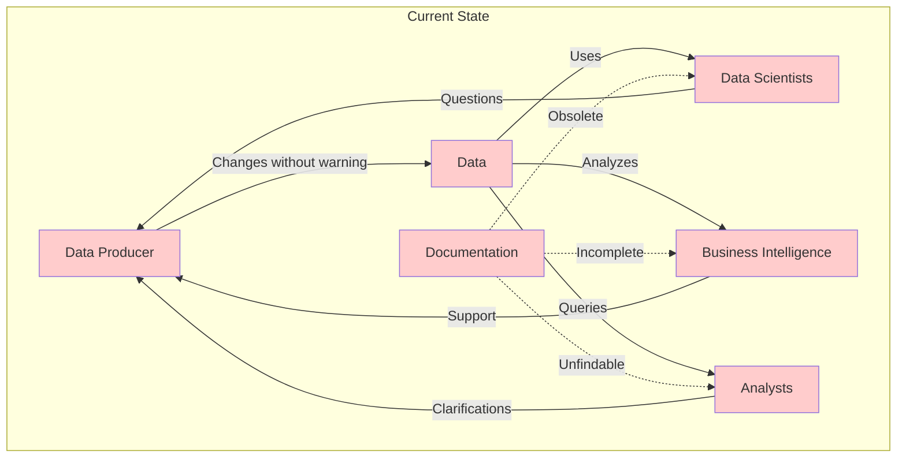
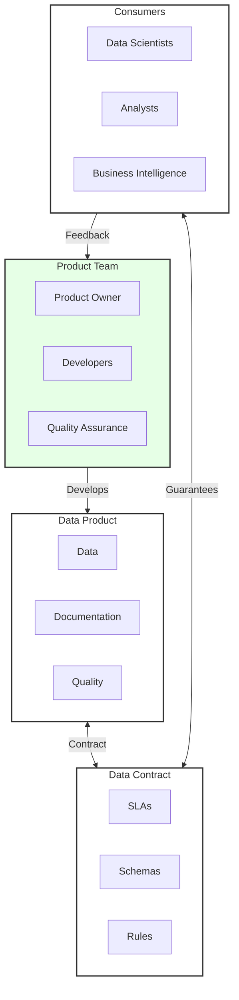
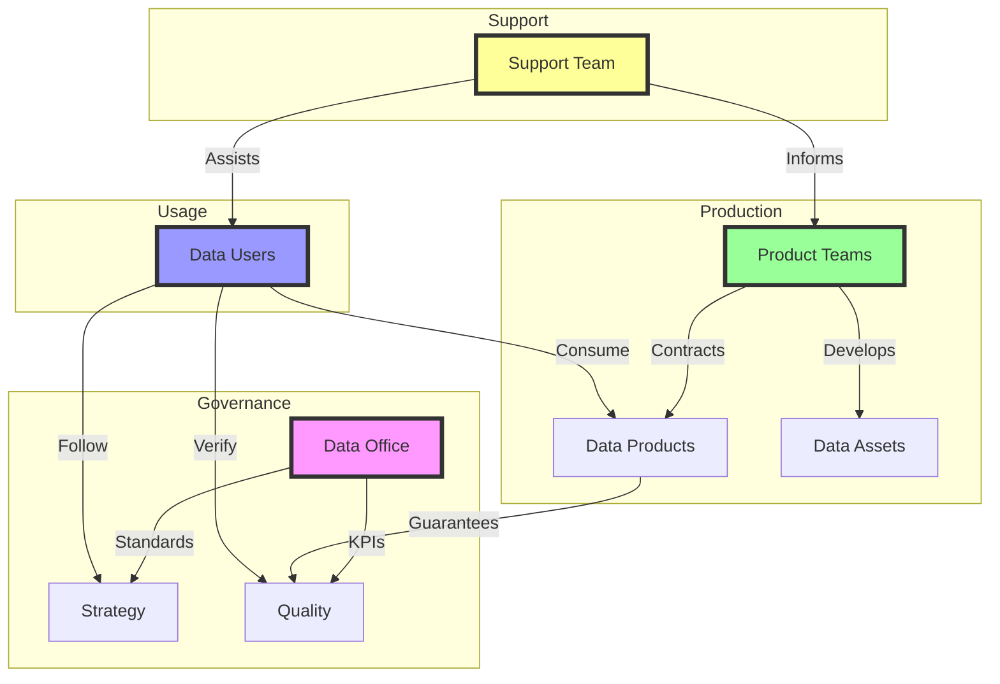
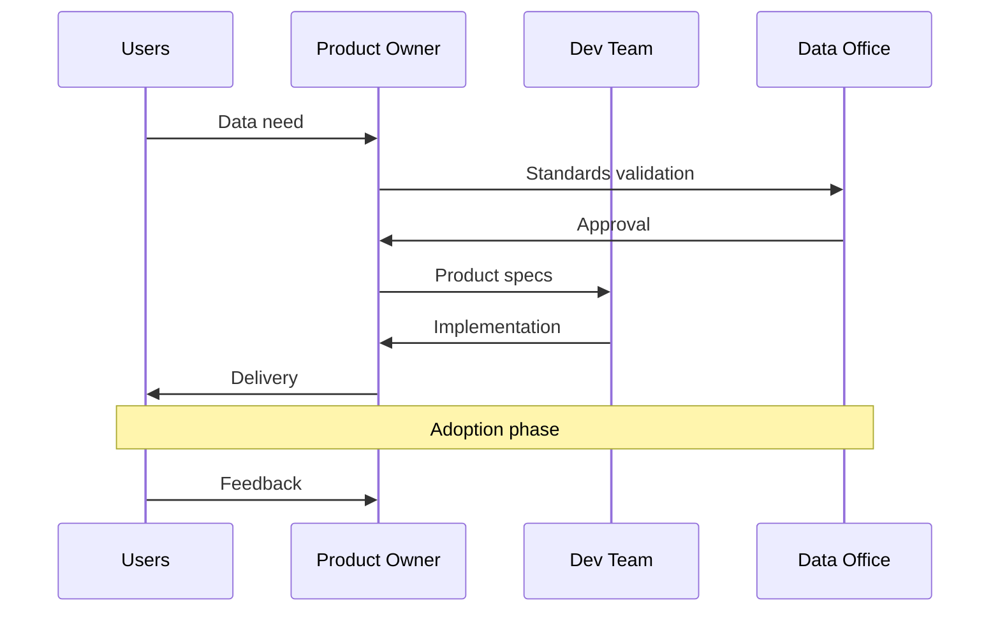
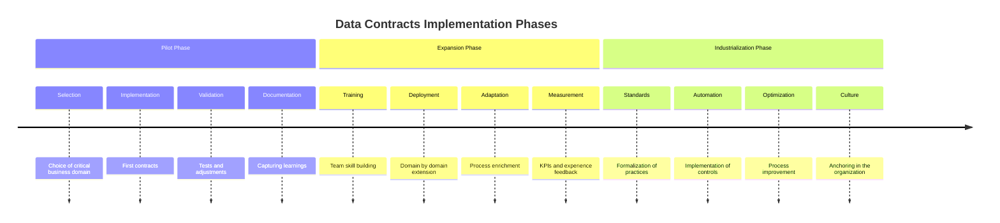

# Data Contracts: The Key to Reliable and Product-Oriented Data

In our first article, we explored the fundamentals of data contracts and their essential role in transforming data into products. We saw how this approach allows structuring and formalizing data exchanges within an organization. But how does this transformation happen in practice? What challenges need to be overcome, and what solutions should be implemented?

To understand the scale of the necessary change, let's first dive into the daily reality of organizations. The more data companies accumulate, the more complex its exploitation paradoxically becomes. Data scientists struggle to locate the documentation they need. Analysts discover, often too late, that the data format has changed without notice. Business teams question the reliability of the data they use for strategic decisions.

These situations, although common, are not inevitable. In this article, we'll explore in detail how data contracts address these daily challenges, first examining current issues and then detailing the concrete solutions they bring. We'll see how this approach, beyond its technical aspect, profoundly transforms the way an organization produces, maintains, and consumes its data.

## The Current Situation: A Fragmented Ecosystem

The traditional data ecosystem often resembles a city that grew without an urban plan. Each team has built its territory, creating a complex patchwork of silos that communicate poorly with each other. This fragmentation, though historically understandable, now generates more problems than it solves.

At the heart of this system, data producers often operate in urgency, modifying structures or formats without being able to measure the impact of their changes. Documentation, when it exists, quickly becomes obsolete, lost in poorly adapted document management systems (who doesn't have both a wiki and a collaborative documentation tool?). Overwhelmed by support requests, they struggle to maintain the expected quality of service.

On the other side, data consumers navigate blindly. Data scientists waste precious time looking for the right information or understanding why their pipelines mysteriously stopped. Business Intelligence teams discover changes during their analyses, questioning the reliability of their reports. Business analysts, caught in between, multiply requests for clarification.

This fragmentation has a real cost for the organization. Beyond the obvious loss of operational efficiency, the very ability of the company to exploit its data heritage is compromised. Advanced analytics or artificial intelligence projects, which require reliable and well-documented data, are particularly impacted. A structural change becomes necessary.

## The Transformation: Data Contracts + Product Approach

The answer to these challenges lies in a dual transformation: the adoption of data contracts coupled with a true product approach. This paradigm shift fundamentally redefines how organizations design, produce, and consume their data.

The product approach introduces a new vision, centered on the user. Data is no longer simply "produced" but truly "designed" to meet specific needs. A clear roadmap guides its evolution, while professional support ensures its proper use. Continuous improvement becomes the norm, fueled by constant user feedback.

Data contracts, for their part, formalize commitments between producers and consumers. Schemas are rigorously documented, quality is subject to explicit guarantees, and precise SLAs define expected service levels. Any change now follows a structured process, allowing consumers to anticipate and adapt.

This new organization creates a virtuous circle where data quality continuously improves. The real needs of users guide the evolution of data products, while robust processes guarantee stability and reliability. Data finally becomes what it should always have been: a strategic asset that is mastered and valued.

## The Complete Ecosystem

A mature data ecosystem requires precise orchestration between different actors, each with a crucial role to play in overall success.

### The Stakeholder Ecosystem

Implementing data contracts requires precise orchestration between multiple actors in the organization. At the heart of this ecosystem, the Business Sponsor carries the vision and unlocks necessary resources, while Data Managers ensure daily supervision of operations. Data Owners, guarantors of data quality and integrity, work hand in hand with the Core Data Product that orchestrates all interactions.

The product team plays a central role in this transformation. The Data Product Owner defines the product vision in close collaboration with Source Product Managers who manage source data. The development team, supported by Data Quality Managers, implements contracts following a "3 amigos" approach that ensures alignment between business needs, data quality, and technical feasibility.

User support takes on a new dimension with the establishment of a dedicated team that assists End-Users in their daily use of data. This team works closely with Stakeholders and Application Owners to ensure an optimal user experience and successful adoption.

Governance, driven by the Data Office, plays a crucial role in establishing and maintaining standards. Data architects validate proposed designs, while Data Stewards enrich the data catalog and Security Officers ensure access compliance.

This complex but necessary organization allows addressing the multiple challenges of modern data. Business validation becomes a fluid process where business value is clearly identified and rules are validated by all stakeholders. Quality and compliance are ensured by documented processes and clearly established rules. Operational support relies on defined SLAs and mastered evolution processes. Finally, technical collaboration enables rigorous validation of feasibility and precise qualification of data sources.

## The Collaboration Process

Implementing data contracts requires a well-defined collaboration process, where each actor plays a precise role in a meticulously orchestrated choreography. This process, far from being an additional bureaucratic constraint, forms the foundation for effective collaboration and controlled evolution of the data heritage.

The cycle always starts with the expression of a user need. Whether it's a new data source or the evolution of an existing data product, the Product Owner plays a central role in translating these needs into concrete specifications. This first step is crucial: it ensures that the future data contract will address the real business issues while remaining technically feasible.

Validation by the Data Office constitutes an essential checkpoint. This team, guardian of the organization's standards, ensures that the new contract integrates harmoniously into the existing ecosystem. It verifies compliance with quality, security, and governance standards, while providing expertise to optimize the proposed solution.

Once standards are validated, the development team comes into play. Their mission goes beyond simple technical implementation: they collaborate closely with the Product Owner to refine specifications, identify potential friction points, and propose innovative solutions. This iterative phase leads to a robust and scalable data product.

Delivery marks the beginning of an equally important new phase: adoption. The Product Owner assists users in getting familiar with the new data contract, collects their initial feedback, and identifies areas for improvement. This adoption phase is critical for long-term success: it ensures that the contract effectively meets needs and is correctly used.

The loop closes with continuous user feedback, fueling a permanent improvement cycle. This valuable feedback helps refine existing contracts and enrich best practices for future developments.

This collaborative process ensures several essential benefits:
- A clear and shared definition of needs, avoiding costly misunderstandings
- Systematic validation of standards, ensuring the coherence of the data ecosystem
- Rigorous and documented implementation, facilitating future maintenance
- A continuous feedback cycle, allowing constant improvement of services

The key to success lies in the fluidity of these interactions. Each actor must understand their role and have the necessary tools to collaborate effectively. Agile project management tools, combined with dedicated data contract collaboration platforms, facilitate this complex orchestration.

## Benefits of This Approach

Adopting data contracts generates cascading benefits throughout the organization. For data teams, it's a profound transformation of their way of working. The product vision finally allows them to break out of the infernal cycle of ad-hoc requests to focus on creating sustainable value. Processes, now structured, bring clarity and predictability to their daily work. User satisfaction naturally improves, drastically reducing time spent on technical support and emergency fixes.

For users, the change is just as striking. Documentation, once scattered and often obsolete, becomes a reliable source of information, constantly kept up to date. Service guarantees provide the serenity necessary to build lasting solutions. Professional support, organized and responsive, helps them quickly solve their difficulties. Evolutions, previously sources of anxiety, now follow a controlled process that preserves the stability of their applications.

For the organization as a whole, benefits quickly materialize into competitive advantages. Projects accelerate, freed from the brakes related to understanding and accessing data. The overall quality of solutions improves, driven by a better understanding of source data. The return on investment for data initiatives naturally optimizes, while governance, finally effective, allows maintaining the course over the long term.

## Progressive Implementation

Implementing data contracts cannot happen overnight. It requires a progressive approach, respectful of the organization's pace of learning and adaptation.

The pilot phase constitutes a crucial step in this transformation. It begins with the careful selection of a critical business domain, important enough to demonstrate the value of the approach, but circumscribed enough to remain manageable. The first contracts are then put in place with particular care, each decision being documented to serve as a reference for later phases. This phase allows validating the approach in the specific context of the organization and documenting the first successes that will serve to convince the most skeptical.

Expansion represents the most delicate phase. Deployment is carried out domain by domain, taking into account the specificities and maturity of each. Team training then takes on capital importance: it's not simply about explaining new processes, but instilling a new data culture. Existing processes are progressively adapted, enriched with lessons learned during the pilot phase. Results are measured with precision, feeding a virtuous circle of continuous improvement.

Industrialization marks the last stage of this transformation. Practices, now proven, are standardized across the organization. Controls, initially manual, are progressively automated to ensure systematic application of standards. Processes are continuously optimized, nourished by accumulated experience and field feedback. Continuous improvement then becomes not just an objective, but a daily reality anchored in the company's culture.

## Conclusion

Transforming an organization towards a model based on data contracts represents much more than a simple technical change - it's a true cultural revolution in our approach to data. We've seen how this transformation profoundly impacts the company's culture, placing quality and reliability at the heart of daily concerns. Data-producing and consuming teams find themselves empowered, leading to better valorization of the data heritage.

The success of this transformation rests on several fundamental pillars that we've explored: strong management commitment, a pragmatic approach favoring quick wins, transparent communication, and adequate team training. But these foundations, as solid as they may be, are not enough. To realize this vision, the organization must equip itself with robust processes and adapted tools.

This is precisely what we'll explore in upcoming articles. We'll first see how to set up effective workflows for managing data contracts, detailing the processes of creation, validation, and evolution. We'll then dive into the technical aspects of implementation, exploring the tools and technologies that allow transforming this vision into operational reality.

In the next article, we'll focus on workflows and versioning of data contracts, essential elements to guarantee controlled evolution of your data heritage.