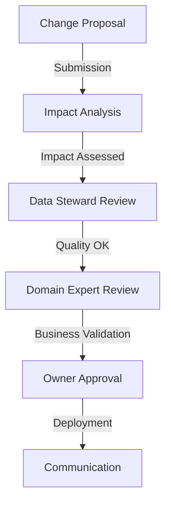

# Structure and Governance: The Architecture That Makes the Difference

The data science team just finished a tense presentation to the executive committee. Their Black Friday sales forecasts were largely overestimated, causing costly overstocking. Analysis reveals that changes in average basket calculation rules, though documented in a Jira ticket, were never communicated to the analysis teams. This situation, unfortunately common in retail, illustrates why data contract governance cannot be reduced to purely technical aspects.

## Why Start with Governance?

Before diving into the technical details of data contracts, it's crucial to understand how they integrate into the organization. Experience shows that failures in data contract adoption are rarely due to technical problems, but rather to gaps in governance and organization.

Take the example of a large retail chain that had invested heavily in a sophisticated technical solution for data contracts. Six months after launch, less than 20% of teams were effectively using the contracts. The post-mortem analysis revealed that the project had neglected organizational aspects: who is responsible for what? How are decisions made? How are changes communicated?

## The Architecture of a Data Contract

A well-structured data contract resembles a constitution more than a simple technical specification. It establishes not only technical rules but also responsibilities and decision processes.

Here's a concrete example from an e-commerce company:

```yaml
apiVersion: v3.0.0
kind: DataContract
id: urn:datacontract:retail:transactions
domain: retail-domain
tenant: RetailCorp
name: Retail Transactions
version: 2.1.0
status: active

description:
  purpose: "Provide access to retail transaction data for analytics and reporting"
  usage: "Internal use for retail analytics and reporting"
  limitations: "Data steward approval required for changes"
  authoritativeDefinitions:
    - type: business-glossary
      url: https://company.com/glossary/retail-transactions

schema:
  - name: RetailTransaction
    physicalName: retail_transactions
    physicalType: table
    description: "Retail transaction records"
    dataGranularityDescription: "One row per transaction"
    tags: ["retail", "transactions", "sales"]
    properties:
      - name: transaction_id
        logicalType: string
        physicalType: text
        description: "Unique transaction identifier"
        isNullable: false
        isUnique: true
        criticalDataElement: true
        pattern: "TX-[0-9]{10}"
        examples:
          - "TX-0123456789"
          - "TX-9876543210"

quality:
  - rule: uniqueCheck
    description: "Transaction IDs must be unique"
    dimension: uniqueness
    severity: error
    businessImpact: critical
  - rule: patternCheck
    description: "Transaction IDs must follow the pattern TX-XXXXXXXXXX"
    dimension: validity
    severity: error
    businessImpact: operational

team:
  - username: rjohnson
    role: Data Product Owner
    dateIn: "2023-01-01"
  - username: asmith
    role: Data Steward
    dateIn: "2023-01-01"

roles:
  - role: retail_data_reader
    access: read
    firstLevelApprovers: Data Steward
  - role: retail_data_admin
    access: write
    firstLevelApprovers: Data Product Owner
    secondLevelApprovers: Data Governance Officer

support:
  - channel: "#retail-data-help"
    tool: slack
    url: https://company.slack.com/retail-data-help
  - channel: retail-data-support
    tool: email
    url: mailto:retail-data@company.com

servers:
  - server: local
    type: local
    format: parquet
    path: ./data/retail_transactions.parquet
  - server: prod
    type: s3
    format: parquet
    path: s3://data-lake-prod/retail/transactions/
    description: "Production retail transactions data"

slaProperties:
  - property: latency
    value: 2
    unit: d
  - property: retention
    value: 7
    unit: y
  - property: frequency
    value: 1
    unit: d

servicelevels:
  approval:
    description: "Change approval process"
    minor:
      responseTime: "2d"
      approvers: ["data_steward"]
    major:
      responseTime: "5d"
      approvers: ["data_steward", "domain_expert", "owner"]
      requiresMeeting: true

tags:
  - retail
  - transactions
  - sales

customProperties:
  - property: dataDomain
    value: retail
  - property: criticality
    value: high
  - property: changeApprovalRequired
    value: true
```

This contract doesn't just define a schema - it clearly establishes who is responsible for what and how decisions are made.

## Organization and Processes

The organizational dimension of data contracts materializes through well-defined roles and processes. Let's take the example of a company that succeeded in its data contract adoption:

- The **Data Product Owner** carries the strategic vision. She understands business needs and ensures the contract meets them.
- The **Data Steward** is the quality guardian. He verifies that quality rules are relevant and applied.
- The **Domain Expert** brings business expertise. She validates that definitions and rules correspond to field reality.

The modification process perfectly illustrates this collaboration:



## Towards Effective Governance

Implementing effective governance requires a delicate balance. Too much control stifles innovation, too little leads to chaos. Here are some principles that have proven successful:

1. **Start Small but Think Big**: Begin with a pilot domain but design a structure that can expand.
2. **Automate Progressively**: Start with manual processes to understand them, then automate.
3. **Measure and Adapt**: Track key metrics (approval time, team satisfaction) and adjust accordingly.

## Conclusion

Data contract governance isn't just about processes - it's a cultural change that must be carefully orchestrated. In upcoming articles, we'll explore the technical aspects (versioning, architecture patterns) that build upon this solid organizational foundation.

But remember: the best technical architecture cannot compensate for failing governance. That's why we started here.