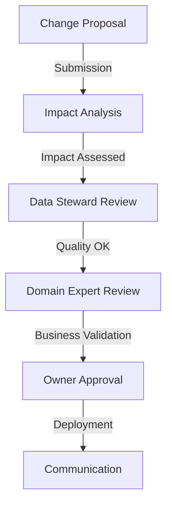

# Structure and Governance: The Architecture That Makes the Difference

The data science team just finished a tense presentation to the executive committee. Their Black Friday sales forecasts were largely overestimated, causing costly overstocking. Analysis reveals that changes in average basket calculation rules, though documented in a Jira ticket, were never communicated to the analysis teams. This situation, unfortunately common in retail, illustrates why data contract governance cannot be reduced to purely technical aspects.

## Why Start with Governance?

Before diving into the technical details of data contracts, it's crucial to understand how they integrate into the organization. Experience shows that failures in data contract adoption are rarely due to technical problems, but rather to gaps in governance and organization.

Take the example of a large retail chain that had invested heavily in a sophisticated technical solution for data contracts. Six months after launch, less than 20% of teams were effectively using the contracts. The post-mortem analysis revealed that the project had neglected organizational aspects: who is responsible for what? How are decisions made? How are changes communicated?

## The Architecture of a Data Contract

A well-structured data contract resembles a constitution more than a simple technical specification. It establishes not only technical rules but also responsibilities and decision processes.

Here's a concrete example from an e-commerce company:

```yaml
dataContractSpecification: 1.1.0
id: urn:datacontract:retail:transactions
info:
  title: "Retail Transactions"
  version: "2.1.0"
  description: "Retail transactions data contract"
  owner: "retail-data"
  contact:
    name: "Retail Data Team"
    email: "retail-data@company.com"

servers:
  local:
    type: "local"
    path: "./data/retail_transactions.parquet"
    format: "parquet"
    description: "Local retail transactions data"
  prod:
    type: "s3"
    path: "s3://data-lake-prod/retail/transactions/"
    format: "parquet"
    description: "Production retail transactions data"

models:
  RetailTransaction:
    type: "table"
    description: "Retail transaction records"
    fields:
      transaction_id:
        type: "text"
        description: "Unique transaction identifier"
        required: true
        pattern: "TX-[0-9]{10}"

terms:
  usage: "Internal use for retail analytics and reporting"
  limitations: "Data steward approval required for changes"
  noticePeriod: "P2D"

servicelevels:
  approval:
    description: "Change approval process"
    minor:
      responseTime: "P2D"
      approvers: ["data_steward"]
    major:
      responseTime: "P5D"
      approvers: ["data_steward", "domain_expert", "owner"]
      requiresMeeting: true
```

This contract doesn't just define a schema - it clearly establishes who is responsible for what and how decisions are made.

## Organization and Processes

The organizational dimension of data contracts materializes through well-defined roles and processes. Let's take the example of a company that succeeded in its data contract adoption:

- The **Data Product Owner** carries the strategic vision. She understands business needs and ensures the contract meets them.
- The **Data Steward** is the quality guardian. He verifies that quality rules are relevant and applied.
- The **Domain Expert** brings business expertise. She validates that definitions and rules correspond to field reality.

The modification process perfectly illustrates this collaboration:



## Towards Effective Governance

Implementing effective governance requires a delicate balance. Too much control stifles innovation, too little leads to chaos. Here are some principles that have proven successful:

1. **Start Small but Think Big**: Begin with a pilot domain but design a structure that can expand.
2. **Automate Progressively**: Start with manual processes to understand them, then automate.
3. **Measure and Adapt**: Track key metrics (approval time, team satisfaction) and adjust accordingly.

## Conclusion

Data contract governance isn't just about processes - it's a cultural change that must be carefully orchestrated. In upcoming articles, we'll explore the technical aspects (versioning, architecture patterns) that build upon this solid organizational foundation.

But remember: the best technical architecture cannot compensate for failing governance. That's why we started here.