# Structure and governance: the architecture that makes the difference

The question of data contract governance is central in any data-driven organization. A data contract cannot be reduced to a simple technical documentation; it is a social contract that establishes the rules of collaboration around data. The difference between a static document and a living data contract lies precisely in its governance.

## The architecture of a data contract

A well-structured data contract resembles a constitution: it establishes fundamental rules while providing mechanisms for its evolution. The structure must reflect not only the technical aspects but also the organizational dimension of the contract. This duality is essential to ensure that the contract remains relevant and applied over time.

Here is an example of an ODCS contract that illustrates this structured approach:

```yaml
odcs_version: "1.0.0"
id: "retail_transactions"
version: "2.1.0"
domain: "retail"

# Governance and Responsibilities
governance:
  owner:
    team: "retail-data"
    contact: "retail-data@company.com"
  stakeholders:
    - role: "data_steward"
      team: "data_office"
      responsibilities: ["quality", "compliance"]
    - role: "domain_expert"
      team: "retail_ops"
      responsibilities: ["business_rules", "definitions"]
  
  approval_process:
    changes:
      minor: ["data_steward"]
      major: ["data_steward", "domain_expert", "arch_board"]
    sla: "5 business days"

# Technical Interface
interface:
  type: "stream"
  spec:
    format: "avro"
    schema: # Schema definition
      # ... schema details ...

# Business Rules and Quality
business_rules:
  - name: "transaction_amount_check"
    description: "Total amount must match the sum of items"
    owner: "retail_ops"
    validation:
      sql: >
        SELECT transaction_id 
        FROM transactions 
        WHERE total_amount != (
          SELECT SUM(item_price * quantity) 
          FROM transaction_items 
          WHERE transaction_id = transactions.transaction_id
        )

# Operational Aspects
operational:
  sla:
    freshness: "5m"
    availability: "99.99%"
  monitoring:
    alerts:
      - condition: "freshness > 10m"
        severity: "critical"
        notify: ["retail-data-oncall"]
```

The contract structure reflects the different dimensions of governance. At the responsibility level, each aspect of the contract is associated with a clearly identified owner. The data steward ensures quality supervision, while the business expert guarantees the business relevance of the defined rules. This distribution of roles creates a system of checks and balances that maintains the integrity of the contract.

## The ecosystem of data contracts

The overall architecture of a data contract system is built around several interconnected components:


The contract registry acts as the central point of the architecture, orchestrating interactions between the different components. The validation service ensures contract compliance, while the monitoring system oversees the overall health of the ecosystem. This distributed architecture allows for a clear separation of responsibilities while maintaining overall coherence.

## Organization and processes

The organizational dimension of data contracts materializes through well-defined roles and processes. The Data Product Owner carries the strategic vision of the data product, while the Data Steward ensures its quality and compliance. The Domain Expert, in turn, guarantees alignment with business needs. This tripartite distribution of responsibilities ensures a balance between the different perspectives necessary for good data management.

The change management process perfectly illustrates this collaboration:

```mermaid
graph TD
    A[Change Proposal] -->|Submission| B[Impact Analysis]
    B -->|Impact Evaluated| C[Review by Data Steward]
    C -->|Quality OK| D[Review by Domain Expert]
    D -->|Business Validation| E[Implementation]
    E -->|Deployment| F[Monitoring]
```



## Governance in action

The governance of data contracts rests on four fundamental pillars. The first concerns the clarity of responsibilities: each contract must have a unique owner, with clearly documented roles and decision-making processes. The second pillar deals with change management, with a precise classification of modification types and approval processes adapted to their impact.

The third pillar concerns quality and compliance, with automatic contract validation mechanisms and continuous verification of business rules. Finally, the fourth pillar focuses on monitoring, with real-time metric monitoring and proactive anomaly detection.

## Towards effective governance

Implementing effective governance of data contracts requires a progressive and methodical approach. It is preferable to start with a limited scope but an extensible architecture that can evolve with the organization's needs. Automation should be introduced gradually, starting with the most repetitive tasks, to allow teams to adopt new processes.

Governance must remain at the service of operational efficiency, without creating excessive bureaucracy. Processes must be flexible enough to adapt to different contexts while maintaining a coherent framework that ensures data quality and reliability.

## Conclusion

The governance of data contracts represents a delicate balance between structure and flexibility. It must provide a sufficiently rigorous framework to ensure data quality and consistency while remaining flexible enough to allow innovation and adaptation to the organization's changing needs. In the next article, we will explore how to manage the evolution of these contracts over time, maintaining their relevance without creating unnecessary friction. 