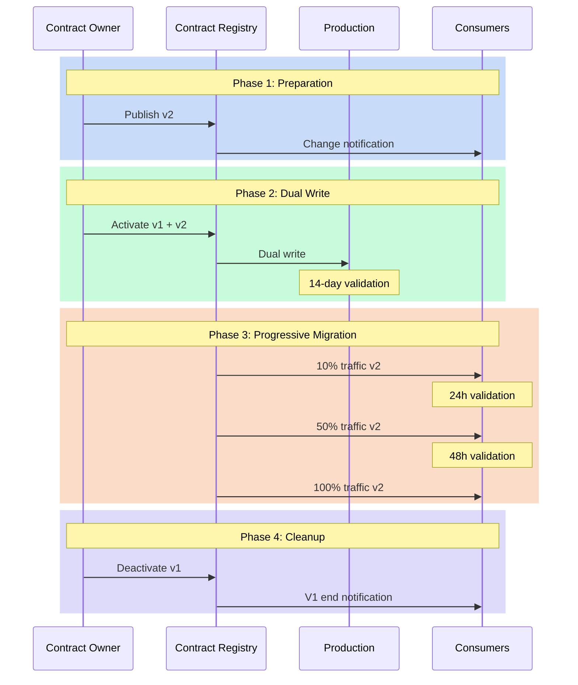

# Versioning: Managing Evolution Without Revolution

"How can we modify this field without breaking existing applications?" This question, asked during an architecture committee meeting, perfectly illustrates the challenge of data contract versioning. Evolution is inevitable, but it shouldn't turn into a revolution. Data contract versioning represents a crucial challenge in modern data management, where change is constant but must be controlled to avoid disruption.

## The Need for Controlled Change

Change in data structures is a constant in our systems. Needs evolve, models are refined, requirements transform. However, each modification to a data contract can have cascading repercussions throughout the information system. Version management thus becomes a balancing act between the necessity of evolution and maintaining stability.

The approach to data contract versioning revolves around three fundamental principles. The first is predictability: all changes must be anticipated and communicated. The second is compatibility: modifications must, whenever possible, preserve the functioning of existing systems. The third is traceability: each evolution must be documented and justified.

## The Dimensions of Change

The typology of changes in a data contract can be analyzed along several dimensions:
- The technical dimension concerns the very nature of modifications: additions, deletions, or modifications of fields.
- The functional dimension focuses on the business impact of changes.
- The temporal dimension defines the rhythm and progressiveness of evolution.



## Versioning Strategies

The versioning strategy of a data contract must be considered from its inception. It relies on a semantic versioning system adapted to the specificities of data contracts. Minor changes, such as adding optional fields, only increment the revision number. Major modifications, which can impact consumers, require a new major version and a migration plan.

Here's an example contract that illustrates this approach:

```yaml
openDataContract: "1.0.0"
info:
  title: "order_events"
  version: "1.0.0"
  description: "Initial contract version"
  changelog:
    - version: "1.0.0"
      date: "2023-01-01"
      changes:
        - type: "initial"
          description: "Initial contract version"
lifecycle:
  deprecation:
    successor_version: "2.0.0"
    schedule:
      announcement_date: "2023-06-01"
      transition_period:
        start: "2023-06-01"
        end: "2023-09-01"
      support_end: "2023-10-01"
    migration:
      guide: "docs/migrations/v1_to_v2.md"
      tools:
        - name: "data-converter"
          path: "tools/convert_v1_to_v2.py"
    monitoring:
      usage_metric: "active_consumers_v1"
      alert_threshold: 5

contracts:
  OrderEvent:
    type: "stream"
    schema:
      fields:
        - name: "order_id"
          type: "string"
        - name: "amount"
          type: "decimal"

---
openDataContract: "1.0.0"
info:
  title: "order_events"
  version: "2.0.0"
  changelog:
    - version: "2.0.0"
      date: "2023-06-01"
      changes:
        - type: "breaking"
          description: "Amount restructured with currency"
          migration_guide: "docs/migrations/v2.0.0.md"

contracts:
  OrderEvent:
    type: "stream"
    schema:
      fields:
        - name: "order_id"
          type: "string"
        - name: "amount"
          type: "struct"
          fields:
            - name: "value"
              type: "decimal"
            - name: "currency"
              type: "string"
```

## Migration as a Process

Migration to a new contract version isn't a one-time event but a process that extends over time. This process begins with a preparation phase where the new version is designed and validated. This is followed by a coexistence period where old and new versions operate in parallel. This phase allows consumers to migrate at their own pace while ensuring service continuity.

Timing management is crucial in this process. A change that's too rapid can destabilize the ecosystem, while a transition that's too slow can complicate maintenance. The ideal pace depends on multiple factors: the nature of the change, the number of consumers, system criticality.

## Managing End of Life

The end of life of a contract version is as important as its introduction. A version cannot simply be "switched off" - it must be gradually decommissioned according to a structured process:

1. **Deprecation Announcement**: Clear communication to consumers with a precise timeline
2. **Transition Period**: Typically 3-6 months where the version is marked as deprecated but still functional
3. **Usage Monitoring**: Active tracking of consumers still on the old version
4. **Migration Support**: Help for lagging teams to migrate to the new version
5. **Progressive Deactivation**: Gradual reduction of support until complete shutdown

Here's an example end-of-life timeline:


This structured approach to end of life allows:
- Avoiding surprises and service interruptions
- Giving teams sufficient time to adapt
- Maintaining consumer trust in the system
- Reducing operational risks
- Optimizing maintenance costs

## Conclusion

Data contract versioning is an art that requires both rigor and pragmatism. It's not just about managing version numbers, but orchestrating the evolution of a complex ecosystem. Success relies on a methodical approach that combines clear processes, proactive communication, and appropriate tools.

A crucial aspect we haven't yet addressed is the management of contract subscriptions. How do we ensure all consumers are properly notified of version changes and end-of-life events? We'll explore this subscription mechanism in our article on architecture patterns, where we'll see how the "Contract Registry" pattern effectively manages this communication.

In the next article, we'll explore the architecture patterns that enable implementing these versioning principles effectively and scalably.