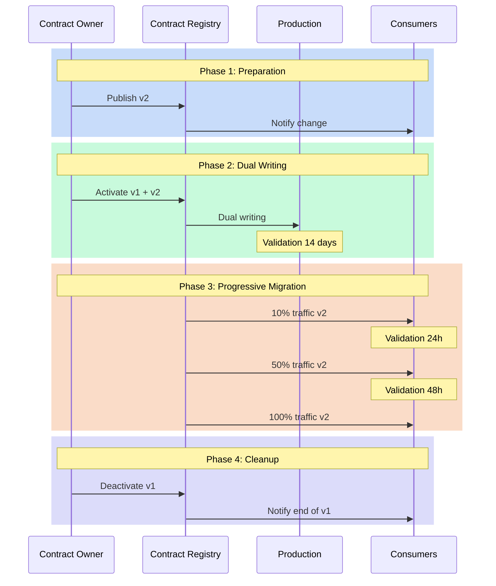

# Versioning: managing evolution without revolution

"How do we change this field without breaking existing applications?" This question, posed during an architecture committee, perfectly illustrates the challenge of versioning data contracts. Evolution is inevitable, but it must not turn into a revolution. The versioning of data contracts represents a crucial challenge in modern data management, where change is constant but must be controlled to avoid disruptions.

## The need for controlled change

Change in data structures is a constant in our systems. Needs evolve, models refine, requirements transform. However, each modification of a data contract can have cascading repercussions throughout the information system. Managing versioning thus becomes a balancing act between the need for evolution and maintaining stability.

The approach to versioning data contracts revolves around three fundamental principles. The first is predictability: any change must be anticipated and communicated. The second is compatibility: modifications should, as much as possible, preserve the functioning of existing systems. The third is traceability: each evolution must be documented and justified.

## The dimensions of change

The typology of changes in a data contract can be analyzed according to several dimensions. The technical dimension concerns the very nature of the modifications: additions, deletions, or modifications of fields. The functional dimension focuses on the business impact of changes. The temporal dimension, finally, defines the pace and progressiveness of evolutions.



## Versioning strategies

The versioning strategy of a data contract must be thought out from its conception. It relies on a semantic versioning system adapted to the specificities of data contracts. Minor changes, such as adding optional fields, only increment the revision number. Major modifications, which can impact consumers, require a new major version and a migration plan.

Here is an example of a contract illustrating this approach:

```yaml
# Version 1.0.0
odcs_version: "1.0.0"
id: "order_events"
version: "1.0.0"
changelog:
  - version: "1.0.0"
    date: "2023-01-01"
    changes:
      - type: "initial"
        description: "Initial version of the contract"

interface:
  type: "stream"
  spec:
    schema:
      fields:
        - name: "order_id"
          type: "string"
        - name: "amount"
          type: "decimal"

# Version 2.0.0 (Major Change)
---
version: "2.0.0"
changelog:
  - version: "2.0.0"
    date: "2023-06-01"
    changes:
      - type: "breaking"
        description: "Restructuring of amount into currency"
        migration_guide: "docs/migrations/v2.0.0.md"

interface:
  type: "stream"
  spec:
    schema:
      fields:
        - name: "order_id"
          type: "string"
        - name: "amount"
          type: "struct"
          fields:
            - name: "value"
              type: "decimal"
            - name: "currency"
              type: "string"
```

## Migration as a process

Migration to a new contract version is not a one-time event but a process that extends over time. This process begins with a preparation phase where the new version is designed and validated. It is followed by a coexistence period where the old and new versions operate in parallel. This phase allows consumers to migrate at their own pace while ensuring service continuity.

Timing management is crucial in this process. A change that is too rapid can destabilize the ecosystem, while a transition that is too slow can complicate maintenance. The ideal pace depends on multiple factors: the nature of the change, the number of consumers, the criticality of the system.

## Conclusion

Versioning data contracts is an art that requires rigor and pragmatism. It is not simply about managing version numbers but orchestrating the evolution of a complex ecosystem. Success relies on a methodical approach that combines process clarity, proactive communication, and appropriate tools.

In the next article, we will explore architectural patterns that enable the effective and scalable implementation of these versioning principles. 