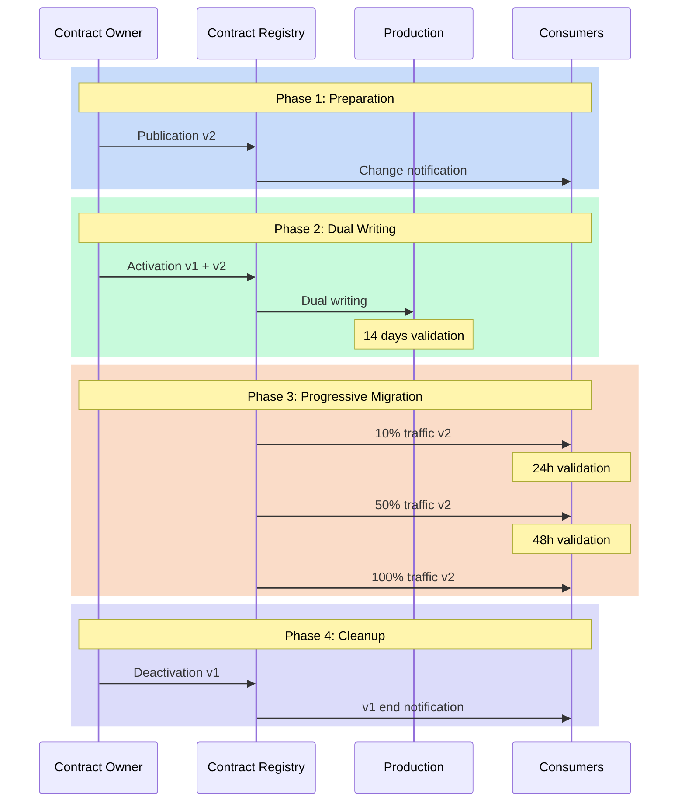
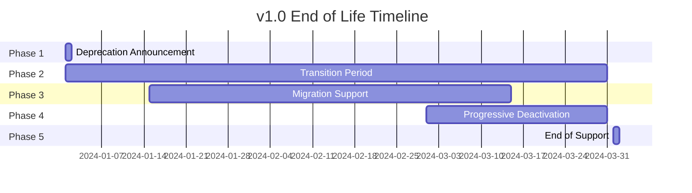

# Versioning: Managing Evolution Without Revolution

"How can we modify this field without breaking existing applications?" This question, asked during an architecture committee, perfectly illustrates the challenge of data contract versioning. Evolution is inevitable, but it shouldn't turn into a revolution. Data contract versioning represents a crucial challenge in modern data management, where change is constant but must be controlled to avoid disruptions.

## The Need for Controlled Change

Change in data structures is a constant in our systems. Needs evolve, models refine, requirements transform. However, each modification to a data contract can have cascade repercussions throughout the information system. Version management thus becomes a balancing act between the necessity for evolution and maintaining stability.

The approach to data contract versioning revolves around three fundamental principles. The first is predictability: all changes must be anticipated and communicated. The second is compatibility: modifications must, as much as possible, preserve existing systems' functioning. The third is traceability: each evolution must be documented and justified.

## The Dimensions of Change

The typology of changes in a data contract can be analyzed along several dimensions.
- The technical dimension concerns the very nature of modifications: additions, deletions, or modifications of fields.
- The functional dimension looks at the business impact of changes.
- The temporal dimension, finally, defines the rhythm and progressiveness of evolutions.



## Versioning Strategies

The versioning strategy of a data contract must be thought out from its conception. It relies on a semantic versioning system adapted to the specificities of data contracts. Minor changes, like adding optional fields, only increment the revision number. Major modifications, which can impact consumers, require a new major version and a migration plan.

Here's an example contract that illustrates this approach:

```yaml
dataContractSpecification: 1.1.0
id: urn:datacontract:orders:events
info:
  title: "Order Events"
  version: "1.0.0"
  description: "Order events stream contract"
  owner: "order-team"
  contact:
    name: "Order Team"
    email: "order-team@company.com"

servers:
  local:
    type: "local"
    path: "./data/order_events.parquet"
    format: "parquet"
    description: "Local order events data"

models:
  OrderEvent:
    type: "table"
    description: "Order event records"
    fields:
      order_id:
        type: "text"
        description: "Unique order identifier"
        required: true
      amount:
        type: "decimal"
        description: "Order amount"
        required: true

terms:
  usage: "Order event processing and analytics"
  limitations: "Migration to v2.0.0 required by 2023-10-01"
  noticePeriod: "P3M"

servicelevels:
  availability:
    description: "Event data availability"
    percentage: "99.9%"
    measurement: "daily"
  
  support:
    description: "Support during migration period"
    time: "9am to 5pm EST on business days"
    responseTime: "P1D"
  
  deprecation:
    description: "Version 1.0.0 deprecation schedule"
    announcement: "2023-06-01"
    endOfLife: "2023-10-01"
    migrationGuide: "docs/migrations/v1_to_v2.md"

---
dataContractSpecification: 1.1.0
id: urn:datacontract:orders:events
info:
  title: "Order Events"
  version: "2.0.0"
  description: "Enhanced order events stream contract with additional fields"
  owner: "order-team"
  contact:
    name: "Order Team"
    email: "order-team@company.com"

servers:
  local:
    type: "local"
    path: "./data/order_events.parquet"
    format: "parquet"
    description: "Local order events data"
  prod:
    type: "s3"
    path: "s3://data-lake-prod/orders/events/"
    format: "parquet"
    description: "Production order events data"

models:
  OrderEvent:
    type: "table"
    description: "Order event records with enhanced fields"
    fields:
      order_id:
        type: "text"
        description: "Unique order identifier"
        required: true
      amount:
        type: "decimal"
        description: "Order amount"
        required: true
      customer_id:
        type: "text"
        description: "Customer identifier"
        required: true
      status:
        type: "text"
        description: "Order status"
        enum: ["created", "confirmed", "shipped", "delivered", "cancelled"]
        required: true
      timestamp:
        type: "timestamp"
        description: "Event timestamp"
        required: true

terms:
  usage: "Order event processing and analytics"
  limitations: "Production use only"
  noticePeriod: "P6M"

servicelevels:
  availability:
    description: "Stream availability"
    percentage: "99.9%"
    measurement: "monthly"
  
  latency:
    description: "Event delivery latency"
    threshold: "PT5S"
    percentage: "95%"
  
  support:
    description: "24/7 support for critical issues"
    time: "24/7"
    responseTime: "PT1H"
```

## Migration as a Process

Migration to a new contract version isn't a one-time event but a process that extends over time. This process begins with a preparation phase where the new version is designed and validated. This is followed by a coexistence period where old and new versions operate in parallel. This phase allows consumers to migrate at their own pace while ensuring service continuity.

Timing management is crucial in this process. A change that's too rapid can destabilize the ecosystem, while a transition that's too slow can complicate maintenance. The ideal rhythm depends on multiple factors: the nature of the change, the number of consumers, system criticality.

## Managing End of Life

The end of life of a contract version is as important as its introduction. A version can't simply be "turned off" - it must be gradually decommissioned according to a structured process:

1. **Deprecation Announcement**: Clear communication to consumers with a precise timeline
2. **Transition Period**: Typically 3 to 6 months where the version is marked as deprecated but still functional
3. **Usage Monitoring**: Active tracking of consumers still on the old version
4. **Migration Support**: Help for lagging teams to migrate to the new version
5. **Progressive Deactivation**: Gradual reduction of support until complete shutdown

Here's an example end-of-life timeline:



This structured approach to end of life allows:
- Avoiding surprises and service interruptions
- Giving teams sufficient time to adapt
- Maintaining consumer trust in the system
- Reducing operational risks
- Optimizing maintenance costs

## Conclusion

Data contract versioning is an art that requires rigor and pragmatism. It's not just about managing version numbers, but orchestrating the evolution of a complex ecosystem. Success relies on a methodical approach that combines process clarity, proactive communication, and appropriate tools.

A crucial aspect we haven't yet addressed is managing contract subscriptions. How to ensure all consumers are properly notified of version changes and end of life? We'll explore this subscription mechanism in our article on architecture patterns, where we'll see how the "Contract Registry" pattern effectively manages this communication.

In the next article, we'll explore the architecture patterns that allow implementing these versioning principles effectively and scalably.