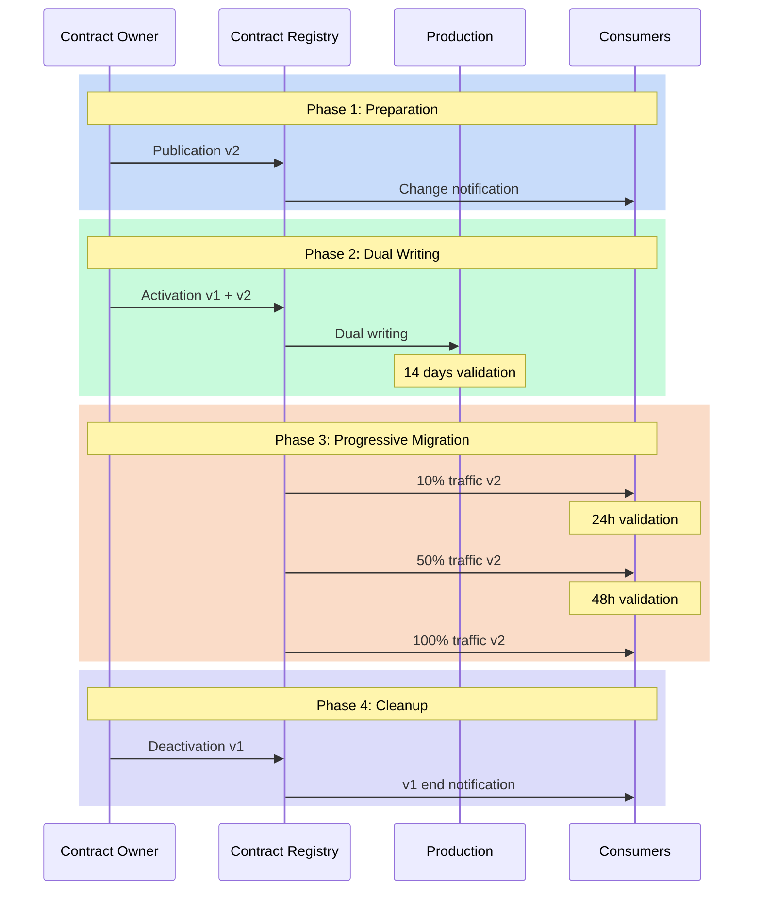
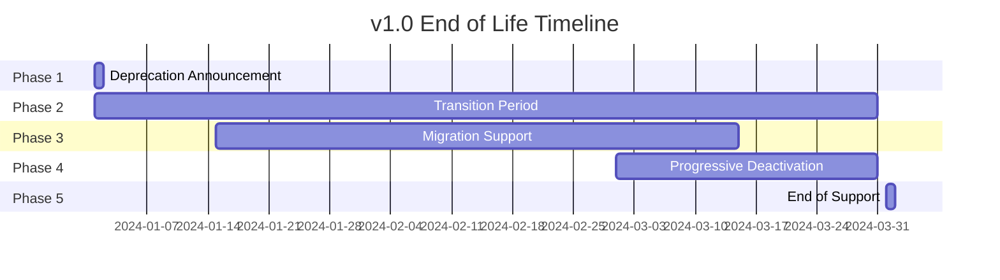

# Data Contracts and Versioning: The essential foundation for successful evolution

"How can we modify this field without breaking existing applications?" This question, asked during an architecture committee, perfectly illustrates the challenge of data contract versioning. Evolution is inevitable, but it shouldn't turn into a revolution. Data contract versioning represents a crucial challenge in modern data management, where change is constant but must be controlled to avoid disruptions.

## The Need for Controlled Change

Change in data structures is a constant in our systems. Needs evolve, models refine, requirements transform. However, each modification to a data contract can have cascade repercussions throughout the information system. Version management thus becomes a balancing act between the necessity for evolution and maintaining stability.

The approach to data contract versioning revolves around three fundamental principles. The first is predictability: all changes must be anticipated and communicated. The second is compatibility: modifications must, as much as possible, preserve existing systems' functioning. The third is traceability: each evolution must be documented and justified.

## Contract Version vs. Data Model Version

A crucial distinction, often overlooked, is between the contract version and the underlying data model version. These two concepts evolve at different rhythms and for distinct reasons.

**The contract version** concerns the entire contractual document, including metadata, documentation, SLAs, contacts, and other contextual information. This version can evolve frequently without necessarily impacting data consumers.

**The data model version** focuses specifically on the data structure itself: schemas, fields, types, constraints. It's this version that has a direct impact on consumer applications.

Here are some examples of changes that affect only the contract version, without modifying the data model:
- Updating field descriptions
- Changing contacts or owners
- Modifying SLAs
- Adding examples or additional documentation
- Updating links to external resources
- Data classification

In contrast, these changes impact the data model version:
- Adding, removing, or renaming fields
- Modifying data types
- Changing constraints (nullability, uniqueness)
- Restructuring relationships between entities

This distinction is essential for effective version management. It allows:
1. Reducing the "fear of change" by clarifying the real impact of modifications
2. Simplifying approval processes according to the type of change
3. Communicating more precisely with consumers
4. Optimizing migration strategies

In practice, a data contract should therefore maintain two distinct version numbers:
```yaml
version: 2.3.0          # Global contract version
schemaVersion: 1.0.0    # Data model version
```

This clear distinction between the two types of versions allows organizations to streamline governance processes while accelerating non-critical evolution cycles, thus creating an optimal balance between agility and stability.

## The Dimensions of Change

The typology of changes in a data contract can be analyzed along several dimensions.
- The technical dimension concerns the very nature of modifications: additions, deletions, or modifications of fields.
- The functional dimension looks at the business impact of changes.
- The temporal dimension, finally, defines the rhythm and progressiveness of evolutions.



## Versioning Strategies

The versioning strategy of a data contract must be thought out from its conception. It relies on a semantic versioning system adapted to the specificities of data contracts. Minor changes, like adding optional fields, only increment the revision number. Major modifications, which can impact consumers, require a new major version and a migration plan.

Here's an example contract that illustrates this approach:

```yaml
apiVersion: v3.0.0
kind: DataContract
id: urn:datacontract:sales:transactions
domain: sales-domain
tenant: SalesOps
name: Sales Transactions
version: 2.0.0
status: active

description:
  purpose: "Track and manage sales transaction data"
  usage: "Sales analytics and reporting"
  limitations: "Contains sensitive financial data"
  dataGranularityDescription: "One record per sales transaction"
  changelog:
    - version: "2.0.0"
      date: "2024-03-15"
      changes:
        - type: breaking
          description: "Added mandatory payment_method field"
    - version: "1.1.0"
      date: "2024-02-01"
      changes:
        - type: feature
          description: "Added optional discount_code field"
    - version: "1.0.0"
      date: "2024-01-01"
      changes:
        - type: initial
          description: "Initial release"

schema:
  - name: SalesTransaction
    physicalName: sales_transactions
    physicalType: table
    description: "Sales transaction records"
    tags: ["sales", "transactions", "financial"]
    properties:
      - name: transaction_id
        logicalType: string
        physicalType: text
        description: "Unique transaction identifier"
        isNullable: false
        isUnique: true
        criticalDataElement: true
        examples: ["SALE-001", "SALE-002"]
      - name: payment_method
        logicalType: string
        physicalType: text
        description: "Payment method used"
        isNullable: false
        addedInVersion: "2.0.0"
        allowedValues: ["CREDIT", "DEBIT", "CASH"]
        examples: ["CREDIT"]
      - name: discount_code
        logicalType: string
        physicalType: text
        description: "Applied discount code"
        isNullable: true
        addedInVersion: "1.1.0"
        examples: ["SUMMER2024"]

quality:
  - rule: uniqueTransactionId
    description: "Transaction IDs must be unique"
    dimension: uniqueness
    severity: error
    businessImpact: critical
  - rule: validPaymentMethod
    description: "Payment method must be one of the allowed values"
    dimension: validity
    severity: error
    businessImpact: operational

team:
  - username: klee
    role: Data Product Owner
    dateIn: "2024-01-01"
  - username: pjones
    role: Data Steward
    dateIn: "2024-01-01"

support:
  - channel: "#sales-data-help"
    tool: slack
    url: https://company.slack.com/sales-data-help
  - channel: sales-data@company.com
    tool: email
    url: mailto:sales-data@company.com

servers:
  - server: prod
    type: postgresql
    format: sql
    url: postgresql://sales-db.prod.company.com:5432/sales
    description: "Production sales database"

slaProperties:
  - property: latency
    value: 5
    unit: m
  - property: retention
    value: 10
    unit: y
  - property: frequency
    value: 1
    unit: m

tags:
  - sales
  - transactions
  - financial

customProperties:
  - property: dataDomain
    value: sales
  - property: criticality
    value: high
  - property: financialData
    value: true
```

## Migration as a Process

Migration to a new contract version isn't a one-time event but a process that extends over time. This process begins with a preparation phase where the new version is designed and validated. This is followed by a coexistence period where old and new versions operate in parallel. This phase allows consumers to migrate at their own pace while ensuring service continuity.

Timing management is crucial in this process. A change that's too rapid can destabilize the ecosystem, while a transition that's too slow can complicate maintenance. The ideal rhythm depends on multiple factors: the nature of the change, the number of consumers, system criticality.

## Managing End of Life

The end of life of a contract version is as important as its introduction. A version can't simply be "turned off" - it must be gradually decommissioned according to a structured process:

1. **Deprecation Announcement**: Clear communication to consumers with a precise timeline
2. **Transition Period**: Typically 3 to 6 months where the version is marked as deprecated but still functional
3. **Usage Monitoring**: Active tracking of consumers still on the old version
4. **Migration Support**: Help for lagging teams to migrate to the new version
5. **Progressive Deactivation**: Gradual reduction of support until complete shutdown

Here's an example end-of-life timeline:



This structured approach to end of life allows:
- Avoiding surprises and service interruptions
- Giving teams sufficient time to adapt
- Maintaining consumer trust in the system
- Reducing operational risks
- Optimizing maintenance costs

## Conclusion

Data contract versioning is an art that requires rigor and pragmatism. It's not just about managing version numbers, but orchestrating the evolution of a complex ecosystem. Success relies on a methodical approach that combines process clarity, proactive communication, and appropriate tools.

A crucial aspect we haven't yet addressed is managing contract subscriptions. How to ensure all consumers are properly notified of version changes and end of life? We'll explore this subscription mechanism in our article on architecture patterns, where we'll see how the "Contract Registry" pattern effectively manages this communication.

In the next article, we'll explore the architecture patterns that allow implementing these versioning principles effectively and scalably.