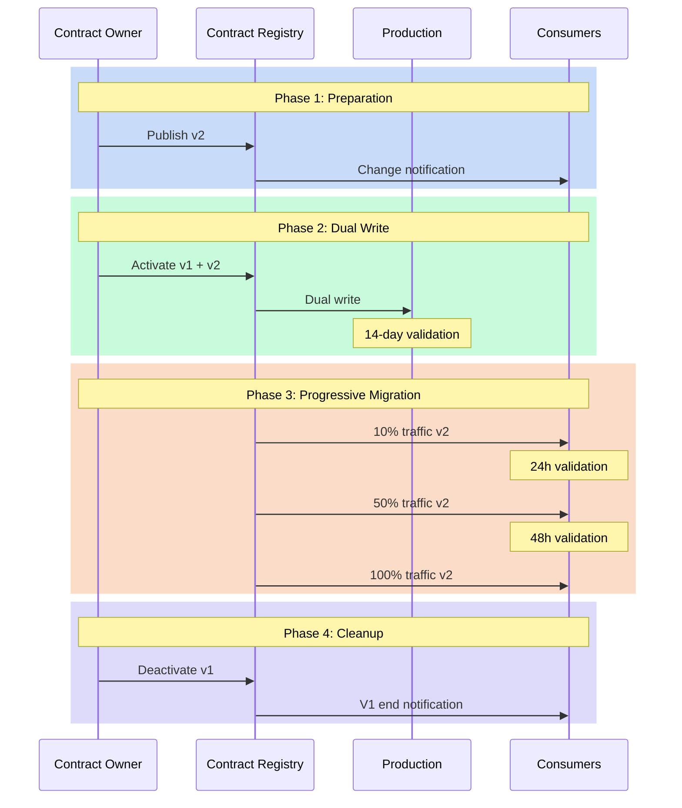

# Versioning: Managing Evolution Without Revolution

"How can we modify this field without breaking existing applications?" This question, asked during an architecture committee meeting, perfectly illustrates the challenge of data contract versioning. Evolution is inevitable, but it shouldn't turn into a revolution. Data contract versioning represents a crucial challenge in modern data management, where change is constant but must be controlled to avoid disruption.

## The Need for Controlled Change

Change in data structures is a constant in our systems. Needs evolve, models are refined, requirements transform. However, each modification to a data contract can have cascading repercussions throughout the information system. Version management thus becomes a balancing act between the necessity of evolution and maintaining stability.

The approach to data contract versioning revolves around three fundamental principles:
1. Predictability: all changes must be anticipated and communicated
2. Compatibility: modifications must, whenever possible, preserve the functioning of existing systems
3. Traceability: each evolution must be documented and justified

## The Dimensions of Change

The typology of changes in a data contract can be analyzed along several dimensions:
- The technical dimension concerns the very nature of modifications: additions, deletions, or modifications of fields
- The functional dimension focuses on the business impact of changes
- The temporal dimension defines the rhythm and progressiveness of evolution



## Versioning Strategies

The versioning strategy of a data contract must be considered from its inception. Here's an example contract that illustrates this approach:

```yaml
dataContractSpecification: 1.1.0
id: urn:datacontract:orders:events
info:
  title: "Order Events"
  version: "1.0.0"
  description: "Order events stream contract"
  owner: "order-team"
  contact:
    name: "Order Team"
    email: "order-team@company.com"

servers:
  local:
    type: "local"
    path: "./data/order_events.parquet"
    format: "parquet"
    description: "Local order events data"

models:
  OrderEvent:
    type: "table"
    description: "Order event records"
    fields:
      order_id:
        type: "text"
        description: "Unique order identifier"
        required: true
      amount:
        type: "decimal"
        description: "Order amount"
        required: true

terms:
  usage: "Order event processing and analytics"
  limitations: "Migration to v2.0.0 required by 2023-10-01"
  noticePeriod: "P3M"

servicelevels:
  availability:
    description: "Event data availability"
    percentage: "99.9%"
    measurement: "daily"
  
  support:
    description: "Support during migration period"
    time: "9am to 5pm EST on business days"
    responseTime: "P1D"
  
  deprecation:
    description: "Version 1.0.0 deprecation schedule"
    announcement: "2023-06-01"
    endOfLife: "2023-10-01"
    migrationGuide: "docs/migrations/v1_to_v2.md"

---
dataContractSpecification: 1.1.0
id: urn:datacontract:orders:events
info:
  title: "Order Events"
  version: "2.0.0"
  description: "Enhanced order events stream contract with additional fields"
  owner: "order-team"
  contact:
    name: "Order Team"
    email: "order-team@company.com"

servers:
  local:
    type: "local"
    path: "./data/order_events.parquet"
    format: "parquet"
    description: "Local order events data"
  prod:
    type: "s3"
    path: "s3://data-lake-prod/orders/events/"
    format: "parquet"
    description: "Production order events data"

models:
  OrderEvent:
    type: "table"
    description: "Order event records with enhanced fields"
    fields:
      order_id:
        type: "text"
        description: "Unique order identifier"
        required: true
      amount:
        type: "decimal"
        description: "Order amount"
        required: true
      customer_id:
        type: "text"
        description: "Customer identifier"
        required: true
      status:
        type: "text"
        description: "Order status"
        enum: ["created", "confirmed", "shipped", "delivered", "cancelled"]
        required: true
      timestamp:
        type: "timestamp"
        description: "Event timestamp"
        required: true

terms:
  usage: "Order event processing and analytics"
  limitations: "Production use only"
  noticePeriod: "P6M"

servicelevels:
  availability:
    description: "Stream availability"
    percentage: "99.9%"
    measurement: "monthly"
  
  latency:
    description: "Event delivery latency"
    threshold: "PT5S"
    percentage: "95%"
  
  support:
    description: "24/7 support for critical issues"
    time: "24/7"
    responseTime: "PT1H"
```

## Managing Transitions

The transition phase between contract versions is particularly delicate. It requires careful orchestration to avoid any disruption to production systems. This orchestration begins with a dual-write period, where data is written simultaneously to both the old and new versions of the contract. This approach allows validating the new version while maintaining existing system stability.

### Phase 1: Preparation
This phase is crucial as it lays the groundwork for a successful transition:
- The Contract Owner publishes the new version (v2) in the Registry
- Consumers are automatically notified via the subscription system
- Teams can begin studying the changes and planning their migration
- Migration documentation is validated and published

### Phase 2: Dual Write
This security phase allows validating the new version under real conditions:
- Data is written simultaneously to v1 and v2 versions
- Teams can compare results between both versions
- A 14-day period covers all business cases (month-end, weekends, etc.)
- Anomalies can be detected without production impact

### Phase 3: Progressive Migration
The switch is done in stages to minimize risks:
- 10% of traffic is directed to v2, allowing quick problem detection
- A 24h validation confirms proper functioning at this first stage
- Traffic is increased to 50% if no problems are detected
- After 48 additional hours of validation, the complete switch is made

### Phase 4: Cleanup
This final phase is often neglected but essential:
- V1 is officially deprecated in the Registry
- A final notification is sent to consumers
- V1 resources are cleaned up (storage, monitoring, etc.)
- Documentation is updated to reflect v1's end of life

## Managing End of Life

The end of life of a contract version is as important as its introduction. A version cannot simply be "switched off" - it must be gradually decommissioned according to a structured process:

1. **Deprecation Announcement**: Clear communication to consumers with a precise timeline
2. **Transition Period**: Typically 3-6 months where the version is marked as deprecated but still functional
3. **Usage Monitoring**: Active tracking of consumers still on the old version
4. **Migration Support**: Help for lagging teams to migrate to the new version
5. **Progressive Deactivation**: Gradual reduction of support until complete shutdown

Here's an example end-of-life timeline:


This structured approach to end of life allows:
- Avoiding surprises and service interruptions
- Giving teams sufficient time to adapt
- Maintaining consumer trust in the system
- Reducing operational risks
- Optimizing maintenance costs

## Conclusion

Data contract versioning is an art that requires both rigor and pragmatism. It's not just about managing version numbers, but orchestrating the evolution of a complex ecosystem. Success relies on a methodical approach that combines clear processes, proactive communication, and appropriate tools.

In the next article, we'll explore the architecture patterns that enable implementing these versioning principles effectively and scalably.