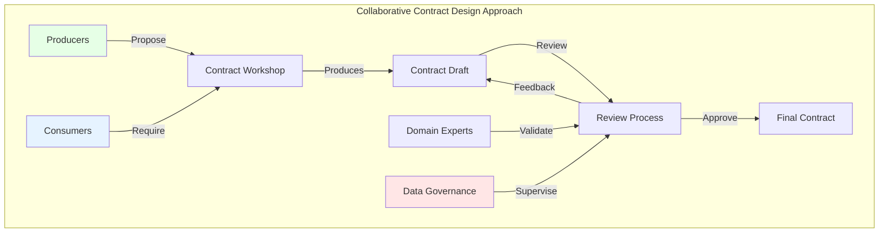

# Construction Architecture of Data Contracts: From Design to Deployment

When we talk about data contracts, we often focus on their operation in production - how they regulate data exchanges, how they integrate into the information system. But there is a story that unfolds long before: that of their creation. Over the course of my consultations, I've noticed that this crucial construction phase remains in the shadows, even though it shapes the future of the entire data infrastructure.

It's a bit like admiring a building for its architecture without ever talking about the construction site that saw it come to life. Yet, it is during construction that decisions are made that will ensure the solidity and longevity of the whole. In this article, I invite you to explore the backstage of data contract creation, to discover the methods that transform a simple idea into a robust contract, from its design to its first deployment.

## The Collaborative Contract Design Approach

At the heart of data contract construction is the Collaborative Contract Design approach. This method addresses a fundamental issue: how to design contracts that meet the needs of all stakeholders?



This approach is based on five fundamental principles:

1. **Multidisciplinary Participation**  
   It's not just about bringing together technical teams. An effective data contract requires the active participation of several complementary profiles:
   - **Data producers** bring their knowledge of source systems, technical constraints, and extraction possibilities
   - **Consumers** express their needs, use cases, and quality requirements
   - **Business experts** ensure that the contract accurately reflects business reality and domain semantics
   - **Data governance** ensures alignment with company policies, security, and regulatory compliance
   
   I've observed that the absence of even one of these profiles can lead to unbalanced contracts, either too technical and disconnected from real needs, or unrealistic in terms of implementation.

2. **Rapid Iteration**  
   Unlike the "big design upfront" approach, collaborative design favors short, iterative cycles:
   - Start with a minimalist version of the contract that meets essential needs
   - Gather feedback quickly before committing to costly developments
   - Adjust and enrich the contract progressively
   - Validate each iteration with all stakeholders
   
   This approach significantly reduces the risk of spending weeks designing a contract that ultimately proves unsuitable. In my practice, I recommend iterations of 1 to 2 weeks maximum, with frequent synchronization points.

3. **Contextual Documentation**  
   Beyond the data structure, the contract must capture the "why" behind each decision:
   - Document the alternatives considered and the reasons for the choices made
   - Explicitly state the accepted trade-offs (e.g., between performance and exhaustiveness)
   - Record key discussions that led to decisions
   - Reference business or technical constraints that influenced the design
   
   This contextual documentation proves invaluable when new members join the team or when the contract needs to be revisited months later. It transforms the contract from a simple technical document into a shared knowledge repository.

4. **Test-Driven Validation**  
   The contract is not just a description - it's a promise that must be verifiable:
   - Define tests that validate compliance with the contract even before its implementation
   - Create example datasets that illustrate typical and extreme use cases
   - Automate compliance verification to enable continuous integration
   - Include negative tests that clearly demonstrate what is not acceptable
   
   This approach, inspired by TDD (Test-Driven Development), clarifies expectations and avoids misinterpretations. Tests become the executable definition of the contract, complementing its formal description.

5. **Domain-Driven Approach**  
   The contract must speak the language of the business, not that of the underlying systems:
   - Use business domain terminology, not technical jargon (this is all too often the case, and we end up with contracts that are not readable by non-technical people)
   - Structure data according to the business vision, even if it requires transformation from source systems (and this is a real issue, as sources often refuse to adapt to the business vision)
   - Include business rules and constraints that give meaning to the data
   - Avoid exposing the specifics of underlying technical systems
   
   This approach, inspired by Domain-Driven Design, ensures that the contract remains relevant even if the underlying technologies evolve. It creates a common language between technical and business teams, significantly reducing misunderstandings.

### The Collaborative Contract Design Process

The typical process includes the following steps:

1. **Initial Workshop**: Collaborative session where producers and consumers define their needs
2. **Draft Creation**: Development of a first version of the contract
3. **Technical Review**: Verification of technical feasibility and consistency
4. **Business Review**: Validation by domain experts
5. **Governance Review**: Verification of compliance with standards and policies
6. **Finalization**: Consolidation of feedback and final validation

One of the key advantages of this method is that it allows early identification of incompatibilities and implementation challenges, thereby reducing later correction costs.

## Practical Guide: Creating a Data Contract from A to Z

Enough theory! Let's see concretely how to create a data contract, step by step, from its design to its deployment. I will guide you through the complete process with an example that you can adapt to your context.

### Step 1: Initialize Your First Data Contract

Let's start by creating a simple contract. Here's how to proceed:

1. **Create a dedicated repository** in your version control system (GitHub, GitLab, etc.)

2. **Initialize a data contract file** at the root, for example `customer_profile.datacontract.yaml`:

```yaml
# customer_profile.datacontract.yaml
dataContractSpecification: 0.9.2
id: customer_profile
info:
  title: Customer Profile
  version: 0.1.0
  description: >
    Data contract for customer profiles,
    used by the marketing team for behavioral analysis.
  owner: customer-data-team
  contact:
    name: Customer Data Team
    url: https://wiki.example.com/data-team
    email: data-team@example.com
```

3. **Add stakeholder information**:

```yaml
# Continuation of the customer_profile.datacontract.yaml file
contractedService:
  provider:
    name: CRM System
    team: CRM Team
    contact: alice@example.com
  consumer:
    - name: Marketing Application
      team: Marketing Team
      contact: bob@example.com
    - name: Analytics Dashboard
      team: Data Team
      contact: charlie@example.com
  termsOfService: https://wiki.example.com/terms-of-service
```

4. **Commit these initial elements** to your repository with a clear message:

```bash
git add customer_profile.datacontract.yaml
git commit -m "Initial: creation of customer profile data contract"
git push
```

### Step 2: Define the Data Structure

Now, let's add the data structure to the contract. This is the step where you concretely define what will be exchanged:

1. **Add the models section** that describes the data structure:

```yaml
# Continuation of the customer_profile.datacontract.yaml file
models:
  Customer:
    description: Customer information
    type: object
    required:
      - customer_id
      - first_name
      - last_name
      - email
    properties:
      customer_id:
        type: string
        description: Unique customer identifier
        pattern: "^CUS[0-9]{6}$"
        example: "CUS123456"
      
      first_name:
        type: string
        description: Customer's first name
        maxLength: 50
        example: "Marie"
      
      last_name:
        type: string
        description: Customer's last name
        maxLength: 50
        example: "Dupont"
      
      email:
        type: string
        format: email
        description: Customer's email address
        example: "marie.dupont@example.com"
      
      phone:
        type: string
        description: Phone number (international format)
        pattern: "^\\+[0-9]{1,3} [0-9 ]{5,15}$"
        example: "+33 6 12 34 56 78"
```

2. **Define data access interfaces**:

```yaml
# Continuation of the customer_profile.datacontract.yaml file
interfaces:
  customerProfile:
    description: Interface to access customer profiles
    serving:
      server: https://api.example.com
      security:
        - type: oauth2
          description: OAuth2 authentication required
      endpoints:
        getCustomerProfile:
          path: /customers/{customerId}
          method: GET
          description: Retrieve a specific customer's profile
          parameters:
            - name: customerId
              in: path
              required: true
              schema:
                type: string
                pattern: "^CUS[0-9]{6}$"
              description: Unique customer identifier
          response:
            type: object
            $ref: "#/models/Customer"
```

3. **Add important business rules** that are not captured by the schema:

```yaml
# Continuation of the customer_profile.datacontract.yaml file
quality:
  rules:
    - name: email_verification
      description: The email address must be verified before being included in the contract
      rationale: Avoid propagation of invalid addresses in systems
    
    - name: minor_identification
      description: Minor clients (-18 years) must be identified with a specific flag
      rationale: Specific GDPR legal obligations for minors
```

4. **Commit these additions** with a descriptive message:

```bash
git commit -am "Add: customer profile data structure"
```

### Step 3: Define Examples and Tests

Examples and tests are essential to clarify the contract's usage:

1. **Add complete examples**:

```yaml
# Continuation of the customer_profile.datacontract.yaml file
examples:
  - name: standard_client
    description: Example of a standard client with all information
    interface: customerProfile
    endpoint: getCustomerProfile
    parameters:
      customerId: "CUS123456"
    response:
      customer_id: "CUS123456"
      first_name: "Marie"
      last_name: "Dupont"
      email: "marie.dupont@example.com"
      phone: "+33 6 12 34 56 78"
      
  - name: minimal_client
    description: Example with only mandatory fields
    interface: customerProfile
    endpoint: getCustomerProfile
    parameters:
      customerId: "CUS654321"
    response:
      customer_id: "CUS654321"
      first_name: "Jean"
      last_name: "Martin"
      email: "jean.martin@example.com"
```

2. **Configure quality and test aspects**:

```yaml
# Continuation of the customer_profile.datacontract.yaml file
quality:
  tests:
    - name: validation_client_id
      description: Verify that the client ID meets the expected format
      test:
        interface: customerProfile
        endpoint: getCustomerProfile
        parameters:
          customerId: "CUS123456"
        assertions:
          - jsonPath: "$.customer_id"
            expected: "CUS123456"
    
    - name: validation_email_format
      description: Verify that the email is in the correct format
      test:
        interface: customerProfile
        endpoint: getCustomerProfile
        parameters:
          customerId: "CUS123456"
        assertions:
          - jsonPath: "$.email"
            matchesRegex: "^[a-zA-Z0-9._%+-]+@[a-zA-Z0-9.-]+\\.[a-zA-Z]{2,}$"
```

3. **Commit these additions**:

```bash
git commit -am "Add: examples and validation tests"
```

### Step 4: Document Technical Aspects

To facilitate adoption, document implementation aspects:

1. **Specify access and SLA details**:

```yaml
# Continuation of the customer_profile.datacontract.yaml file
slo:
  availability:
    description: Availability of the Customer Profile API
    target: 99.9%
    period: 30d
    
  latency:
    description: Response time for API requests
    target: 200ms
    period: 30d
    percentile: 95
    
  errorRate:
    description: Maximum error rate 
    target: 0.1%
    period: 30d
```

2. **Document error codes**:

```yaml
# Continuation of the customer_profile.datacontract.yaml file
interfaces:
  customerProfile:
    # ... [existing content] ...
    errors:
      - status: 404
        description: Client not found
        resolution: "Check client identifier"
        
      - status: 403
        description: Unauthorized access
        resolution: "Check access rights and authentication"
```

3. **Commit these technical details**:

```bash
git commit -am "Add: technical details and SLA"
```

### Step 5: Establish Versioning Strategy

The ODCS standard integrates versioning into its metadata. Complete the `info` section:

```yaml
# Update of the info section
info:
  title: Customer Profile
  version: 0.1.0
  description: >
    Data contract for customer profiles,
    used by the marketing team for behavioral analysis.
  versioningPolicy:
    compatibleChanges:
      - "Addition of optional fields"
      - "Enumeration extension"
      - "Constraint relaxation"
    breakingChanges:
      - "Field removal"
      - "Field renaming"
      - "Data type modification"
      - "Addition of mandatory fields"
  deprecationPolicy:
    deprecationNotice: "3 months"
    supportPeriod: "6 months after deprecation"
```

### Step 6: Validate Data and Publish Your Contract

This crucial step ensures that your contract is both technically correct and usable by various stakeholders.

#### 6.1 The datacontract-cli Tool

To work efficiently with data contracts, the reference tool is `datacontract-cli`. It's an open-source command-line tool that offers numerous features to validate, test, generate, and publish your data contracts.

Let's start by installing it:

```bash
# Installation via pip
pip install 'datacontract-cli[all]'

# Verify installation
datacontract --version
```

Here are the main available commands:

| Command | Description | Usage Example |
|----------|-------------|----------------------|
| `init` | Creates a new data contract from a template | `datacontract init datacontract.yaml` |
| `lint` | Validates the syntax and structure of the data contract | `datacontract lint datacontract.yaml` |
| `test` | Runs schema and quality tests on configured servers | `datacontract test --server production datacontract.yaml` |
| `export` | Converts the data contract to different formats (SQL, HTML, JSON Schema, etc.) | `datacontract export --format html --output doc.html datacontract.yaml` |
| `import` | Creates a data contract from an existing source (SQL, Avro, etc.) | `datacontract import --format sql --source schema.sql --dialect postgres` |
| `diff` | Displays differences between two versions of data contracts | `datacontract diff v1.yaml v2.yaml` |
| `breaking` | Identifies breaking changes | `datacontract breaking v1.yaml v2.yaml` |
| `changelog` | Generates a changelog between two versions | `datacontract changelog v1.yaml v2.yaml` |
| `publish` | Publishes the data contract to a registry | `datacontract publish datacontract.yaml --registry https://registry.example.com` |
| `catalog` | Creates an HTML catalog of data contracts | `datacontract catalog --files "*.yaml" --output "./catalog"` |
| `api` | Starts a web server with a REST API to interact with datacontract-cli | `datacontract api --port 4242` |

#### 6.2 Using GitHub Actions for Validation and Publication

GitHub Actions offers an accessible solution to automate the lifecycle of your data contracts. Create a `.github/workflows/validate-datacontract.yml` file in your repository:

```yaml
name: Validate Data Contract

on:
  push:
    paths:
      - '*.datacontract.yaml'
  pull_request:
    paths:
      - '*.datacontract.yaml'

jobs:
  validate:
    runs-on: ubuntu-latest
    steps:
      - uses: actions/checkout@v3
      - name: Set up Python
        uses: actions/setup-python@v4
        with:
          python-version: '3.11'
      - name: Install dependencies
        run: pip install datacontract-cli
      - name: Validate contract
        run: datacontract lint *.datacontract.yaml
      - name: Run tests
        run: datacontract test *.datacontract.yaml
      
  publish:
    needs: validate
    if: github.ref == 'refs/heads/main' && github.event_name == 'push'
    runs-on: ubuntu-latest
    steps:
      - uses: actions/checkout@v3
      - name: Set up Python
        uses: actions/setup-python@v4
        with:
          python-version: '3.11'
      - name: Install dependencies
        run: pip install datacontract-cli
      - name: Publish contract
        run: |
          datacontract publish *.datacontract.yaml \
            --registry ${{ secrets.REGISTRY_URL }} \
            --token ${{ secrets.REGISTRY_TOKEN }}
```

This GitHub Actions configuration automates:
- Syntax validation of the contract with each modification
- Execution of tests defined in the contract
- Publication of the contract to a central registry after validation

#### 6.3 Develop Validation Tools for Your Consumers

Provide your consumers with tools that allow them to easily validate data against your contract:

```python
# validation_lib.py - to be shared with your teams
import json
import jsonschema
import requests
import subprocess

def extract_schema(contract_path, model_name):
    """Extracts the JSON schema of a model from an ODCS contract"""
    result = subprocess.run(
        ["datacontract", "schema-extract", contract_path, "--model", model_name],
        capture_output=True, text=True
    )
    return json.loads(result.stdout)

def validate_data(data, schema):
    """Validates data against a schema"""
    try:
        jsonschema.validate(instance=data, schema=schema)
        return True, None
    except jsonschema.exceptions.ValidationError as e:
        return False, str(e)

def fetch_and_validate(api_url, contract_path, model_name, auth_token=None):
    """Fetches data from an API and validates it"""
    headers = {"Authorization": f"Bearer {auth_token}"} if auth_token else {}
    response = requests.get(api_url, headers=headers)
    data = response.json()
    schema = extract_schema(contract_path, model_name)
    return validate_data(data, schema)
```

#### 6.4 Prepare Your Contract for Publication

Before officially publishing your contract, ensure that:
- All validation errors have been corrected (`datacontract lint`)
- Tests pass successfully (`datacontract test`)
- Examples are correct and functional
- Documentation is complete and clear

Then, publish your contract with explicit versioning:

```bash
# Create a Git tag for the version
git tag -a v0.1.0 -m "First version of the customer profile contract"
git push --tags

# Publish to your contract registry
datacontract publish customer_profile.datacontract.yaml \
  --registry https://registry.example.com \
  --token $REGISTRY_TOKEN
```

### Step 7: Support Adoption

To maximize the adoption of data contracts, set up a comprehensive support system:

1. **Create a quick start guide** for consumers:

```markdown
# User Guide for the Customer Profile Contract

## Getting Started

### API Access
Request your credentials from the CRM team via the self-service portal.

### Example Request
```bash
curl -X GET "https://api.example.com/customers/CUS123456" \
  -H "Authorization: Bearer TOKEN"
```

## The Contract Registry: An Essential Element

A contract registry is a fundamental component of your data infrastructure. It is not just a "nice to have" but an **essential element** for industrializing and governing your data contracts.

### Why a Registry is Indispensable

The contract registry fulfills several critical functions:

1. **Single Source of Truth**: It centralizes all your contracts in an official location
2. **Discoverability**: It allows teams to easily find available contracts
3. **Governance**: It facilitates the application of policies and standards
4. **Traceability**: It keeps the history of changes and versions
5. **Automation**: It integrates into your pipelines for validation and artifact generation

Without a registry, you will quickly find yourself with scattered contracts, contradictory versions, and general confusion about what is official.

### The Logical Progression: From GitHub Actions to Centralized Registry

1. **Beginner Level: GitHub Actions + Git**
   - Use GitHub Actions to validate and publish contracts
   - Store contracts in Git repositories
   - **Advantages**: Easy to set up, no additional infrastructure
   - **Limitations**: Contract dispersion, lack of overview, manual governance

2. **Intermediate Level: GitHub Actions + Central Registry**
   - Continue using GitHub Actions for CI/CD
   - Systematically publish validated contracts to a central registry
   - **Advantages**: Centralized view while preserving existing workflows
   - **Configuration Example**:
   ```yaml
   # Publication to a central registry from GitHub Actions
   - name: Publish to central registry
     run: |
       datacontract publish *.datacontract.yaml \
         --registry https://registry.example.com \
         --metadata '{"source_repo": "${{ github.repository }}", "commit": "${{ github.sha }}"}'
   ```

3. **Advanced Level: Integrated Contract Management Platform**
   - Use a specialized platform that manages the entire lifecycle
   - Integrate validation, publication, visualization, and governance
   - **Advantages**: Optimized workflow, less friction, better adoption
   - **Key Features**: Advanced search, contract dependencies, impact alerts, usage metrics

### Types of Registries

Several options are available depending on your maturity:

1. **Basic Solution**: A dedicated Git repository with a documented structure
   - **Advantages**: Easy to set up, integrated versioning
   - **Limitations**: Limited search capabilities, no user-friendly interface

2. **Intermediate Solution**: Enterprise wiki or documentation portal
   - **Advantages**: Better UX, integration with your existing ecosystem
   - **Limitations**: Lack of contract-specific features

3. **Advanced Solution**: Specialized tool (DataHub, Amundsen, ODCS registry)
   - **Advantages**: Rich features, automated integration, advanced governance
   - **Limitations**: Greater installation and maintenance effort

### Essential Features of a Good Contract Registry

To be truly effective, your registry should offer:

1. **Search and Discovery Interface**:
   - Search by metadata (owner, domain, version)
   - Visualization of contract relationships
   - Usage and health statistics

2. **Version and Compatibility Management**:
   - Automatic detection of breaking changes
   - Alert consumers in case of major updates
   - Retain complete change history

3. **Integration with Your Ecosystem**:
   - API for automation and integration
   - Hooks for notifications and workflow execution
   - Automatic artifact generation (documentation, client code)

## Conclusion

Building a data contract is an iterative process that relies on collaboration and gradual evolution. By following this structured approach, you will create contracts that are both relevant to the business and technically sound.

The journey we have taken together, from collaborative design to technical validation, through versioning and documentation, illustrates the richness of this approach. The importance of the contract registry, as the cornerstone of your infrastructure, should not be underestimated.

Remember that the contract itself is just a means and not an end - its goal is to facilitate mutual understanding and ensure the quality of data exchanges. The true success of a data contract is measured by its ability to improve collaboration between teams and ensure the integrity of data flowing through your organization. 