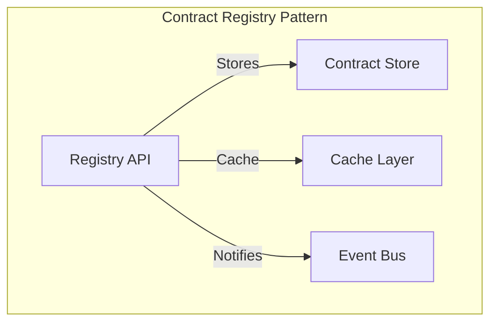
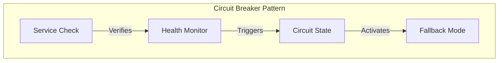
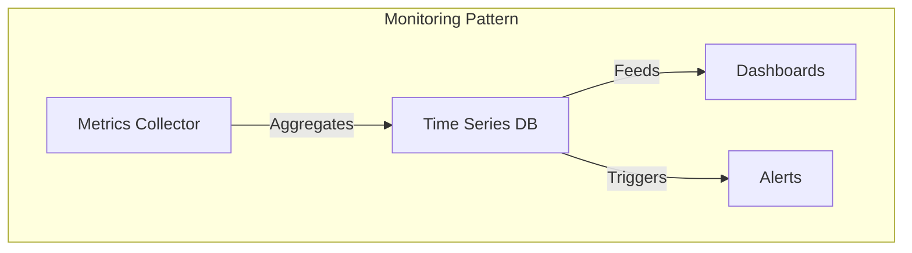
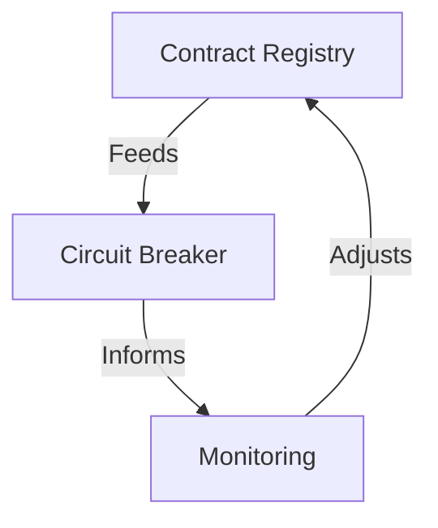

# Architecture patterns: the patterns that really work

"In theory, there is no difference between theory and practice. In practice, there is." This saying takes on its full meaning when discussing architecture patterns for data contracts. The architectural patterns we will explore are not mere theoretical abstractions but conceptual models that structure how data contracts integrate into an organization's data ecosystem.

## The contract registry pattern

At the heart of any data contract architecture lies the Contract Registry pattern. This pattern addresses a fundamental issue: how to centralize and efficiently distribute data contracts across the organization? The Registry acts as a single source of truth, providing a centralized access point while managing the distribution and updating of contracts.

The essence of this pattern lies in its ability to manage the complete lifecycle of contracts. The Registry does not merely store contracts passively; it actively orchestrates their distribution, validation, and evolution. The cache layer optimizes performance by reducing access latency to frequently used contracts, while the event bus enables efficient asynchronous communication between the system's various components.

## The circuit breaker pattern

The Circuit Breaker pattern represents a sophisticated approach to managing resilience in a data contract ecosystem. Its fundamental principle is to prevent the propagation of failures by quickly detecting and isolating problems.

This pattern operates at three distinct levels. At the detection level, it continuously monitors the health of data flows and associated contracts. At the protection level, it can quickly isolate failing components to prevent cascading effects. At the recovery level, it manages the gradual resumption of service once issues are resolved.

## The proactive monitoring pattern

Proactive monitoring goes beyond mere passive surveillance. This pattern deeply integrates observability into the architecture of data contracts, allowing not only for problem detection but also anticipation.

The proactive monitoring approach rests on three fundamental pillars. The first is the continuous collection of relevant metrics, ranging from data compliance to system performance. The second is real-time analysis of these metrics to detect trends and anomalies. The third is the ability to trigger automatic corrective actions when certain thresholds are reached.

## Orchestrating the patterns

The true power of these patterns emerges from their harmonious orchestration. The Registry feeds the Circuit Breaker with information on the state of contracts, while monitoring provides an overview of the system's health. This synergy creates a self-regulating system capable of maintaining its stability in the face of disruptions.

This orchestration allows for dynamic management of data contracts, where each pattern plays a specific role in maintaining the quality and reliability of the overall system.

## Conclusion

The architectural patterns of data contracts are not mere theoretical models but practical guides for building robust and scalable systems. Their successful implementation relies on a deep understanding of their interactions and complementarity. In the next article, we will explore how these patterns translate into concrete implementations in different technological contexts. 