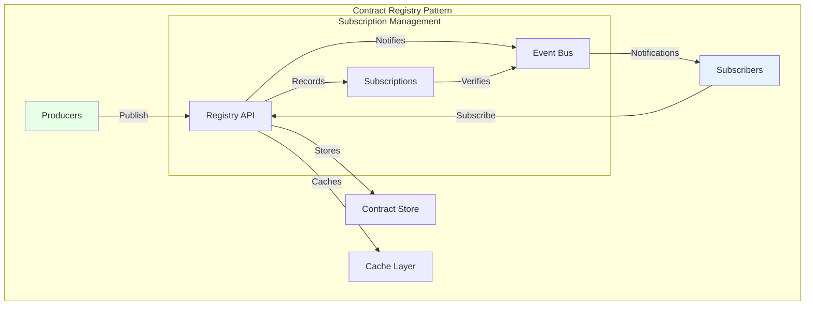
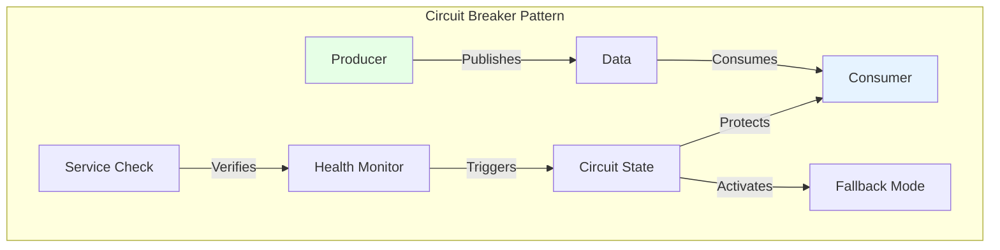
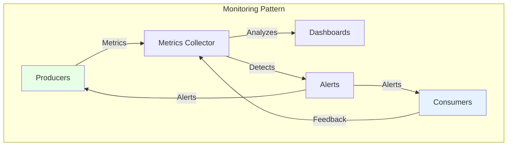
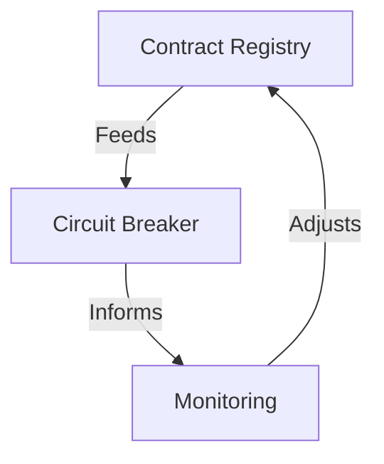

# Architecture Patterns: The Patterns That Really Work

"In theory, there is no difference between theory and practice. In practice, there is."

This maxim takes on its full meaning when discussing architecture patterns for data contracts. The architectural patterns we'll explore aren't just theoretical abstractions, but conceptual models that structure how data contracts integrate into an organization's data ecosystem.

## The Contract Registry Pattern

At the heart of any data contract architecture lies the Contract Registry pattern. This pattern addresses a fundamental problem: how to effectively centralize and distribute data contracts across the organization? The Registry acts as a single source of truth, offering a centralized access point while managing contract distribution and updates.



The essence of this pattern lies in its ability to manage the complete lifecycle of contracts. The Registry doesn't just passively store contracts; it actively orchestrates their distribution, validation, and evolution. The cache layer optimizes performance by reducing access latency to frequently used contracts, while the event bus enables efficient asynchronous communication between different system components.

The subscription mechanism is central to this pattern:
- Consumers subscribe to contracts they're interested in
- The Registry maintains a subscription registry
- Any contract modification (new version, deprecation) triggers a notification to affected subscribers
- Producers can consult the list of consumers for their contracts

## The Circuit Breaker Pattern

The Circuit Breaker pattern represents a sophisticated approach to resilience management in a data contract ecosystem. Its fundamental principle is to prevent failure propagation by quickly detecting and isolating problems.



This pattern operates at three distinct levels:

1. **Detection**: Continuous monitoring of data flows and associated contracts
2. **Protection**: Rapid isolation of failing components to prevent cascade effects
3. **Recovery**: Managing gradual service restoration

The Fallback Mode is a crucial component of this pattern. When a failure is detected, instead of failing completely, the system switches to a degraded but functional mode. For example:

- If real-time data is unavailable, use the latest valid cached data
- If the complete schema cannot be validated, accept a minimal subset of critical fields
- If the primary producer is unavailable, switch to a secondary data source

Let's take a concrete retail example: the product recommendation system normally uses real-time customer navigation data. If this data becomes unavailable, the Circuit Breaker activates the Fallback Mode which uses a simpler recommendation model based only on sales history. Performance is reduced, but the service continues to function.

```yaml
fallback_modes:
  recommendation_service:
    - level: "primary"
      source: "real_time_navigation"
      schema: "full_customer_behavior"
    - level: "fallback"
      source: "sales_history"
      schema: "minimal_product_data"
      activation_conditions:
        - "real_time_data_latency > 30s"
        - "schema_validation_errors > 5%"
```

## The Proactive Monitoring Pattern

Proactive monitoring goes beyond simple passive surveillance. This pattern deeply integrates observability into the data contracts architecture, allowing not just to detect problems, but to anticipate them.



The proactive approach to monitoring rests on three fundamental pillars. The first is continuous collection of relevant metrics, ranging from data compliance to system performance. The second is real-time analysis of these metrics to detect trends and anomalies. The third is the ability to trigger automatic corrective actions when certain thresholds are reached.

## Pattern Orchestration

The true power of these patterns emerges from their harmonious orchestration. The Registry feeds the Circuit Breaker with information about contract states, while monitoring provides an overview of system health. This synergy creates a self-regulating system capable of maintaining stability in the face of disruptions.



This orchestration enables dynamic management of data contracts, where each pattern plays a specific role in maintaining the quality and reliability of the overall system.

## Conclusion

The architectural patterns of data contracts aren't just theoretical models, but practical guides for building robust and scalable systems. Their successful implementation relies on a deep understanding of their interactions and complementarity.

However, experience shows that production deployment of data contracts is often the stumbling block for many projects. How to manage performance at scale? How to ensure high availability of the Registry? How to orchestrate the deployment of different components? These crucial questions, often neglected in the design phase, will be the subject of our next article on industrializing data contracts.