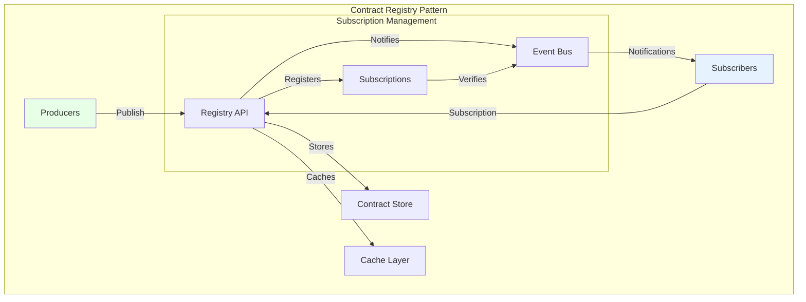
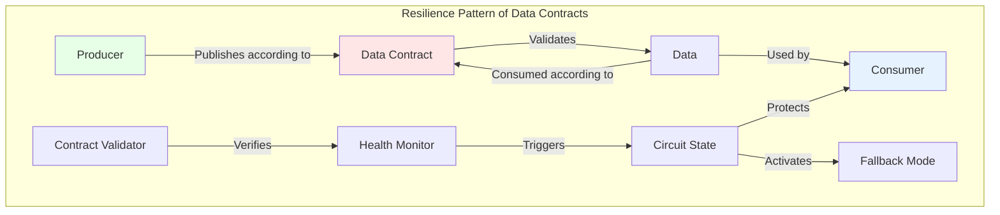
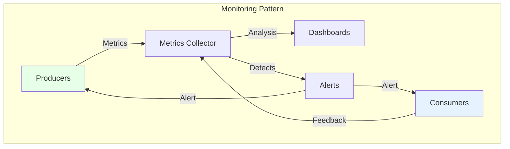
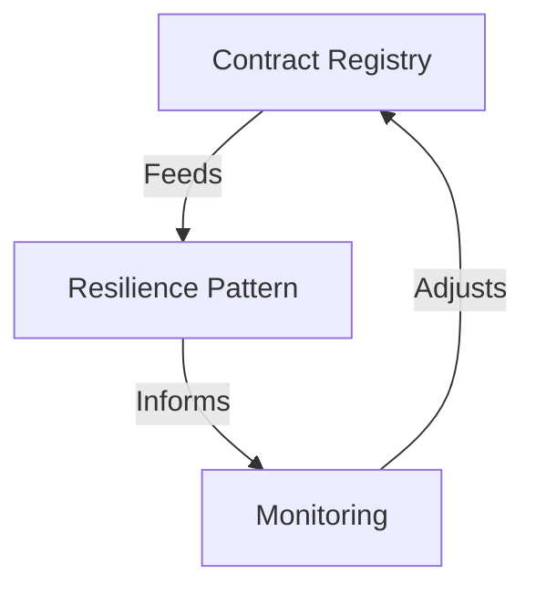

# Operational Architecture Patterns: Patterns That Really Work in Production

"In theory, there is no difference between theory and practice. In practice, there is." 

This saying makes perfect sense when we talk about operational architecture patterns for data contracts. The patterns we will explore in this article focus on how data contracts function and are managed once they are created and deployed in production.

Unlike the construction architecture of data contracts (which we had already covered in the previous article), operational architecture focuses on how contracts integrate into an organization's data ecosystem and how they are maintained, distributed, and monitored daily.

## The Contract Registry Pattern

At the heart of any data contract architecture is the Contract Registry pattern. This pattern addresses a fundamental issue: how to centralize and efficiently distribute data contracts across the organization? The Registry acts as a single source of truth, providing a centralized access point while managing the distribution and updating of contracts.



The essence of this pattern lies in its ability to manage the complete lifecycle of contracts. The Registry does not merely store contracts passively; it actively orchestrates their distribution, validation, and evolution. The cache layer optimizes performance by reducing access latency to frequently used contracts, while the event bus enables efficient asynchronous communication between the system's various components.

The subscription mechanism is central to this pattern:
- Consumers subscribe to the contracts they are interested in
- The Registry maintains a record of subscriptions
- Any modification of a contract (new version, deprecation) triggers a notification to the concerned subscribers
- Producers can consult the list of consumers of their contracts

## The Resilience Pattern of Data Contracts

The resilience pattern of data contracts is inspired by the famous Circuit Breaker pattern used in software development but is specifically adapted to the context of data contracts. Its fundamental principle is to prevent the propagation of failures related to contract violations by quickly detecting and isolating problems.



This pattern operates at three distinct levels, all centered on the data contract:

1. **Detection of Contract Violations**: Continuous monitoring of data compliance with established contracts (schema, quality, SLAs)
2. **Protection of Consumers**: Rapid isolation of non-compliant data flows to prevent error propagation
3. **Controlled Adaptation**: Implementation of graceful degradation strategies defined in the contract itself

### The Circuit Breaker Applied to Data Contracts

The Circuit Breaker in this context works as follows:
- **Closed State**: Data flows normally, in compliance with the contract
- **Open State**: When too many contract violations are detected, the circuit opens to protect consumers
- **Half-Open State**: After a delay, the system tests if the issues are resolved before fully closing the circuit again

What distinguishes this pattern is that the rules for opening and closing the circuit are directly specified in the data contract, making the system self-adaptive.

### The Fallback Mode as a Resilience Strategy

The Fallback Mode is a complementary strategy to the Circuit Breaker. When the circuit is open (indicating contract violations), instead of completely failing, the system can switch to a degraded but functional mode, also defined in the contract. For example:

- If real-time data does not meet the freshness contract, use the last valid data in cache
- If the complete schema cannot be validated, accept a minimal subset of critical fields defined in the contract
- If the primary producer is unavailable, switch to a secondary data source specified in the contract

Let's take a concrete example in retail: the product recommendation system normally uses real-time customer navigation data, with a contract specifying the structure and freshness of the data. The contract also includes resilience rules:

```yaml
data_contract:
  name: "customer_behavior_data"
  schema: "full_customer_behavior.avsc"
  sla:
    freshness: "< 5min"
    completeness: "> 95%"
  
  # Resilience rules integrated into the contract
  resilience:
    circuit_breaker:
      open_when:
        - "schema_validation_errors > 5%"
        - "data_freshness > 30min"
      recovery:
        retry_after: "5min"
        max_retries: 3
    
    fallback_modes:
      - level: "primary"
        source: "real_time_navigation"
        schema: "full_customer_behavior"
      - level: "fallback"
        source: "sales_history"
        schema: "minimal_product_data"
        activation_conditions:
          - "real_time_data_latency > 30s"
          - "schema_validation_errors > 5%"
```

This approach directly integrates resilience strategies into the data contract itself, creating a self-adaptive system capable of maintaining a service, even degraded, in the face of failures.

## The Proactive Monitoring Pattern

Proactive monitoring goes beyond simple passive surveillance. This pattern deeply integrates observability into the architecture of data contracts, allowing not only to detect problems but also to anticipate them.



The proactive monitoring approach is based on three fundamental pillars. The first is the continuous collection of relevant metrics, ranging from data compliance to system performance. The second is real-time analysis of these metrics to detect trends and anomalies. The third is the ability to trigger automatic corrective actions when certain thresholds are reached.

## Orchestrating the Patterns

The true power of these patterns emerges from their harmonious orchestration. The Registry feeds the resilience pattern with information on the state of contracts, while monitoring provides an overview of the system's health. This synergy creates a self-regulating system capable of maintaining its stability in the face of disruptions.



This orchestration allows dynamic management of data contracts, where each pattern plays a specific role in maintaining the quality and reliability of the overall system.

## Conclusion

The architectural patterns of data contracts are not mere theoretical models but practical guides for building robust and scalable systems. Their successful implementation relies on a deep understanding of their interactions and complementarity.

However, experience shows that the production deployment of data contracts is often the stumbling block of many projects. How to manage performance at scale? How to ensure high availability of the Registry? How to orchestrate the deployment of different components? These crucial questions, often overlooked in the design phase, will be the subject of our next article on the industrialization of data contracts. 