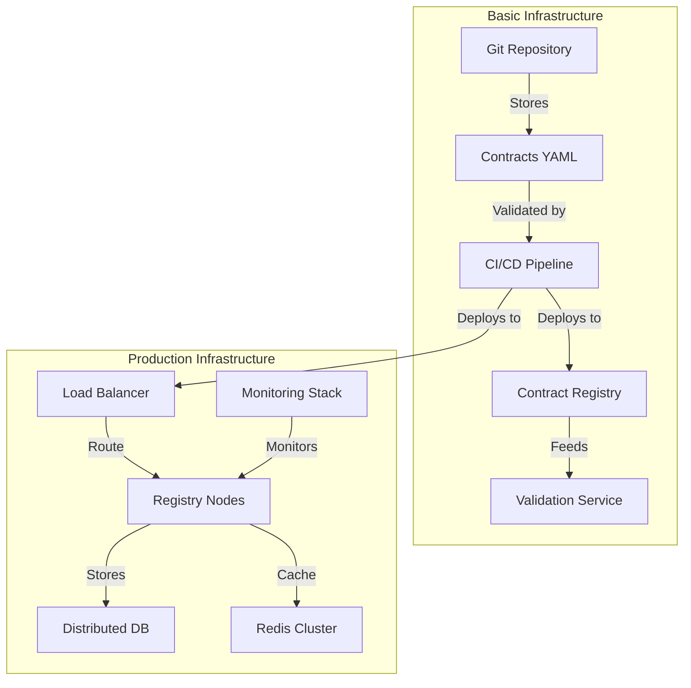

# Implementation: from concept to reality

"It's all well and good in theory, but how do we put it into production?" This question comes up systematically during discussions about data contracts. It reflects a legitimate concern: the transition from theory to practice is often where the most beautiful concepts meet the reality of the field.

## Architecture and infrastructure

Implementing a data contract system relies on a distributed architecture that must reconcile robustness and flexibility. At the heart of this architecture is the Contract Registry, the true cornerstone of the system. This registry is not just a simple document repository; it is an active service that orchestrates the entire lifecycle of contracts.

This architecture highlights several essential concepts. The first is the separation between contract storage and their use in production. Contracts are first versioned in a Git repository, allowing precise tracking of changes and effective collaboration between teams. The CI/CD pipeline then plays a crucial role in automating contract validation and deployment.

## Continuous validation

One of the most critical aspects of implementation is the continuous validation of contracts. This validation operates at several levels. At the syntactic level first, where each contract is checked to ensure it complies with the ODCS format. At the semantic level next, where business rules and quality constraints are evaluated. Finally, at the operational level, where the contract's impact on existing systems is measured.

The validation process must be automated but not blind. Experience shows that purely automatic validation can overlook subtle issues that only a human eye can detect. This is why a hybrid approach is recommended, combining automated tests and human review for critical changes.

## Progressive deployment

Deploying a data contract system cannot be done abruptly. A progressive approach, inspired by continuous deployment techniques, is necessary. This approach begins with a shadow testing phase, where the new system operates in parallel with the old one without impacting production. This phase allows validating the system's behavior under real conditions.

Next comes a gradual deployment phase, where traffic is progressively redirected to the new system. This approach allows quickly detecting problems and correcting them before they impact all users. The ability to roll back quickly is crucial during this phase.

## Observability as a foundation

Observability is not an additional feature but a fundamental component of the system. It must be thought of from the design stage and integrated at all levels. This observability revolves around three axes: technical metrics (latency, availability), business metrics (validation rate, data quality), and usage metrics (contract usage, access patterns).

Implementing good observability not only allows detecting problems but also understanding the system's actual usage. This understanding is valuable for guiding system evolution and prioritizing improvements.

## The human dimension

The technical aspect of implementation, although crucial, represents only part of the challenge. The human dimension is just as important. Implementing a data contract system represents a significant change in how teams work with data. This change must be accompanied.

This support involves training teams, establishing clear processes, and above all, constant communication. Teams must understand not only how to use the system but also why it is important.

## Conclusion

Implementing a data contract system is a journey more than a destination. It is an iterative process that must adapt to the organization's needs and constraints. The success of this implementation relies as much on the solidity of the technical architecture as on the ability to accompany change within teams.

In the next article, we will explore how to manage the complete lifecycle of data contracts, from creation to retirement, through evolution and maintenance. 