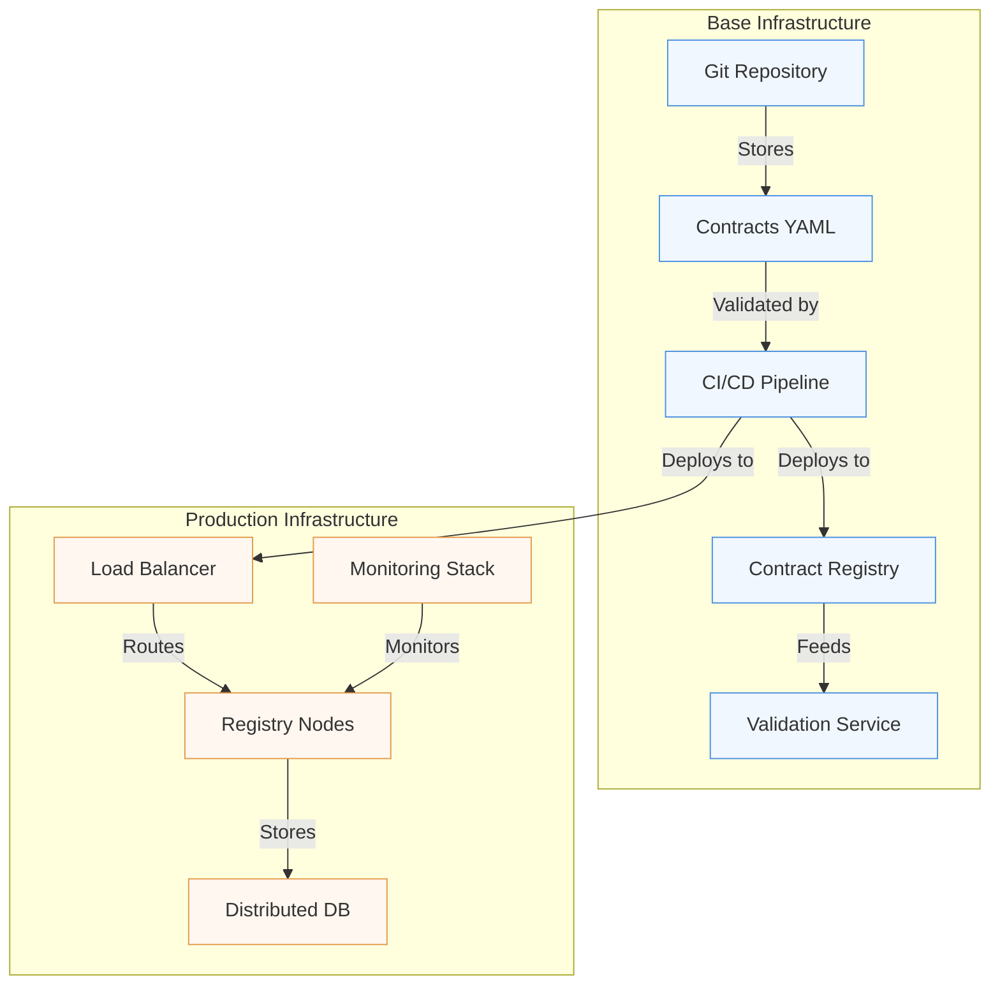

# Implementation: From Concept to Reality

"Theory is all well and good, but how do we put this into production?"

This question comes up systematically during discussions about data contracts. It reflects a legitimate concern: the transition from theory to practice is often the moment when the most beautiful concepts collide with ground reality.

## Architecture and Infrastructure

The implementation of a data contract system relies on a distributed architecture that must balance robustness and flexibility. At the heart of this architecture lies the Contract Registry, the true cornerstone of the system. This registry isn't just a simple document repository; it's an active service that orchestrates the entire contract lifecycle.



This architecture highlights several essential concepts. The first is the separation between contract storage and their production use. Contracts are first versioned in a Git repository, allowing precise tracking of modifications and effective collaboration between teams. The CI/CD pipeline then plays a crucial role in automating contract validation and deployment.

For scalability, solutions like Redis can be added for caching, but this is generally only necessary for very high-load systems.

## Continuous Validation

One of the most critical aspects of implementation is continuous contract validation. A CI/CD pipeline that only validates YAML syntax has no value - we've seen cases where Contract Registries accepted syntactically valid but semantically meaningless contracts, creating a false sense of security.

Validation must operate at several levels:
- **Syntactic**: Verification of ODCS format and contract structure
- **Semantic**: Validation of business rules, definition consistency, compliance with organization standards
- **Contextual**: Verification of dependencies, compatibility with existing versions
- **Operational**: Evaluation of impact on existing systems

A contract that passes syntactic validation but fails semantic or contextual validations is potentially more dangerous than no contract at all, as it gives a false impression of governance. The CI/CD pipeline must therefore integrate thorough tests that verify not just the form but also the substance of contracts.

## Progressive Deployment

The deployment of a data contract system cannot be done abruptly. A progressive approach, inspired by continuous deployment techniques, is necessary. This approach begins with a shadow testing phase, where the new system operates in parallel with the old one without impacting production. This phase allows validating system behavior under real conditions.

Next comes a gradual deployment phase, where traffic is progressively redirected to the new system. This approach allows quickly detecting problems and correcting them before they impact all users. The ability to quickly roll back is crucial during this phase.

## Observability as Foundation

Observability isn't an additional feature but a fundamental component of the system. Without it, it's impossible to know if data contracts are fulfilling their role. In our retail context, let's take the example of a contract for sales data:

```yaml
dataContractSpecification: 1.1.0
id: urn:datacontract:sales:monitoring
info:
  title: "Sales Data Monitoring"
  version: "1.0.0"
  description: "Monitoring configuration for sales data quality and system health"
  owner: "data-quality-team"
  contact:
    name: "Data Quality Team"
    email: "dq-team@company.com"

servers:
  local:
    type: "local"
    path: "./data/monitoring_config.json"
    format: "json"
    description: "Local monitoring configuration"
  prod:
    type: "s3"
    path: "s3://data-lake-prod/monitoring/config/"
    format: "json"
    description: "Production monitoring configuration"

models:
  MonitoringConfig:
    type: "object"
    description: "Monitoring metrics configuration"
    fields:
      system_health:
        type: "object"
        description: "System health metrics"
        fields:
          contract_validation_latency:
            type: "object"
            description: "Contract validation performance"
            fields:
              threshold_ms:
                type: "integer"
                description: "Maximum acceptable latency in milliseconds"
                required: true
              alert_level:
                type: "text"
                enum: ["warning", "critical"]
                required: true
          registry_availability:
            type: "object"
            description: "Contract registry availability"
            fields:
              min_percentage:
                type: "decimal"
                description: "Minimum acceptable availability percentage"
                required: true
      data_quality:
        type: "object"
        description: "Data quality metrics"
        fields:
          missing_product_codes:
            type: "object"
            description: "Missing product code monitoring"
            fields:
              max_percentage:
                type: "decimal"
                description: "Maximum acceptable percentage of missing codes"
                required: true
              measurement_window:
                type: "text"
                description: "Time window for measurement"
                required: true

terms:
  usage: "Monitoring configuration for data quality assurance"
  limitations: "Alert thresholds require SRE team approval"
  noticePeriod: "P2D"

servicelevels:
  alerts:
    description: "Alert response time"
    responseTime: "PT15M"
    priority: "P1"
  
  reporting:
    description: "Monitoring reports generation"
    frequency: "PT1H"
    retention: "P90D"
```

These metrics allow answering concrete questions:
- Is the system working correctly? (technical metrics)
- Is the data reliable? (business metrics)
- Are teams actually using the contracts? (usage metrics)

For example, a sudden increase in schema violations might indicate:
- A problem in the data source system
- A contract poorly adapted to real needs
- A need for training of producing teams

Observability thus allows being proactive rather than reactive in data contract management.

## The Human Dimension

The technical aspect of implementation, while crucial, represents only part of the challenge. The human dimension is equally important. Implementing a data contract system represents a significant change in how teams work with data.

This human dimension is so critical that it deserves a dedicated article. In our article on governance and adoption that will appear in a future article, we'll explore in detail:
- Team organization and role definition
- Training and support strategies
- Setting up a Center of Excellence
- Adoption and satisfaction metrics

Because even the most sophisticated technical implementation will fail if teams aren't properly supported through this change.

## Conclusion

Implementing a data contract system is a journey more than a destination. It's an iterative process that must adapt to the organization's needs and constraints. The success of this implementation relies as much on the solidity of the technical architecture as on the ability to support change among teams.

In the next article, we'll explore how to manage the complete lifecycle of data contracts, from their creation to their retirement, including their evolution and maintenance.