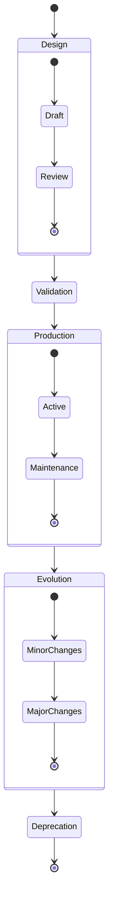
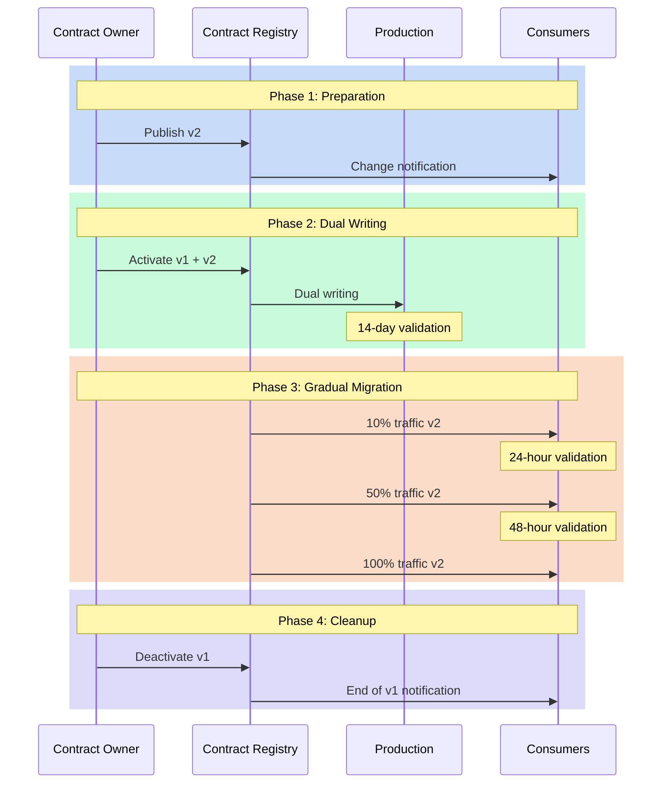

# Lifecycle: Beyond Simple YAML

It's midnight, and an alert sounds: a critical data contract has just been modified without following the established process. This situation, unfortunately common, illustrates the crucial importance of understanding and properly managing the lifecycle of data contracts. A data contract is not a static document - it is a living organism that evolves with your organization and requires rigorous management throughout its existence.

## The Phases of the Lifecycle

The lifecycle of a data contract follows a well-defined path, from its conception to its end of life. This natural progression begins with a design phase where needs are identified and the contract is developed. This initial step is crucial as it lays the foundation for everything that follows. The contract then goes through a rigorous validation phase before entering production.



Once in production, the contract enters a phase of continuous evolution, where it adapts to the changing needs of the organization. This evolution must be carefully orchestrated to maintain data consistency and quality. Finally, when the contract is no longer relevant, it enters a deprecation phase leading to its end of life.

## The Structure of an Evolving Contract

To support this lifecycle, the contract itself must be structured to capture its evolution. Here's how such a contract could be structured:

```yaml
apiVersion: v3.0.0
kind: DataContract
id: urn:datacontract:user:preferences
domain: user-domain
tenant: UserExperience
name: User Preferences
version: 3.0.0
status: active

description:
  purpose: "Manage user preferences and settings"
  usage: "Personalization and user experience optimization"
  limitations: "Personal data subject to GDPR"
  dataGranularityDescription: "One record per user"
  lifecycle:
    currentPhase: "active"
    phases:
      - name: "draft"
        startDate: "2023-09-01"
        endDate: "2023-10-01"
        activities: ["initial design", "stakeholder review"]
      - name: "beta"
        startDate: "2023-10-01"
        endDate: "2023-12-01"
        activities: ["limited production testing", "performance optimization"]
      - name: "active"
        startDate: "2024-01-01"
        activities: ["full production use", "monitoring"]
    deprecationPlan:
      scheduledDate: "2025-01-01"
      migrationPath: "v4.0.0"
      notificationPeriod: "6 months"

schema:
  - name: UserPreference
    physicalName: user_preferences
    physicalType: table
    description: "User preference settings"
    tags: ["user", "preferences", "settings"]
    properties:
      - name: user_id
        logicalType: string
        physicalType: text
        description: "Unique user identifier"
        isNullable: false
        isUnique: true
        criticalDataElement: true
        examples: ["USER-001"]
      - name: theme
        logicalType: string
        physicalType: text
        description: "UI theme preference"
        isNullable: false
        allowedValues: ["light", "dark", "system"]
        addedInVersion: "2.0.0"
        examples: ["dark"]
      - name: notifications
        logicalType: object
        physicalType: json
        description: "Notification preferences"
        isNullable: false
        addedInVersion: "3.0.0"
        schema:
          type: object
          properties:
            email:
              type: boolean
              description: "Email notifications enabled"
            push:
              type: boolean
              description: "Push notifications enabled"
            frequency:
              type: string
              enum: ["real-time", "daily", "weekly"]
        examples: [{"email": true, "push": false, "frequency": "daily"}]

quality:
  - rule: validTheme
    description: "Theme must be one of the allowed values"
    dimension: validity
    severity: error
    businessImpact: operational
  - rule: validNotifications
    description: "Notification preferences must be valid JSON"
    dimension: validity
    severity: error
    businessImpact: operational

team:
  - username: agarcia
    role: Data Product Owner
    dateIn: "2023-09-01"
  - username: lzhang
    role: Data Steward
    dateIn: "2023-09-01"

support:
  - channel: "#user-preferences"
    tool: slack
    url: https://company.slack.com/user-preferences
  - channel: user-prefs@company.com
    tool: email
    url: mailto:user-prefs@company.com

servers:
  - server: prod
    type: postgresql
    format: sql
    url: postgresql://user-prefs.prod.company.com:5432/preferences
    description: "Production preferences database"

slaProperties:
  - property: latency
    value: 1
    unit: s
  - property: retention
    value: 5
    unit: y
  - property: frequency
    value: 1
    unit: s

tags:
  - user
  - preferences
  - settings
  - personalization

customProperties:
  - property: dataDomain
    value: user
  - property: criticality
    value: high
  - property: personalData
    value: true
  - property: gdprRelevant
    value: true
```

## Managing Transitions

The transition phase between contract versions is particularly delicate. It requires careful orchestration to avoid any disruption to production systems. This orchestration begins with a period of dual writing, where data is written simultaneously in both the old and new versions of the contract. This approach allows the new version to be validated while maintaining the stability of existing systems.



### Phase 1: Preparation
This phase is crucial as it lays the groundwork for a successful transition:
- The Contract Owner publishes the new version (v2) in the Registry
- Consumers are automatically notified via the subscription system
- Teams can begin studying the changes and planning their migration
- The migration documentation is validated and published

### Phase 2: Dual Writing
This securing phase allows the new version to be validated under real conditions:
- Data is written simultaneously in versions v1 and v2
- Teams can compare results between the two versions
- A 14-day period covers all business cases (end of month, weekend, etc.)
- Anomalies can be detected without impacting production

### Phase 3: Gradual Migration
The switch is done in stages to minimize risks:
- 10% of traffic is directed to v2, allowing problems to be quickly detected
- A 24-hour validation confirms proper functioning at this first stage
- Traffic is increased to 50% if no issues are detected
- After an additional 48 hours of validation, the full switch is made

### Phase 4: Cleanup
This final phase is often overlooked but essential:
- v1 is officially deprecated in the Registry
- A final notification is sent to consumers
- v1 resources are cleaned up (storage, monitoring, etc.)
- Documentation is updated to reflect the end of life of v1

This methodical approach to transition allows:
- Minimizing operational risks
- Providing visibility to all stakeholders
- Ensuring a controlled and reversible migration
- Maintaining service quality during the transition

## The End of a Contract's Life

The end of a contract's life must be managed with as much care as its creation. This phase begins with a deprecation period where consumers are gradually migrated to alternatives. Once all consumers are migrated, the contract can be archived, but its metadata and history must be preserved to maintain traceability and regulatory compliance.

## Conclusion

Managing the lifecycle of data contracts is a fundamental aspect of any data governance strategy. It requires a systematic approach and constant attention to the needs of data producers and consumers. Good lifecycle management not only ensures data quality and reliability but also facilitates system evolution while maintaining user trust.

In the next article, we will explore how these lifecycle management practices fit into a broader data governance strategy and how they contribute to creating a mature data culture within the organization. 