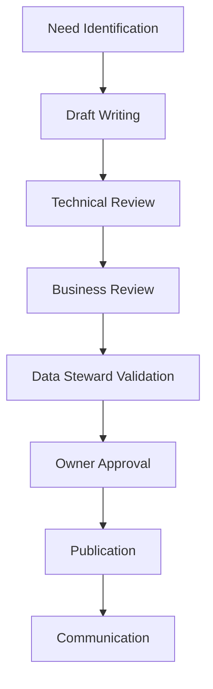

# Data Contracts Governance and Adoption: The Human Aspect

The success of a data contracts initiative doesn't rely solely on technical aspects. Human organization, governance, and team adoption are critical success factors. My experience shows that even technically perfect implementations fail without proper governance and a well-thought-out adoption strategy.

## Organization and Roles

Role clarity is essential for effective data contracts governance. Beyond formal responsibilities, an entire collaboration ecosystem must be established. Here are the key roles and their articulation:

### Data Contract Owner

```yaml
role: Data Contract Owner
responsibilities:
  - Definition of data contracts strategy
  - Conflict resolution
  - Validation of major changes
  - Supervision of overall quality
skills_required:
  - Strategic data vision
  - Understanding of business challenges
  - Decision-making ability
reporting_to: Chief Data Officer
```

The Data Contract Owner is not just a title - they are the guarantor of the vision and overall coherence. Their role is particularly crucial in moments of tension, for example during disagreements between producers and consumers about schema evolution. They must know how to balance teams' short-term needs with the long-term vision of the data architecture.

### Data Architect

The Data Architect plays a pivotal role between technical vision and business needs. Their expertise is essential for:
- Ensuring technical consistency of contracts across domains
- Anticipating the impacts of changes on the overall architecture
- Guiding teams in adopting appropriate patterns

```yaml
role: Data Architect
responsibilities:
  - Technical architecture design
  - Definition of contract patterns
  - Establishment of technical standards
  - Architectural evolution management
skills_required:
  - Deep technical expertise
  - System design experience
  - Cross-domain knowledge
  - Mastery of architecture patterns
reporting_to: Technical Director
key_collaborations:
  - Data Contract Owner
  - Product Manager
  - Data Engineers
```

### Product Manager

The Product Manager brings an often-neglected essential dimension: the product vision. Data contracts are not just technical artifacts; they are products that must create value for their users. The Product Manager:
- Analyzes data consumers' needs
- Prioritizes evolution based on business value
- Ensures alignment with global product strategy

```yaml
role: Product Manager
responsibilities:
  - Data products strategy
  - User needs analysis
  - Feature prioritization
  - Stakeholder management
skills_required:
  - Product management expertise
  - Data domain knowledge
  - User experience focus
  - Strategic thinking
reporting_to: Data Products Lead
key_collaborations:
  - Data Architect
  - Data Contract Owner
  - Business Users
```

### Data Steward

```yaml
role: Data Steward
responsibilities:
  - Contract maintenance
  - Documentation and standards
  - Team training
  - Quality monitoring
skills_required:
  - Technical data expertise
  - Educational skills
  - Methodological rigor
reporting_to: Data Contract Owner
```

### Data Engineer

```yaml
role: Data Engineer
responsibilities:
  - Technical implementation
  - Testing and validation
  - Operational monitoring
  - Schema evolution
skills_required:
  - Data engineering expertise
  - Testing tools mastery
  - Understanding of architecture patterns
reporting_to: Technical Lead
```

### Data Consumer

```yaml
role: Data Consumer
responsibilities:
  - Contract compliance
  - Needs reporting
  - Review participation
  - Functional validation
skills_required:
  - Business understanding
  - Analytical ability
  - Communication
reporting_to: Business Unit Lead
```

## Governance Process

### Creation and Approval

The contract creation and approval process follows a structured workflow:



### Validation Workflow

```python
class ContractWorkflow:
    def __init__(self, contract_draft):
        self.draft = contract_draft
        self.status = "draft"
        self.approvals = {}
        
    def submit_for_review(self):
        """Submits the contract for review"""
        self.status = "in_review"
        self.notify_reviewers()
        
    def approve(self, reviewer_role, comments=None):
        """Records an approval"""
        self.approvals[reviewer_role] = {
            'approved_at': datetime.now(),
            'comments': comments
        }
        
    def is_fully_approved(self):
        """Checks if all approvals are obtained"""
        required_roles = {'technical', 'business', 'steward', 'owner'}
        return required_roles.issubset(self.approvals.keys())
```

### Monitoring and Reporting

Governance monitoring relies on key metrics:

```python
class GovernanceMetrics:
    def calculate_adoption_rate(self):
        """Calculates contract adoption rate"""
        return {
            'total_contracts': self.count_total_contracts(),
            'active_contracts': self.count_active_contracts(),
            'compliance_rate': self.calculate_compliance_rate(),
            'quality_score': self.calculate_quality_score()
        }
        
    def generate_governance_report(self):
        """Generates a governance report"""
        return {
            'metrics': self.calculate_adoption_rate(),
            'violations': self.get_contract_violations(),
            'pending_reviews': self.get_pending_reviews(),
            'quality_trends': self.analyze_quality_trends()
        }
```

## Adoption Strategies

### Center of Excellence

Establishing a Center of Excellence (CoE) is crucial:

```python
class DataContractCoE:
    def provide_templates(self):
        """Provides standardized templates"""
        return {
            'basic_contract': self.load_template('basic'),
            'event_contract': self.load_template('event'),
            'api_contract': self.load_template('api')
        }
        
    def deliver_training(self):
        """Organizes training"""
        training_modules = [
            'contract_basics',
            'quality_rules',
            'migration_patterns',
            'best_practices'
        ]
        return self.schedule_training(training_modules)
```

### Training Program

Training is not an optional step but a pillar of success. Our experience shows that a structured training program must:
- Adapt to different profiles and maturity levels
- Combine theory and practice with concrete cases
- Evolve with organization maturity

```yaml
training_program:
  modules:
    - name: "Data Contracts Fundamentals"
      duration: "1 day"
      target_audience: "All"
      objectives:
        - Understand business value of contracts
        - Master fundamental concepts
        - Identify relevant use cases
    - name: "Technical Implementation"
      duration: "2 days"
      target_audience: "Data Engineers"
    - name: "Governance and Quality"
      duration: "1 day"
      target_audience: "Data Stewards"
    - name: "Usage and Compliance"
      duration: "0.5 day"
      target_audience: "Data Consumers"
```

### Success Metrics

Success monitoring should not be limited to technical metrics. It's crucial to also measure business and organizational impact:

```python
class AdoptionMetrics:
    def track_success_metrics(self):
        return {
            'contract_coverage': self.calculate_coverage(),
            'quality_improvement': self.measure_quality_trends(),
            'time_to_market': self.calculate_delivery_time(),
            'incident_reduction': self.measure_incident_reduction(),
            'team_satisfaction': self.measure_satisfaction()
        }
```

These metrics must be analyzed in their context and serve as a basis for continuous program improvement.

## Lessons Learned

1. **Start Small**
   - Identify motivated early adopters
   - Demonstrate value quickly
   - Iterate on feedback

2. **Invest in Training**
   - Continuously train teams
   - Share success stories
   - Document best practices

3. **Measure and Communicate**
   - Track adoption metrics
   - Celebrate successes
   - Learn from failures

4. **Adapt Governance**
   - Stay agile in processes
   - Listen to team needs
   - Evolve with maturity

## Conclusion

Data contracts governance and adoption is a journey, not a destination. Success relies on a balance between structure and flexibility, between control and autonomy. Investment in the human aspect is as important as technical excellence.

This series of articles on data contracts ends here, but your journey is just beginning. Use these principles as a starting point and adapt them to your specific context.

## Reference Implementation

The governance infrastructure is implemented in:

- [Governance](../../../governance/)
  - [Workflow](../../../governance/workflow.py) - Workflow management
  - [CoE Config](../../../governance/coe_config.yaml) - Center of Excellence configuration
- [Templates](../../../contracts/templates/) - Contract templates