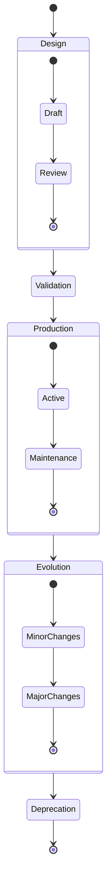
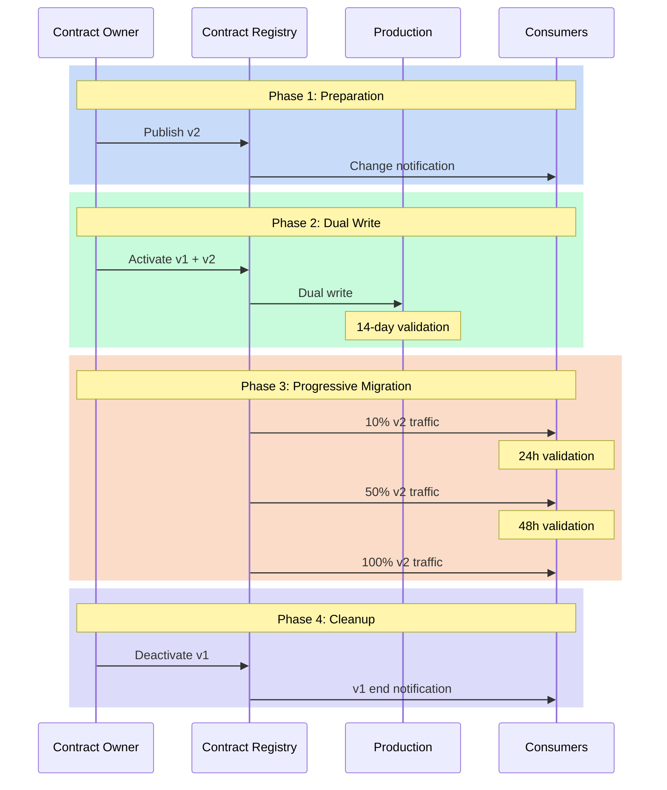

# Lifecycle: Beyond Simple YAML

It's midnight, and an alert rings out: a critical data contract has been modified without following the established process. This situation illustrates the crucial importance of understanding and properly managing the lifecycle of data contracts. A data contract is not a static document - it's a living organism that evolves with your organization and requires rigorous management throughout its existence.

## Lifecycle Phases

The lifecycle of a data contract follows a well-defined path, from its conception to its end of life. This natural progression begins with a design phase where needs are identified and the contract is developed. This initial stage is crucial as it lays the foundation for everything that follows. The contract then goes through a rigorous validation phase before entering production.



Once in production, the contract enters a phase of continuous evolution, adapting to the changing needs of the organization. This evolution must be carefully orchestrated to maintain data consistency and quality. Finally, when the contract is no longer relevant, it enters a deprecation phase that leads to its end of life.

## Structure of an Evolving Contract

To support this lifecycle, the contract itself must be structured to capture its evolution. Here's how such a contract could be structured:

```yaml
apiVersion: v3.0.0
kind: DataContract
id: urn:datacontract:user:preferences
domain: user-domain
tenant: UserExperience
name: User Preferences
version: 3.0.0
status: active

description:
  purpose: "Manage user preferences and settings"
  usage: "Personalization and user experience optimization"
  limitations: "Personal data subject to GDPR"
  dataGranularityDescription: "One record per user"
  lifecycle:
    currentPhase: "active"
    phases:
      - name: "draft"
        startDate: "2023-09-01"
        endDate: "2023-10-01"
        activities: ["initial design", "stakeholder review"]
      - name: "beta"
        startDate: "2023-10-01"
        endDate: "2023-12-01"
        activities: ["limited production testing", "performance optimization"]
      - name: "active"
        startDate: "2024-01-01"
        activities: ["full production use", "monitoring"]
    deprecationPlan:
      scheduledDate: "2025-01-01"
      migrationPath: "v4.0.0"
      notificationPeriod: "6 months"

schema:
  - name: UserPreference
    physicalName: user_preferences
    physicalType: table
    description: "User preference settings"
    tags: ["user", "preferences", "settings"]
    properties:
      - name: user_id
        logicalType: string
        physicalType: text
        description: "Unique user identifier"
        isNullable: false
        isUnique: true
        criticalDataElement: true
        examples: ["USER-001"]
      - name: theme
        logicalType: string
        physicalType: text
        description: "UI theme preference"
        isNullable: false
        allowedValues: ["light", "dark", "system"]
        addedInVersion: "2.0.0"
        examples: ["dark"]
      - name: notifications
        logicalType: object
        physicalType: json
        description: "Notification preferences"
        isNullable: false
        addedInVersion: "3.0.0"
        schema:
          type: object
          properties:
            email:
              type: boolean
              description: "Email notifications enabled"
            push:
              type: boolean
              description: "Push notifications enabled"
            frequency:
              type: string
              enum: ["real-time", "daily", "weekly"]
        examples: [{"email": true, "push": false, "frequency": "daily"}]
```

## Managing Transitions

The transition phase between contract versions is particularly delicate. It requires meticulous orchestration to avoid any disruption to production systems. This orchestration begins with a dual-write period, where data is written simultaneously to both the old and new versions of the contract. This approach allows validation of the new version while maintaining stability of existing systems.



### Phase 1: Preparation
This phase is crucial as it lays the groundwork for a successful transition:
- The Contract Owner publishes the new version (v2) in the Registry
- Consumers are automatically notified via the subscription system
- Teams can begin studying changes and planning their migration
- Migration documentation is validated and published

### Phase 2: Dual Write
This security phase allows validation of the new version in real conditions:
- Data is written simultaneously to both v1 and v2 versions
- Teams can compare results between the two versions
- A 14-day period covers all business cases (month-end, weekends, etc.)
- Anomalies can be detected without impacting production

### Phase 3: Progressive Migration
The switchover is done in stages to minimize risks:
- 10% of traffic is directed to v2, allowing quick problem detection
- 24h validation confirms proper operation at this first stage
- Traffic is increased to 50% if no issues are detected
- After 48h additional validation, complete switchover is performed

### Phase 4: Cleanup
This final phase is often neglected but essential:
- v1 is officially deprecated in the Registry
- A final notification is sent to consumers
- v1 resources are cleaned up (storage, monitoring, etc.)
- Documentation is updated to reflect v1 end of life

This methodical approach to transition minimizes operational risks, provides visibility to all stakeholders, ensures controlled and reversible migration, and maintains service quality during the transition.

## Traceability: The Living Memory of Your Contracts

Data contract traceability is often reduced to a simple version history, which constitutes an incomplete view. Effective traceability captures not only technical changes but also the context, motivations, and decisions that guided contract evolution.

Complete traceability must answer three essential questions: the "what" (technical modifications), the "why" (business motivations), and the "how" (decision process). These elements must be captured in a structured and accessible way.

To be truly effective, this traceability must be integrated into teams' daily tools. Integration with ticketing systems, documentation, and project management creates an uninterrupted thread between expressed business needs and their technical implementation.

An effective traceability model must include:

- **Technical Context**: What modifications were made to the contract and by whom
- **Business Context**: What business needs motivated these changes
- **Decision Process**: How decisions were made and by whom
- **Impact and Dependencies**: What systems and processes were affected
- **Documentation Links**: References to specifications, tickets, discussions

This traceability approach creates essential continuity between business motivations and technical implementations. When a business analyst questions unexpected behavior in a dashboard, they can trace back through the traceability chain to the decisions that influenced data structure. This transparency strengthens data trust and facilitates problem resolution.

## Consumer Perspective: The Other Side of the Mirror

The lifecycle of data contracts is often approached from the producers' perspective, neglecting the essential consumer perspective. However, a data contract only exists through its use by consumers.

Integrating consumers into the lifecycle fundamentally transforms the dynamics: consumers are no longer passive recipients but active participants in contract evolution.

This integration can take several concrete forms:

- **Contract Subscription System**: A mechanism allowing consumers to subscribe to contracts of interest and automatically receive notifications of changes
- **Consumer Advisory Board**: A representative group of key consumers participating in contract evolution decisions
- **Formalized Feedback Loops**: Dedicated channels for collecting and integrating consumer experience feedback
- **Collaborative Impact Assessment**: Joint evaluation of change impact on consumer workflows
- **Differentiated Communication**: Messages adapted to different consumer profiles (data scientists, analysts, developers)

The consumer-centric approach also modifies our view of versioning. Beyond technical compatibility, we must consider real impact on user workflows. A technically minor change can have a major impact on certain use cases.

A successful migration process must include:

- Clear communication channels adapted to different user profiles
- Test environments allowing consumers to validate their workflows
- Dedicated support during the transition period
- Clearly defined rollback mechanisms in case of problems

The contract subscription system deserves special attention. This mechanism enables proactive rather than reactive communication. Consumers precisely define which contracts interest them and at what level of detail they want to be informed. They can, for example, choose to be notified of all modifications or only major changes likely to impact their workflows.

This approach presents several significant architectural advantages. First, it greatly improves communication scalability - each modification is communicated only to truly concerned parties, avoiding information noise. Second, it empowers consumers who become actors in their own information. Finally, it provides producers with a clear view of the ecosystem depending on their contracts, facilitating impact analysis during future evolutions.

From an implementation perspective, this subscription system naturally integrates with the Contract Registry we discussed in previous articles. The Registry maintains not only contracts but also subscription mapping, enabling intelligent notification routing.

Overall, this collaborative approach strengthens mutual trust between producers and consumers and significantly contributes to ecosystem stability.

## Lifecycle Audits: Prevention is Better than Cure

Lifecycle audits are not a mere administrative formality - they constitute a vital mechanism for detecting and correcting problems before they impact your operations. These audits examine several key dimensions:

- **Technical Vitality**: Is the contract functioning correctly from an operational perspective? Are performances optimal? Are technical limits respected?

- **Business Relevance**: Does the contract still meet current organization needs? Are defined fields and structures still relevant? Are there new uncovered needs?

- **Governance Effectiveness**: Do processes surrounding the contract function as intended? Are validations and approvals performed with necessary rigor? Are exceptions properly managed?

To be truly effective, these audits must follow a structured schedule:

- **Daily Automated Checks**: Technical and operational contract controls
- **Monthly Reviews**: Examination of usage patterns and alignment with business needs
- **Quarterly Comprehensive Audits**: Evaluation of the entire contract portfolio

The often neglected but crucial element of these audits is tracking identified actions. Detected problems must be addressed through a clear process, with well-defined responsibilities and precise deadlines.

Audit results must also feed into a continuous improvement process. Insights from audits should be systematically integrated into the data contracts roadmap, creating a virtuous feedback loop that continuously strengthens system robustness.

## From End of Life to Rebirth

The end of life of a contract must be managed with as much care as its creation. This phase begins with a deprecation period where consumers are gradually migrated to alternatives. Once all consumers are migrated, the contract can be archived, but its metadata and history must be preserved to maintain traceability and regulatory compliance.

However, the official end of life of a contract is not always its real end. The phenomenon of "zombie contracts" - supposedly retired contracts still used by some systems - is more common than thought and can create significant risks. A rigorous verification process is necessary to ensure all systems have effectively migrated.

Furthermore, it's crucial to recognize that the end of life of a contract can also be the beginning of a new cycle. Accumulated knowledge, proven patterns, and lessons learned constitute valuable assets for designing future generations of contracts.

A systematic "positive post-mortem" process for each retired contract allows examination of what worked well, what could have been improved, and how these lessons can be applied to future contracts. This continuous learning practice transforms each cycle end into a catalyst for improvement.

End of life also offers the opportunity to evaluate the overall data architecture. I've observed that decommissioning a contract often reveals undocumented interdependencies and rationalization opportunities. This is why decommissioning deserves to be treated as a full architectural project, not just an operational task.

## Conclusion

Managing the lifecycle of data contracts is a fundamental aspect of any data governance strategy. It requires a systematic approach and constant attention to the needs of data producers and consumers. Good lifecycle management not only ensures data quality and reliability but also facilitates system evolution while maintaining user trust.

Complete traceability, active consumer integration through subscription systems, and regular audits constitute the three pillars of a mature lifecycle approach. These elements are not mere theoretical best practices but essential mechanisms that determine the success or failure of your data contracts strategy.

Managing the lifecycle of your data contracts is not an administrative task, it's an architectural investment that protects and values your data heritage. As organizations accelerate their digital transformation, this competency will become increasingly differentiating in the ability to extract value from data while maintaining governance and compliance.

In the next article, we will explore how these lifecycle management practices integrate into a broader data governance strategy and how they contribute to creating a mature data culture within the organization. 