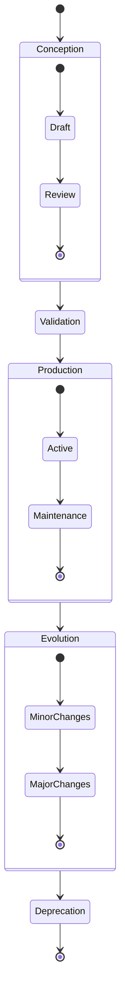
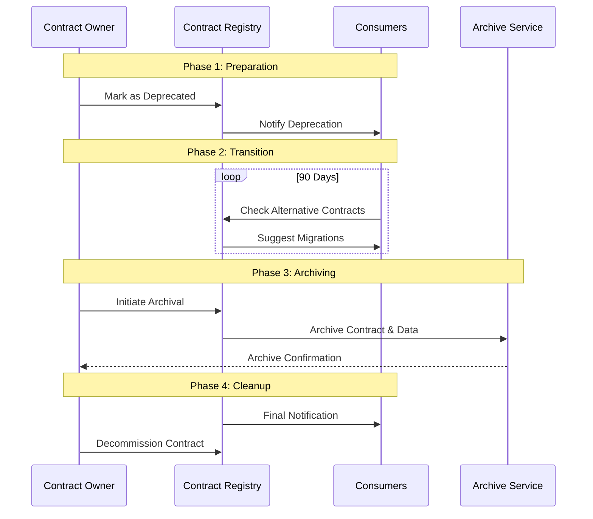

# Lifecycle: Beyond Simple YAML

It's midnight, and an alert sounds: a critical data contract has just been modified without following the established process. This situation, unfortunately common, illustrates the crucial importance of understanding and properly managing the lifecycle of data contracts. A data contract is not a static document - it is a living organism that evolves with your organization and requires rigorous management throughout its existence.

## The Phases of the Lifecycle

The lifecycle of a data contract follows a well-defined path, from its conception to its end of life. This natural progression begins with a design phase where needs are identified and the contract is developed. This initial step is crucial as it lays the foundation for everything that follows. The contract then goes through a rigorous validation phase before entering production.



Once in production, the contract enters a phase of continuous evolution, where it adapts to the changing needs of the organization. This evolution must be carefully orchestrated to maintain data consistency and quality. Finally, when the contract is no longer relevant, it enters a deprecation phase leading to its end of life.

## The Structure of an Evolving Contract

To support this lifecycle, the contract itself must be structured to capture its evolution. Here is how such a contract could be structured:

```yaml
odcs_version: "1.0.0"
id: "customer_profile"
version: "2.0.0"
status: "active"

lifecycle:
  created_at: "2023-01-15"
  last_updated: "2023-06-01"
  review_cycle: "quarterly"
  phases:
    - phase: "draft"
      start_date: "2023-01-15"
      end_date: "2023-02-01"
    - phase: "review"
      start_date: "2023-02-01"
      end_date: "2023-02-15"
    - phase: "active"
      start_date: "2023-02-15"
      
  versions:
    - version: "1.0.0"
      status: "deprecated"
      start_date: "2023-02-15"
      end_of_life: "2023-08-15"
      breaking_changes: false
      
    - version: "2.0.0"
      status: "active"
      start_date: "2023-06-01"
      breaking_changes: true
      migration_guide: "docs/migrations/v2.0.0.md"

  dependencies:
    - contract: "user_preferences"
      version: "^1.0.0"
    - contract: "payment_history"
      version: "^2.1.0"

  retention:
    duration: "7 years"
    compliance: ["GDPR", "CCPA"]
    archive_policy:
      type: "cold_storage"
      location: "s3://archive/"
```

## Managing Transitions

The transition phase between contract versions is particularly delicate. It requires meticulous orchestration to avoid any disruption to production systems. This orchestration begins with a dual writing period, where data is written simultaneously in both the old and new contract versions. This approach allows validating the new version while maintaining the stability of existing systems.



## The End of a Contract's Life

The end of a contract's life must be managed with as much care as its creation. This phase begins with a deprecation period where consumers are gradually migrated to alternatives. Once all consumers are migrated, the contract can be archived, but its metadata and history must be preserved to maintain traceability and regulatory compliance.

## Conclusion

Managing the lifecycle of data contracts is a fundamental aspect of any data governance strategy. It requires a systematic approach and constant attention to the needs of data producers and consumers. Good lifecycle management not only ensures data quality and reliability but also facilitates system evolution while maintaining user trust.

In the next article, we will explore how these lifecycle management practices integrate into a broader data governance strategy and how they contribute to creating a mature data culture within the organization. 