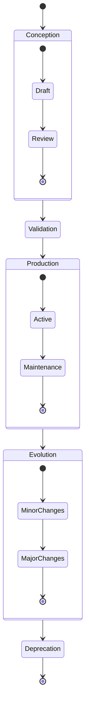
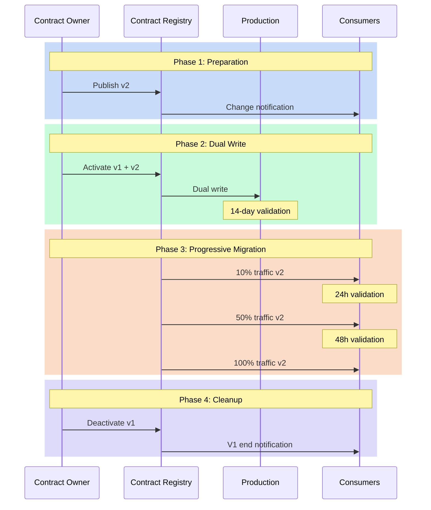

# Lifecycle: Beyond Simple YAML

It's midnight, and an alert sounds: a critical data contract has been modified without following the established process. This situation, unfortunately common, illustrates the crucial importance of properly understanding and managing the lifecycle of data contracts. A data contract isn't a static document - it's a living organism that evolves with your organization and requires rigorous management throughout its existence.

## Lifecycle Phases

The lifecycle of a data contract follows a well-defined path, from conception to end of life. This natural progression begins with a design phase where needs are identified and the contract is developed. This initial stage is crucial as it lays the foundation for everything that follows. The contract then goes through a rigorous validation phase before entering production.



Once in production, the contract enters a phase of continuous evolution, where it adapts to the organization's changing needs. This evolution must be carefully orchestrated to maintain data consistency and quality. Finally, when the contract is no longer relevant, it enters a deprecation phase that leads to its end of life.

## Structure of an Evolving Contract

To support this lifecycle, the contract itself must be structured to capture its evolution. Here's how such a contract might be structured:

```yaml
dataContractSpecification: 1.1.0
id: urn:datacontract:customer:profile
info:
  title: "Customer Profile"
  version: "2.0.0"
  description: "Customer profile data with lifecycle management"
  owner: "customer-data-team"
  contact:
    name: "Customer Data Team"
    email: "customer-data@company.com"
  status: "active"
  created: "2023-01-01"
  updated: "2023-06-01"
  review:
    cycle: "P3M"
    nextReview: "2023-09-01"

servers:
  local:
    type: "local"
    path: "./data/customer_profiles.parquet"
    format: "parquet"
    description: "Local customer profiles data"
  prod:
    type: "s3"
    path: "s3://data-lake-prod/customer/profiles/"
    format: "parquet"
    description: "Production customer profiles data"

models:
  CustomerProfile:
    type: "table"
    description: "Customer profile information"
    fields:
      customer_id:
        type: "text"
        description: "Unique customer identifier"
        required: true
      email:
        type: "text"
        description: "Customer email address"
        required: true
        pii: true
      preferences:
        type: "object"
        description: "Customer preferences"
        fields:
          language:
            type: "text"
            description: "Preferred language"
            required: true
          marketing_consent:
            type: "boolean"
            description: "Marketing communication consent"
            required: true

terms:
  usage: "Customer profile management and personalization"
  limitations: "Subject to GDPR and CCPA compliance"
  retention:
    duration: "P5Y"
    basis: "Legal requirement"
  dependencies:
    upstream:
      - "customer_registration_events"
      - "preference_updates"
    downstream:
      - "marketing_campaigns"
      - "personalization_service"

servicelevels:
  availability:
    description: "Profile data availability"
    percentage: "99.9%"
    measurement: "daily"
  
  privacy:
    description: "Privacy compliance"
    requirements:
      - "GDPR Article 17 - Right to erasure"
      - "CCPA Section 1798.105 - Right to deletion"
    responseTime: "P30D"
  
  versions:
    active:
      version: "2.0.0"
      since: "2023-06-01"
    deprecated:
      version: "1.0.0"
      until: "2023-12-31"
      migrationGuide: "docs/migrations/customer_profile_v1_to_v2.md"
```

## Managing Transitions

The transition phase between contract versions is particularly delicate. It requires careful orchestration to avoid any disruption to production systems. This orchestration begins with a dual-write period, where data is written simultaneously to both the old and new versions of the contract. This approach allows validating the new version while maintaining existing system stability.



### Phase 1: Preparation
This phase is crucial as it lays the groundwork for a successful transition:
- The Contract Owner publishes the new version (v2) in the Registry
- Consumers are automatically notified via the subscription system
- Teams can begin studying the changes and planning their migration
- Migration documentation is validated and published

### Phase 2: Dual Write
This security phase allows validating the new version under real conditions:
- Data is written simultaneously to v1 and v2 versions
- Teams can compare results between both versions
- A 14-day period covers all business cases (month-end, weekends, etc.)
- Anomalies can be detected without production impact

### Phase 3: Progressive Migration
The switch is done in stages to minimize risks:
- 10% of traffic is directed to v2, allowing quick problem detection
- A 24h validation confirms proper functioning at this first stage
- Traffic is increased to 50% if no problems are detected
- After 48 additional hours of validation, the complete switch is made

### Phase 4: Cleanup
This final phase is often neglected but essential:
- V1 is officially deprecated in the Registry
- A final notification is sent to consumers
- V1 resources are cleaned up (storage, monitoring, etc.)
- Documentation is updated to reflect v1's end of life

This methodical approach to transition allows:
- Minimizing operational risks
- Giving visibility to all stakeholders
- Ensuring controlled and reversible migration
- Maintaining service quality during transition

## Contract End of Life

A contract's end of life must be managed with as much care as its creation. This phase begins with a deprecation period where consumers are gradually migrated to alternatives. Once all consumers are migrated, the contract can be archived, but its metadata and history must be preserved to maintain traceability and regulatory compliance.

## Conclusion

Managing the lifecycle of data contracts is a fundamental aspect of any data governance strategy. It requires a systematic approach and constant attention to the needs of data producers and consumers. Good lifecycle management not only ensures data quality and reliability but also facilitates system evolution while maintaining user trust.

In the next article, we'll explore how these lifecycle management practices integrate into a broader data governance strategy, and how they contribute to creating a mature data culture within the organization.