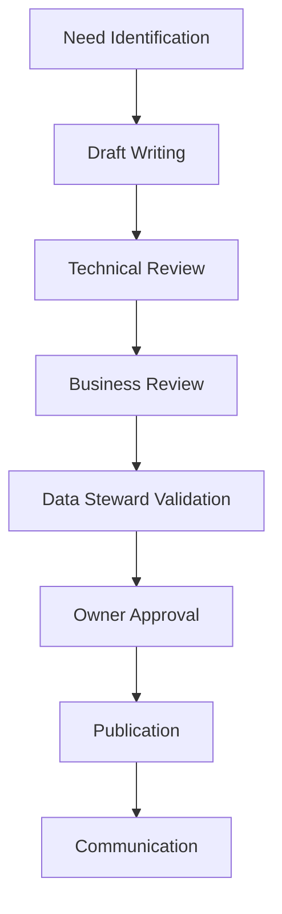

# Governance and Adoption of Data Contracts: The Human Aspect

The data science team has just finished a tense presentation before the executive committee. Their sales forecasts for Black Friday were grossly overestimated, causing costly overstock. The analysis reveals that the change in average basket calculation rules, although documented in a Jira ticket, was never communicated to the analysis teams. This situation, unfortunately common in retail, illustrates why the governance of data contracts cannot be reduced to purely technical aspects.

## Why Start with Governance?

The success of a data contracts initiative does not rely solely on technical aspects. Experience shows that most failures are not due to technical problems but to human and organizational factors. Here are the most common failure patterns:

- **Silent Workaround**: Teams, pressed by deadlines, create "workarounds" outside the contract system. These parallel paths gradually become the norm, rendering contracts obsolete.

- **Passive Resistance**: Teams follow processes minimally, filling contracts superficially without real adherence to quality and documentation principles.

- **Lack of Ownership**: Without clearly defined responsibilities, contracts become orphaned documents that no one maintains or evolves.

- **Excessive Bureaucracy**: Conversely, overly rigid governance pushes teams to see contracts as a hindrance rather than a tool for improvement.

Let's take a concrete example in retail: a marketing team urgently needs to analyze customer behavior for a Black Friday campaign. The official contract modification process would take two weeks. What often happens? The team creates a local copy of the data, modifies the schemas without documentation, and the work is done in a hurry. This "exception" quickly becomes the rule, creating an invisible but growing technical debt.

That's why governance must be thought of from the start, not as a restrictive framework, but as a facilitator that:
- Makes the "virtuous path" easier than workarounds
- Balances agility and control
- Empowers rather than restricts
- Values collaboration over constraint

## Organization and Roles

Clarity of roles is essential for effective governance of data contracts. Beyond formal responsibilities, a whole ecosystem of collaboration must be established. Let's examine the key roles and their articulation.

In a data mesh context, where each domain is autonomous in the production and consumption of data, this clarity of roles becomes even more critical:

The Data Contracts Manager, attached to the Chief Data Officer, is the guarantor of the vision and overall coherence. He defines the data contracts strategy, resolves conflicts, validates major changes, and oversees overall quality. His role is particularly crucial in times of tension, for example, during disagreements between producers and consumers on schema evolution. He must know how to balance the short-term needs of teams with the long-term vision of the data architecture.

The Data Architect plays a pivotal role between technical vision and business needs. Attached to the Technical Director, he ensures the technical coherence of contracts between domains, anticipates the impacts of changes on the overall architecture, and guides teams in adopting appropriate patterns. His strong technical expertise and cross-domain vision allow him to establish technical standards and manage architectural evolution coherently.

The Product Manager brings an essential dimension often overlooked: the product vision. Data contracts are not just technical artifacts; they are products that must create value for their users. Attached to the Data Products Manager, he analyzes the needs of data consumers, prioritizes developments according to business value, and ensures alignment with the overall product strategy. His understanding of business issues and ability to dialogue with technical teams make him a key player in the project's success.

In summary, the key roles are:
- The **Data Engineer** implements the contracts and ensures their technical integration.
- The **Data Architect** guarantees the overall coherence of contracts with the data architecture.
- The **Data Quality Analyst** monitors and analyzes compliance with contracts.
- The **Data Governance Officer** oversees the application of governance policies.
- The **Contract Registry Admin** manages the registry infrastructure and access.

## Governance Process

The governance process is the beating heart of a successful data contracts strategy. In a data mesh, where contracts become the main interface between domains, this process takes on particular importance. It is not a simple series of administrative steps, but a collaborative journey that ensures the quality and relevance of contracts.

Let's take the example of a new contract for retail sales data:

The process begins with **need identification**. The marketing team wants to analyze purchasing patterns by region. This request triggers a discovery phase where needs are precisely documented and impacts evaluated.

**Draft writing** is a collaborative exercise that begins with the intervention of the Data Architect. He works with the marketing team to:
- Understand analysis needs and translate them into technical requirements
- Evaluate the impact on the existing data architecture
- Identify patterns to apply and similar contracts
- Define quality rules and appropriate SLAs

Once this framework is set, Data Engineers can implement the contract following architectural guidelines. This early collaboration with the architect avoids later integration problems and ensures coherence with the rest of the system.

The **technical and business review** phases are crucial. The technical team verifies feasibility, performance, and compatibility with the existing architecture. Business experts ensure that definitions are correct and that all necessary analysis dimensions are present.

**Validation by the Data Steward** goes beyond a simple check. The Data Steward examines coherence with other domain contracts, verifies alignment with company standards, and evaluates the impact on data governance.

**Final approval** by the owner is not just a formality. It is a strategic validation that confirms the contract aligns with the organization's objectives and respects budgetary and regulatory constraints.

Finally, the **communication phase** is often underestimated but essential. It includes notifying stakeholders, updating documentation, and organizing information sessions if necessary.

## Adoption Strategies

Establishing a Center of Excellence (CoE) is crucial. It is not just an organizational structure; it is the engine of adoption and dissemination of best practices. The CoE must provide standardized models adapted to different use cases, a structured training program, and continuous support to teams.

In the data mesh architecture, the CoE plays a particular role:
- It establishes inter-domain standards to ensure interoperability
- It facilitates the sharing of best practices between autonomous domains
- It ensures overall coherence while respecting domain autonomy
- It promotes the reuse of proven patterns

Training is not an optional step but a pillar of success. Experience shows that an effective training program must adapt to different profiles and maturity levels. For beginners, a one-day training on the fundamentals helps understand the business value of contracts and essential concepts. Data engineers benefit from a two-day in-depth technical training, while data stewards focus on governance and quality aspects. Data consumers receive targeted training on contract usage and compliance.

## The Path to Success

The success of data contract adoption relies on a progressive and iterative approach. It is crucial to start with a limited but significant scope, where value can be quickly demonstrated. Early adopters must be carefully chosen: motivated teams, on critical but controlled use cases.

In a data mesh, it is recommended to:
- Start with a well-defined pilot domain
- Establish success stories before expanding to other domains
- Use feedback to refine governance
- Encourage positive emulation between domains

Tracking success should not be limited to technical metrics. It is crucial to also measure business and organizational impact through the coverage of critical data by contracts, improvement in data quality, reduction in time to market for new analyses, decrease in data-related incidents, and team satisfaction. These metrics should be analyzed in their context and serve as a basis for continuous program improvement.

## Conclusion

The governance and adoption of data contracts is a journey, not a destination. Success relies on a balance between structure and flexibility, between control and autonomy. Investment in the human aspect is as important as technical excellence.

This series of articles on data contracts ends here for now, but your journey is just beginning. Use these principles as a starting point and adapt them to your specific context. If the need arises, we can enrich this series with other articles exploring specific aspects or new feedback. The success of your data contracts initiative will depend on your ability to create a true data culture within your organization, where data quality and reliability are everyone's business. 