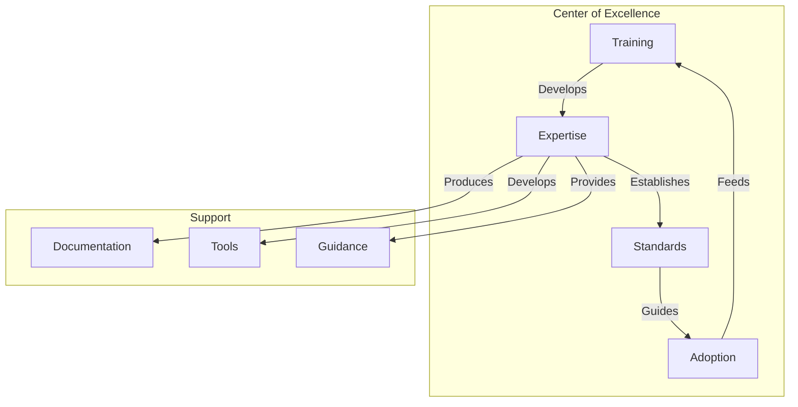

# Governance and Adoption: The Key to Success

"The best standards are worthless if they aren't adopted." This truth, often neglected, is at the heart of the success or failure of data contract initiatives. Governance and adoption are not secondary considerations to be addressed after technical aspects - they are the very foundation of a successful implementation.

## Governance as Foundation

Data contract governance should be seen as an enabling framework rather than a constraint. It should facilitate innovation while ensuring quality and consistency. Here's an example of a governance structure formalized in a contract:

```yaml
dataContractSpecification: 1.1.0
id: urn:datacontract:governance:framework
info:
  title: "Data Contract Governance Framework"
  version: "1.0.0"
  description: "Governance framework for data contracts"
  owner: "data-governance-office"
  contact:
    name: "Data Governance Office"
    email: "dgo@company.com"

models:
  GovernanceModel:
    type: "object"
    description: "Data contract governance model"
    fields:
      roles:
        type: "object"
        description: "Governance roles and responsibilities"
        fields:
          data_steward:
            type: "object"
            description: "Data steward role"
            fields:
              responsibilities:
                type: "array"
                items:
                  type: "text"
                description: "Data steward responsibilities"
                example: ["quality_validation", "compliance_check"]
              qualifications:
                type: "array"
                items:
                  type: "text"
                description: "Required qualifications"
          domain_owner:
            type: "object"
            description: "Domain owner role"
            fields:
              responsibilities:
                type: "array"
                items:
                  type: "text"
                description: "Domain owner responsibilities"
      processes:
        type: "object"
        description: "Governance processes"
        fields:
          contract_approval:
            type: "object"
            description: "Contract approval process"
            fields:
              steps:
                type: "array"
                items:
                  type: "object"
                  fields:
                    name:
                      type: "text"
                    approver:
                      type: "text"
                    sla:
                      type: "text"
                      format: "duration"

terms:
  review_cycle:
    frequency: "P3M"
    participants: ["data_steward", "domain_owner", "compliance_officer"]
  
  escalation:
    levels:
      - level: 1
        handler: "domain_owner"
        responseTime: "P1D"
      - level: 2
        handler: "governance_board"
        responseTime: "P3D"

servicelevels:
  approval:
    description: "Contract approval process"
    responseTime: "P5D"
    escalationThreshold: "P7D"
```

## The Center of Excellence (CoE)

The Center of Excellence plays a crucial role in the adoption of data contracts. It's not just a support center - it's a true transformation catalyst. Here's how to structure its operation:



## Progressive Adoption Strategy

The adoption of data contracts must follow a progressive and measured approach. Here's an example of a formalized adoption plan:

```yaml
dataContractSpecification: 1.1.0
id: urn:datacontract:adoption:strategy
info:
  title: "Data Contract Adoption Strategy"
  version: "1.0.0"
  description: "Strategic framework for data contract adoption"
  owner: "transformation-office"
  contact:
    name: "Transformation Office"
    email: "transformation@company.com"

models:
  AdoptionPhases:
    type: "object"
    description: "Phased adoption strategy"
    fields:
      phase1_pilot:
        type: "object"
        description: "Pilot phase with selected domains"
        fields:
          duration: 
            type: "text"
            format: "duration"
            value: "P3M"
          success_criteria:
            type: "array"
            items:
              type: "text"
          domains:
            type: "array"
            items:
              type: "text"
            example: ["sales", "customer"]
      phase2_expansion:
        type: "object"
        description: "Controlled expansion phase"
        fields:
          duration:
            type: "text"
            format: "duration"
            value: "P6M"
          target_coverage:
            type: "integer"
            description: "Percentage of domains covered"
            minimum: 50
      phase3_standardization:
        type: "object"
        description: "Enterprise-wide standardization"
        fields:
          duration:
            type: "text"
            format: "duration"
            value: "P1Y"
          completion_criteria:
            type: "array"
            items:
              type: "text"

terms:
  success_metrics:
    adoption_rate:
      description: "Percentage of eligible domains using contracts"
      target: 80
      timeframe: "P1Y"
    quality_improvement:
      description: "Reduction in data quality incidents"
      target: 50
      timeframe: "P6M"

servicelevels:
  support:
    description: "Adoption support services"
    availability:
      business_hours: "9am-5pm"
      response_time: "P1D"
    training:
      frequency: "P1M"
      capacity: 30
```

## Measuring Success

The success of data contract adoption must be measured objectively and continuously. Key metrics include:

1. **Adoption Rate**
   - Number of domains actively using contracts
   - Percentage of critical data covered
   - Speed of adoption by domain

2. **Business Impact**
   - Reduction in quality incidents
   - Improvement in time to market
   - Consumer team satisfaction

3. **Practice Maturity**
   - Quality of produced contracts
   - Adherence to governance processes
   - Level of automation achieved

## Training and Support

Training should not be limited to technical aspects. It should cover:

1. **Fundamentals**
   - Data contract principles
   - Business benefits
   - Roles and responsibilities

2. **Technical Aspects**
   - Contract writing
   - Tool usage
   - Validation and testing

3. **Soft Skills**
   - Inter-team communication
   - Change management
   - Conflict resolution

## Conclusion

The governance and adoption of data contracts are inseparable from their technical success. Well-designed governance creates the necessary framework for adoption, while a progressive adoption strategy allows building the necessary trust and expertise.

The next article will explore how these principles apply in specific contexts, with detailed case studies of organizations that have successfully completed their transformation.