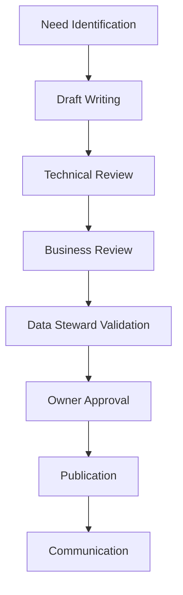

# Data Contract Governance and Adoption: The Human Aspect

The data science team just finished a tense presentation to the executive committee. Their Black Friday sales forecasts were largely overestimated, causing costly overstocking. Analysis reveals that changes to average basket calculation rules, although documented in a Jira ticket, were never communicated to the analysis teams. This situation, unfortunately common in retail, illustrates why data contract governance cannot be reduced to purely technical aspects.

## Why Start with Governance?

The success of a data contracts initiative doesn't rely solely on technical aspects. Experience shows that most failures are not due to technical problems, but to human and organizational factors. Here are the most frequent failure patterns:

- **Silent Circumvention**: Teams, pressed by deadlines, create "workarounds" outside the contract system. These parallel paths gradually become the norm, making contracts obsolete.

- **Passive Resistance**: Teams follow processes minimally, filling out contracts superficially without real adherence to quality and documentation principles.

- **Lack of Ownership**: Without clearly defined responsibilities, contracts become orphaned documents that no one maintains or evolves.

- **Excessive Bureaucracy**: Conversely, overly rigid governance pushes teams to see contracts as a hindrance rather than an improvement tool.

Let's take a concrete retail example: a marketing team urgently needs to analyze customer behavior for a Black Friday campaign. The official contract modification process would take two weeks. What often happens? The team creates a local copy of the data, modifies schemas without documentation, and the work is done urgently. This "exception" quickly becomes the rule, creating invisible but growing technical debt.

This is why governance must be considered from the start, not as a restrictive framework, but as a facilitator that:
- Makes the "virtuous path" easier than workarounds
- Balances agility and control
- Empowers rather than restricts
- Values collaboration rather than constraint

## Organization and Roles

Role clarity is essential for effective data contract governance. Beyond formal responsibilities, it's an entire collaboration ecosystem that must be put in place. Let's examine the key roles and their articulation.

In a data mesh context, where each domain is autonomous in data production and consumption, this role clarity becomes even more critical:

The Data Contracts Manager, reporting to the Chief Data Officer, is the guarantor of the overall vision and coherence. They define the data contracts strategy, resolve conflicts, validate major changes, and oversee overall quality. Their role is particularly crucial in moments of tension, for example during disagreements between producers and consumers about schema evolution. They must know how to balance teams' short-term needs with the long-term data architecture vision.

The Data Architect plays a pivotal role between technical vision and business needs. Reporting to the Technical Director, they ensure technical coherence of contracts between domains, anticipate changes' impacts on the overall architecture, and guide teams in adopting appropriate patterns. Their strong technical expertise and cross-domain vision allow them to establish technical standards and manage architectural evolution coherently.

The Product Manager brings an often-neglected essential dimension: the product vision. Data contracts aren't just technical artifacts; they're products that must create value for their users. Reporting to the Data Products Manager, they analyze data consumers' needs, prioritize evolution based on business value, and ensure alignment with the overall product strategy. Their understanding of business issues and ability to dialogue with technical teams make them a key player in project success.

In summary, the key roles are:
- The **Data Engineer** implements contracts and ensures their technical integration.
- The **Data Architect** ensures overall coherence of contracts with data architecture.
- The **Data Quality Analyst** monitors and analyzes contract compliance.
- The **Data Governance Officer** oversees governance policy application.
- The **Contract Registry Admin** manages registry infrastructure and access.

## Governance Process

The governance process is the beating heart of a successful data contracts strategy. In a data mesh, where contracts become the main interface between domains, this process takes on particular importance. It's not just a series of administrative steps, but a collaborative journey that ensures contract quality and relevance.

Let's take the example of a new contract for retail sales data:

The process begins with **need identification**. The marketing team wants to analyze purchase patterns by region. This request triggers a discovery phase where needs are precisely documented and impacts evaluated.

**Draft writing** is a collaborative exercise that begins with the Data Architect's intervention. They work with the marketing team to:
- Understand analysis needs and translate them into technical requirements
- Evaluate impact on existing data architecture
- Identify patterns to apply and similar contracts
- Define appropriate quality rules and SLAs

Once this framework is set, Data Engineers can implement the contract following architectural guidelines. This early collaboration with the architect avoids later integration problems and ensures coherence with the rest of the system.

The **technical and business review** phases are crucial. The technical team verifies feasibility, performance, and compatibility with existing architecture. Business experts ensure definitions are correct and all necessary analysis dimensions are present.

**Data Steward validation** goes beyond simple verification. The Data Steward examines coherence with other domain contracts, verifies alignment with company standards, and evaluates impact on data governance.

Final **owner approval** isn't just a formality. It's a strategic validation confirming that the contract aligns with organization objectives and respects budgetary and regulatory constraints.

Finally, the **communication phase** is often underestimated but essential. It includes stakeholder notification, documentation updates, and organizing information sessions if necessary.

## Adoption Strategies

Establishing a Center of Excellence (CoE) is crucial. It's not just an organizational structure; it's the engine for adoption and best practice dissemination. The CoE must provide standardized templates adapted to different use cases, a structured training program, and continuous team support.

In data mesh architecture, the CoE plays a particular role:
- It establishes interdomain standards to ensure interoperability
- It facilitates best practice sharing between autonomous domains
- It ensures global coherence while respecting domain autonomy
- It promotes reuse of proven patterns

Training isn't an optional step but a pillar of success. Experience shows that an effective training program must adapt to different profiles and maturity levels. For beginners, a one-day training on fundamentals helps understand contracts' business value and essential concepts. Data engineers benefit from in-depth two-day technical training, while data stewards focus on governance and quality aspects. Data consumers receive targeted training on contract usage and compliance.

## The Path to Success

Success in data contract adoption relies on a progressive and iterative approach. It's crucial to start with a limited but significant scope where value can be quickly demonstrated. Early adopters must be carefully chosen: motivated teams on critical but controlled use cases.

In a data mesh, it's recommended to:
- Start with a well-defined pilot domain
- Establish success stories before extending to other domains
- Use feedback to refine governance
- Encourage positive emulation between domains

Success tracking shouldn't be limited to technical metrics. It's crucial to also measure business and organizational impact through critical data coverage by contracts, data quality improvement, reduction in time-to-market for new analyses, decrease in data-related incidents, and team satisfaction. These metrics must be analyzed in context and serve as a basis for continuous program improvement.

## Conclusion

Data contract governance and adoption is a journey, not a destination. Success relies on a balance between structure and flexibility, between control and autonomy. Investment in the human aspect is as important as technical excellence.

This series of articles on data contracts ends here for now, but your journey is just beginning. Use these principles as a starting point and adapt them to your specific context. If needed, we can enrich this series with other articles exploring specific aspects or new experience feedback. The success of your data contracts initiative will depend on your ability to create a true data culture within your organization, where data quality and reliability are everyone's business.