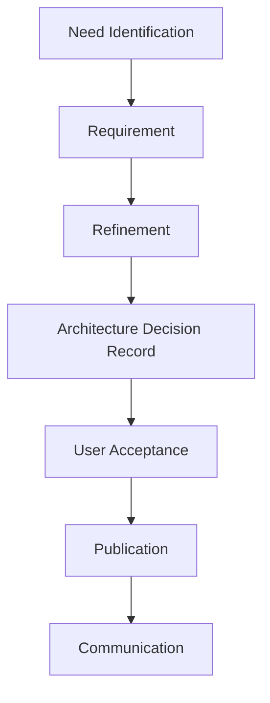

# Ensuring Data Contracts Adoption Across an Organization

The data science team just finished a tense presentation to the executive committee. Their Black Friday sales forecasts were largely overestimated, causing costly overstocking. Analysis reveals that changes in average basket calculation rules, although documented in a Jira ticket, were never communicated to the analytics teams. In this situation, a proper contract would have:

- Explicitly documented the change: the contract formalizes the model's evolution.
- Notified consumers: a structured information process would have required the producing team to alert data consumers.
- Managed operational impact: the producer's responsibility would have included impact assessment and support for adapting usage.

In this context, the contract incorporates essential governance mechanisms, such as control and communication. It anchors them from the design phase, directly within the tools used by teams. In theory, this facilitates the natural adoption of good governance practices by making them accessible and intuitive. In practice, starting with governance can help structure interactions between data producers and consumers under certain conditions.

## Why and How to Start with Governance?

The success of a data contracts initiative doesn't solely rely on technical aspects. Experience shows that most failures are not due to technical issues but to human and organizational factors. Here are the most common failure patterns:

- **Silent Bypassing**: Teams, pressed by deadlines, create "workarounds" outside the contracts system. These parallel paths gradually become the norm, making contracts obsolete.

- **Passive Resistance**: Teams follow processes minimally, filling contracts superficially without real adherence to quality and documentation principles.

- **Lack of Ownership**: Without clearly defined functional responsibilities, contracts become orphaned documents that no one maintains or evolves.

- **Excessive Bureaucracy**: Conversely, overly rigid governance pushes teams to view contracts as a hindrance rather than an improvement tool.

Let's take a concrete example: a marketing team urgently needs to analyze customer behavior for a Black Friday campaign. Working cross-functionally following the official process takes two weeks. What often happens? The team creates a local copy of the data, chooses not to consume source contracts, and modifies schemas without documentation. This "exception" quickly becomes the rule, creating growing functional and technical debt.

The contract must be designed from the start by a facilitating body (governance-as-a-service) that:
- Makes the "virtuous path" easier than workarounds
- Addresses operational needs
- Facilitates collaboration between producers and consumers
- Promotes accountability

A governance-as-a-service team must work on two key axes to demonstrate the contract's value: organizational strategy and operational processes.

On the strategic level, it must clarify roles and responsibilities between data producers and consumers, establishing clear standards for documentation, change communication, and impact management. This involves supporting teams in adopting practices like data contracts, which ensure explicit alignment between production and usage.

On the process side, the team must integrate these contracts directly into business and tech teams' workflows through tools and automations that make governance smooth and non-constraining. By structuring these mechanisms, governance becomes an efficiency lever rather than an administrative constraint.

# Practical Foundations of the Approach

## Organization and Roles

Effective data contracts governance primarily relies on clear role definition. Beyond formal responsibilities, it's about structuring a true collaborative ecosystem where each actor plays a key role in contract reliability and evolution. In a decentralized environment, where each domain autonomously manages data production and consumption, precise articulation of roles and their interactions becomes essential.

Regarding product vision:
- The **Data Product Owner** ensures alignment between usage and operational reality.
- The **Data Architect** ensures products integrate coherently with the global data architecture.
- The **Product Manager** of the data producer drives business process evolution.

Regarding contract vision:
- The **Data Engineer** implements contracts and ensures their technical integration.
- The **Data Owner** defines the domain's data strategy, ensures contracts meet business challenges, and arbitrates conflicts between producers and consumers.
- The **Data Quality Analyst** monitors data compliance with requirements defined in contracts and analyzes discrepancies.

Regarding contract framework implementation and evolution:
- The **Data Governance Officer** oversees governance policy application.
- The **Contract Registry Admin** administers contract registry infrastructure and manages access to ensure secure and efficient use.

## Governance Process

The governance process is the beating heart of a successful data contracts strategy. In a data mesh, where contracts become the main interface between domains, this process takes on particular importance. It's not just a series of administrative steps but a collaborative journey that ensures contract quality and relevance.

Let's take the example of a new contract for retail sales data:

The process begins with **need identification**. The marketing team wants to analyze purchase patterns by region. This request triggers a discovery phase where needs are precisely documented and impacts assessed.

**Requirement writing** is a collaborative exercise that begins with the Data Product Owner's intervention. They work with the marketing team to:
- Understand analysis needs and translate them into technical requirements
- Assess impact on existing data architecture
- Identify patterns to apply and similar contracts
- Define appropriate quality rules and SLAs

A **refinement phase** allows Data Engineers, Data Stewards, Data Quality Analysts, and Data Architects to ensure understanding of the business domain and requirement feasibility. The Data Steward examines consistency with other domain contracts, verifies alignment with company standards, and assesses governance impact. The Data Owner confirms the contract aligns with organizational objectives and constraints.

Once this framework is established, Data Engineers can implement the contract following architectural directives (Architecture Decision Record). This early collaboration with the architect avoids later integration problems and ensures consistency with the rest of the system.

**User approval** isn't just a formality. It's a strategic validation that confirms usage and allows consumers to explore the data. Stewards and Owners are counted as data consumers.

Finally, the **communication phase** is often underestimated but essential. It includes stakeholder notification, documentation updates, and organizing information sessions if necessary.

## Adoption Strategies

Establishing an enabling team is crucial. It's not just an organizational structure; it's the engine for adoption and dissemination of best practices. The enabling team must provide standardized templates adapted to different use cases, a structured training program, and continuous team support.

To build a decentralized architecture, the enabling team plays a special role:
- It establishes inter-domain standards to ensure interoperability
- It facilitates sharing of best practices between autonomous domains
- It ensures global coherence while respecting domain autonomy
- It promotes reuse of proven patterns

Training isn't optional but a pillar of success. Experience shows that an effective training program must adapt to different profiles and maturity levels. For beginners, a one-day training on fundamentals helps understand the business value of contracts and essential concepts. Data engineers benefit from in-depth technical training over two days, while data stewards focus on governance and quality aspects. Data consumers receive targeted training on contract usage and compliance.

## The Path to Success

Data contracts adoption success relies on a progressive and iterative approach. It's crucial to start with a limited but significant scope where value can be quickly demonstrated. Early adopters must be carefully chosen: motivated teams working on critical but manageable use cases.

In a data mesh, it's recommended to:
- Start with a well-defined pilot domain
- Establish success stories before extending to other domains
- Use feedback to refine governance
- Encourage positive emulation between domains

Success monitoring shouldn't be limited to technical metrics. It's crucial to also measure business and organizational impact through critical data coverage by contracts, data quality improvement, reduction in time-to-market for new analyses, decrease in data-related incidents, and team satisfaction. These metrics must be analyzed in context and serve as a basis for continuous program improvement.

## Conclusion

Data contracts governance and adoption is a journey, not a destination. Success relies on balance between structure and flexibility, between control and autonomy. Investment in the human aspect is as important as technical excellence.

This series of articles on data contracts ends here for now, but your journey is just beginning. Use these principles as a starting point and adapt them to your specific context. If needed, we can enrich this series with other articles exploring specific aspects or new experience feedback. The success of your data contracts initiative will depend on your ability to create a true data culture within your organization, where data quality and reliability are everyone's business. 