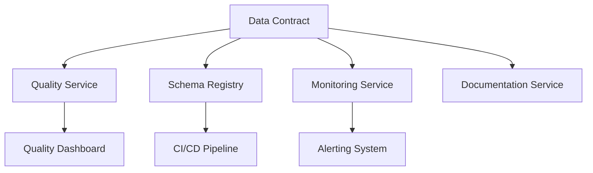

# Data Contract Lifecycle: Beyond YAML

The vision of a data contract as a simple YAML file is unfortunately too widespread in organizations. This reductive vision significantly limits the value that data contracts can bring. In reality, a data contract is a complex architectural component with its own lifecycle, dependencies, and responsibilities.

## Contract Version vs Model Version Distinction

One of the most common confusions concerns version management. It is crucial to understand that a data contract has two distinct versioning dimensions, each with its own lifecycle and impacts:

```yaml
metadata:
  contract_version: 2.1.0  # Version of the contract itself
  schema_version: 1.0.0    # Version of the data model
  last_updated: "2024-03-15"
  changelog:
    - type: "contract_update"
      version: "2.1.0"
      description: "Added quality rules for email"
      schema_impact: false
    - type: "schema_update"
      version: "1.0.0"
      description: "Initial model structure"
      breaking_change: true
```

### Contract Version
The contract version reflects the evolution of governance and commitments around the data. It can change frequently without requiring modifications to the data itself. For example:
- Adding new quality rules
- Strengthening SLAs
- Clarifying documentation
- Modifying responsibilities

These changes are generally non-disruptive and can be deployed quickly, but they require clear communication with stakeholders.

### Model Version
The model version, on the other hand, concerns the physical structure of the data. These changes are more delicate as they can have a direct impact on consumers. They include:
- Adding or removing fields
- Modifying data types
- Restructuring relationships
- Format changes

These evolutions require careful planning and often a transition period where multiple versions coexist.

## Responsibilities and Dependencies

A data contract doesn't exist in isolation - it's at the heart of an ecosystem of services and responsibilities:



This distributed architecture reflects a fundamental principle: the data contract defines the commitments, but their implementation is delegated to specialized services.

### Associated Services

1. **Quality Service**
The quality service is responsible for executing and tracking quality rules defined in the contract. It's not just about technical validation, but true quality governance:
- Regular execution of quality rules
- Historization of metrics for trend analysis
- Proactive degradation detection
- Intelligent alerting with context

2. **Schema Registry**
   - Schema validation
   - Migration management
   - Version compatibility

3. **Monitoring Service**
   - SLA tracking
   - Usage metrics
   - Transformation performance

4. **Documentation Service**
   - Automatic generation
   - Change traceability
   - Examples and use cases

## Complete Lifecycle

The lifecycle of a data contract revolves around several phases:

### 1. Initialization
```python
class ContractLifecycle:
    def initialize_contract(self, domain, name):
        """Creation of a new contract"""
        contract = self.create_base_structure()
        self.register_dependencies()
        self.setup_monitoring()
        self.initialize_quality_rules()
        return contract

    def register_dependencies(self):
        """Registration of associated services"""
        self.quality_service.register()
        self.schema_registry.register()
        self.monitoring_service.register()
```

### 2. Evolution
```python
def evolve_contract(self, contract, change_type):
    """Management of contract evolution"""
    if change_type == 'contract_only':
        # Update without schema impact
        self.update_contract_version()
        self.update_documentation()
        self.notify_stakeholders()
    elif change_type == 'schema_update':
        # Evolution with data impact
        self.validate_schema_compatibility()
        self.plan_migration()
        self.update_dependencies()
```

### 3. Monitoring and Maintenance
```python
class ContractMonitoring:
    def monitor_health(self):
        """Contract health monitoring"""
        quality_metrics = self.quality_service.get_metrics()
        usage_stats = self.monitoring_service.get_stats()
        dependencies_status = self.check_dependencies()
        
        if self.needs_attention(quality_metrics, usage_stats):
            self.trigger_maintenance_workflow()
```

## Best Practices

1. **Separation of Responsibilities**
   - The contract defines the "what"
   - Services implement the "how"
   - Each component has a single responsibility

2. **Automation**
   - Generation of associated services
   - Continuous validation
   - Documentation updates

3. **Governance**
   - Clear review process
   - Responsibility matrix
   - Communication plan

## Reference Implementation

```python
class DataContractSystem:
    def __init__(self):
        self.contract_registry = ContractRegistry()
        self.quality_service = QualityService()
        self.schema_registry = SchemaRegistry()
        self.monitoring = MonitoringService()
        
    def deploy_contract(self, contract_def):
        """Complete deployment of a contract"""
        # Contract validation
        contract = self.contract_registry.register(contract_def)
        
        # Service setup
        self.quality_service.setup(contract)
        self.schema_registry.register_schema(contract)
        self.monitoring.initialize(contract)
        
        # Monitoring configuration
        self.setup_dashboards(contract)
        self.setup_alerts(contract)
        
        return contract.id
```

## Conclusion

A data contract is much more than a simple YAML file - it's a central component of data architecture that orchestrates numerous services and responsibilities. Its effective management requires a clear understanding of its complete lifecycle and ecosystem.