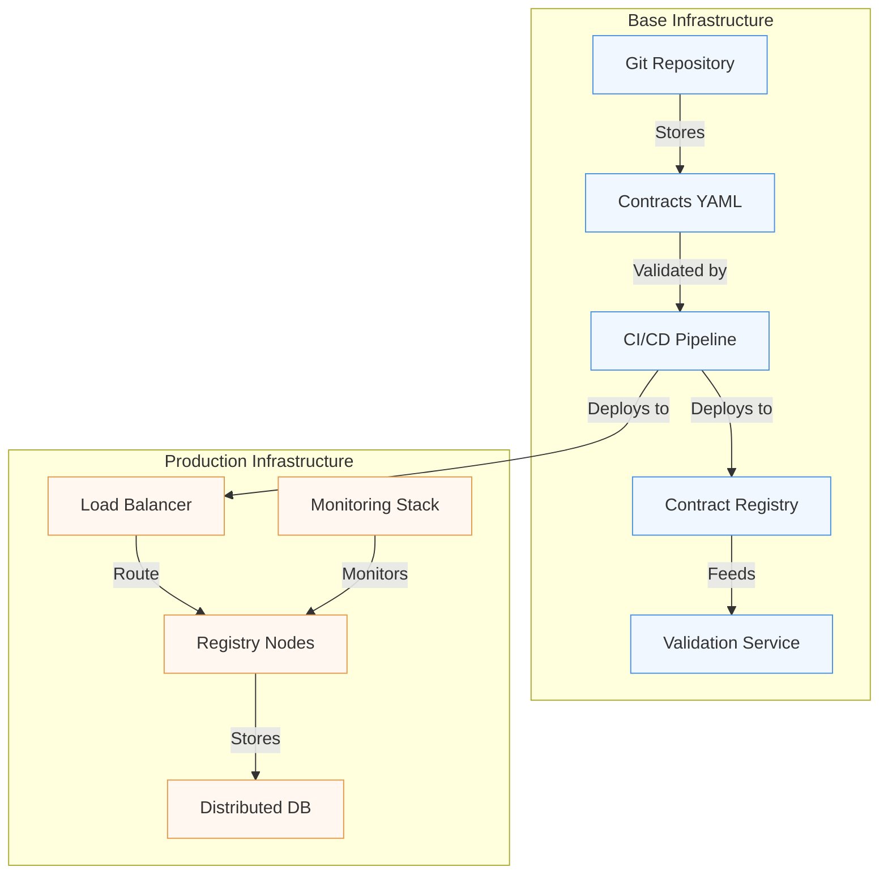

# Implementation: From Concept to Reality

"Theory is all well and good, but how do we put it into production?" 

This question invariably arises during discussions about data contracts. It reflects a legitimate concern: the transition from theory to practice is often the moment when the most beautiful concepts collide with the reality on the ground.

## Architecture and Infrastructure

Implementing a data contract system relies on a distributed architecture that must reconcile robustness and flexibility. At the heart of this architecture is the Contract Registry, the true cornerstone of the system. This registry is not just a simple document repository; it is an active service that orchestrates the entire lifecycle of contracts.



This architecture highlights several essential concepts. The first is the separation between contract storage and their use in production. Contracts are first versioned in a Git repository, allowing precise tracking of changes and effective collaboration between teams. The CI/CD pipeline then plays a crucial role in automating contract validation and deployment.

For scalability, solutions like Redis can be added for caching, but this is generally only necessary for very high-load systems.

## Continuous Validation

One of the most critical aspects of implementation is the continuous validation of contracts. A CI/CD pipeline that only validates YAML syntax is worthless - we have seen cases where Contract Registries accepted syntactically valid but semantically meaningless contracts, creating a false sense of security.

Validation must occur at several levels:
- **Syntactic**: Verification of ODCS format and contract structure
- **Semantic**: Validation of business rules, definition consistency, compliance with organizational standards
- **Contextual**: Verification of dependencies, compatibility with existing versions
- **Operational**: Evaluation of impact on existing systems

A contract that passes syntactic validation but fails semantic or contextual validations is potentially more dangerous than no contract at all, as it gives a false impression of governance. The CI/CD pipeline must therefore integrate thorough tests that verify not only the form but also the substance of contracts.

## Progressive Deployment

Deploying a data contract system cannot be done abruptly. A progressive approach, inspired by continuous deployment techniques, is necessary. This approach begins with a shadow testing phase, where the new system operates in parallel with the old one without impacting production. This phase allows the system's behavior to be validated under real conditions.

Next comes a gradual deployment phase, where traffic is progressively redirected to the new system. This approach allows problems to be quickly detected and corrected before they impact all users. The ability to quickly roll back is crucial during this phase.

## Observability as a Foundation

Observability is not an additional feature but a fundamental component of the system. Without it, it is impossible to know if data contracts are fulfilling their role. In our retail context, let's take the example of a contract for sales data:

```yaml
monitoring:
  technical:
    # System health metrics
    - metric: "contract_validation_latency"
      threshold: "< 500ms"
      alert: "high"
    - metric: "registry_availability"
      threshold: "> 99.9%"
      alert: "critical"

  business:
    # Data quality metrics
    - metric: "missing_product_codes"
      threshold: "< 0.1%"
      alert: "high"
    - metric: "invalid_sale_amounts"
      threshold: "< 0.01%"
      alert: "critical"

  usage:
    # Usage metrics
    - metric: "active_consumers"
      threshold: "> 0"
      alert: "info"
    - metric: "schema_violations"
      threshold: "< 10 per hour"
      alert: "warning"
```

These metrics allow us to answer concrete questions:
- Is the system functioning correctly? (technical metrics)
- Is the data reliable? (business metrics)
- Are teams effectively using the contracts? (usage metrics)

For example, a sudden increase in schema violations may indicate:
- A problem in the data source system
- A contract poorly adapted to real needs
- A need for training of producing teams

Observability thus allows for proactive rather than reactive management of data contracts.

## The Human Dimension

The technical aspect of implementation, while crucial, represents only part of the challenge. The human dimension is just as important. Implementing a data contract system represents a significant change in how teams work with data. 

This human dimension is so critical that it deserves a dedicated article. In our article on governance and adoption that will appear in a future article, we will explore in detail:
- Team organization and role definition
- Training and support strategies
- Establishing a Center of Excellence
- Adoption and satisfaction metrics

Because even the most sophisticated technical implementation will fail if teams are not properly supported in this change.

## Conclusion

Implementing a data contract system is a journey more than a destination. It is an iterative process that must adapt to the needs and constraints of the organization. The success of this implementation relies as much on the solidity of the technical architecture as on the ability to support change among teams.

In the next article, we will explore how to manage the complete lifecycle of data contracts, from their creation to their retirement, through their evolution and maintenance. 