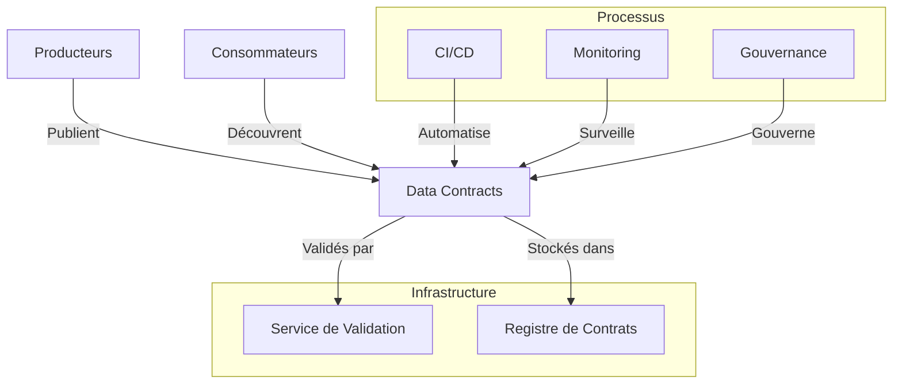
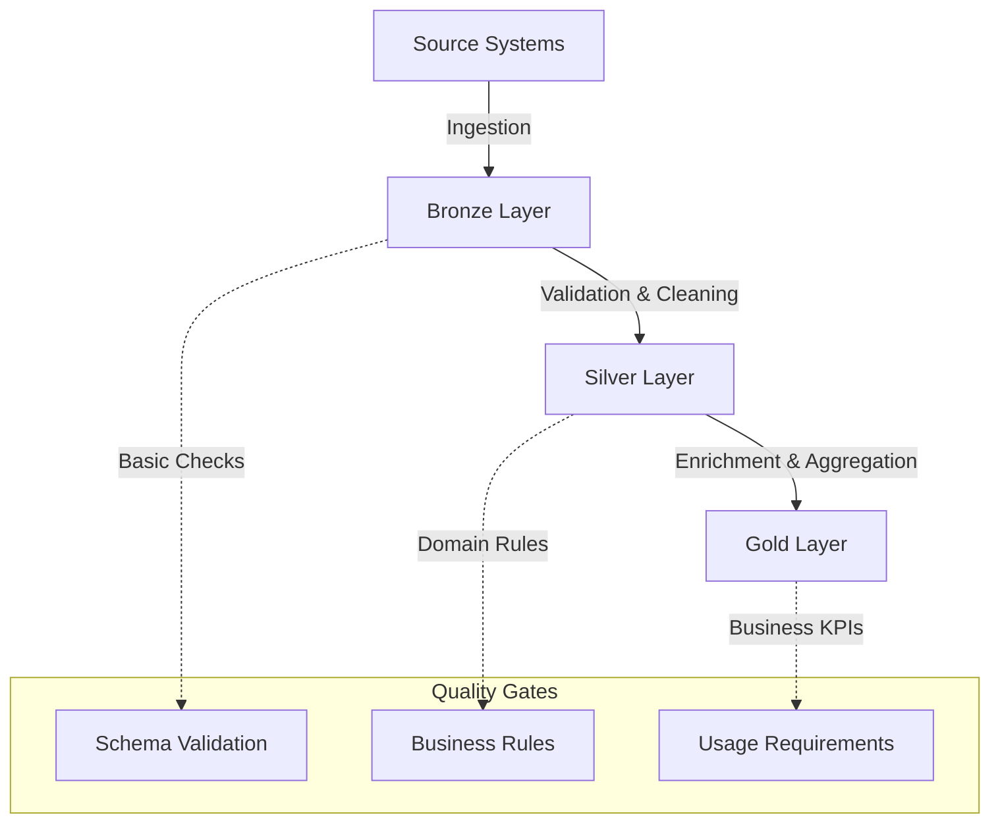

# Révolutionner la gestion des données avec les data contracts

Il est 3h du matin. L'équipe de support reçoit une alerte critique : le pipeline de données alimentant le tableau de bord des ventes en temps réel est en panne. L'analyse préliminaire révèle que l'équipe e-commerce a modifié le format des données de commande sans préavis. Un champ requis a été renommé, et maintenant toute la chaîne de traitement est paralysée. Cette situation, malheureusement trop courante, illustre une réalité souvent négligée : les données ne sont pas qu'un actif, c'est un produit qui nécessite une gestion rigoureuse de son cycle de vie.

## Le quotidien sans data contracts

Imaginez une entreprise e-commerce en pleine croissance. Plusieurs équipes travaillent en parallèle sur différentes parties du système :

- L'équipe e-commerce gère la plateforme de vente et génère les données de transactions
- L'équipe data science développe des modèles de recommandation
- L'équipe BI produit les rapports pour le management
- L'équipe marketing utilise les données clients pour les campagnes

En surface, tout fonctionne. Mais en dessous, c'est le chaos :

- Les data engineers passent leurs journées à réparer des pipelines cassés parce qu'un champ a changé de type ou de nom
- Les data scientists découvrent que leurs modèles produisent des résultats erronés à cause de changements silencieux dans les données d'entrée
- L'équipe BI doit constamment vérifier si les métriques sont toujours calculées de la même façon

Les réunions sont remplies de questions comme : "Qui a changé ce champ ?", "Pourquoi les données sont différentes aujourd'hui ?", "Comment sommes-nous censés utiliser cette colonne ?"

## Le coût caché de l'absence de contrats

Cette situation a un coût réel, souvent sous-estimé :

- Des décisions business prises sur des données incorrectes
- Des heures perdues en débogage et réconciliation
- Des projets data retardés
- Une perte de confiance dans les données
- Du stress et de la frustration dans les équipes

Cette situation devient encore plus critique dans un contexte de Data Mesh, où la responsabilité des données est décentralisée vers les domaines métier. Prenons l'exemple d'une banque que j'ai récemment accompagnée dans sa transformation Data Mesh. Chaque domaine - crédit, épargne, assurance - est devenu responsable de ses propres données. Sans data contracts, cette décentralisation a initialement amplifié les problèmes : les incohérences se sont multipliées, la traçabilité est devenue un cauchemar, et la confiance dans les données s'est érodée.

En moyenne, les équipes passent 40% de leur temps à gérer ces problèmes de coordination et de qualité. C'est comme construire une maison où chaque artisan utiliserait ses propres unités de mesure, mais à l'échelle d'une ville entière.

## L'émergence des data contracts

La transformation Data Mesh représente un changement fondamental dans la façon dont les organisations gèrent leurs données. Dans ce modèle, chaque domaine métier devient responsable de ses propres données, qu'il s'agisse des données de crédit, d'épargne ou d'assurance pour une banque, ou des données de vente, de logistique ou de marketing pour un retailer. Cette décentralisation promet une meilleure agilité et un plus grand alignement avec les besoins métier.

Cependant, cette autonomie accrue des domaines crée de nouveaux défis. Sans structure appropriée, les problèmes de coordination se multiplient. Les équipes peuvent passer jusqu'à 40% de leur temps à gérer des problèmes de cohérence et de qualité des données, un coût caché mais significatif. Les Data Contracts émergent comme une réponse structurée à ces défis.

Examinons l'architecture typique d'une implémentation de Data Contracts :



Cette architecture illustre les composants essentiels d'un système de Data Contracts. Le registre de contrats centralise les définitions, tandis que le service de validation assure leur conformité. L'intégration avec les processus CI/CD permet l'automatisation, tandis que le monitoring assure une qualité continue. La gouvernance, enfin, fournit le cadre nécessaire à une évolution contrôlée.

## Open data contract standard (ODCS)

Face à ces défis, un standard a émergé : l'Open Data Contract Standard (ODCS). Ce n'est pas qu'une spécification technique de plus - c'est un langage commun qui permet aux équipes de communiquer clairement leurs attentes et engagements concernant les données. Voici un exemple concret de contrat ODCS pour un flux de données client :

```yaml
dataContractSpecification: 1.1.0
id: urn:datacontract:customer:profile
info:
  title: "Customer Profile"
  version: "1.0.0"
  description: "Customer profile data contract"
  owner: "customer-data-team"
  contact:
    name: "Customer Data Team"
    email: "customer-data@company.com"

servers:
  local:
    type: "local"
    path: "./data/customer_profiles.parquet"
    format: "parquet"
    description: "Local customer profiles data"
  prod:
    type: "s3"
    path: "s3://data-lake-prod/customer/profiles/"
    format: "parquet"
    description: "Production customer profiles data"

models:
  CustomerProfile:
    type: "table"
    description: "Customer profile information"
    fields:
      customer_id:
        type: "text"
        description: "Unique customer identifier"
        required: true
        unique: true
      email:
        type: "text"
        description: "Customer email address"
        required: true
        pii: true
      first_name:
        type: "text"
        description: "Customer first name"
        required: true
        pii: true
      last_name:
        type: "text"
        description: "Customer last name"
        required: true
        pii: true
      birth_date:
        type: "date"
        description: "Customer birth date"
        required: true
        pii: true
      address:
        type: "object"
        description: "Customer address"
        fields:
          street:
            type: "text"
            description: "Street address"
            required: true
          city:
            type: "text"
            description: "City"
            required: true
          country:
            type: "text"
            description: "Country"
            required: true

terms:
  usage: "Customer data management and analytics"
  limitations: "PII data subject to GDPR and CCPA compliance"
  retention:
    duration: "P5Y"
    basis: "Legal requirement"

servicelevels:
  availability:
    description: "Profile data availability"
    percentage: "99.9%"
    measurement: "daily"
  
  privacy:
    description: "Privacy compliance"
    requirements:
      - "GDPR Article 17 - Right to erasure"
      - "CCPA Section 1798.105 - Right to deletion"
    responseTime: "P30D"
```

Analysons chaque section de ce contrat en détail :

1. L'en-tête du contrat établit son identité et sa gouvernance. Le champ `id` identifie uniquement le contrat, tandis que la section `info` fournit les métadonnées essentielles, y compris les informations de contact de l'équipe responsable.

2. La section `servers` définit où et comment les données sont stockées. Dans cet exemple, nous avons une configuration locale pour le développement et une configuration de production dans S3.

3. La section `models` décrit la structure des données avec une définition précise de chaque champ. Les champs contenant des données personnelles (PII) sont clairement identifiés, et les contraintes de validation sont explicites.

4. Les `terms` établissent les conditions d'utilisation, y compris les aspects de conformité réglementaire et la durée de rétention des données exprimée au format ISO 8601.

5. Les `servicelevels` définissent des engagements mesurables sur la disponibilité des données et la conformité à la vie privée, avec des temps de réponse précis pour les demandes liées aux droits personnels.

## Implémentation : des concepts à la réalité

L'implémentation des data contracts dans un contexte de data lake est particulièrement pertinente, notamment dans une architecture en médaillons (bronze, silver, gold). Cette approche structurée permet une évolution progressive de la qualité des données.

L'architecture en médaillons se décompose en trois niveaux :

1. **Bronze** : Les données brutes sont ingérées telles quelles, avec des contrats focalisés sur la validation des schémas de base. Par exemple, les données de transactions brutes du système de caisse.

2. **Silver** : Les données sont nettoyées et standardisées, avec des contrats incluant des règles de qualité métier. C'est à ce niveau que les transactions sont normalisées et enrichies.

3. **Gold** : Les données sont enrichies et optimisées pour les cas d'usage business, avec des contrats orientés vers les besoins analytiques. Par exemple, les données de ventes agrégées pour le reporting.



Chaque transition entre les couches est gouvernée par des data contracts qui définissent les règles de transformation, les critères de qualité et les responsabilités des équipes. Cette approche permet une évolution maîtrisée de la qualité des données, où chaque niveau apporte une valeur ajoutée claire et mesurable.

## Par où commencer ?

Dans un contexte Data Mesh, l'adoption des data contracts doit s'aligner avec la maturité des domaines en tant que producteurs de données. J'ai observé que les organisations réussissent mieux quand elles :

1. Identifient un domaine métier mature et motivé pour piloter l'initiative. Dans le retail, le domaine des ventes joue souvent ce rôle, créant un exemple concret pour les autres domaines.
2. Commencent par un produit de données critique ayant plusieurs consommateurs. La table silver des transactions est parfaite : données critiques pour le reporting, multiples consommateurs analytiques, besoins de qualité clairs.
3. Établissent une boucle de feedback courte avec les consommateurs. Les data scientists analysant les comportements d'achat fournissent un retour précieux sur les attributs nécessaires et leurs contraintes de qualité.
4. Automatisent progressivement les validations et le monitoring, transformant le contrat en un outil vivant plutôt qu'une documentation statique.
5. Documentent et partagent les succès pour créer un effet boule de neige. Quand les autres domaines voient la réduction des incidents et l'amélioration de la fiabilité des analyses, ils adoptent naturellement l'approche.

L'objectif n'est pas la perfection immédiate, mais d'établir un nouveau standard de collaboration autour des données. Si vous voulez que l'adoption des data contracts réussisse, tout le monde doit être impliqué et respecter le format, sans quoi votre déploiement en production échouera.

## Conclusion

Les data contracts dans un data lake ne sont pas qu'une documentation - ils deviennent le garde-fou qui assure la qualité et la fiabilité des données à chaque étape de transformation. En formalisant les attentes et les responsabilités, ils créent un cadre de confiance qui permet de construire des analyses fiables sur des données de qualité.

Dans le prochain article, nous explorerons comment ces contrats s'intègrent dans une stratégie globale de gouvernance des données, en mettant l'accent sur l'évolution et la maintenance des contrats dans le temps.

## Implémentation de référence

Les concepts présentés dans cet article sont implémentés dans les fichiers suivants :

- [Data contract basique](../../../contracts/customer-domain/order_events.yaml) - Exemple de contrat simple
- [Data contract avancé](../../../contracts/customer-domain/customer_profile_events.yaml) - Contrat avec règles de qualité
- [Tests de validation](../../../validation/contract_tests.py) - Implémentation de la validation

Pour commencer avec ces exemples, consultez le [guide de démarrage rapide](../../../README.md#quick-start). 