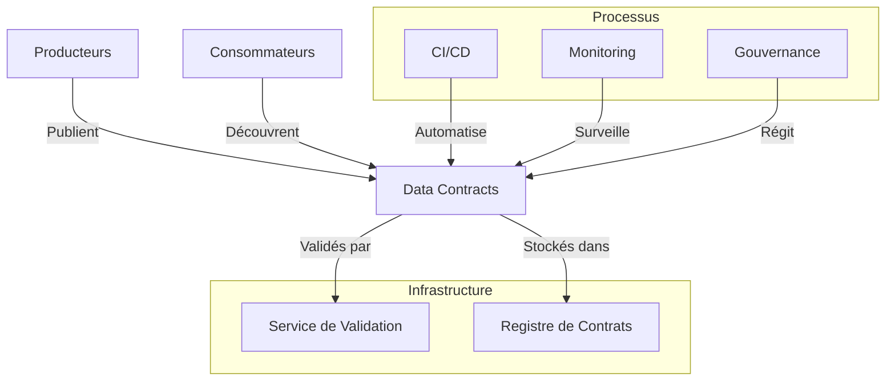

# Révolutionner la gestion des données avec les data contracts

Il est 3h du matin. L'équipe de support reçoit une alerte critique : le pipeline de données alimentant le tableau de bord des ventes en temps réel est en panne. L'analyse préliminaire révèle que l'équipe e-commerce a modifié le format des données de commande sans préavis. Un champ requis a été renommé, et maintenant toute la chaîne de traitement est paralysée. Cette situation, malheureusement trop fréquente, illustre une réalité souvent négligée : la donnée n'est pas qu'un actif, c'est un produit qui nécessite une gestion rigoureuse de son cycle de vie.

## Le quotidien sans data contracts

Imaginez une entreprise e-commerce en pleine croissance. Plusieurs équipes travaillent en parallèle sur différentes parties du système :

- L'équipe e-commerce gère la plateforme de vente et génère des données de transactions. 
- L'équipe data science développe des modèles de recommandation. 
- L'équipe BI produit des rapports pour la direction. 
- L'équipe marketing exploite les données clients pour ses campagnes.

En apparence, tout fonctionne. Mais sous la surface, c'est le chaos :

- Les data engineers passent leurs journées à corriger des pipelines cassés parce qu'un champ a changé de type ou de nom. 
- Les data scientists découvrent que leurs modèles produisent des résultats erronés à cause de changements silencieux dans les données d'entrée. 
- L'équipe BI doit constamment vérifier si les métriques sont toujours calculées de la même manière.

Les réunions sont remplies de questions comme : "Qui a changé ce champ ?", "Pourquoi les données sont-elles différentes aujourd'hui ?", "Comment est-ce qu'on est censé utiliser cette colonne ?"

## Le coût caché de l'absence de contrats

Cette situation a un coût réel, souvent sous-estimé :

- Des décisions business prises sur des données incorrectes
- Des heures perdues en debugging et reconciliation
- Des projets data qui prennent du retard
- Une perte de confiance dans les données
- Du stress et de la frustration dans les équipes

Cette situation devient encore plus critique dans un contexte de Data Mesh, où la responsabilité des données est décentralisée vers les domaines métiers. Prenons l'exemple d'une banque que j'ai accompagnée récemment dans sa transformation Data Mesh. Chaque domaine - crédit, épargne, assurance - devenait responsable de ses propres données. Sans data contracts, cette décentralisation a initialement amplifié les problèmes : les incohérences se sont multipliées, la traçabilité est devenue un cauchemar, et la confiance dans les données s'est érodée.

En moyenne, les équipes passent 40% de leur temps à gérer ces problèmes de coordination et de qualité. C'est comme construire une maison où chaque artisan utiliserait ses propres unités de mesure, mais à l'échelle d'une ville entière.

## L'émergence des data contracts

La transformation Data Mesh représente un changement fondamental dans la façon dont les organisations gèrent leurs données. Dans ce modèle, chaque domaine métier devient responsable de ses propres données, qu'il s'agisse de données de crédit, d'épargne ou d'assurance pour une banque, ou de données de vente, de logistique ou de marketing pour un distributeur. Cette décentralisation promet une meilleure agilité et une plus grande adéquation avec les besoins métiers.

Cependant, cette autonomie accrue des domaines crée de nouveaux défis. Sans structure adaptée, les problèmes de coordination se multiplient. Les équipes peuvent passer jusqu'à 40% de leur temps à gérer des questions de cohérence et de qualité des données, un coût caché mais significatif. Les Data Contracts émergent comme une réponse structurée à ces défis.

Examinons l'architecture type d'une implémentation de Data Contracts :



Cette architecture illustre les composants essentiels d'un système de Data Contracts. Le registre de contrats centralise les définitions, tandis que le service de validation assure leur respect. L'intégration avec les processus CI/CD permet l'automatisation, pendant que le monitoring garantit la qualité en continu. La gouvernance, enfin, fournit le cadre nécessaire à une évolution contrôlée.

## Open data contract standard (ODCS)

Face à ces défis, un standard a émergé : l'Open Data Contract Standard (ODCS). Ce n'est pas qu'une spécification technique de plus, c'est un langage commun qui permet aux équipes de communiquer clairement leurs attentes et leurs engagements concernant les données. Prenons un exemple concret de contrat ODCS pour un flux de données client :

```yaml
odcs_version: "1.0.0"
id: "customer_profile"
version: "1.0.0"
domain: "customer"
owner: 
  team: "customer-data"
  contact: "customer-data@company.com"

interface:
  type: "batch"
  spec:
    format: "parquet"
    schema:
      type: "struct"
      fields:
        - name: "customer_id"
          type: "string"
          description: "Identifiant unique du client"
          constraints:
            - type: "not_null"
        - name: "email"
          type: "string"
          constraints:
            - type: "email_format"

quality:
  rules:
    - name: "email_validity"
      severity: "critical"
    - name: "recent_data"
      severity: "warning"

operational:
  sla:
    freshness: "24h"
    availability: "99.9%"
```

Analysons en détail chaque section de ce contrat :

1. L'en-tête du contrat établit son identité et sa gouvernance. Le champ `domain` n'est pas qu'une simple catégorisation - il rattache explicitement ces données à une unité métier responsable. L'information de contact n'est pas une formalité administrative ; c'est un engagement de responsabilité.

2. La section `interface` va au-delà d'une simple description technique. Le choix du format Parquet n'est pas anodin - il reflète un compromis entre performance de lecture et flexibilité du schéma. Chaque champ du schéma est documenté et contraint, créant un cadre clair pour la qualité des données.

3. Les règles de qualité établissent une hiérarchie claire des problèmes potentiels. Une adresse email invalide est considérée comme critique car elle peut impacter directement la communication avec le client, tandis que la fraîcheur des données est un avertissement qui mérite attention sans nécessairement déclencher une alarme.

4. Les SLAs opérationnels ne sont pas de simples objectifs - ils représentent un contrat de service concret entre le producteur et ses consommateurs. Une fraîcheur de 24h et une disponibilité de 99.9% sont des engagements mesurables qui guideront les choix d'architecture et d'exploitation.

## Mise en œuvre : des concepts à la réalité

La mise en place des data contracts dans un contexte de datalake est particulièrement pertinente, notamment dans une architecture médaillon (bronze, silver, gold). Prenons l'exemple du domaine des ventes, où les données brutes de transactions sont progressivement raffinées pour alimenter des analyses et tableaux de bord critiques.

Le premier contrat établi concerne la table silver des transactions de vente. Cette table est un point névralgique : elle nettoie et standardise les données brutes de la couche bronze, et sert de source de vérité pour la création des agrégats de la couche gold.

```yaml
odcs_version: "1.0.0"
id: "sales_transactions_silver"
version: "1.0.0"
domain: "sales_analytics"
owner: 
  team: "data-engineering"
  contact: "data-engineering@retail.com"

interface:
  type: "batch"
  spec:
    format: "delta"
    schema:
      fields:
        - name: "transaction_id"
          type: "string"
          description: "Identifiant unique de la transaction"
          constraints:
            - type: "not_null"
            - type: "unique"
            
        - name: "transaction_date"
          type: "date"
          description: "Date de la transaction"
          constraints:
            - type: "not_null"
            - type: "not_future"
            
        - name: "store_id"
          type: "string"
          description: "Identifiant unique du magasin"
          constraints:
            - type: "not_null"
            - type: "reference"
              table: "dim_stores"
              field: "store_id"
            
        - name: "product_id"
          type: "string"
          description: "Identifiant unique du produit"
          constraints:
            - type: "not_null"
            - type: "reference"
              table: "dim_products"
              field: "product_id"
              
        - name: "quantity"
          type: "integer"
          description: "Quantité vendue"
          constraints:
            - type: "positive"
            
        - name: "unit_price"
          type: "decimal"
          description: "Prix unitaire au moment de la vente"
          constraints:
            - type: "positive"
            
        - name: "total_amount"
          type: "decimal"
          description: "Montant total de la ligne"
          constraints:
            - type: "positive"

quality:
  rules:
    - name: "amount_consistency"
      description: "Vérification du montant total"
      severity: "critical"
      check: >
        ABS(total_amount - (quantity * unit_price)) <= 0.01
        
    - name: "referential_integrity"
      description: "Vérification des références"
      severity: "critical"
      check: >
        EXISTS(SELECT 1 FROM dim_stores s WHERE s.store_id = store_id) AND
        EXISTS(SELECT 1 FROM dim_products p WHERE p.product_id = product_id)
        
    - name: "deduplication"
      description: "Détection des doublons"
      severity: "warning"
      check: >
        COUNT(*) = COUNT(DISTINCT transaction_id)

processing:
  scheduling:
    frequency: "hourly"
    dependencies:
      - "sales_transactions_bronze"
      - "dim_stores"
      - "dim_products"
  expectations:
    volume:
      min_rows: 1000
      max_rows: 1000000
    latency: "30m"

operational:
  sla:
    freshness: "1h"
    availability: "99.9%"
  monitoring:
    metrics:
      - name: "quality_score"
        description: "Pourcentage de lignes respectant toutes les règles"
        threshold: 0.99
      - name: "processing_time"
        threshold: "15m"
      - name: "incremental_volume"
        description: "Nombre de nouvelles lignes par run"
        alert:
          min: 100
          max: 100000
```

Ce contrat introduit plusieurs concepts fondamentaux adaptés au contexte d'un datalake médaillon :

1. **Contrôle de Qualité Multi-niveaux** : Les règles de qualité couvrent à la fois l'intégrité des données (unicité des transactions, cohérence des montants) et l'intégrité référentielle avec les dimensions. Cette double validation assure la fiabilité des analyses en aval.

2. **SLAs Adaptés au Batch** : Les métriques de fraîcheur et disponibilité sont calibrées pour un traitement batch horaire, avec des attentes claires sur les volumes de données attendus à chaque run.

3. **Monitoring Orienté Data Engineering** : Le suivi intègre des métriques spécifiques au traitement des données, comme le taux de qualité et les variations de volume, essentielles pour détecter les anomalies dans la chaîne de traitement.

## Par où commencer ?

Dans un contexte Data Mesh, l'adoption des data contracts doit s'aligner avec la maturité des domaines en tant que producteurs de données. J'ai observé que les organisations réussissent mieux quand elles :

1. Identifient un domaine métier mature et motivé pour piloter l'initiative. Dans la distribution, le domaine des ventes joue souvent ce rôle, créant un exemple concret pour les autres domaines.
2. Commencent par un produit de données critique ayant plusieurs consommateurs. La table silver des transactions est parfaite : données critiques pour le reporting, multiples consommateurs analytiques, besoins de qualité clairs.
3. Établissent une boucle de feedback courte avec les consommateurs. Les data scientists analysant les comportements d'achat fournissent des retours précieux sur les attributs nécessaires et leurs contraintes de qualité.
4. Automatisent progressivement les validations et le monitoring, transformant le contrat en un outil vivant plutôt qu'une documentation statique.
5. Documentent et partagent les succès pour créer un effet boule de neige. Quand les autres domaines constatent la réduction des incidents et l'amélioration de la fiabilité des analyses, ils adoptent naturellement l'approche.

L'objectif n'est pas la perfection immédiate, mais d'établir un nouveau standard de collaboration autour des données. Si vous voulez que l'adoption des data contracts soit un succès, il faut que tout le monde soit impliqué et respecte le format, sans quoi votre mise en production sera un échec.
## Conclusion

Les data contracts dans un datalake ne sont pas qu'une documentation - ils deviennent le garde-fou qui garantit la qualité et la fiabilité des données à chaque étape de transformation. En formalisant les attentes et les responsabilités, ils créent un cadre de confiance qui permet de construire des analyses fiables sur des données de qualité.

Dans le prochain article, nous explorerons comment ces contrats s'intègrent dans une stratégie globale de gouvernance des données, en mettant l'accent sur l'évolution et la maintenance des contrats dans le temps.

## Implémentation de référence

Les concepts présentés dans cet article sont implémentés dans les fichiers suivants :

- [Data Contract de base](../../../contracts/customer-domain/order_events.yaml) - Exemple de contract simple
- [Data Contract avancé](../../../contracts/customer-domain/customer_profile_events.yaml) - Contract avec règles de qualité
- [Tests de validation](../../../validation/contract_tests.py) - Implémentation des validations

Pour démarrer avec ces exemples, consultez le [guide de démarrage rapide](../../../README.md#-démarrage-rapide). 