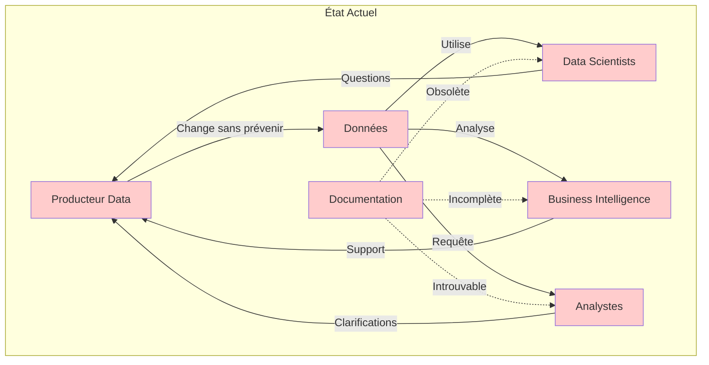
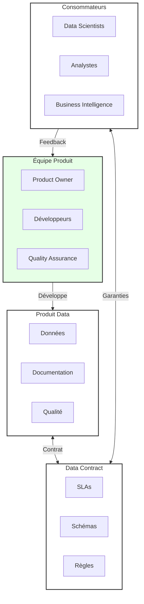
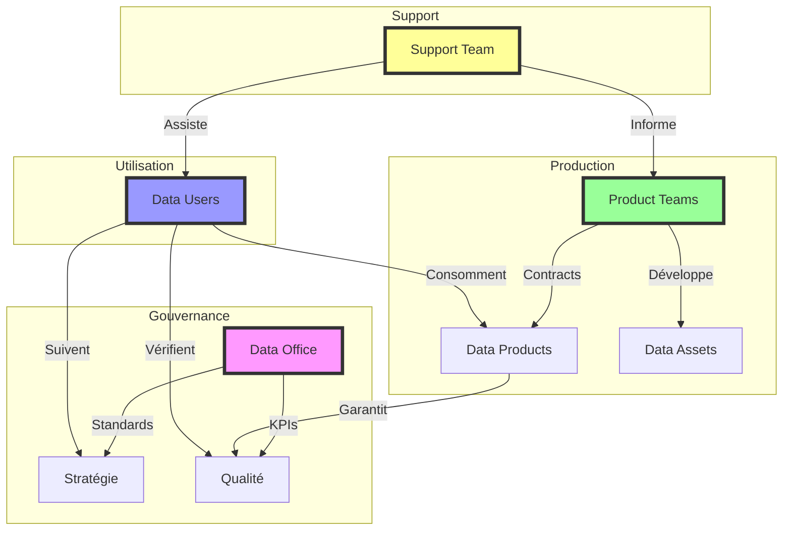
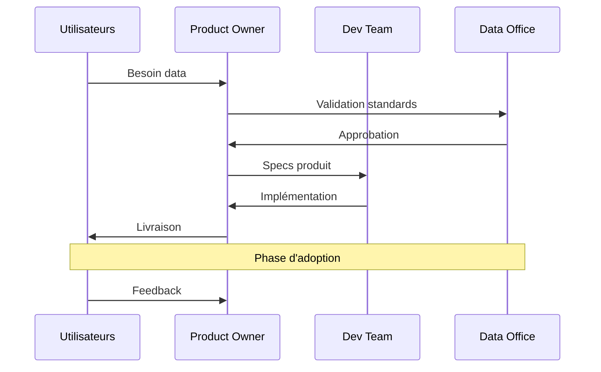
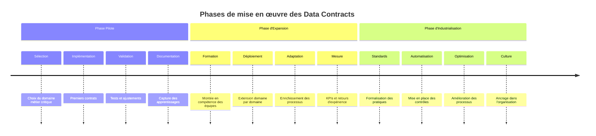

# Data Contracts : La clé d'une donnée fiable et produit

Dans notre premier article, nous avons exploré les fondamentaux des data contracts et leur rôle essentiel dans la transformation des données en produits. Nous avons vu comment cette approche permet de structurer et de formaliser les échanges de données au sein de l'organisation. Mais comment cette transformation s'opère-t-elle concrètement ? Quels sont les défis à surmonter et les solutions à mettre en place ?

Pour comprendre l'ampleur du changement nécessaire, plongeons d'abord dans la réalité quotidienne des organisations. Plus les entreprises accumulent de données, plus leur exploitation devient paradoxalement complexe. Les data scientists peinent à localiser la documentation dont ils ont besoin. Les analystes découvrent, souvent trop tard, que le format des données a changé sans préavis. Les équipes business s'interrogent sur la fiabilité des données qu'elles utilisent pour leurs décisions stratégiques.

Ces situations, bien que courantes, ne sont pas une fatalité. Dans cet article, nous allons explorer en détail comment les data contracts répondent à ces défis quotidiens, en examinant d'abord les problématiques actuelles puis en détaillant les solutions concrètes qu'ils apportent. Nous verrons comment cette approche, au-delà de son aspect technique, transforme en profondeur la façon dont l'organisation produit, maintient et consomme ses données.

## La situation actuelle : un écosystème fragmenté

L'écosystème data traditionnel ressemble souvent à une ville qui aurait grandi sans plan d'urbanisme. Chaque équipe a construit son territoire, créant un patchwork complexe de silos qui communiquent mal entre eux. Cette fragmentation, bien qu'historiquement compréhensible, génère aujourd'hui plus de problèmes qu'elle n'en résout.

Au cœur de ce système, les producteurs de données opèrent souvent dans l'urgence, modifiant les structures ou les formats sans pouvoir mesurer l'impact de leurs changements. La documentation, quand elle existe, devient rapidement obsolète, perdue dans des systèmes de gestion documentaire mal adaptés (qui n'a pas un wiki et un outil de documentation collaboratif ?). Submergés par les demandes de support, ils peinent à maintenir la qualité de service attendue.

De l'autre côté, les consommateurs de données naviguent à vue. Les data scientists perdent un temps précieux à chercher la bonne information ou à comprendre pourquoi leurs pipelines se sont mystérieusement arrêtés. Les équipes de Business Intelligence découvrent les changements lors de leurs analyses, remettant en question la fiabilité de leurs rapports. Les analystes métier, coincés entre les deux, multiplient les demandes de clarification.

Cette fragmentation a un coût réel pour l'organisation. Au-delà de la perte évidente d'efficacité opérationnelle, c'est la capacité même de l'entreprise à exploiter son patrimoine data qui est compromise. Les projets d'analyse avancée ou d'intelligence artificielle, qui nécessitent des données fiables et bien documentées, sont particulièrement impactés. Un changement structurel devient nécessaire.

## La transformation : Data Contracts + Approche Produit

La réponse à ces défis réside dans une double transformation : l'adoption des data contracts couplée à une véritable approche produit. Ce changement de paradigme redéfinit fondamentalement la façon dont les organisations conçoivent, produisent et consomment leurs données.

L'approche produit introduit une nouvelle vision, centrée sur l'utilisateur. Les données ne sont plus simplement "produites" mais véritablement "conçues" pour répondre à des besoins spécifiques. Une roadmap claire guide leur évolution, tandis qu'un support professionnel assure leur bon usage. L'amélioration continue devient la norme, alimentée par les retours constants des utilisateurs.

Les data contracts, quant à eux, formalisent les engagements entre producteurs et consommateurs. Les schémas sont rigoureusement documentés, la qualité fait l'objet de garanties explicites, et des SLAs précis définissent les niveaux de service attendus. Tout changement suit désormais un processus structuré, permettant aux consommateurs d'anticiper et de s'adapter.

Cette nouvelle organisation crée un cercle vertueux où la qualité des données s'améliore continuellement. Les besoins réels des utilisateurs guident l'évolution des produits data, tandis que des processus robustes garantissent stabilité et fiabilité. La donnée devient enfin ce qu'elle aurait toujours dû être : un actif stratégique maîtrisé et valorisé.

## L'écosystème complet

Un écosystème data mature nécessite une orchestration précise entre différents acteurs, chacun ayant un rôle crucial à jouer dans la réussite globale.

### L'écosystème des parties prenantes

La mise en place des data contracts nécessite une orchestration précise entre de multiples acteurs de l'organisation. Au cœur de cet écosystème, le sponsor Business porte la vision et débloque les ressources nécessaires, tandis que les Data Managers assurent la supervision quotidienne des opérations. Les Data Owners, garants de la qualité et de l'intégrité des données, travaillent main dans la main avec le Core Data Product qui orchestre l'ensemble des interactions.

L'équipe produit joue un rôle central dans cette transformation. Le Data Product Owner définit la vision produit en collaboration étroite avec les Source Product Managers qui gèrent les données sources. L'équipe de développement, soutenue par les Data Quality Managers, implémente les contrats en suivant une approche "3 amigos" qui garantit l'alignement entre les besoins métier, la qualité des données et la faisabilité technique.

Le support aux utilisateurs prend une dimension nouvelle avec la mise en place d'une équipe dédiée qui accompagne les End-Users dans leur utilisation quotidienne des données. Cette équipe travaille en étroite collaboration avec les Stakeholders et les Application Owners pour garantir une expérience utilisateur optimale et une adoption réussie.

La gouvernance, pilotée par le Data Office, joue un rôle crucial dans l'établissement et le maintien des standards. Les architectes data valident les designs proposés, pendant que les Data Stewards enrichissent le catalogue de données et que les Security Officers veillent à la conformité des accès.

Cette organisation complexe mais nécessaire permet de répondre aux multiples enjeux de la donnée moderne. La validation business devient un processus fluide où la valeur métier est clairement identifiée et les règles sont validées par l'ensemble des parties prenantes. La qualité et la conformité sont assurées par des processus documentés et des règles clairement établies. Le support opérationnel s'appuie sur des SLAs définis et des processus d'évolution maîtrisés. Enfin, la collaboration technique permet une validation rigoureuse de la faisabilité et une qualification précise des sources de données.

## Le processus de collaboration

La mise en place des data contracts nécessite un processus de collaboration bien défini, où chaque acteur joue un rôle précis dans une chorégraphie minutieusement orchestrée. Ce processus, loin d'être une contrainte bureaucratique supplémentaire, constitue le socle d'une collaboration efficace et d'une évolution maîtrisée du patrimoine data.

Le cycle démarre toujours par l'expression d'un besoin utilisateur. Qu'il s'agisse d'une nouvelle source de données ou de l'évolution d'un produit data existant, le Product Owner joue un rôle central dans la traduction de ces besoins en spécifications concrètes. Cette première étape est cruciale : elle permet de s'assurer que le futur data contract répondra aux véritables enjeux métier tout en restant techniquement réalisable.

La validation par le Data Office constitue un point de contrôle essentiel. Cette équipe, gardienne des standards de l'organisation, s'assure que le nouveau contrat s'intègre harmonieusement dans l'écosystème existant. Elle vérifie la conformité aux normes de qualité, de sécurité et de gouvernance, tout en apportant son expertise pour optimiser la solution proposée.

Une fois les standards validés, l'équipe de développement entre en jeu. Leur mission va au-delà de la simple implémentation technique : ils collaborent étroitement avec le Product Owner pour affiner les spécifications, identifier les potentiels points de friction et proposer des solutions innovantes. Cette phase itérative permet d'aboutir à un produit data robuste et évolutif.

La livraison marque le début d'une nouvelle phase tout aussi importante : l'adoption. Le Product Owner accompagne les utilisateurs dans la prise en main du nouveau data contract, recueille leurs premiers retours et identifie les axes d'amélioration. Cette phase d'adoption est critique pour le succès à long terme : elle permet de s'assurer que le contrat répond effectivement aux besoins et qu'il est correctement utilisé.

La boucle se referme avec le feedback continu des utilisateurs, alimentant un cycle d'amélioration permanent. Ce retour d'expérience précieux permet d'affiner les contrats existants et d'enrichir les bonnes pratiques pour les futurs développements.

Ce processus collaboratif assure plusieurs bénéfices essentiels :
- Une définition claire et partagée des besoins, évitant les malentendus coûteux
- Une validation systématique des standards, garantissant la cohérence de l'écosystème data
- Une implémentation rigoureuse et documentée, facilitant la maintenance future
- Un cycle de feedback continu, permettant une amélioration constante des services

La clé du succès réside dans la fluidité de ces interactions. Chaque acteur doit comprendre son rôle et disposer des outils nécessaires pour collaborer efficacement. Les outils de gestion de projet agiles, combinés à des plateformes de collaboration dédiées aux data contracts, facilitent cette orchestration complexe.

## Les bénéfices de cette approche

L'adoption des data contracts génère des bénéfices en cascade à travers toute l'organisation. Pour les équipes data, c'est une transformation profonde de leur façon de travailler. La vision produit leur permet enfin de sortir du cycle infernal des demandes ad-hoc pour se concentrer sur la création de valeur durable. Les processus, désormais structurés, apportent clarté et prévisibilité dans leur travail quotidien. La satisfaction des utilisateurs s'améliore naturellement, réduisant drastiquement le temps consacré au support technique et aux corrections d'urgence.

Du côté des utilisateurs, le changement est tout aussi marquant. La documentation, autrefois dispersée et souvent obsolète, devient une source fiable d'information, constamment maintenue à jour. Les garanties de service leur apportent la sérénité nécessaire pour construire des solutions pérennes. Le support professionnel, organisé et réactif, les aide à résoudre rapidement leurs difficultés. Les évolutions, auparavant sources d'anxiété, suivent maintenant un processus maîtrisé qui préserve la stabilité de leurs applications.

Pour l'organisation dans son ensemble, les bénéfices se matérialisent rapidement en avantages compétitifs. Les projets s'accélèrent, libérés des freins liés à la compréhension et à l'accès aux données. La qualité globale des solutions s'améliore, portée par une meilleure compréhension des données sources. Le retour sur investissement des initiatives data s'optimise naturellement, tandis que la gouvernance, enfin effective, permet de maintenir le cap sur le long terme.

## Mise en œuvre progressive

La mise en place des data contracts ne peut se faire du jour au lendemain. Elle nécessite une approche progressive, respectueuse du rythme d'apprentissage et d'adaptation de l'organisation. 

La phase pilote constitue une étape cruciale de cette transformation. Elle débute par la sélection minutieuse d'un domaine métier critique, suffisamment important pour démontrer la valeur de l'approche, mais assez circonscrit pour rester maîtrisable. Les premiers contrats sont alors mis en place avec un soin particulier, chaque décision étant documentée pour servir de référence aux phases ultérieures. Cette phase permet de valider l'approche dans le contexte spécifique de l'organisation et de documenter les premiers succès qui serviront à convaincre les plus sceptiques.

L'expansion représente la phase la plus délicate. Le déploiement s'effectue domaine par domaine, en tenant compte des spécificités et de la maturité de chacun. La formation des équipes prend alors une importance capitale : il ne s'agit pas simplement d'expliquer de nouveaux processus, mais d'insuffler une nouvelle culture de la donnée. Les processus existants sont progressivement adaptés, enrichis des leçons apprises lors de la phase pilote. Les résultats sont mesurés avec précision, alimentant un cercle vertueux d'amélioration continue.

L'industrialisation marque la dernière étape de cette transformation. Les pratiques, désormais éprouvées, sont standardisées à l'échelle de l'organisation. Les contrôles, initialement manuels, sont progressivement automatisés pour garantir une application systématique des standards. Les processus sont optimisés en continu, nourris par l'expérience accumulée et les retours du terrain. L'amélioration continue devient alors non plus un objectif, mais une réalité quotidienne ancrée dans la culture de l'entreprise.

## Conclusion

La transformation d'une organisation vers un modèle basé sur les data contracts représente bien plus qu'un simple changement technique - c'est une véritable révolution culturelle dans notre approche de la donnée. Nous avons vu comment cette transformation impacte profondément la culture de l'entreprise, plaçant la qualité et la fiabilité au cœur des préoccupations quotidiennes. Les équipes productrices et consommatrices de données se trouvent responsabilisées, conduisant à une meilleure valorisation du patrimoine data.

La réussite de cette transformation repose sur plusieurs piliers fondamentaux que nous avons explorés : un engagement fort de la direction, une approche pragmatique privilégiant les victoires rapides, une communication transparente et une formation adéquate des équipes. Mais ces fondations, aussi solides soient-elles, ne suffisent pas. Pour concrétiser cette vision, l'organisation doit se doter de processus robustes et d'outils adaptés.

C'est précisément ce que nous explorerons dans les prochains articles. Nous verrons d'abord comment mettre en place des workflows efficaces de gestion des data contracts, en détaillant les processus de création, de validation et d'évolution. Nous plongerons ensuite dans les aspects techniques de l'implémentation, explorant les outils et technologies qui permettent de transformer cette vision en réalité opérationnelle.

Dans le prochain article, nous nous concentrerons sur les workflows et le versioning des data contracts, des éléments essentiels pour garantir une évolution maîtrisée de votre patrimoine data.