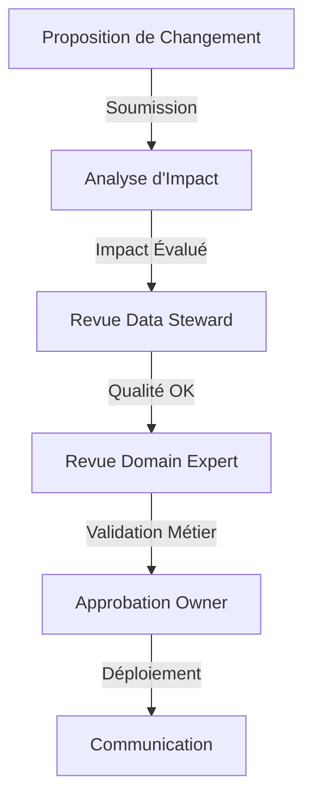

# Structure et gouvernance : l'architecture qui fait la différence

L'équipe data science vient de terminer une présentation tendue devant le comité exécutif. Leurs prévisions de ventes pour le Black Friday étaient largement surestimées, causant un surstock coûteux. L'analyse révèle que le changement des règles de calcul du panier moyen, bien que documenté dans un ticket Jira, n'avait jamais été communiqué aux équipes d'analyse. Cette situation, malheureusement courante dans le retail, illustre pourquoi la gouvernance des data contracts ne peut pas se résumer à des aspects purement techniques.

## Pourquoi commencer par la gouvernance ?

Avant de plonger dans les détails techniques des data contracts, il est crucial de comprendre comment ils s'intègrent dans l'organisation. L'expérience montre que les échecs dans l'adoption des data contracts sont rarement dus à des problèmes techniques, mais plutôt à des lacunes dans la gouvernance et l'organisation.

Prenons l'exemple d'une grande enseigne de distribution qui avait investi massivement dans une solution technique sophistiquée de data contracts. Six mois après le lancement, moins de 20% des équipes utilisaient effectivement les contrats. L'analyse post-mortem a révélé que le projet avait négligé les aspects organisationnels : qui est responsable de quoi ? Comment les décisions sont-elles prises ? Comment les changements sont-ils communiqués ?

## L'architecture d'un data contract

Un data contract bien structuré ressemble plus à une constitution qu'à une simple spécification technique. Il établit non seulement les règles techniques, mais aussi les responsabilités et les processus de décision.

Voici un exemple concret tiré d'une entreprise e-commerce :

```yaml
openDataContract: "1.0.0"
info:
  title: "retail_transactions"
  version: "2.1.0"
  domain: "retail"
  owner:
    team: "retail-data"
    contact: "retail-data@company.com"
  stakeholders:
    - role: "data_steward"
      team: "data_office"
      responsibilities: ["quality", "compliance"]
    - role: "domain_expert"
      team: "retail_ops"
      responsibilities: ["business_rules", "definitions"]
  
  approval_process:
    changes:
      minor:
        approvers: ["data_steward"]
        sla: "2 business days"
      major:
        approvers: ["data_steward", "domain_expert", "owner"]
        sla: "5 business days"
        requires_review_meeting: true

contracts:
  RetailTransaction:
    type: "batch"
    format: "parquet"
    schema:
      fields:
        - name: "transaction_id"
          type: "string"
          description: "Identifiant unique de la transaction"
          business_rules:
            - rule: "format"
              pattern: "TX-[0-9]{10}"
              severity: "error"
```

Ce contrat ne se contente pas de définir un schéma - il établit clairement qui est responsable de quoi et comment les décisions sont prises.

## Organisation et processus

La dimension organisationnelle des data contracts se matérialise à travers des rôles et des processus bien définis. Prenons l'exemple d'une entreprise qui a réussi son adoption des data contracts :

- Le **Data Product Owner** porte la vision stratégique. Elle comprend les besoins métier et s'assure que le contrat y répond.
- Le **Data Steward** est le gardien de la qualité. Il vérifie que les règles de qualité sont pertinentes et appliquées.
- Le **Domain Expert** apporte l'expertise métier. Elle valide que les définitions et les règles correspondent à la réalité du terrain.

Le processus de modification illustre parfaitement cette collaboration :



## Vers une gouvernance efficace

La mise en place d'une gouvernance efficace nécessite un équilibre délicat. Trop de contrôle étouffe l'innovation, trop peu mène au chaos. Voici quelques principes qui ont fait leurs preuves :

1. **Commencez petit mais pensez grand** : Démarrez avec un domaine pilote mais concevez une structure qui pourra s'étendre.
2. **Automatisez progressivement** : Commencez par les processus manuels pour les comprendre, puis automatisez.
3. **Mesurez et adaptez** : Suivez des métriques clés (temps d'approbation, satisfaction des équipes) et ajustez en fonction.

## Conclusion

La gouvernance des data contracts n'est pas qu'une question de processus - c'est un changement culturel qui doit être soigneusement orchestré. Dans les prochains articles, nous explorerons les aspects techniques (versioning, patterns d'architecture) qui s'appuient sur cette base organisationnelle solide.

Mais rappelez-vous : la meilleure architecture technique ne peut pas compenser une gouvernance défaillante. C'est pourquoi nous avons commencé par là.