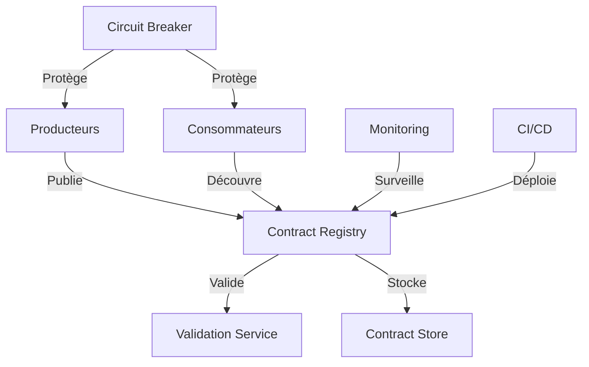
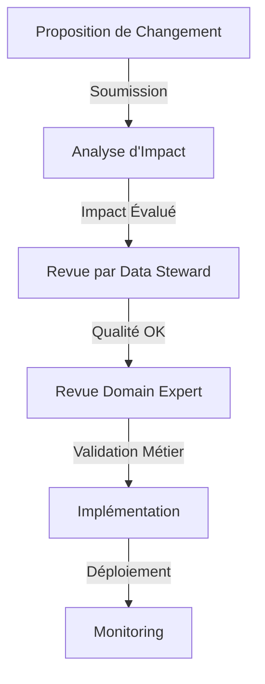

# Structure et gouvernance : l'architecture qui fait la différence

La question de la gouvernance des data contracts est centrale dans toute organisation data-driven. Un data contract ne peut pas être réduit à une simple documentation technique ; c'est un contrat social qui établit les règles de collaboration autour des données. La différence entre un document statique et un contrat de données vivant réside précisément dans sa gouvernance.

## L'architecture d'un data contract

Un data contract bien structuré s'apparente à une constitution : il établit les règles fondamentales tout en prévoyant les mécanismes de son évolution. La structure doit refléter non seulement les aspects techniques, mais aussi la dimension organisationnelle du contrat. Cette dualité est essentielle pour garantir que le contrat reste pertinent et appliqué dans le temps.

Voici un exemple de contrat ODCS qui illustre cette approche structurée :

```yaml
odcs_version: "1.0.0"
id: "retail_transactions"
version: "2.1.0"
domain: "retail"

# Gouvernance et Responsabilités
governance:
  owner:
    team: "retail-data"
    contact: "retail-data@company.com"
  stakeholders:
    - role: "data_steward"
      team: "data_office"
      responsibilities: ["quality", "compliance"]
    - role: "domain_expert"
      team: "retail_ops"
      responsibilities: ["business_rules", "definitions"]
  
  approval_process:
    changes:
      minor: ["data_steward"]
      major: ["data_steward", "domain_expert", "arch_board"]
    sla: "5 business days"

# Interface Technique
interface:
  type: "stream"
  spec:
    format: "avro"
    schema: # Définition du schéma
      # ... détails du schéma ...

# Règles Métier et Qualité
business_rules:
  - name: "transaction_amount_check"
    description: "Montant total doit correspondre à la somme des items"
    owner: "retail_ops"
    validation:
      sql: >
        SELECT transaction_id 
        FROM transactions 
        WHERE total_amount != (
          SELECT SUM(item_price * quantity) 
          FROM transaction_items 
          WHERE transaction_id = transactions.transaction_id
        )

# Aspects Opérationnels
operational:
  sla:
    freshness: "5m"
    availability: "99.99%"
  monitoring:
    alerts:
      - condition: "freshness > 10m"
        severity: "critical"
        notify: ["retail-data-oncall"]
```

La structure du contrat reflète les différentes dimensions de la gouvernance. Au niveau des responsabilités, chaque aspect du contrat est associé à un propriétaire clairement identifié. Le data steward assure la supervision de la qualité, pendant que l'expert métier garantit la pertinence business des règles définies. Cette répartition des rôles crée un système de checks and balances qui maintient l'intégrité du contrat.

## L'écosystème des data contracts

L'architecture globale d'un système de data contracts s'articule autour de plusieurs composants interconnectés :



Le registry de contrats agit comme le point central de l'architecture, orchestrant les interactions entre les différents composants. Le service de validation assure le respect des contrats, pendant que le système de monitoring veille à la santé globale de l'écosystème. Cette architecture distribuée permet une séparation claire des responsabilités tout en maintenant la cohérence de l'ensemble.

## Organisation et processus

La dimension organisationnelle des data contracts se matérialise à travers des rôles et des processus bien définis. Le Data Product Owner porte la vision stratégique du produit de données, tandis que le Data Steward veille à sa qualité et sa conformité. Le Domain Expert, quant à lui, garantit l'alignement avec les besoins métier. Cette tripartition des responsabilités assure un équilibre entre les différentes perspectives nécessaires à la bonne gestion des données.

Le processus de gestion des changements illustre parfaitement cette collaboration :



## Gouvernance en action

La gouvernance des data contracts repose sur quatre piliers fondamentaux. Le premier concerne la clarté des responsabilités : chaque contrat doit avoir un propriétaire unique, avec des rôles et des processus de décision clairement documentés. Le deuxième pilier traite de la gestion du changement, avec une classification précise des types de modifications et des processus d'approbation adaptés à leur impact.

Le troisième pilier concerne la qualité et la conformité, avec des mécanismes de validation automatique des contrats et une vérification continue des règles métier. Enfin, le quatrième pilier porte sur le monitoring, avec une surveillance en temps réel des métriques et une détection proactive des anomalies.

## Vers une gouvernance efficace

La mise en place d'une gouvernance efficace des data contracts nécessite une approche progressive et méthodique. Il est préférable de commencer avec un périmètre limité mais une architecture extensible, qui pourra évoluer avec les besoins de l'organisation. L'automatisation doit être introduite graduellement, en commençant par les tâches les plus répétitives, pour permettre aux équipes de s'approprier les nouveaux processus.

La gouvernance doit rester au service de l'efficacité opérationnelle, sans créer de bureaucratie excessive. Les processus doivent être suffisamment flexibles pour s'adapter aux différents contextes, tout en maintenant un cadre cohérent qui garantit la qualité et la fiabilité des données.

## Conclusion

La gouvernance des data contracts représente un équilibre délicat entre structure et flexibilité. Elle doit fournir un cadre suffisamment rigoureux pour garantir la qualité et la cohérence des données, tout en restant assez souple pour permettre l'innovation et l'adaptation aux besoins changeants de l'organisation. Dans le prochain article, nous explorerons comment gérer l'évolution de ces contrats dans le temps, en maintenant leur pertinence sans créer de friction inutile.