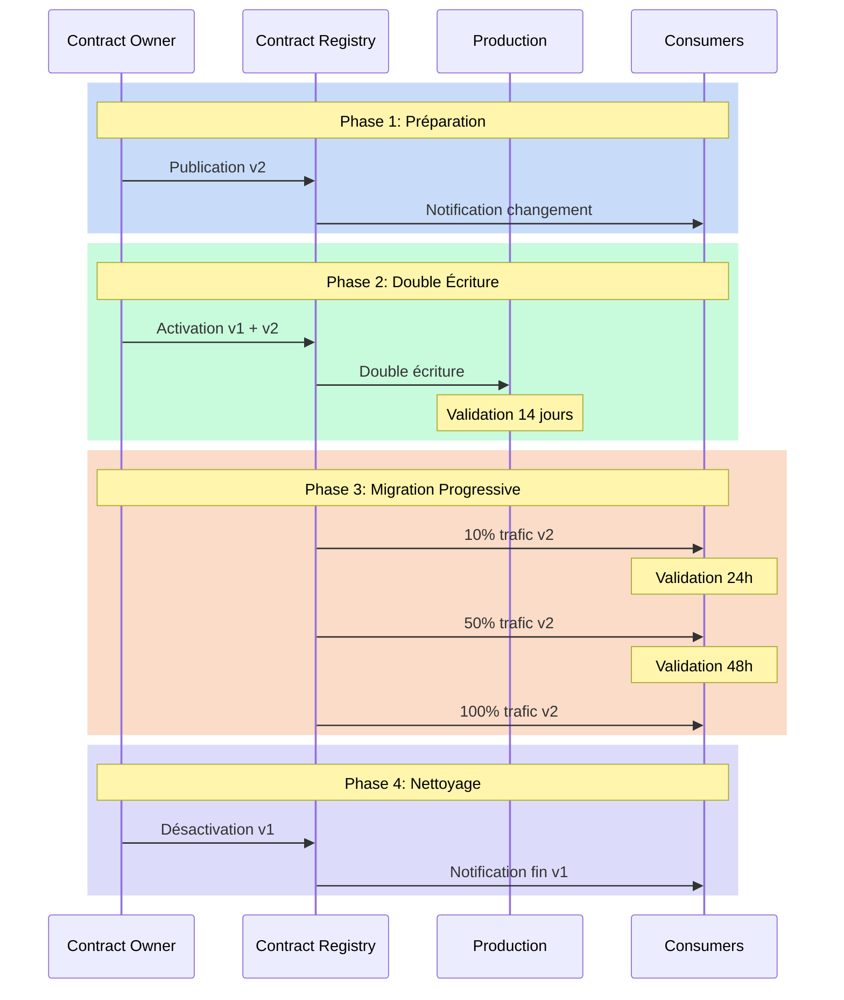

# Versioning : Gérer l'Évolution sans la Révolution

"Comment modifier ce champ sans casser les applications existantes ?" Cette question, posée lors d'un comité d'architecture, illustre parfaitement le défi du versioning des data contracts. L'évolution est inévitable, mais elle ne doit pas se transformer en révolution. Le versioning des data contracts représente un défi crucial dans la gestion des données modernes, où le changement est constant mais doit être maîtrisé pour éviter les perturbations.

## La Nécessité du Changement Contrôlé

Le changement dans les structures de données est une constante dans nos systèmes. Les besoins évoluent, les modèles s'affinent, les exigences se transforment. Cependant, chaque modification d'un data contract peut avoir des répercussions en cascade sur l'ensemble du système d'information. La gestion du versioning devient donc un exercice d'équilibriste entre la nécessité d'évolution et le maintien de la stabilité.

L'approche du versioning des data contracts s'articule autour de trois principes fondamentaux. Le premier est la prévisibilité : tout changement doit être anticipé et communiqué. Le second est la compatibilité : les modifications doivent, dans la mesure du possible, préserver le fonctionnement des systèmes existants. Le troisième est la traçabilité : chaque évolution doit être documentée et justifiée.

## Les Dimensions du Changement

La typologie des changements dans un data contract peut être analysée selon plusieurs dimensions. La dimension technique concerne la nature même des modifications : ajouts, suppressions ou modifications de champs. La dimension fonctionnelle s'intéresse à l'impact business des changements. La dimension temporelle, enfin, définit le rythme et la progressivité des évolutions.



## Stratégies de Versioning

La stratégie de versioning d'un data contract doit être pensée dès sa conception. Elle s'appuie sur un système de versioning sémantique adapté aux spécificités des contrats de données. Les changements mineurs, comme l'ajout de champs optionnels, n'incrémentent que le numéro de révision. Les modifications majeures, qui peuvent impacter les consommateurs, nécessitent une nouvelle version majeure et un plan de migration.

Voici un exemple de contrat qui illustre cette approche :

```yaml
# Version 1.0.0
odcs_version: "1.0.0"
id: "order_events"
version: "1.0.0"
changelog:
  - version: "1.0.0"
    date: "2023-01-01"
    changes:
      - type: "initial"
        description: "Version initiale du contrat"

interface:
  type: "stream"
  spec:
    schema:
      fields:
        - name: "order_id"
          type: "string"
        - name: "amount"
          type: "decimal"

# Version 2.0.0 (Changement Majeur)
---
version: "2.0.0"
changelog:
  - version: "2.0.0"
    date: "2023-06-01"
    changes:
      - type: "breaking"
        description: "Restructuration du montant en devise"
        migration_guide: "docs/migrations/v2.0.0.md"

interface:
  type: "stream"
  spec:
    schema:
      fields:
        - name: "order_id"
          type: "string"
        - name: "amount"
          type: "struct"
          fields:
            - name: "value"
              type: "decimal"
            - name: "currency"
              type: "string"
```

## La Migration comme Processus

La migration vers une nouvelle version de contrat n'est pas un événement ponctuel mais un processus qui s'étend dans le temps. Ce processus commence par une phase de préparation où la nouvelle version est conçue et validée. Suit une période de coexistence où les anciennes et nouvelles versions fonctionnent en parallèle. Cette phase permet aux consommateurs de migrer à leur rythme tout en garantissant la continuité du service.

La gestion du timing est cruciale dans ce processus. Un changement trop rapide peut déstabiliser l'écosystème, tandis qu'une transition trop lente peut complexifier la maintenance. Le rythme idéal dépend de multiples facteurs : la nature du changement, le nombre de consommateurs, la criticité du système.

## Conclusion

Le versioning des data contracts est un art qui demande rigueur et pragmatisme. Il ne s'agit pas simplement de gérer des numéros de version, mais de orchestrer l'évolution d'un écosystème complexe. La réussite repose sur une approche méthodique qui combine clarté des processus, communication proactive et outils adaptés.

Dans le prochain article, nous explorerons les patterns d'architecture qui permettent de mettre en œuvre ces principes de versioning de manière efficace et scalable.