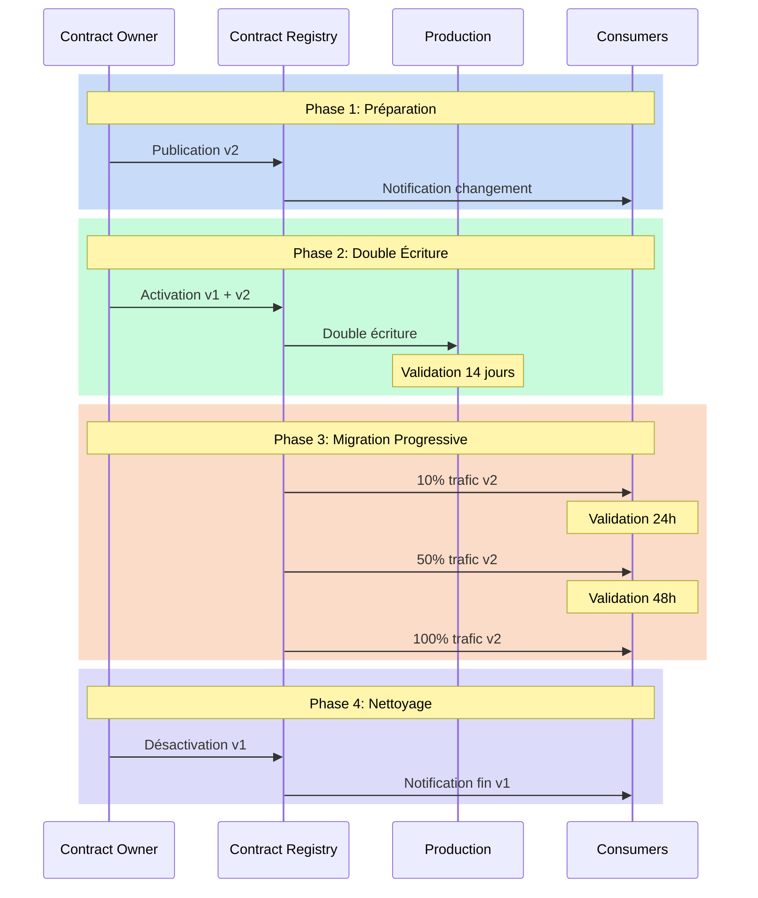
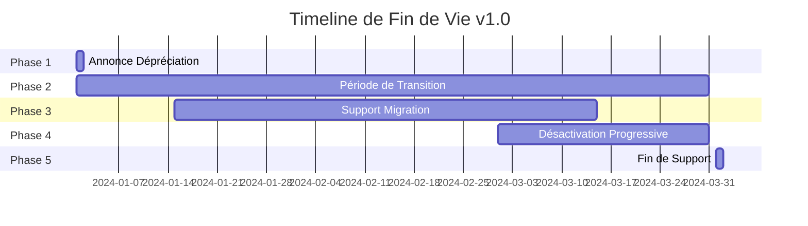

# Versioning : gérer l'évolution sans la révolution

"Comment modifier ce champ sans casser les applications existantes ?" Cette question, posée lors d'un comité d'architecture, illustre parfaitement le défi du versioning des data contracts. L'évolution est inévitable, mais elle ne doit pas se transformer en révolution. Le versioning des data contracts représente un défi crucial dans la gestion des données modernes, où le changement est constant mais doit être maîtrisé pour éviter les perturbations.

## La nécessité du changement contrôlé

Le changement dans les structures de données est une constante dans nos systèmes. Les besoins évoluent, les modèles s'affinent, les exigences se transforment. Cependant, chaque modification d'un data contract peut avoir des répercussions en cascade sur l'ensemble du système d'information. La gestion du versioning devient donc un exercice d'équilibriste entre la nécessité d'évolution et le maintien de la stabilité.

L'approche du versioning des data contracts s'articule autour de trois principes fondamentaux. Le premier est la prévisibilité : tout changement doit être anticipé et communiqué. Le second est la compatibilité : les modifications doivent, dans la mesure du possible, préserver le fonctionnement des systèmes existants. Le troisième est la traçabilité : chaque évolution doit être documentée et justifiée.

## Les dimensions du changement

La typologie des changements dans un data contract peut être analysée selon plusieurs dimensions. 
- La dimension technique concerne la nature même des modifications : ajouts, suppressions ou modifications de champs. 
- La dimension fonctionnelle s'intéresse à l'impact business des changements. 
- La dimension temporelle, enfin, définit le rythme et la progressivité des évolutions.



## Stratégies de versioning

La stratégie de versioning d'un data contract doit être pensée dès sa conception. Elle s'appuie sur un système de versioning sémantique adapté aux spécificités des contrats de données. Les changements mineurs, comme l'ajout de champs optionnels, n'incrémentent que le numéro de révision. Les modifications majeures, qui peuvent impacter les consommateurs, nécessitent une nouvelle version majeure et un plan de migration.

Voici un exemple de contrat qui illustre cette approche :

```yaml
apiVersion: v3.0.0
kind: DataContract
id: urn:datacontract:sales:transactions
domain: sales-domain
tenant: SalesOps
name: Transactions de Vente
version: 2.0.0
status: active

description:
  purpose: "Suivre et gérer les données de transactions de vente"
  usage: "Analyse des ventes et reporting"
  limitations: "Contient des données financières sensibles"
  dataGranularityDescription: "Un enregistrement par transaction de vente"
  changelog:
    - version: "2.0.0"
      date: "2024-03-15"
      changes:
        - type: breaking
          description: "Ajout du champ payment_method obligatoire"
    - version: "1.1.0"
      date: "2024-02-01"
      changes:
        - type: feature
          description: "Ajout du champ discount_code optionnel"
    - version: "1.0.0"
      date: "2024-01-01"
      changes:
        - type: initial
          description: "Version initiale"

schema:
  - name: SalesTransaction
    physicalName: sales_transactions
    physicalType: table
    description: "Enregistrements des transactions de vente"
    tags: ["ventes", "transactions", "financier"]
    properties:
      - name: transaction_id
        logicalType: string
        physicalType: text
        description: "Identifiant unique de transaction"
        isNullable: false
        isUnique: true
        criticalDataElement: true
        examples: ["VENTE-001", "VENTE-002"]
      - name: payment_method
        logicalType: string
        physicalType: text
        description: "Méthode de paiement utilisée"
        isNullable: false
        addedInVersion: "2.0.0"
        allowedValues: ["CREDIT", "DEBIT", "ESPECES"]
        examples: ["CREDIT"]
      - name: discount_code
        logicalType: string
        physicalType: text
        description: "Code de réduction appliqué"
        isNullable: true
        addedInVersion: "1.1.0"
        examples: ["ETE2024"]

quality:
  - rule: uniqueTransactionId
    description: "Les IDs de transaction doivent être uniques"
    dimension: uniqueness
    severity: error
    businessImpact: critical
  - rule: validPaymentMethod
    description: "La méthode de paiement doit être une des valeurs autorisées"
    dimension: validity
    severity: error
    businessImpact: operational

team:
  - username: klee
    role: Data Product Owner
    dateIn: "2024-01-01"
  - username: pjones
    role: Data Steward
    dateIn: "2024-01-01"

support:
  - channel: "#sales-data-help"
    tool: slack
    url: https://company.slack.com/sales-data-help
  - channel: sales-data@company.com
    tool: email
    url: mailto:sales-data@company.com

servers:
  - server: prod
    type: postgresql
    format: sql
    url: postgresql://sales-db.prod.company.com:5432/sales
    description: "Base de données des ventes en production"

slaProperties:
  - property: latency
    value: 5
    unit: m
  - property: retention
    value: 10
    unit: y
  - property: frequency
    value: 1
    unit: m

tags:
  - ventes
  - transactions
  - financier

customProperties:
  - property: dataDomain
    value: sales
  - property: criticality
    value: high
  - property: financialData
    value: true
```

## La migration comme processus

La migration vers une nouvelle version de contrat n'est pas un événement ponctuel mais un processus qui s'étend dans le temps. Ce processus commence par une phase de préparation où la nouvelle version est conçue et validée. Suit une période de coexistence où les anciennes et nouvelles versions fonctionnent en parallèle. Cette phase permet aux consommateurs de migrer à leur rythme tout en garantissant la continuité du service.

La gestion du timing est cruciale dans ce processus. Un changement trop rapide peut déstabiliser l'écosystème, tandis qu'une transition trop lente peut complexifier la maintenance. Le rythme idéal dépend de multiples facteurs : la nature du changement, le nombre de consommateurs, la criticité du système.

## Gérer la fin de vie

La fin de vie d'une version de contrat est aussi importante que son introduction. Une version ne peut pas être simplement "éteinte" - elle doit être progressivement mise hors service selon un processus structuré :

1. **Annonce de dépréciation** : Communication claire aux consommateurs avec un calendrier précis
2. **Période de transition** : Typiquement 3 à 6 mois où la version est marquée comme dépréciée mais toujours fonctionnelle
3. **Monitoring d'usage** : Suivi actif des consommateurs encore sur l'ancienne version
4. **Support à la migration** : Aide aux équipes retardataires pour migrer vers la nouvelle version
5. **Désactivation progressive** : Réduction graduelle du support jusqu'à l'arrêt complet

Voici un exemple de timeline de fin de vie :



Cette approche structurée de la fin de vie permet de :
- Éviter les surprises et les interruptions de service
- Donner suffisamment de temps aux équipes pour s'adapter
- Maintenir la confiance des consommateurs dans le système
- Réduire les risques opérationnels
- Optimiser les coûts de maintenance

## Conclusion

Le versioning des data contracts est un art qui demande rigueur et pragmatisme. Il ne s'agit pas simplement de gérer des numéros de version, mais de orchestrer l'évolution d'un écosystème complexe. La réussite repose sur une approche méthodique qui combine clarté des processus, communication proactive et outils adaptés.

Un aspect crucial que nous n'avons pas encore abordé est la gestion des abonnements aux contrats. Comment s'assurer que tous les consommateurs sont correctement notifiés des changements de version et des fins de vie ? Nous explorerons ce mécanisme d'abonnement dans notre article sur les patterns d'architecture, où nous verrons comment le pattern "Contract Registry" permet de gérer efficacement cette communication.

Dans le prochain article, nous explorerons les patterns d'architecture qui permettent de mettre en œuvre ces principes de versioning de manière efficace et scalable.