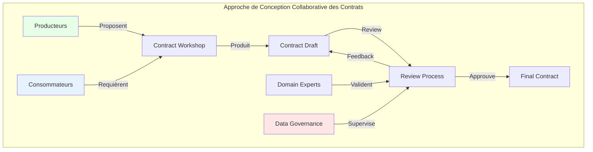

# Architecture de construction des data contracts : de la conception au déploiement

Quand on parle de data contracts, on s'attarde souvent sur leur fonctionnement en production - comment ils régulent les échanges de données, comment ils s'intègrent dans le système d'information. Mais il y a une histoire qui se joue bien avant : celle de leur création. J'ai constaté au fil de mes accompagnements que cette phase cruciale de construction reste dans l'ombre, alors qu'elle façonne l'avenir de toute l'infrastructure data.

C'est un peu comme si on admirait un bâtiment pour son architecture sans jamais parler du chantier qui l'a vu naître. Pourtant, c'est pendant la construction que se prennent les décisions qui feront la solidité et la pérennité de l'ensemble. Dans cet article, je vous invite à explorer les coulisses de la création des data contracts, à découvrir les méthodes qui transforment une simple idée en un contrat robuste, depuis sa conception jusqu'à son premier déploiement.

## L'approche de Conception Collaborative des Contrats

Au cœur de la construction des data contracts se trouve l'approche de Conception Collaborative des Contrats. Cette méthode répond à une problématique fondamentale : comment concevoir des contrats qui répondent aux besoins de toutes les parties prenantes ? 



Cette approche repose sur cinq principes fondamentaux :

1. **Participation multi-disciplinaire**  
   Il ne s'agit pas simplement de réunir les équipes techniques. Un data contract efficace nécessite la participation active de plusieurs profils complémentaires :
   - Les **producteurs de données** apportent leur connaissance des systèmes sources, des contraintes techniques et des possibilités d'extraction
   - Les **consommateurs** expriment leurs besoins, cas d'usage et exigences de qualité
   - Les **experts métier** garantissent que le contrat reflète fidèlement la réalité business et la sémantique du domaine _---> Les experts métiers c le data producer non ?_
   - La **gouvernance data** assure l'alignement avec les politiques de l'entreprise, la sécurité et la conformité réglementaire
   
   J'ai observé que l'absence d'un seul de ces profils peut conduire à des contrats déséquilibrés, soit trop techniques et déconnectés des besoins réels, soit irréalistes en termes d'implémentation.

2. **Itération rapide**  
   Contrairement à l'approche "big design upfront", la conception collaborative privilégie des cycles courts et itératifs :
   - Commencer avec une version minimaliste du contrat qui répond aux besoins essentiels
   - Recueillir les retours rapidement, avant de s'engager dans des développements coûteux
   - Ajuster et enrichir le contrat progressivement
   - Valider chaque itération avec toutes les parties prenantes
   
   Cette approche réduit considérablement le risque de passer des semaines à concevoir un contrat qui s'avère finalement inadapté. Dans ma pratique, je recommande des itérations de 1 à 2 semaines maximum, avec des points de synchronisation fréquents.

3. **Documentation contextuelle**  
   Au-delà de la structure des données, le contrat doit capturer le "pourquoi" derrière chaque décision :
   - Documenter les alternatives envisagées et les raisons des choix effectués
   - Expliciter les compromis acceptés (par exemple entre performance et exhaustivité)
   - Enregistrer les discussions clés qui ont mené aux décisions
   - Référencer les contraintes business ou techniques qui ont influencé la conception
   
   Cette documentation contextuelle se révèle inestimable lorsque de nouveaux membres rejoignent l'équipe ou quand il faut revisiter le contrat des mois plus tard. Elle transforme le contrat d'un simple document technique en un référentiel de connaissances partagées.

4. **Validation pilotée par les tests**  
   Le contrat n'est pas qu'une description - c'est une promesse qui doit être vérifiable :
   - Définir des tests qui valident la conformité au contrat avant même son implémentation
   - Créer des jeux de données d'exemple qui illustrent les cas d'usage typiques et extrêmes
   - Automatiser la vérification de conformité pour permettre l'intégration continue
   - Inclure des tests négatifs qui démontrent clairement ce qui n'est pas acceptable
   
   Cette approche, inspirée du TDD (Test-Driven Development), permet de clarifier les attentes et d'éviter les mauvaises interprétations. Les tests deviennent la définition exécutable du contrat, complémentaire à sa description formelle.

5. **Approche Domain-Driven**  
   Le contrat doit parler le langage du métier, pas celui des systèmes sous-jacents :
   - Utiliser la terminologie du domaine métier, pas le jargon technique (c'est beaucoup trop souvent le cas et on se retrouve avec des contrats qui ne sont pas lisibles par les non-techniques)
   - Structurer les données selon la vision métier, même si cela nécessite une transformation depuis les systèmes sources (et c'est un vrai sujet, car les sources vont souvent refuser de s'adapter à la vision métier)
   - Inclure les règles métier et contraintes qui donnent sens aux données
   - Éviter de laisser transparaître les spécificités des systèmes techniques sous-jacents
   
   Cette approche, inspirée du Domain-Driven Design, garantit que le contrat reste pertinent même si les technologies sous-jacentes évoluent. Elle crée un langage commun entre les équipes techniques et métier, réduisant considérablement les malentendus.

### Le processus de Conception Collaborative des Contrats

Le processus typique comprend les étapes suivantes :

1. **Workshop initial** : Session collaborative où producteurs et consommateurs définissent leurs besoins
2. **Création du draft** : Élaboration d'une première version du contrat
3. **Discovery Technico-Fonctionnelle** : Validation des requirements business définis + Faisabilité technique
4. **Review métier** : Validation par les experts domaine ---> _Pareil - à mon sens c'est porté par le data producer normalement. Derriere le mot métier tu mets quoi ?_
5. **Review de gouvernance** : Vérification de la conformité aux standards et politiques
6. **Review de la sécurité** : Vérification de l'architecture technique sur le prisme orienté sécurité
7. **Finalisation** : Consolidation des feedbacks et validation finale

L'un des avantages clés de cette méthode est qu'elle permet d'identifier très tôt les incompatibilités et les challenges d'implémentation, réduisant ainsi les coûts de correction ultérieurs.

## Guide pratique : Créer un data contract de A à Z

Assez de théorie ! Voyons concrètement comment créer un data contract, pas à pas, depuis sa conception jusqu'à son déploiement. Je vais vous guider à travers le processus complet avec un exemple que vous pourrez adapter à votre contexte.

### Étape 1 : Initialiser votre premier data contract

Commençons par créer un contrat simple. Voici comment procéder :

1. **Créez un dépôt dédié** dans votre système de gestion de version (GitHub, GitLab, etc.) _**--> Est ce que cette approche n'est pas contradictoire avec le point 5 --> Approche Domain Driven ? Un contrat souvent est initié par le producteur avec un profil plutôt produit que technique**_
On pourrait dire écrire: 1. Création de la première version du contract par le domain producteur de la donnée. 
Pour des raisons de lisibilité, nous formaliserons le contrat en yaml.

2. **Initialisez un fichier de data contract** à la racine, par exemple `customer_profile.datacontract.yaml` :

```yaml
# customer_profile.datacontract.yaml
dataContractSpecification: 0.9.2
id: customer_profile
info:
  title: Profil Client
  version: 0.1.0
  description: >
    Contrat de données pour les profils clients,
    utilisé par l'équipe marketing pour l'analyse comportementale.
  owner: equipe-donnees-client
  contact:
    name: Équipe Données Client
    url: https://wiki.example.com/data-team
    email: data-team@example.com
```

3. **Ajoutez les informations sur les parties prenantes** :

```yaml
# Suite du fichier customer_profile.datacontract.yaml
contractedService:
  provider:
    name: Système CRM
    team: Équipe CRM
    contact: alice@exemple.com
  consumer:
    - name: Application Marketing
      team: Équipe Marketing
      contact: bob@exemple.com
    - name: Tableau de bord Analytics
      team: Équipe Data
      contact: charlie@exemple.com
  termsOfService: https://wiki.example.com/terms-of-service
```

4. **Commitez ces premiers éléments** dans votre dépôt avec un message explicite :

```bash
git add customer_profile.datacontract.yaml
git commit -m "Initial: création du contrat de données profil client"
git push
```

### Étape 2 : Définir la structure des données

Maintenant, ajoutons la structure de données au contrat. C'est l'étape où vous définissez concrètement ce qui sera échangé :

1. **Ajoutez la section models** qui décrit la structure des données :

```yaml
# Suite du fichier customer_profile.datacontract.yaml
models:
  Customer:
    description: Informations d'un client
    type: object
    required:
      - customer_id
      - first_name
      - last_name
      - email
    properties:
      customer_id:
        type: string
        description: Identifiant unique du client
        pattern: "^CUS[0-9]{6}$"
        example: "CUS123456"
      
      first_name:
        type: string
        description: Prénom du client
        maxLength: 50
        example: "Marie"
      
      last_name:
        type: string
        description: Nom de famille du client
        maxLength: 50
        example: "Dupont"
      
      email:
        type: string
        format: email
        description: Adresse email du client
        example: "marie.dupont@exemple.com"
      
      phone:
        type: string
        description: Numéro de téléphone (format international)
        pattern: "^\\+[0-9]{1,3} [0-9 ]{5,15}$"
        example: "+33 6 12 34 56 78"
```

2. **Définissez les interfaces d'accès aux données** :

```yaml
# Suite du fichier customer_profile.datacontract.yaml
interfaces:
  customerProfile:
    description: Interface pour accéder aux profils clients
    serving:
      server: https://api.exemple.com
      security:
        - type: oauth2
          description: Authentification OAuth2 requise
      endpoints:
        getCustomerProfile:
          path: /customers/{customerId}
          method: GET
          description: Récupérer le profil d'un client spécifique
          parameters:
            - name: customerId
              in: path
              required: true
              schema:
                type: string
                pattern: "^CUS[0-9]{6}$"
              description: Identifiant unique du client
          response:
            type: object
            $ref: "#/models/Customer"
```

3. **Ajoutez les règles métier** importantes qui ne sont pas capturées par le schéma :

```yaml
# Suite du fichier customer_profile.datacontract.yaml
quality:
  rules:
    - name: email_verification
      description: L'adresse email doit être vérifiée avant d'être incluse dans le contrat
      rationale: Éviter la propagation d'adresses invalides dans les systèmes
    
    - name: minor_identification
      description: Les clients mineurs (-18 ans) doivent être identifiés avec un flag spécifique
      rationale: Obligations légales RGPD spécifiques aux mineurs
```

4. **Commitez ces ajouts** avec un message descriptif :

```bash
git commit -am "Ajout: structure des données du profil client"
```

### Étape 3 : Définir les exemples et les tests

Les exemples et tests sont essentiels pour clarifier l'usage du contrat :

1. **Ajoutez des exemples complets** :

```yaml
# Suite du fichier customer_profile.datacontract.yaml
examples:
  - name: client_standard
    description: Exemple d'un client standard avec toutes les informations
    interface: customerProfile
    endpoint: getCustomerProfile
    parameters:
      customerId: "CUS123456"
    response:
      customer_id: "CUS123456"
      first_name: "Marie"
      last_name: "Dupont"
      email: "marie.dupont@exemple.com"
      phone: "+33 6 12 34 56 78"
      
  - name: client_minimal
    description: Exemple avec uniquement les champs obligatoires
    interface: customerProfile
    endpoint: getCustomerProfile
    parameters:
      customerId: "CUS654321"
    response:
      customer_id: "CUS654321"
      first_name: "Jean"
      last_name: "Martin"
      email: "jean.martin@exemple.com"
```

2. **Configurez les aspects de qualité et test** :

```yaml
# Suite du fichier customer_profile.datacontract.yaml
quality:
  tests:
    - name: validation_id_client
      description: Vérifie que l'ID client respecte le format attendu
      test:
        interface: customerProfile
        endpoint: getCustomerProfile
        parameters:
          customerId: "CUS123456"
        assertions:
          - jsonPath: "$.customer_id"
            expected: "CUS123456"
    
    - name: validation_email_format
      description: Vérifie que l'email est au bon format
      test:
        interface: customerProfile
        endpoint: getCustomerProfile
        parameters:
          customerId: "CUS123456"
        assertions:
          - jsonPath: "$.email"
            matchesRegex: "^[a-zA-Z0-9._%+-]+@[a-zA-Z0-9.-]+\\.[a-zA-Z]{2,}$"
```

3. **Commitez ces ajouts** :

```bash
git commit -am "Ajout: exemples et tests de validation"
```

### Étape 4 : Documenter les aspects techniques

Pour faciliter l'adoption, documentez les aspects d'implémentation :

1. **Spécifiez les détails d'accès et de SLA** :

```yaml
# Suite du fichier customer_profile.datacontract.yaml
slo:
  availability:
    description: Disponibilité de l'API Customer Profile
    target: 99.9%
    period: 30d
    
  latency:
    description: Temps de réponse pour les requêtes d'API
    target: 200ms
    period: 30d
    percentile: 95
    
  errorRate:
    description: Taux d'erreur maximum 
    target: 0.1%
    period: 30d
```

2. **Documentez les codes d'erreur** :

```yaml
# Suite du fichier customer_profile.datacontract.yaml
interfaces:
  customerProfile:
    # ... [contenu existant] ...
    errors:
      - status: 404
        description: Client non trouvé
        resolution: "Vérifier l'identifiant client"
        
      - status: 403
        description: Accès non autorisé
        resolution: "Vérifier les droits d'accès et l'authentification"
```

3. **Commitez ces précisions techniques** :

```bash
git commit -am "Ajout: détails techniques et SLA"
```

### Étape 5 : Établir la stratégie de versionnement

La norme ODCS intègre le versionnement dans ses métadonnées. Complétez la section `info` :

```yaml
# Mise à jour de la section info
info:
  title: Profil Client
  version: 0.1.0
  description: >
    Contrat de données pour les profils clients,
    utilisé par l'équipe marketing pour l'analyse comportementale.
  versioningPolicy:
    compatibleChanges:
      - "Ajout de champs optionnels"
      - "Extension d'énumérations"
      - "Assouplissement de contraintes"
    breakingChanges:
      - "Suppression de champs"
      - "Renommage de champs"
      - "Modification du type de données"
      - "Ajout de champs obligatoires"
  deprecationPolicy:
    deprecationNotice: "3 mois"
    supportPeriod: "6 mois après dépréciation"
```

### Étape 6 : Valider les données et publier votre contrat

Cette étape cruciale garantit que votre contrat est à la fois techniquement correct et utilisable par les différentes parties prenantes.

#### 6.1 L'outil datacontract-cli

Pour travailler efficacement avec les data contracts, l'outil de référence est `datacontract-cli`. C'est un outil en ligne de commande open-source qui offre de nombreuses fonctionnalités pour valider, tester, générer et publier vos data contracts. _**--> tu as même une API maintenant héhé https://cli.datacontract.com/API**_

Commençons par l'installer :

```bash
# Installation via pip
pip install 'datacontract-cli[all]'

# Vérifiez l'installation
datacontract --version
```

Voici les principales commandes disponibles :

| Commande | Description | Exemple d'utilisation |
|----------|-------------|----------------------|
| `init` | Crée un nouveau data contract à partir d'un modèle | `datacontract init datacontract.yaml` |
| `lint` | Valide la syntaxe et la structure du data contract | `datacontract lint datacontract.yaml` |
| `test` | Exécute des tests de schéma et de qualité sur les serveurs configurés | `datacontract test --server production datacontract.yaml` |
| `export` | Convertit le data contract vers différents formats (SQL, HTML, JSON Schema, etc.) | `datacontract export --format html --output doc.html datacontract.yaml` |
| `import` | Crée un data contract à partir d'une source existante (SQL, Avro, etc.) | `datacontract import --format sql --source schema.sql --dialect postgres` |
| `diff` | Affiche les différences entre deux versions de data contracts | `datacontract diff v1.yaml v2.yaml` |
| `breaking` | Identifie les changements qui cassent la compatibilité | `datacontract breaking v1.yaml v2.yaml` |
| `changelog` | Génère un journal des modifications entre deux versions | `datacontract changelog v1.yaml v2.yaml` |
| `publish` | Publie le data contract dans un registre | `datacontract publish datacontract.yaml --registry https://registry.exemple.com` |
| `catalog` | Crée un catalogue HTML de data contracts | `datacontract catalog --files "*.yaml" --output "./catalog"` |
| `api` | Démarre un serveur web avec une API REST pour interagir avec datacontract-cli | `datacontract api --port 4242` |

#### 6.2 Utiliser GitHub Actions pour la validation et publication

GitHub Actions offre une solution accessible pour automatiser le cycle de vie de vos data contracts. Créez un fichier `.github/workflows/validate-datacontract.yml` dans votre dépôt :

```yaml
name: Validate Data Contract

on:
  push:
    paths:
      - '*.datacontract.yaml'
  pull_request:
    paths:
      - '*.datacontract.yaml'

jobs:
  validate:
    runs-on: ubuntu-latest
    steps:
      - uses: actions/checkout@v3
      - name: Set up Python
        uses: actions/setup-python@v4
        with:
          python-version: '3.11'
      - name: Install dependencies
        run: pip install datacontract-cli
      - name: Validate contract
        run: datacontract lint *.datacontract.yaml
      - name: Run tests
        run: datacontract test *.datacontract.yaml
      
  publish:
    needs: validate
    if: github.ref == 'refs/heads/main' && github.event_name == 'push'
    runs-on: ubuntu-latest
    steps:
      - uses: actions/checkout@v3
      - name: Set up Python
        uses: actions/setup-python@v4
        with:
          python-version: '3.11'
      - name: Install dependencies
        run: pip install datacontract-cli
      - name: Publish contract
        run: |
          datacontract publish *.datacontract.yaml \
            --registry ${{ secrets.REGISTRY_URL }} \
            --token ${{ secrets.REGISTRY_TOKEN }}
```

Cette configuration GitHub Actions permet d'automatiser :
- La validation syntaxique du contrat à chaque modification
- L'exécution des tests définis dans le contrat
- La publication du contrat dans un registre central après validation

#### 6.3 Développer des outils de validation pour vos consommateurs

Fournissez à vos consommateurs des outils qui leur permettent de valider facilement les données contre votre contrat :

```python
# validation_lib.py - à partager avec vos équipes
import json
import jsonschema
import requests
import subprocess

def extract_schema(contract_path, model_name):
    """Extrait le schéma JSON d'un modèle depuis un contrat ODCS"""
    result = subprocess.run(
        ["datacontract", "schema-extract", contract_path, "--model", model_name],
        capture_output=True, text=True
    )
    return json.loads(result.stdout)

def validate_data(data, schema):
    """Valide des données contre un schéma"""
    try:
        jsonschema.validate(instance=data, schema=schema)
        return True, None
    except jsonschema.exceptions.ValidationError as e:
        return False, str(e)

def fetch_and_validate(api_url, contract_path, model_name, auth_token=None):
    """Récupère les données depuis une API et les valide"""
    headers = {"Authorization": f"Bearer {auth_token}"} if auth_token else {}
    response = requests.get(api_url, headers=headers)
    data = response.json()
    schema = extract_schema(contract_path, model_name)
    return validate_data(data, schema)
```

#### 6.4 Préparez votre contrat pour la publication

Avant de publier officiellement votre contrat, assurez-vous que :
- Toutes les erreurs de validation ont été corrigées (`datacontract lint`)
- Les tests passent avec succès (`datacontract test`)
- Les exemples sont corrects et fonctionnels
- La documentation est complète et claire

Puis, publiez votre contrat avec un versionnement explicite :

```bash
# Créez un tag Git pour la version
git tag -a v0.1.0 -m "Première version du contrat profil client"
git push --tags

# Publiez dans votre registre de contrats
datacontract publish customer_profile.datacontract.yaml \
  --registry https://registry.exemple.com \
  --token $REGISTRY_TOKEN
```


### Étape 7 : Favoriser l'adoption

Pour maximiser l'adoption des data contracts, concentrez-vous sur ces actions clés :

1. **Documentation pratique** - Créez un guide d'utilisation clair avec des exemples concrets :
   ```markdown
   # Guide d'utilisation du contrat Profil Client
   
   ## Accès à l'API
   Demandez vos credentials à l'équipe CRM via le portail self-service.
   
   ## Exemple de requête
   curl -X GET "https://api.exemple.com/customers/CUS123456" -H "Authorization: Bearer TOKEN"
   ```

2. **Ressources développeurs** - Fournissez des exemples de code dans les langages utilisés par vos équipes

3. **Canaux de support** - Mettez en place un canal Slack dédié et des permanences régulières

4. **Boucle de feedback** - Implémentez des métriques simples pour suivre l'utilisation et recueillir des idées d'amélioration

5. **Partage de connaissances** - Organisez des ateliers ciblés et créez des vidéos de démonstration

En gardant le support pratique et ciblé, vous transformerez votre data contract d'une simple documentation en une partie intégrante de vos opérations de données.


## Le registre de contrats : un élément essentiel

Un registre de contrats est un composant fondamental de votre infrastructure data. Il n'est pas simplement un "nice to have" mais un **élément essentiel** pour industrialiser et gouverner vos data contracts.

### Pourquoi un registre est indispensable

Le registre de contrats remplit plusieurs fonctions critiques :

1. **Source unique de vérité** : Il centralise tous vos contrats dans un emplacement officiel
2. **Découvrabilité** : Il permet aux équipes de trouver facilement les contrats disponibles
3. **Gouvernance** : Il facilite l'application des politiques et standards
4. **Traçabilité** : Il garde l'historique des changements et des versions
5. **Automatisation** : Il s'intègre dans vos pipelines pour la validation et la génération d'artifacts

Sans registre, vous vous retrouverez rapidement avec des contrats éparpillés, des versions contradictoires et une confusion générale quant à ce qui est officiel.

### La progression logique: de GitHub Actions au registre centralisé

1. **Niveau débutant: GitHub Actions + Git**
   - Utiliser GitHub Actions pour valider et publier les contrats
   - Stocker les contrats dans des dépôts Git
   - **Avantages**: Facilité de mise en place, pas d'infrastructure supplémentaire
   - **Limites**: Dispersion des contrats, absence de vue d'ensemble, gouvernance manuelle

2. **Niveau intermédiaire: GitHub Actions + Registre central**
   - Continuer à utiliser GitHub Actions pour la CI/CD
   - Publier systématiquement les contrats validés dans un registre central
   - **Avantages**: Vue centralisée tout en préservant les workflows existants
   - **Exemple de configuration**:
   ```yaml
   # Publication vers un registre central depuis GitHub Actions
   - name: Publish to central registry
     run: |
       datacontract publish *.datacontract.yaml \
         --registry https://registry.exemple.com \
         --metadata '{"source_repo": "${{ github.repository }}", "commit": "${{ github.sha }}"}'
   ```

3. **Niveau avancé: Plateforme intégrée de gestion des contrats**
   - Utiliser une plateforme spécialisée qui gère tout le cycle de vie
   - Intégrer la validation, publication, visualisation et gouvernance
   - **Avantages**: Workflow optimisé, moins de friction, meilleure adoption
   - **Fonctionnalités clés**: Recherche avancée, dépendances entre contrats, alertes d'impact, métriques d'utilisation

### Types de registres : choisir la solution adaptée à votre maturité

Le choix d'un registre de contrats n'est pas anodin et doit correspondre à la maturité de votre organisation en matière de data contracts. Une solution trop complexe risque d'être sous-utilisée, tandis qu'une approche trop basique pourrait rapidement montrer ses limites face à un nombre croissant de contrats. Évaluez honnêtement votre niveau de maturité actuel et anticipez vos besoins à moyen terme avant de choisir parmi ces options :

1. **Solution basique** : Un dépôt Git dédié avec une structure documentée
   - **Avantages** : Facile à mettre en place, versionnement intégré
   - **Limites** : Faibles capacités de recherche, pas d'interface conviviale

2. **Solution intermédiaire** : Wiki d'entreprise ou portail documentaire
   - **Avantages** : Meilleure UX, intégration avec votre écosystème existant
   - **Limites** : Manque de fonctionnalités spécifiques aux contrats

3. **Solution avancée** : Outil spécialisé (DataHub, Amundsen, registre ODCS)
   - **Avantages** : Fonctionnalités riches, intégration automatisée, gouvernance avancée
   - **Limites** : Effort d'installation et maintenance plus important

### Fonctionnalités essentielles d'un bon registre de contrats

Quelle que soit la solution retenue, certaines fonctionnalités sont déterminantes pour garantir l'efficacité de votre registre à long terme. Ces capacités constituent le socle minimal que vous devriez exiger ou planifier de développer progressivement :

1. **Interface de recherche et de découverte**:
   - Recherche par métadonnées (propriétaire, domaine, version)
   - Visualisation des relations entre contrats
   - Statistiques d'utilisation et de santé des contrats

2. **Gestion des versions et compatibilité**:
   - Détection automatique des changements incompatibles
   - Alerte aux consommateurs en cas de mise à jour majeure
   - Conservation de l'historique complet des modifications

3. **Intégration avec votre écosystème**:
   - API pour l'automatisation et l'intégration
   - Hooks pour les notifications et l'exécution de workflows
   - Génération automatique d'artifacts (documentation, code client)

En définitive, le registre de contrats que vous choisirez devra évoluer avec votre organisation. Commencez peut-être avec une solution simple, mais gardez à l'esprit que l'investissement dans un registre robuste rapportera des dividendes considérables en termes de productivité des équipes et de qualité des données échangées. Le temps économisé en recherche de contrats, en résolution de malentendus et en réconciliation de versions divergentes justifiera amplement l'effort initial.

## Conclusion

La construction d'un data contract est un processus itératif qui repose sur la collaboration et l'évolution progressive. En suivant cette approche structurée, vous créerez des contrats qui seront à la fois pertinents pour le métier et techniquement solides.

Le chemin que nous avons parcouru ensemble, de la conception collaborative à la validation technique, en passant par le versionnement et la documentation, illustre la richesse de cette démarche. L'importance du registre de contrats, en tant que pierre angulaire de votre infrastructure, ne doit pas être sous-estimée.

N'oubliez pas que le contrat lui-même n'est qu'un moyen et non une fin - son objectif est de faciliter la compréhension mutuelle et d'assurer la qualité des échanges de données. Le véritable succès d'un data contract se mesure à sa capacité à améliorer la collaboration entre équipes et à garantir l'intégrité des données qui circulent dans votre organisation
