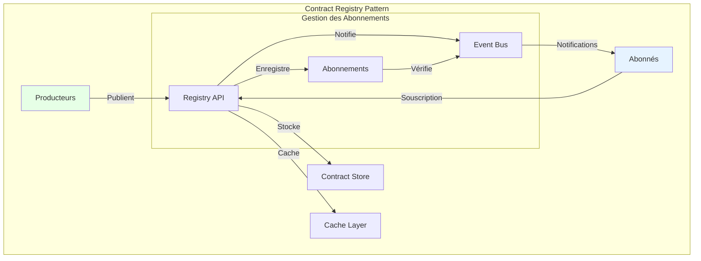
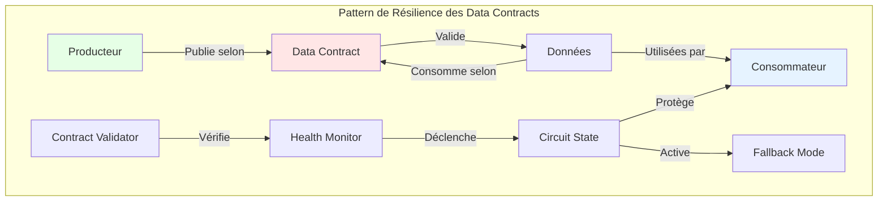
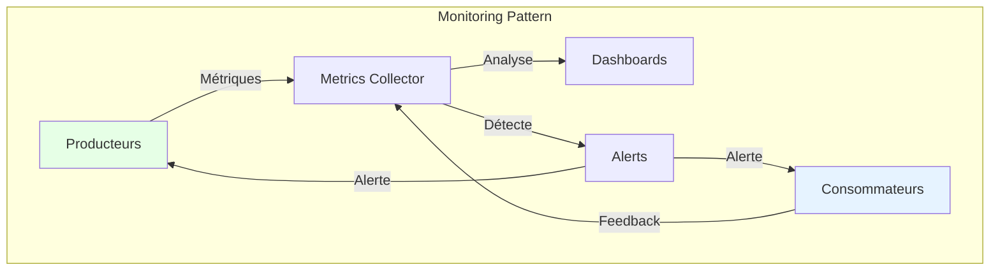
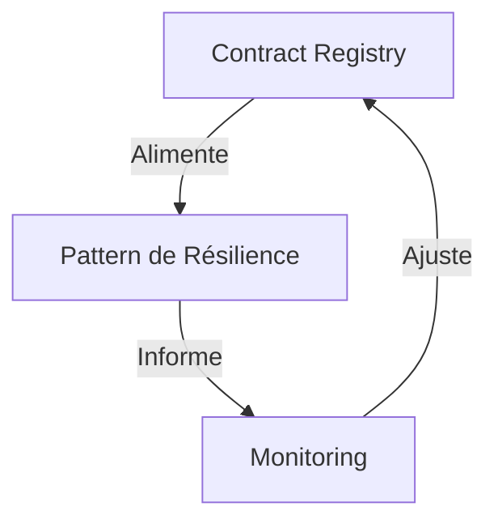

# Patterns d'architecture : les patterns qui marchent vraiment

"En théorie, il n'y a pas de différence entre la théorie et la pratique. En pratique, il y en a." 

Cette maxime prend tout son sens quand on parle de patterns d'architecture pour les data contracts. Les patterns architecturaux que nous allons explorer ne sont pas de simples abstractions théoriques, mais des modèles conceptuels qui structurent la façon dont les data contracts s'intègrent dans l'écosystème data d'une organisation.

## Le pattern contract registry

Au cœur de toute architecture de data contracts se trouve le pattern du Contract Registry. Ce pattern répond à une problématique fondamentale : comment centraliser et distribuer efficacement les contrats de données à travers l'organisation ? Le Registry agit comme une source unique de vérité, offrant un point d'accès centralisé tout en gérant la distribution et la mise à jour des contrats.



L'essence de ce pattern réside dans sa capacité à gérer le cycle de vie complet des contrats. Le Registry ne se contente pas de stocker passivement les contrats ; il orchestre activement leur distribution, leur validation et leur évolution. La couche de cache optimise les performances en réduisant la latence d'accès aux contrats fréquemment utilisés, tandis que le bus d'événements permet une communication asynchrone efficace entre les différents composants du système.

Le mécanisme d'abonnement est central dans ce pattern :
- Les consommateurs s'abonnent aux contrats qui les intéressent
- Le Registry maintient un registre des abonnements
- Toute modification d'un contrat (nouvelle version, dépréciation) déclenche une notification aux abonnés concernés
- Les producteurs peuvent consulter la liste des consommateurs de leurs contrats

## Le pattern de résilience des data contracts

Le pattern de résilience des data contracts s'inspire du célèbre pattern Circuit Breaker utilisé en développement logiciel, mais l'adapte spécifiquement au contexte des contrats de données. Son principe fondamental est d'éviter la propagation des défaillances liées aux violations de contrat en détectant et en isolant rapidement les problèmes.



Ce pattern opère à trois niveaux distincts, tous centrés sur le data contract :

1. **Détection des violations de contrat** : Surveillance continue de la conformité des données par rapport aux contrats établis (schéma, qualité, SLAs)
2. **Protection des consommateurs** : Isolation rapide des flux de données non conformes pour éviter la propagation des erreurs
3. **Adaptation contrôlée** : Mise en place de stratégies de dégradation gracieuse définies dans le contrat lui-même

### Le Circuit Breaker appliqué aux data contracts

Le Circuit Breaker dans ce contexte fonctionne comme suit :
- **État fermé** : Les données circulent normalement, conformément au contrat
- **État ouvert** : Lorsque trop de violations de contrat sont détectées, le circuit s'ouvre pour protéger les consommateurs
- **État semi-ouvert** : Après un délai, le système teste si les problèmes sont résolus avant de refermer complètement le circuit

Ce qui distingue ce pattern, c'est que les règles d'ouverture et de fermeture du circuit sont directement spécifiées dans le data contract, rendant le système auto-adaptatif.

### Le Fallback Mode comme stratégie de résilience

Le Fallback Mode est une stratégie complémentaire au Circuit Breaker. Lorsque le circuit est ouvert (indiquant des violations de contrat), au lieu d'échouer complètement, le système peut basculer vers un mode dégradé mais fonctionnel, également défini dans le contrat. Par exemple :

- Si les données temps réel ne respectent pas le contrat de fraîcheur, utiliser les dernières données valides en cache
- Si le schéma complet ne peut pas être validé, accepter un sous-ensemble minimal de champs critiques définis dans le contrat
- Si le producteur principal est indisponible, basculer vers une source de données secondaire spécifiée dans le contrat

Prenons un exemple concret dans le retail : le système de recommandation produits utilise normalement des données temps réel de navigation client, avec un contrat spécifiant la structure et la fraîcheur des données. Le contrat inclut également des règles de résilience :

```yaml
data_contract:
  name: "customer_behavior_data"
  schema: "full_customer_behavior.avsc"
  sla:
    freshness: "< 5min"
    completeness: "> 95%"
  
  # Règles de résilience intégrées au contrat
  resilience:
    circuit_breaker:
      open_when:
        - "schema_validation_errors > 5%"
        - "data_freshness > 30min"
      recovery:
        retry_after: "5min"
        max_retries: 3
    
    fallback_modes:
      - level: "primary"
        source: "real_time_navigation"
        schema: "full_customer_behavior"
      - level: "fallback"
        source: "sales_history"
        schema: "minimal_product_data"
        activation_conditions:
          - "real_time_data_latency > 30s"
          - "schema_validation_errors > 5%"
```

Cette approche intègre directement les stratégies de résilience dans le data contract lui-même, créant ainsi un système auto-adaptatif capable de maintenir un service, même dégradé, face aux défaillances.

## Le pattern de monitoring proactif

Le monitoring proactif va au-delà de la simple surveillance passive. Ce pattern intègre profondément l'observabilité dans l'architecture des data contracts, permettant non seulement de détecter les problèmes, mais aussi de les anticiper.



L'approche proactive du monitoring repose sur trois piliers fondamentaux. Le premier est la collecte continue de métriques pertinentes, allant de la conformité des données aux performances des systèmes. Le deuxième est l'analyse en temps réel de ces métriques pour détecter les tendances et anomalies. Le troisième est la capacité à déclencher des actions correctives automatiques lorsque certains seuils sont atteints.

## L'orchestration des patterns

La véritable puissance de ces patterns émerge de leur orchestration harmonieuse. Le Registry alimente le pattern de résilience en informations sur l'état des contrats, tandis que le monitoring fournit une vue d'ensemble de la santé du système. Cette synergie crée un système auto-régulé capable de maintenir sa stabilité face aux perturbations.



Cette orchestration permet une gestion dynamique des contrats de données, où chaque pattern joue un rôle spécifique dans le maintien de la qualité et de la fiabilité du système global.

## Conclusion

Les patterns architecturaux des data contracts ne sont pas de simples modèles théoriques, mais des guides pratiques pour construire des systèmes robustes et évolutifs. Leur mise en œuvre réussie repose sur une compréhension profonde de leurs interactions et de leur complémentarité.

Cependant, l'expérience montre que le passage en production des data contractsest souvent le point d'achoppement de nombreux projets. Comment gérer les performances à l'échelle ? Comment assurer la haute disponibilité du Registry ? Comment orchestrer le déploiement des différents composants ? Ces questions cruciales, souvent négligées dans la phase de conception, feront l'objet de notre prochain article sur l'industrialisation des data contracts.