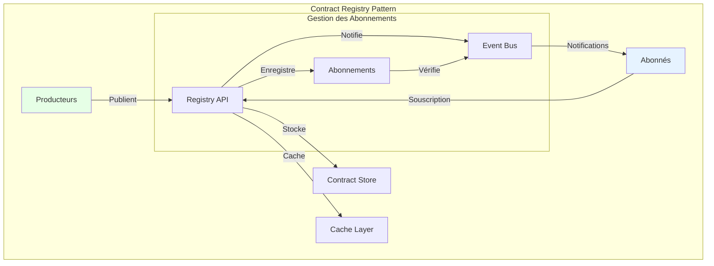
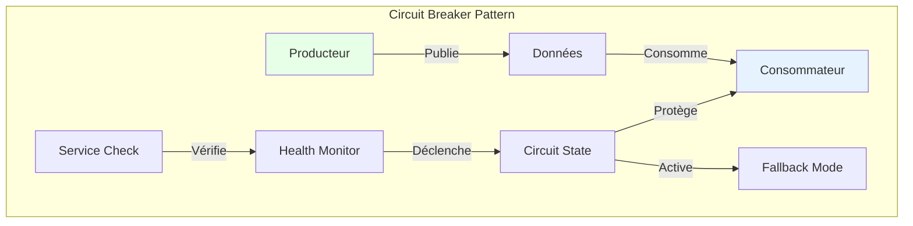
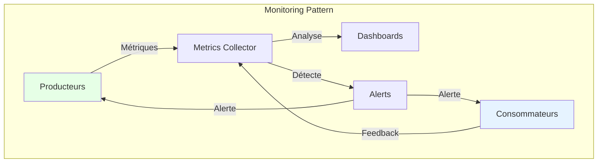
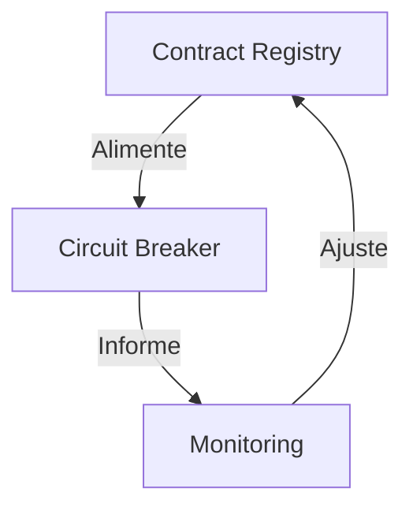

# Patterns d'architecture : les patterns qui marchent vraiment

"En théorie, il n'y a pas de différence entre la théorie et la pratique. En pratique, il y en a." 

Cette maxime prend tout son sens quand on parle de patterns d'architecture pour les data contracts. Les patterns architecturaux que nous allons explorer ne sont pas de simples abstractions théoriques, mais des modèles conceptuels qui structurent la façon dont les data contracts s'intègrent dans l'écosystème data d'une organisation.

## Le pattern contract registry

Au cœur de toute architecture de data contracts se trouve le pattern du Contract Registry. Ce pattern répond à une problématique fondamentale : comment centraliser et distribuer efficacement les contrats de données à travers l'organisation ? Le Registry agit comme une source unique de vérité, offrant un point d'accès centralisé tout en gérant la distribution et la mise à jour des contrats.



L'essence de ce pattern réside dans sa capacité à gérer le cycle de vie complet des contrats. Le Registry ne se contente pas de stocker passivement les contrats ; il orchestre activement leur distribution, leur validation et leur évolution. La couche de cache optimise les performances en réduisant la latence d'accès aux contrats fréquemment utilisés, tandis que le bus d'événements permet une communication asynchrone efficace entre les différents composants du système.

Le mécanisme d'abonnement est central dans ce pattern :
- Les consommateurs s'abonnent aux contrats qui les intéressent
- Le Registry maintient un registre des abonnements
- Toute modification d'un contrat (nouvelle version, dépréciation) déclenche une notification aux abonnés concernés
- Les producteurs peuvent consulter la liste des consommateurs de leurs contrats

## Le pattern circuit breaker

Le pattern Circuit Breaker représente une approche sophistiquée de la gestion de la résilience dans un écosystème de data contracts. Son principe fondamental est d'éviter la propagation des défaillances en détectant et en isolant rapidement les problèmes.



Ce pattern opère à trois niveaux distincts :

1. **Détection** : Surveillance continue de la santé des flux de données et des contrats associés
2. **Protection** : Isolation rapide des composants défaillants pour éviter les effets en cascade
3. **Récupération** : Gestion de la reprise progressive du service

Le Fallback Mode est un composant crucial de ce pattern. Lorsqu'une défaillance est détectée, au lieu d'échouer complètement, le système bascule vers un mode dégradé mais fonctionnel. Par exemple :

- Si les données temps réel ne sont pas disponibles, utiliser les dernières données valides en cache
- Si le schéma complet ne peut pas être validé, accepter un sous-ensemble minimal de champs critiques
- Si le producteur principal est indisponible, basculer vers une source de données secondaire

Prenons un exemple concret dans le retail : le système de recommandation produits utilise normalement des données temps réel de navigation client. Si ces données deviennent indisponibles, le Circuit Breaker active le Fallback Mode qui utilise un modèle de recommandation plus simple basé uniquement sur l'historique des ventes. Les performances sont réduites, mais le service continue de fonctionner.

```yaml
dataContractSpecification: 1.1.0
id: urn:datacontract:recommendation:config
info:
  title: "Recommendation Service Configuration"
  version: "1.0.0"
  description: "Configuration contract for the recommendation service fallback modes"
  owner: "recommendation-team"
  contact:
    name: "Recommendation Team"
    email: "reco-team@company.com"

servers:
  local:
    type: "local"
    path: "./data/recommendation_config.json"
    format: "json"
    description: "Local configuration file"
  prod:
    type: "s3"
    path: "s3://data-lake-prod/recommendation/config/"
    format: "json"
    description: "Production configuration"

models:
  FallbackConfig:
    type: "object"
    description: "Fallback configuration for recommendation service"
    fields:
      mode:
        type: "text"
        description: "Fallback mode"
        enum: ["default", "degraded", "emergency"]
        required: true
      thresholds:
        type: "object"
        description: "Performance thresholds for mode activation"
        fields:
          latency:
            type: "integer"
            description: "Response time threshold in ms"
            required: true
          error_rate:
            type: "decimal"
            description: "Error rate threshold"
            required: true
      sources:
        type: "array"
        description: "Data sources to use in this mode"
        items:
          type: "text"
        required: true

terms:
  usage: "Configuration for recommendation service fallback modes"
  limitations: "Changes require approval from service owner"
  noticePeriod: "P1D"

servicelevels:
  availability:
    description: "Configuration availability"
    percentage: "99.99%"
    measurement: "daily"
  
  changes:
    description: "Configuration change process"
    approvalRequired: true
    approvers: ["service-owner", "sre-team"]
    implementationTime: "PT1H"
```

## Le pattern de monitoring proactif

Le monitoring proactif va au-delà de la simple surveillance passive. Ce pattern intègre profondément l'observabilité dans l'architecture des data contracts, permettant non seulement de détecter les problèmes, mais aussi de les anticiper.



L'approche proactive du monitoring repose sur trois piliers fondamentaux. Le premier est la collecte continue de métriques pertinentes, allant de la conformité des données aux performances des systèmes. Le deuxième est l'analyse en temps réel de ces métriques pour détecter les tendances et anomalies. Le troisième est la capacité à déclencher des actions correctives automatiques lorsque certains seuils sont atteints.

Voici un exemple de configuration de monitoring proactif :

```yaml
dataContractSpecification: 1.1.0
id: urn:datacontract:sales:monitoring
info:
  title: "Sales Data Monitoring"
  version: "1.0.0"
  description: "Monitoring configuration for sales data quality and system health"
  owner: "data-quality-team"
  contact:
    name: "Data Quality Team"
    email: "dq-team@company.com"

servers:
  local:
    type: "local"
    path: "./data/monitoring_config.json"
    format: "json"
    description: "Local monitoring configuration"
  prod:
    type: "s3"
    path: "s3://data-lake-prod/monitoring/config/"
    format: "json"
    description: "Production monitoring configuration"

models:
  MonitoringConfig:
    type: "object"
    description: "Monitoring metrics configuration"
    fields:
      system_health:
        type: "object"
        description: "System health metrics"
        fields:
          contract_validation_latency:
            type: "object"
            description: "Contract validation performance"
            fields:
              threshold_ms:
                type: "integer"
                description: "Maximum acceptable latency in milliseconds"
                required: true
              alert_level:
                type: "text"
                enum: ["warning", "critical"]
                required: true
          registry_availability:
            type: "object"
            description: "Contract registry availability"
            fields:
              min_percentage:
                type: "decimal"
                description: "Minimum acceptable availability percentage"
                required: true
      data_quality:
        type: "object"
        description: "Data quality metrics"
        fields:
          missing_product_codes:
            type: "object"
            description: "Missing product code monitoring"
            fields:
              max_percentage:
                type: "decimal"
                description: "Maximum acceptable percentage of missing codes"
                required: true
              measurement_window:
                type: "text"
                description: "Time window for measurement"
                required: true

terms:
  usage: "Monitoring configuration for data quality assurance"
  limitations: "Alert thresholds require SRE team approval"
  noticePeriod: "P2D"

servicelevels:
  alerts:
    description: "Alert response time"
    responseTime: "PT15M"
    priority: "P1"
  
  reporting:
    description: "Monitoring reports generation"
    frequency: "PT1H"
    retention: "P90D"
```

## L'orchestration des patterns

La véritable puissance de ces patterns émerge de leur orchestration harmonieuse. Le Registry alimente le Circuit Breaker en informations sur l'état des contrats, tandis que le monitoring fournit une vue d'ensemble de la santé du système. Cette synergie crée un système auto-régulé capable de maintenir sa stabilité face aux perturbations.



Cette orchestration permet une gestion dynamique des contrats de données, où chaque pattern joue un rôle spécifique dans le maintien de la qualité et de la fiabilité du système global.

## Conclusion

Les patterns architecturaux des data contracts ne sont pas de simples modèles théoriques, mais des guides pratiques pour construire des systèmes robustes et évolutifs. Leur mise en œuvre réussie repose sur une compréhension profonde de leurs interactions et de leur complémentarité.

Cependant, l'expérience montre que le passage en production des data contractsest souvent le point d'achoppement de nombreux projets. Comment gérer les performances à l'échelle ? Comment assurer la haute disponibilité du Registry ? Comment orchestrer le déploiement des différents composants ? Ces questions cruciales, souvent négligées dans la phase de conception, feront l'objet de notre prochain article sur l'industrialisation des data contracts.