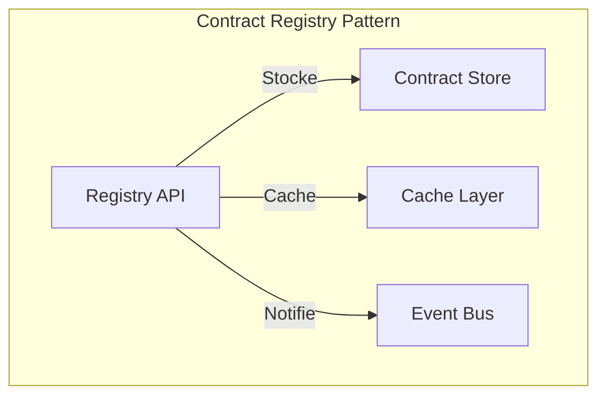
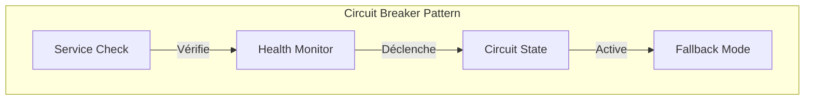
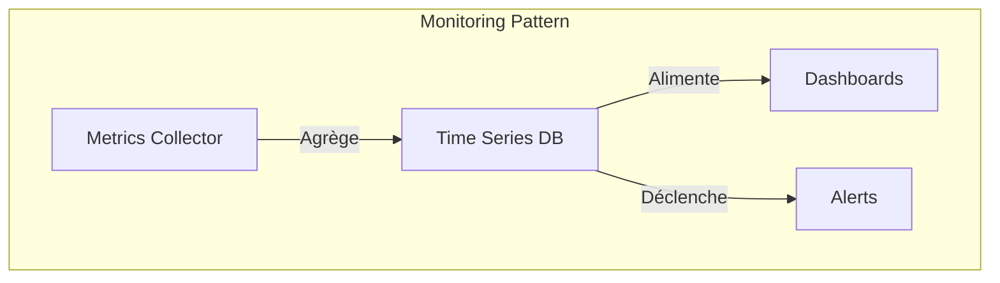
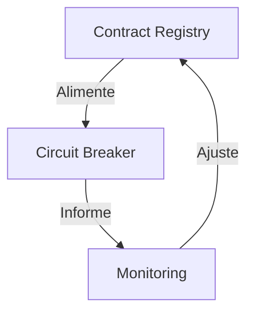

# Patterns d'architecture : les patterns qui marchent vraiment

"En théorie, il n'y a pas de différence entre la théorie et la pratique. En pratique, il y en a." Cette maxime prend tout son sens quand on parle de patterns d'architecture pour les data contracts. Les patterns architecturaux que nous allons explorer ne sont pas de simples abstractions théoriques, mais des modèles conceptuels qui structurent la façon dont les data contracts s'intègrent dans l'écosystème data d'une organisation.

## Le pattern contract registry

Au cœur de toute architecture de data contracts se trouve le pattern du Contract Registry. Ce pattern répond à une problématique fondamentale : comment centraliser et distribuer efficacement les contrats de données à travers l'organisation ? Le Registry agit comme une source unique de vérité, offrant un point d'accès centralisé tout en gérant la distribution et la mise à jour des contrats.

L'essence de ce pattern réside dans sa capacité à gérer le cycle de vie complet des contrats. Le Registry ne se contente pas de stocker passivement les contrats ; il orchestre activement leur distribution, leur validation et leur évolution. La couche de cache optimise les performances en réduisant la latence d'accès aux contrats fréquemment utilisés, tandis que le bus d'événements permet une communication asynchrone efficace entre les différents composants du système.

## Le pattern circuit breaker

Le pattern Circuit Breaker représente une approche sophistiquée de la gestion de la résilience dans un écosystème de data contracts. Son principe fondamental est d'éviter la propagation des défaillances en détectant et en isolant rapidement les problèmes.

Ce pattern opère à trois niveaux distincts. Au niveau de la détection, il surveille en permanence la santé des flux de données et des contrats associés. Au niveau de la protection, il peut rapidement isoler les composants défaillants pour éviter les effets en cascade. Au niveau de la récupération, il gère la reprise progressive du service une fois les problèmes résolus.

## Le pattern de monitoring proactif

Le monitoring proactif va au-delà de la simple surveillance passive. Ce pattern intègre profondément l'observabilité dans l'architecture des data contracts, permettant non seulement de détecter les problèmes, mais aussi de les anticiper.

L'approche proactive du monitoring repose sur trois piliers fondamentaux. Le premier est la collecte continue de métriques pertinentes, allant de la conformité des données aux performances des systèmes. Le deuxième est l'analyse en temps réel de ces métriques pour détecter les tendances et anomalies. Le troisième est la capacité à déclencher des actions correctives automatiques lorsque certains seuils sont atteints.

## L'orchestration des patterns

La véritable puissance de ces patterns émerge de leur orchestration harmonieuse. Le Registry alimente le Circuit Breaker en informations sur l'état des contrats, tandis que le monitoring fournit une vue d'ensemble de la santé du système. Cette synergie crée un système auto-régulé capable de maintenir sa stabilité face aux perturbations.

Cette orchestration permet une gestion dynamique des contrats de données, où chaque pattern joue un rôle spécifique dans le maintien de la qualité et de la fiabilité du système global.

## Conclusion

Les patterns architecturaux des data contracts ne sont pas de simples modèles théoriques, mais des guides pratiques pour construire des systèmes robustes et évolutifs. Leur mise en œuvre réussie repose sur une compréhension profonde de leurs interactions et de leur complémentarité. Dans le prochain article, nous explorerons comment ces patterns se traduisent en implémentations concrètes dans différents contextes technologiques.