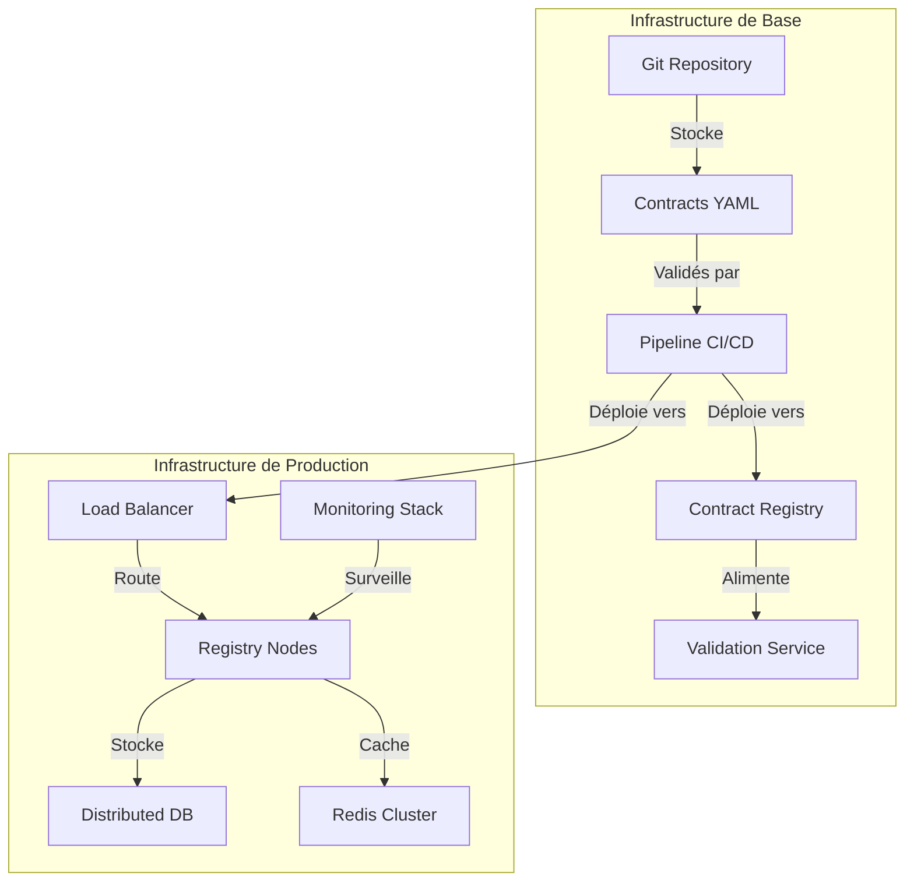

# Implémentation : du concept à la réalité

"C'est bien beau la théorie, mais comment on met ça en prod ?" Cette question revient systématiquement lors des discussions sur les data contracts. Elle reflète une préoccupation légitime : le passage de la théorie à la pratique est souvent le moment où les plus beaux concepts se heurtent à la réalité du terrain.

## Architecture et infrastructure

L'implémentation d'un système de data contracts repose sur une architecture distribuée qui doit concilier robustesse et flexibilité. Au cœur de cette architecture se trouve le Contract Registry, véritable pierre angulaire du système. Ce registre n'est pas qu'un simple dépôt de documents ; c'est un service actif qui orchestre l'ensemble du cycle de vie des contrats.

Cette architecture met en lumière plusieurs concepts essentiels. Le premier est la séparation entre le stockage des contrats et leur utilisation en production. Les contrats sont d'abord versionnés dans un dépôt Git, permettant un suivi précis des modifications et une collaboration efficace entre les équipes. Le pipeline CI/CD joue ensuite un rôle crucial en automatisant la validation et le déploiement des contrats.

## La validation continue

L'un des aspects les plus critiques de l'implémentation est la validation continue des contrats. Cette validation s'opère à plusieurs niveaux. Au niveau syntaxique d'abord, où chaque contrat est vérifié pour s'assurer qu'il respecte le format ODCS. Au niveau sémantique ensuite, où les règles métier et les contraintes de qualité sont évaluées. Enfin, au niveau opérationnel, où l'impact du contrat sur les systèmes existants est mesuré.

Le processus de validation doit être automatisé mais pas aveugle. L'expérience montre qu'une validation purement automatique peut laisser passer des problèmes subtils que seul un œil humain peut détecter. C'est pourquoi une approche hybride est recommandée, combinant tests automatisés et revue humaine pour les changements critiques.

## Le déploiement progressif

Le déploiement d'un système de data contracts ne peut pas se faire de manière brutale. Une approche progressive, inspirée des techniques de déploiement continu, est nécessaire. Cette approche commence par une phase de shadow testing, où le nouveau système fonctionne en parallèle de l'ancien sans impact sur la production. Cette phase permet de valider le comportement du système dans des conditions réelles.

Vient ensuite une phase de déploiement graduel, où le trafic est progressivement redirigé vers le nouveau système. Cette approche permet de détecter rapidement les problèmes et de les corriger avant qu'ils n'impactent l'ensemble des utilisateurs. La capacité à revenir en arrière rapidement est cruciale durant cette phase.

## L'observabilité comme fondation

L'observabilité n'est pas une fonctionnalité additionnelle mais une composante fondamentale du système. Elle doit être pensée dès la conception et intégrée à tous les niveaux. Cette observabilité s'articule autour de trois axes : les métriques techniques (latence, disponibilité), les métriques métier (taux de validation, qualité des données), et les métriques d'usage (utilisation des contrats, patterns d'accès).

La mise en place d'une bonne observabilité permet non seulement de détecter les problèmes mais aussi de comprendre l'utilisation réelle du système. Cette compréhension est précieuse pour guider l'évolution du système et prioriser les améliorations.

## La dimension humaine

L'aspect technique de l'implémentation, bien que crucial, ne représente qu'une partie du défi. La dimension humaine est tout aussi importante. La mise en place d'un système de data contracts représente un changement significatif dans la façon dont les équipes travaillent avec les données. Ce changement doit être accompagné.

Cet accompagnement passe par la formation des équipes, la mise en place de processus clairs, et surtout par une communication constante. Les équipes doivent comprendre non seulement comment utiliser le système mais aussi pourquoi il est important.

## Conclusion

L'implémentation d'un système de data contracts est un voyage plus qu'une destination. C'est un processus itératif qui doit s'adapter aux besoins et aux contraintes de l'organisation. Le succès de cette implémentation repose autant sur la solidité de l'architecture technique que sur la capacité à accompagner le changement auprès des équipes.

Dans le prochain article, nous explorerons comment gérer le cycle de vie complet des data contracts, de leur création à leur retrait, en passant par leur évolution et leur maintenance.