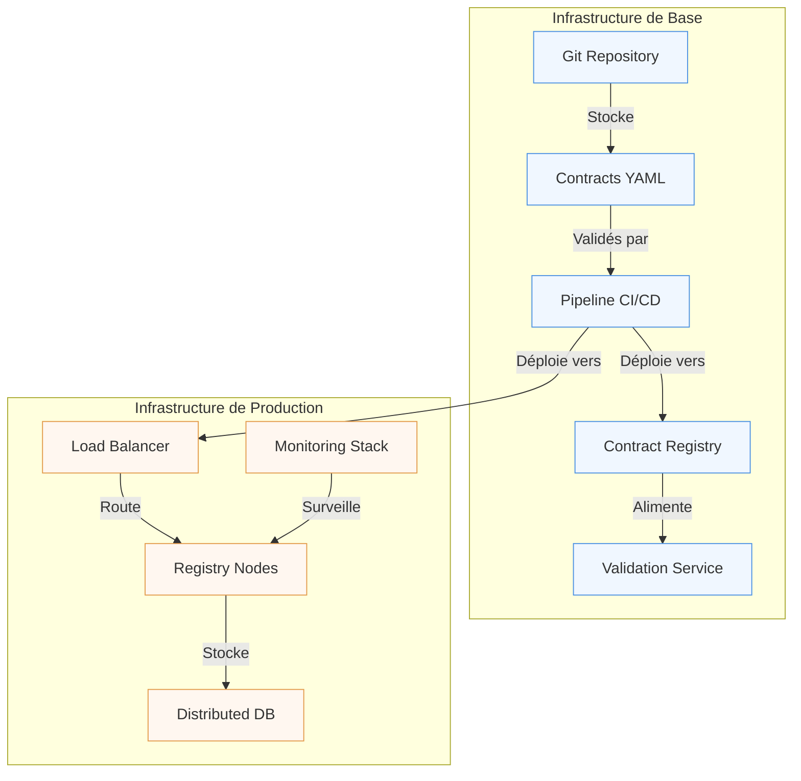

# Implémentation : du concept à la réalité

"C'est bien beau la théorie, mais comment on met ça en prod ?" 

Cette question revient systématiquement lors des discussions sur les data contracts. Elle reflète une préoccupation légitime : le passage de la théorie à la pratique est souvent le moment où les plus beaux concepts se heurtent à la réalité du terrain.

## Architecture et infrastructure

L'implémentation d'un système de data contracts repose sur une architecture distribuée qui doit concilier robustesse et flexibilité. Au cœur de cette architecture se trouve le Contract Registry, véritable pierre angulaire du système. Ce registre n'est pas qu'un simple dépôt de documents ; c'est un service actif qui orchestre l'ensemble du cycle de vie des contrats.



Cette architecture met en lumière plusieurs concepts essentiels. Le premier est la séparation entre le stockage des contrats et leur utilisation en production. Les contrats sont d'abord versionnés dans un dépôt Git, permettant un suivi précis des modifications et une collaboration efficace entre les équipes. Le pipeline CI/CD joue ensuite un rôle crucial en automatisant la validation et le déploiement des contrats.

Pour la scalabilité, des solutions comme Redis peuvent être ajoutées pour le caching, mais ce n'est généralement nécessaire que pour les systèmes à très forte charge.

## La validation continue

L'un des aspects les plus critiques de l'implémentation est la validation continue des contrats. Un pipeline CI/CD qui ne validerait que la syntaxe YAML n'a aucune valeur - nous avons vu des cas où des Contract Registry acceptaient des contrats syntaxiquement valides mais sémantiquement vides de sens, créant une fausse sensation de sécurité.

La validation doit s'opérer à plusieurs niveaux :
- **Syntaxique** : Vérification du format ODCS et de la structure du contrat
- **Sémantique** : Validation des règles métier, cohérence des définitions, conformité aux standards de l'organisation
- **Contextuelle** : Vérification des dépendances, compatibilité avec les versions existantes
- **Opérationnelle** : Évaluation de l'impact sur les systèmes existants

Un contrat qui passe la validation syntaxique mais échoue aux validations sémantiques ou contextuelles est potentiellement plus dangereux qu'une absence de contrat, car il donne une fausse impression de gouvernance. Le pipeline CI/CD doit donc intégrer des tests approfondis qui vérifient non seulement la forme mais aussi le fond des contrats.

## Le déploiement progressif

Le déploiement d'un système de data contracts ne peut pas se faire de manière brutale. Une approche progressive, inspirée des techniques de déploiement continu, est nécessaire. Cette approche commence par une phase de shadow testing, où le nouveau système fonctionne en parallèle de l'ancien sans impact sur la production. Cette phase permet de valider le comportement du système dans des conditions réelles.

Vient ensuite une phase de déploiement graduel, où le trafic est progressivement redirigé vers le nouveau système. Cette approche permet de détecter rapidement les problèmes et de les corriger avant qu'ils n'impactent l'ensemble des utilisateurs. La capacité à revenir en arrière rapidement est cruciale durant cette phase.

## L'observabilité comme fondation

L'observabilité n'est pas une fonctionnalité additionnelle mais une composante fondamentale du système. Sans elle, il est impossible de savoir si les data contracts remplissent leur rôle. Dans notre contexte retail, prenons l'exemple d'un contrat pour les données de ventes :

```yaml
monitoring:
  technical:
    # Métriques de santé du système
    - metric: "contract_validation_latency"
      threshold: "< 500ms"
      alert: "high"
    - metric: "registry_availability"
      threshold: "> 99.9%"
      alert: "critical"

  business:
    # Métriques de qualité des données
    - metric: "missing_product_codes"
      threshold: "< 0.1%"
      alert: "high"
    - metric: "invalid_sale_amounts"
      threshold: "< 0.01%"
      alert: "critical"

  usage:
    # Métriques d'utilisation
    - metric: "active_consumers"
      threshold: "> 0"
      alert: "info"
    - metric: "schema_violations"
      threshold: "< 10 per hour"
      alert: "warning"
```

Ces métriques permettent de répondre à des questions concrètes :
- Le système fonctionne-t-il correctement ? (métriques techniques)
- Les données sont-elles fiables ? (métriques business)
- Les équipes utilisent-elles effectivement les contrats ? (métriques d'usage)

Par exemple, une augmentation soudaine des violations de schéma peut indiquer :
- Un problème dans le système source des données
- Un contrat mal adapté aux besoins réels
- Un besoin de formation des équipes productrices

L'observabilité permet ainsi d'être proactif plutôt que réactif dans la gestion des data contracts.

## La dimension humaine

L'aspect technique de l'implémentation, bien que crucial, ne représente qu'une partie du défi. La dimension humaine est tout aussi importante. La mise en place d'un système de data contracts représente un changement significatif dans la façon dont les équipes travaillent avec les données. 

Cette dimension humaine est si critique qu'elle mérite un article dédié. Dans notre article sur la gouvernance et l'adoption qui paraitra dans un prochain article, nous explorerons en détail :
- L'organisation des équipes et la définition des rôles
- Les stratégies de formation et d'accompagnement
- La mise en place d'un Centre d'Excellence
- Les métriques d'adoption et de satisfaction

Car même l'implémentation technique la plus sophistiquée échouera si les équipes ne sont pas correctement accompagnées dans ce changement.

## Conclusion

L'implémentation d'un système de data contracts est un voyage plus qu'une destination. C'est un processus itératif qui doit s'adapter aux besoins et aux contraintes de l'organisation. Le succès de cette implémentation repose autant sur la solidité de l'architecture technique que sur la capacité à accompagner le changement auprès des équipes.

Dans le prochain article, nous explorerons comment gérer le cycle de vie complet des data contracts, de leur création à leur retrait, en passant par leur évolution et leur maintenance.