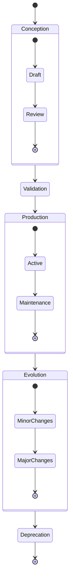
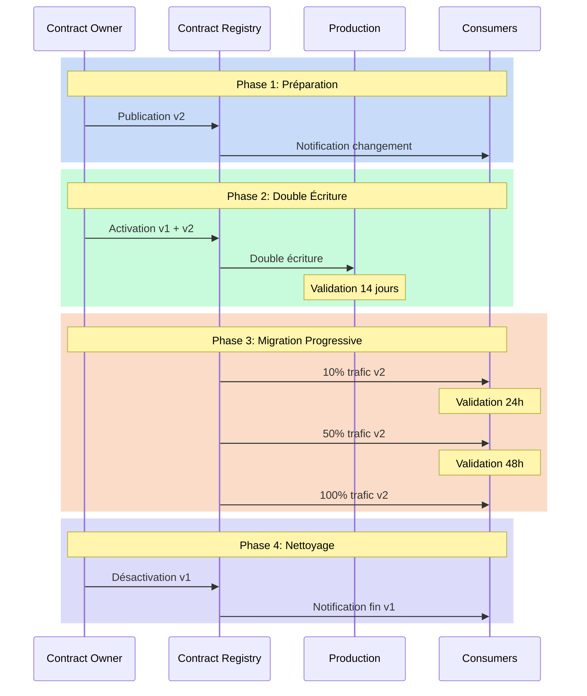

# Cycle de vie : au-delà du simple yaml

Il est minuit, et une alerte retentit : un data contract critique vient d'être modifié sans suivre le processus établi. Cette situation, malheureusement courante, illustre l'importance cruciale de comprendre et de gérer correctement le cycle de vie des data contracts. Un data contract n'est pas un document statique - c'est un organisme vivant qui évolue avec votre organisation et qui nécessite une gestion rigoureuse tout au long de son existence.

## Les phases du cycle de vie

Le cycle de vie d'un data contract suit un parcours bien défini, de sa conception jusqu'à sa fin de vie. Cette progression naturelle commence par une phase de conception où les besoins sont identifiés et le contrat est élaboré. Cette étape initiale est cruciale car elle pose les fondations de tout ce qui suivra. Le contrat passe ensuite par une phase de validation rigoureuse avant d'entrer en production.



Une fois en production, le contrat entre dans une phase d'évolution continue, où il s'adapte aux besoins changeants de l'organisation. Cette évolution doit être soigneusement orchestrée pour maintenir la cohérence et la qualité des données. Enfin, lorsque le contrat n'est plus pertinent, il entre dans une phase de dépréciation qui mène à sa fin de vie.

## La structure d'un contrat évolutif

Pour supporter ce cycle de vie, le contrat lui-même doit être structuré de manière à capturer son évolution. Voici comment un tel contrat pourrait être structuré :

```yaml
apiVersion: v3.0.0
kind: DataContract
id: urn:datacontract:user:preferences
domain: user-domain
tenant: UserExperience
name: User Preferences
version: 3.0.0
status: active

description:
  purpose: "Manage user preferences and settings"
  usage: "Personalization and user experience optimization"
  limitations: "Personal data subject to GDPR"
  dataGranularityDescription: "One record per user"
  lifecycle:
    currentPhase: "active"
    phases:
      - name: "draft"
        startDate: "2023-09-01"
        endDate: "2023-10-01"
        activities: ["initial design", "stakeholder review"]
      - name: "beta"
        startDate: "2023-10-01"
        endDate: "2023-12-01"
        activities: ["limited production testing", "performance optimization"]
      - name: "active"
        startDate: "2024-01-01"
        activities: ["full production use", "monitoring"]
    deprecationPlan:
      scheduledDate: "2025-01-01"
      migrationPath: "v4.0.0"
      notificationPeriod: "6 months"

schema:
  - name: UserPreference
    physicalName: user_preferences
    physicalType: table
    description: "User preference settings"
    tags: ["user", "preferences", "settings"]
    properties:
      - name: user_id
        logicalType: string
        physicalType: text
        description: "Unique user identifier"
        isNullable: false
        isUnique: true
        criticalDataElement: true
        examples: ["USER-001"]
      - name: theme
        logicalType: string
        physicalType: text
        description: "UI theme preference"
        isNullable: false
        allowedValues: ["light", "dark", "system"]
        addedInVersion: "2.0.0"
        examples: ["dark"]
      - name: notifications
        logicalType: object
        physicalType: json
        description: "Notification preferences"
        isNullable: false
        addedInVersion: "3.0.0"
        schema:
          type: object
          properties:
            email:
              type: boolean
              description: "Email notifications enabled"
            push:
              type: boolean
              description: "Push notifications enabled"
            frequency:
              type: string
              enum: ["real-time", "daily", "weekly"]
        examples: [{"email": true, "push": false, "frequency": "daily"}]

quality:
  - rule: validTheme
    description: "Theme must be one of the allowed values"
    dimension: validity
    severity: error
    businessImpact: operational
  - rule: validNotifications
    description: "Notification preferences must be valid JSON"
    dimension: validity
    severity: error
    businessImpact: operational

team:
  - username: agarcia
    role: Data Product Owner
    dateIn: "2023-09-01"
  - username: lzhang
    role: Data Steward
    dateIn: "2023-09-01"

support:
  - channel: "#user-preferences"
    tool: slack
    url: https://company.slack.com/user-preferences
  - channel: user-prefs@company.com
    tool: email
    url: mailto:user-prefs@company.com

servers:
  - server: prod
    type: postgresql
    format: sql
    url: postgresql://user-prefs.prod.company.com:5432/preferences
    description: "Production preferences database"

slaProperties:
  - property: latency
    value: 1
    unit: s
  - property: retention
    value: 5
    unit: y
  - property: frequency
    value: 1
    unit: s

tags:
  - user
  - preferences
  - settings
  - personalization

customProperties:
  - property: dataDomain
    value: user
  - property: criticality
    value: high
  - property: personalData
    value: true
  - property: gdprRelevant
    value: true
```

## Gestion des transitions

La phase de transition entre les versions d'un contrat est particulièrement délicate. Elle nécessite une orchestration minutieuse pour éviter toute perturbation des systèmes en production. Cette orchestration commence par une période de double écriture, où les données sont écrites simultanément dans l'ancienne et la nouvelle version du contrat. Cette approche permet de valider la nouvelle version tout en maintenant la stabilité des systèmes existants.



### Phase 1 : Préparation
Cette phase est cruciale car elle pose les bases d'une transition réussie :
- Le Contract Owner publie la nouvelle version (v2) dans le Registry
- Les consommateurs sont notifiés automatiquement via le système d'abonnement
- Les équipes peuvent commencer à étudier les changements et planifier leur migration
- La documentation de migration est validée et publiée

### Phase 2 : Double Écriture
Cette phase de sécurisation permet de valider la nouvelle version en conditions réelles :
- Les données sont écrites simultanément dans les versions v1 et v2
- Les équipes peuvent comparer les résultats entre les deux versions
- Une période de 14 jours permet de couvrir tous les cas métier (fin de mois, week-end, etc.)
- Les anomalies peuvent être détectées sans impact sur la production

### Phase 3 : Migration Progressive
Le basculement se fait par paliers pour minimiser les risques :
- 10% du trafic est dirigé vers v2, permettant de détecter rapidement les problèmes
- Une validation de 24h confirme le bon fonctionnement sur ce premier palier
- Le trafic est augmenté à 50% si aucun problème n'est détecté
- Après 48h supplémentaires de validation, le basculement complet est effectué

### Phase 4 : Nettoyage
Cette phase finale est souvent négligée mais essentielle :
- La v1 est officiellement dépréciée dans le Registry
- Une dernière notification est envoyée aux consommateurs
- Les ressources de la v1 sont nettoyées (stockage, monitoring, etc.)
- La documentation est mise à jour pour refléter la fin de vie de v1

Cette approche méthodique de la transition permet de :
- Minimiser les risques opérationnels
- Donner de la visibilité à toutes les parties prenantes
- Garantir une migration contrôlée et réversible
- Maintenir la qualité de service pendant la transition

## La fin de vie d'un contrat

La fin de vie d'un contrat doit être gérée avec autant de soin que sa création. Cette phase commence par une période de dépréciation où les consommateurs sont progressivement migrés vers des alternatives. Une fois tous les consommateurs migrés, le contrat peut être archivé, mais ses métadonnées et son historique doivent être préservés pour maintenir la traçabilité et la conformité réglementaire.

## Conclusion

La gestion du cycle de vie des data contracts est un aspect fondamental de toute stratégie de gouvernance des données. Elle requiert une approche systématique et une attention constante aux besoins des producteurs et des consommateurs de données. Une bonne gestion du cycle de vie permet non seulement d'assurer la qualité et la fiabilité des données, mais aussi de faciliter l'évolution des systèmes tout en maintenant la confiance des utilisateurs.

Dans le prochain article, nous explorerons comment ces pratiques de gestion du cycle de vie s'intègrent dans une stratégie plus large de gouvernance des données, et comment elles contribuent à la création d'une culture data mature au sein de l'organisation.