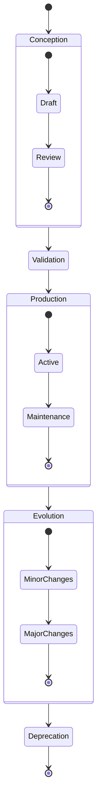
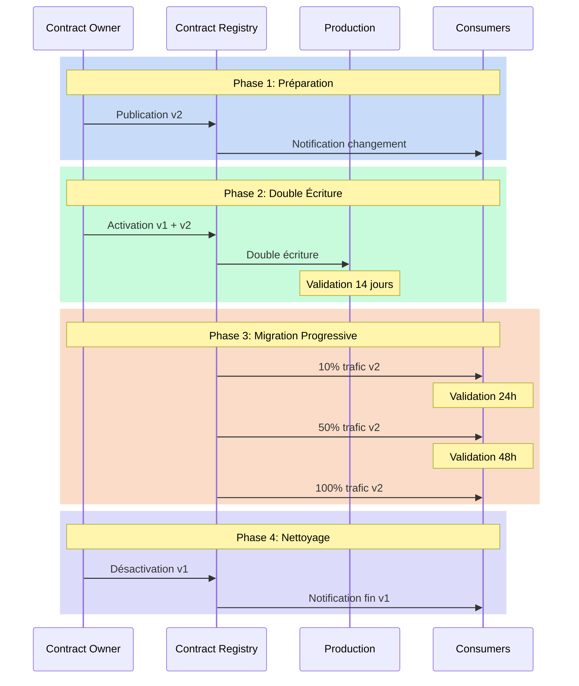

# Cycle de vie : au-delà du simple yaml

Il est minuit, et une alerte retentit : un data contract critique vient d'être modifié sans suivre le processus établi. Cette situation illustre l'importance cruciale de comprendre et de gérer correctement le cycle de vie des data contracts. Un data contract n'est pas un document statique - c'est un organisme vivant qui évolue avec votre organisation et qui nécessite une gestion rigoureuse tout au long de son existence.

## Les phases du cycle de vie

Le cycle de vie d'un data contract suit un parcours bien défini, de sa conception jusqu'à sa fin de vie. Cette progression naturelle commence par une phase de conception où les besoins sont identifiés et le contrat est élaboré. Cette étape initiale est cruciale car elle pose les fondations de tout ce qui suivra. Le contrat passe ensuite par une phase de validation rigoureuse avant d'entrer en production.



Une fois en production, le contrat entre dans une phase d'évolution continue, où il s'adapte aux besoins changeants de l'organisation. Cette évolution doit être soigneusement orchestrée pour maintenir la cohérence et la qualité des données. Enfin, lorsque le contrat n'est plus pertinent, il entre dans une phase de dépréciation qui mène à sa fin de vie.

## La structure d'un contrat évolutif

Pour supporter ce cycle de vie, le contrat lui-même doit être structuré de manière à capturer son évolution. Voici comment un tel contrat pourrait être structuré :

```yaml
apiVersion: v3.0.0
kind: DataContract
id: urn:datacontract:user:preferences
domain: user-domain
tenant: UserExperience
name: User Preferences
version: 3.0.0
status: active

description:
  purpose: "Manage user preferences and settings"
  usage: "Personalization and user experience optimization"
  limitations: "Personal data subject to GDPR"
  dataGranularityDescription: "One record per user"
  lifecycle:
    currentPhase: "active"
    phases:
      - name: "draft"
        startDate: "2023-09-01"
        endDate: "2023-10-01"
        activities: ["initial design", "stakeholder review"]
      - name: "beta"
        startDate: "2023-10-01"
        endDate: "2023-12-01"
        activities: ["limited production testing", "performance optimization"]
      - name: "active"
        startDate: "2024-01-01"
        activities: ["full production use", "monitoring"]
    deprecationPlan:
      scheduledDate: "2025-01-01"
      migrationPath: "v4.0.0"
      notificationPeriod: "6 months"

schema:
  - name: UserPreference
    physicalName: user_preferences
    physicalType: table
    description: "User preference settings"
    tags: ["user", "preferences", "settings"]
    properties:
      - name: user_id
        logicalType: string
        physicalType: text
        description: "Unique user identifier"
        isNullable: false
        isUnique: true
        criticalDataElement: true
        examples: ["USER-001"]
      - name: theme
        logicalType: string
        physicalType: text
        description: "UI theme preference"
        isNullable: false
        allowedValues: ["light", "dark", "system"]
        addedInVersion: "2.0.0"
        examples: ["dark"]
      - name: notifications
        logicalType: object
        physicalType: json
        description: "Notification preferences"
        isNullable: false
        addedInVersion: "3.0.0"
        schema:
          type: object
          properties:
            email:
              type: boolean
              description: "Email notifications enabled"
            push:
              type: boolean
              description: "Push notifications enabled"
            frequency:
              type: string
              enum: ["real-time", "daily", "weekly"]
        examples: [{"email": true, "push": false, "frequency": "daily"}]
```

## Gestion des transitions

La phase de transition entre les versions d'un contrat est particulièrement délicate. Elle nécessite une orchestration minutieuse pour éviter toute perturbation des systèmes en production. Cette orchestration commence par une période de double écriture, où les données sont écrites simultanément dans l'ancienne et la nouvelle version du contrat. Cette approche permet de valider la nouvelle version tout en maintenant la stabilité des systèmes existants.



### Phase 1 : Préparation
Cette phase est cruciale car elle pose les bases d'une transition réussie :
- Le Contract Owner publie la nouvelle version (v2) dans le Registry
- Les consommateurs sont notifiés automatiquement via le système d'abonnement
- Les équipes peuvent commencer à étudier les changements et planifier leur migration
- La documentation de migration est validée et publiée

### Phase 2 : Double Écriture
Cette phase de sécurisation permet de valider la nouvelle version en conditions réelles :
- Les données sont écrites simultanément dans les versions v1 et v2
- Les équipes peuvent comparer les résultats entre les deux versions
- Une période de 14 jours permet de couvrir tous les cas métier (fin de mois, week-end, etc.)
- Les anomalies peuvent être détectées sans impact sur la production

### Phase 3 : Migration Progressive
Le basculement se fait par paliers pour minimiser les risques :
- 10% du trafic est dirigé vers v2, permettant de détecter rapidement les problèmes
- Une validation de 24h confirme le bon fonctionnement sur ce premier palier
- Le trafic est augmenté à 50% si aucun problème n'est détecté
- Après 48h supplémentaires de validation, le basculement complet est effectué

### Phase 4 : Nettoyage
Cette phase finale est souvent négligée mais essentielle :
- La v1 est officiellement dépréciée dans le Registry
- Une dernière notification est envoyée aux consommateurs
- Les ressources de la v1 sont nettoyées (stockage, monitoring, etc.)
- La documentation est mise à jour pour refléter la fin de vie de v1

Cette approche méthodique de la transition permet de minimiser les risques opérationnels, donner de la visibilité à toutes les parties prenantes, garantir une migration contrôlée et réversible, et maintenir la qualité de service pendant la transition.

## Traçabilité : la mémoire vivante de vos contrats

La traçabilité des data contracts est souvent réduite à un simple historique de versions, ce qui constitue une vision incomplète. Une traçabilité efficace capture non seulement les changements techniques, mais également le contexte, les motivations et les décisions qui ont guidé l'évolution du contrat.

Une traçabilité complète doit répondre à trois questions essentielles : le "quoi" (les modifications techniques), le "pourquoi" (les motivations business) et le "comment" (le processus de décision). Ces éléments doivent être capturés de manière structurée et accessible.

Pour être véritablement efficace, cette traçabilité doit être intégrée aux outils quotidiens des équipes. L'intégration avec les systèmes de ticketing, de documentation et de gestion de projets permet de créer un fil conducteur ininterrompu entre les besoins business exprimés et leur implémentation technique.

Un modèle de traçabilité efficace doit inclure :

- **Contexte technique** : Quelles modifications ont été apportées au contrat et par qui
- **Contexte business** : Quels besoins métier ont motivé ces changements
- **Processus décisionnel** : Comment les décisions ont été prises et par qui
- **Impact et dépendances** : Quels systèmes et processus ont été affectés
- **Liens vers la documentation** : Références aux spécifications, tickets, discussions

Cette approche de traçabilité crée une continuité essentielle entre les motivations business et les implémentations techniques. Lorsqu'un analyste business s'interroge sur un comportement inattendu dans un dashboard, il peut remonter la chaîne de traçabilité jusqu'aux décisions qui ont influencé la structure des données. Cette transparence renforce la confiance dans les données et facilite la résolution des problèmes.

## La perspective des consommateurs : l'autre face du miroir

Le cycle de vie des data contracts est souvent abordé du point de vue des producteurs, négligeant ainsi la perspective essentielle des consommateurs. Pourtant, un data contract n'existe que par l'usage qu'en font ses consommateurs.

L'intégration des consommateurs dans le cycle de vie transforme fondamentalement la dynamique : les consommateurs ne sont plus de simples destinataires passifs, mais des participants actifs dans l'évolution des contrats.

Cette intégration peut prendre plusieurs formes concrètes :

- **Système d'abonnement aux contrats** : Un mécanisme permettant aux consommateurs de s'abonner aux contrats qui les intéressent et de recevoir automatiquement des notifications lors des évolutions
- **Consumer Advisory Board** : Un groupe représentatif des principaux consommateurs qui participe aux décisions d'évolution du contrat
- **Feedback Loops formalisés** : Des canaux dédiés pour recueillir et intégrer les retours d'expérience des consommateurs
- **Impact Assessment Collaboratif** : Une évaluation conjointe de l'impact des changements sur les workflows des consommateurs
- **Communication différenciée** : Des messages adaptés aux différents profils de consommateurs (data scientists, analystes, développeurs)

L'approche centrée sur le consommateur modifie également notre vision du versioning. Au-delà de la compatibilité technique, nous devons considérer l'impact réel sur les workflows des utilisateurs. Un changement techniquement mineur peut avoir un impact majeur sur certains cas d'usage.

Un processus de migration réussi doit inclure :

- Des canaux de communication clairs et adaptés aux différents profils d'utilisateurs
- Des environnements de test permettant aux consommateurs de valider leurs workflows
- Un support dédié pendant la période de transition
- Des mécanismes de rollback clairement définis en cas de problème

Le système d'abonnement aux contrats mérite une attention particulière. Ce mécanisme permet d'instaurer une communication proactive plutôt que réactive. Les consommateurs définissent précisément quels contrats les intéressent et à quel niveau de détail ils souhaitent être informés. Ils peuvent, par exemple, choisir d'être notifiés pour toutes les modifications, ou uniquement pour les changements majeurs susceptibles d'impacter leurs workflows.

Cette approche présente plusieurs avantages architecturaux significatifs. D'abord, elle améliore considérablement la scalabilité de la communication - chaque modification n'est communiquée qu'aux parties réellement concernées, évitant ainsi le bruit informationnel. Ensuite, elle responsabilise les consommateurs qui deviennent acteurs de leur propre information. Enfin, elle fournit aux producteurs une vision claire de l'écosystème qui dépend de leurs contrats, facilitant l'analyse d'impact lors des évolutions futures.

D'un point de vue implémentation, ce système d'abonnement s'intègre naturellement au Contract Registry que nous avons évoqué dans de précédents articles. Le Registry conserve non seulement les contrats, mais également la cartographie des abonnements, permettant un routage intelligent des notifications.

Dans l'ensemble, cette approche collaborative renforce la confiance mutuelle entre producteurs et consommateurs, et contribue significativement à la stabilité de l'écosystème de données.

## Les audits de cycle de vie : prévenir plutôt que guérir

Les audits de cycle de vie ne sont pas une simple formalité administrative – ils constituent un mécanisme vital pour détecter et corriger les problèmes avant qu'ils n'impactent vos opérations. Ces audits examinent plusieurs dimensions clés :

- **Vitalité technique** : Le contrat fonctionne-t-il correctement d'un point de vue opérationnel ? Les performances sont-elles optimales ? Les limites techniques sont-elles respectées ?

- **Pertinence métier** : Le contrat répond-il toujours aux besoins actuels de l'organisation ? Les champs et structures définis sont-ils toujours pertinents ? Existe-t-il de nouveaux besoins non couverts ?

- **Efficacité de la gouvernance** : Les processus entourant le contrat fonctionnent-ils comme prévu ? Les validations et approbations sont-elles effectuées avec la rigueur nécessaire ? Les exceptions sont-elles correctement gérées ?

Pour être véritablement efficaces, ces audits doivent suivre un calendrier structuré :

- **Vérifications quotidiennes automatisées** : Contrôles techniques et opérationnels des contrats
- **Revues mensuelles** : Examen des patterns d'utilisation et de l'alignement avec les besoins métiers
- **Audits trimestriels exhaustifs** : Évaluation de l'ensemble du portefeuille de contrats

L'élément souvent négligé, mais crucial, de ces audits est le suivi des actions identifiées. Les problèmes détectés doivent être adressés selon un processus clair, avec des responsabilités bien définies et des échéances précises.

Les résultats de ces audits doivent également alimenter un processus d'amélioration continue. Les insights issus des audits devraient être systématiquement intégrés dans la roadmap des data contracts, créant une boucle de feedback vertueuse qui renforce continuellement la robustesse du système.

## De la fin de vie à la renaissance

La fin de vie d'un contrat doit être gérée avec autant de soin que sa création. Cette phase commence par une période de dépréciation où les consommateurs sont progressivement migrés vers des alternatives. Une fois tous les consommateurs migrés, le contrat peut être archivé, mais ses métadonnées et son historique doivent être préservés pour maintenir la traçabilité et la conformité réglementaire.

Cependant, la fin de vie officielle d'un contrat n'est pas toujours sa fin réelle. Le phénomène de "zombie contracts" - des contrats supposément retirés mais encore utilisés par certains systèmes - est plus courant qu'on ne le pense et peut créer des risques significatifs. Un processus de vérification rigoureux est nécessaire pour s'assurer que tous les systèmes ont effectivement migré.

Par ailleurs, il est crucial de reconnaître que la fin de vie d'un contrat peut aussi être le début d'un nouveau cycle. Les connaissances accumulées, les patterns éprouvés et les leçons apprises constituent un patrimoine précieux pour la conception des futures générations de contrats.

Un processus systématique de "post-mortem positif" pour chaque contrat retiré permet d'examiner ce qui a bien fonctionné, ce qui aurait pu être amélioré, et comment ces enseignements peuvent être appliqués aux futurs contrats. Cette pratique d'apprentissage continu transforme chaque fin de cycle en catalyseur d'amélioration.

La fin de vie offre également l'opportunité d'évaluer l'architecture globale des données. J'ai observé que la décommission d'un contrat révèle souvent des interdépendances non documentées et des opportunités de rationalisation. C'est pourquoi la décommission mérite d'être traitée comme un projet architectural à part entière, pas comme une simple tâche opérationnelle.

## Conclusion

La gestion du cycle de vie des data contracts est un aspect fondamental de toute stratégie de gouvernance des données. Elle requiert une approche systématique et une attention constante aux besoins des producteurs et des consommateurs de données. Une bonne gestion du cycle de vie permet non seulement d'assurer la qualité et la fiabilité des données, mais aussi de faciliter l'évolution des systèmes tout en maintenant la confiance des utilisateurs.

La traçabilité complète, l'intégration active des consommateurs via des systèmes d'abonnement, et les audits réguliers constituent les trois piliers d'une approche mature du cycle de vie. Ces éléments ne sont pas de simples bonnes pratiques théoriques, mais des mécanismes essentiels qui déterminent la réussite ou l'échec de votre stratégie de data contracts.

Gérer le cycle de vie de vos data contracts n'est pas une tâche administrative, c'est un investissement architectural qui protège et valorise votre patrimoine data. À mesure que les organizations accélèrent leur transformation numérique, cette compétence deviendra de plus en plus différenciante dans la capacité à extraire de la valeur des données tout en maintenant gouvernance et conformité.

Dans le prochain article, nous explorerons comment ces pratiques de gestion du cycle de vie s'intègrent dans une stratégie plus large de gouvernance des données, et comment elles contribuent à la création d'une culture data mature au sein de l'organisation.