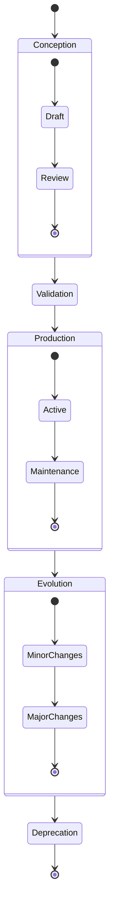
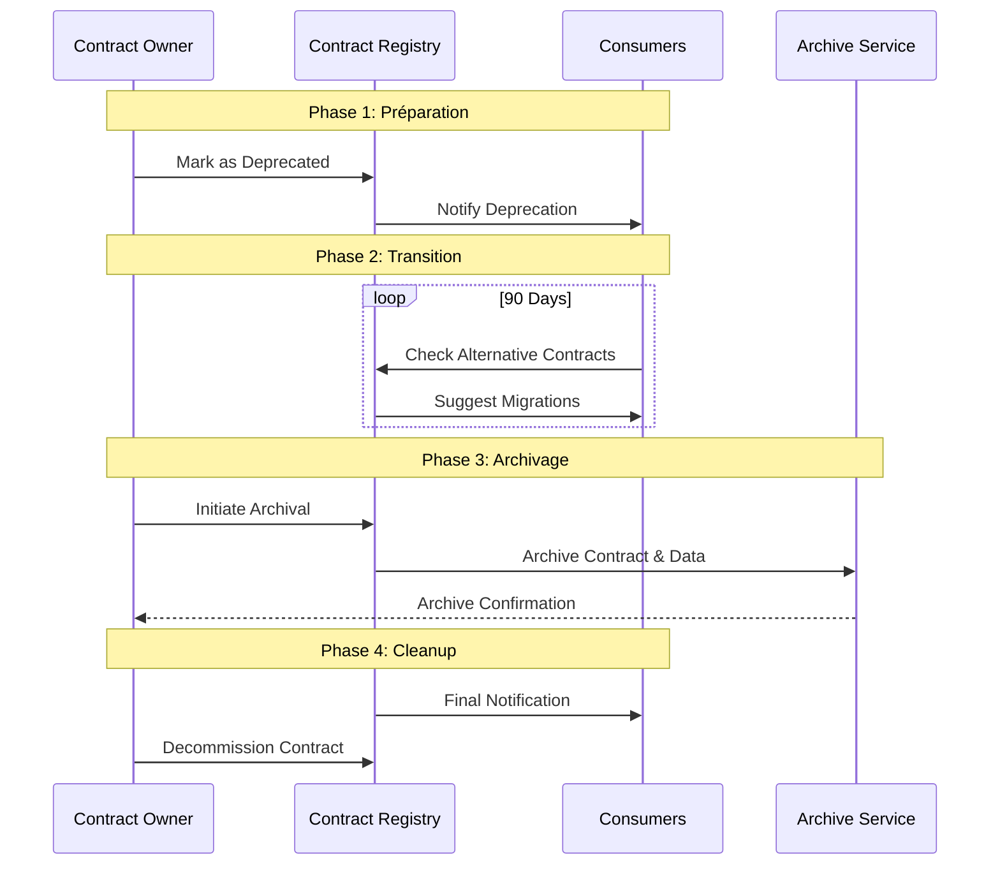

# Cycle de Vie : Au-delà du Simple YAML

Il est minuit, et une alerte retentit : un data contract critique vient d'être modifié sans suivre le processus établi. Cette situation, malheureusement courante, illustre l'importance cruciale de comprendre et de gérer correctement le cycle de vie des data contracts. Un data contract n'est pas un document statique - c'est un organisme vivant qui évolue avec votre organisation et qui nécessite une gestion rigoureuse tout au long de son existence.

## Les Phases du Cycle de Vie

Le cycle de vie d'un data contract suit un parcours bien défini, de sa conception jusqu'à sa fin de vie. Cette progression naturelle commence par une phase de conception où les besoins sont identifiés et le contrat est élaboré. Cette étape initiale est cruciale car elle pose les fondations de tout ce qui suivra. Le contrat passe ensuite par une phase de validation rigoureuse avant d'entrer en production.



Une fois en production, le contrat entre dans une phase d'évolution continue, où il s'adapte aux besoins changeants de l'organisation. Cette évolution doit être soigneusement orchestrée pour maintenir la cohérence et la qualité des données. Enfin, lorsque le contrat n'est plus pertinent, il entre dans une phase de dépréciation qui mène à sa fin de vie.

## La Structure d'un Contrat Évolutif

Pour supporter ce cycle de vie, le contrat lui-même doit être structuré de manière à capturer son évolution. Voici comment un tel contrat pourrait être structuré :

```yaml
odcs_version: "1.0.0"
id: "customer_profile"
version: "2.0.0"
status: "active"

lifecycle:
  created_at: "2023-01-15"
  last_updated: "2023-06-01"
  review_cycle: "quarterly"
  phases:
    - phase: "draft"
      start_date: "2023-01-15"
      end_date: "2023-02-01"
    - phase: "review"
      start_date: "2023-02-01"
      end_date: "2023-02-15"
    - phase: "active"
      start_date: "2023-02-15"
      
  versions:
    - version: "1.0.0"
      status: "deprecated"
      start_date: "2023-02-15"
      end_of_life: "2023-08-15"
      breaking_changes: false
      
    - version: "2.0.0"
      status: "active"
      start_date: "2023-06-01"
      breaking_changes: true
      migration_guide: "docs/migrations/v2.0.0.md"

  dependencies:
    - contract: "user_preferences"
      version: "^1.0.0"
    - contract: "payment_history"
      version: "^2.1.0"

  retention:
    duration: "7 years"
    compliance: ["GDPR", "CCPA"]
    archive_policy:
      type: "cold_storage"
      location: "s3://archive/"
```

## Gestion des Transitions

La phase de transition entre les versions d'un contrat est particulièrement délicate. Elle nécessite une orchestration minutieuse pour éviter toute perturbation des systèmes en production. Cette orchestration commence par une période de double écriture, où les données sont écrites simultanément dans l'ancienne et la nouvelle version du contrat. Cette approche permet de valider la nouvelle version tout en maintenant la stabilité des systèmes existants.



## La Fin de Vie d'un Contrat

La fin de vie d'un contrat doit être gérée avec autant de soin que sa création. Cette phase commence par une période de dépréciation où les consommateurs sont progressivement migrés vers des alternatives. Une fois tous les consommateurs migrés, le contrat peut être archivé, mais ses métadonnées et son historique doivent être préservés pour maintenir la traçabilité et la conformité réglementaire.

## Conclusion

La gestion du cycle de vie des data contracts est un aspect fondamental de toute stratégie de gouvernance des données. Elle requiert une approche systématique et une attention constante aux besoins des producteurs et des consommateurs de données. Une bonne gestion du cycle de vie permet non seulement d'assurer la qualité et la fiabilité des données, mais aussi de faciliter l'évolution des systèmes tout en maintenant la confiance des utilisateurs.

Dans le prochain article, nous explorerons comment ces pratiques de gestion du cycle de vie s'intègrent dans une stratégie plus large de gouvernance des données, et comment elles contribuent à la création d'une culture data mature au sein de l'organisation.