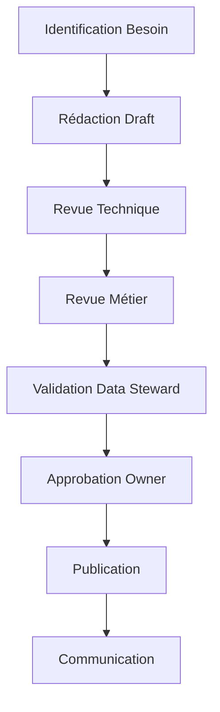

# Gouvernance et Adoption des Data Contracts : L'Aspect Humain

La réussite d'une initiative de data contracts ne repose pas uniquement sur des aspects techniques. L'organisation humaine, la gouvernance et l'adoption par les équipes sont des facteurs critiques de succès. Dans cet article, je partage mon expérience sur la mise en place d'une gouvernance efficace et les stratégies d'adoption qui fonctionnent.

## Organisation et Rôles

La clarté des rôles est essentielle pour une gouvernance efficace des data contracts. Voici les rôles clés que nous avons identifiés :

### Data Contract Owner

```yaml
role: Data Contract Owner
responsibilities:
  - Définition de la stratégie des data contracts
  - Arbitrage des conflits
  - Validation des changements majeurs
  - Supervision de la qualité globale
skills_required:
  - Vision stratégique data
  - Compréhension des enjeux métier
  - Capacité de décision
reporting_to: Chief Data Officer
```

### Data Architect

```yaml
role: Data Architect
responsibilities:
  - Conception de l'architecture technique
  - Définition des patterns de contracts
  - Établissement des standards techniques
  - Pilotage de l'évolution architecturale
skills_required:
  - Expertise technique approfondie
  - Expérience en conception de systèmes
  - Connaissance transverse des domaines
  - Maîtrise des patterns d'architecture
reporting_to: Directeur Technique
key_collaborations:
  - Data Contract Owner
  - Product Manager
  - Data Engineers
```

### Product Manager

```yaml
role: Product Manager
responsibilities:
  - Stratégie des produits de données
  - Analyse des besoins utilisateurs
  - Priorisation des fonctionnalités
  - Gestion des parties prenantes
skills_required:
  - Expertise en gestion de produit
  - Connaissance du domaine data
  - Focus expérience utilisateur
  - Pensée stratégique
reporting_to: Responsable des Produits Data
key_collaborations:
  - Data Architect
  - Data Contract Owner
  - Utilisateurs Métier
```

### Data Steward

```yaml
role: Data Steward
responsibilities:
  - Maintenance des contracts
  - Documentation et standards
  - Formation des équipes
  - Suivi de la qualité
skills_required:
  - Expertise technique data
  - Compétences pédagogiques
  - Rigueur méthodologique
reporting_to: Data Contract Owner
```

### Data Engineer

```yaml
role: Data Engineer
responsibilities:
  - Implémentation technique
  - Tests et validation
  - Monitoring opérationnel
  - Évolution des schémas
skills_required:
  - Expertise en ingénierie data
  - Maîtrise des outils de test
  - Compréhension des patterns d'architecture
reporting_to: Technical Lead
```

### Data Consumer

```yaml
role: Data Consumer
responsibilities:
  - Respect des contracts
  - Remontée des besoins
  - Participation aux revues
  - Validation fonctionnelle
skills_required:
  - Compréhension métier
  - Capacité d'analyse
  - Communication
reporting_to: Business Unit Lead
```

## Processus de Gouvernance

### Création et Approbation

Le processus de création et d'approbation des contracts suit un workflow structuré :



### Workflow de Validation

```python
class ContractWorkflow:
    def __init__(self, contract_draft):
        self.draft = contract_draft
        self.status = "draft"
        self.approvals = {}
        
    def submit_for_review(self):
        """Soumet le contract pour revue"""
        self.status = "in_review"
        self.notify_reviewers()
        
    def approve(self, reviewer_role, comments=None):
        """Enregistre une approbation"""
        self.approvals[reviewer_role] = {
            'approved_at': datetime.now(),
            'comments': comments
        }
        
    def is_fully_approved(self):
        """Vérifie si toutes les approbations sont obtenues"""
        required_roles = {'technical', 'business', 'steward', 'owner'}
        return required_roles.issubset(self.approvals.keys())
```

### Monitoring et Reporting

Le suivi de la gouvernance s'appuie sur des métriques clés :

```python
class GovernanceMetrics:
    def calculate_adoption_rate(self):
        """Calcule le taux d'adoption des contracts"""
        return {
            'total_contracts': self.count_total_contracts(),
            'active_contracts': self.count_active_contracts(),
            'compliance_rate': self.calculate_compliance_rate(),
            'quality_score': self.calculate_quality_score()
        }
        
    def generate_governance_report(self):
        """Génère un rapport de gouvernance"""
        return {
            'metrics': self.calculate_adoption_rate(),
            'violations': self.get_contract_violations(),
            'pending_reviews': self.get_pending_reviews(),
            'quality_trends': self.analyze_quality_trends()
        }
```

## Stratégies d'Adoption

### Centre d'Excellence

La mise en place d'un Centre d'Excellence (CoE) est cruciale :

```python
class DataContractCoE:
    def provide_templates(self):
        """Fournit des templates standardisés"""
        return {
            'basic_contract': self.load_template('basic'),
            'event_contract': self.load_template('event'),
            'api_contract': self.load_template('api')
        }
        
    def deliver_training(self):
        """Organise les formations"""
        training_modules = [
            'contract_basics',
            'quality_rules',
            'migration_patterns',
            'best_practices'
        ]
        return self.schedule_training(training_modules)
```

### Programme de Formation

Un programme de formation structuré est essentiel :

```yaml
training_program:
  modules:
    - name: "Fondamentaux des Data Contracts"
      duration: "1 jour"
      target_audience: "Tous"
      
    - name: "Implémentation Technique"
      duration: "2 jours"
      target_audience: "Data Engineers"
      
    - name: "Gouvernance et Qualité"
      duration: "1 jour"
      target_audience: "Data Stewards"
      
    - name: "Utilisation et Conformité"
      duration: "0.5 jour"
      target_audience: "Data Consumers"
```

### Métriques de Succès

Le suivi du succès de l'adoption s'appuie sur des KPIs précis :

```python
class AdoptionMetrics:
    def track_success_metrics(self):
        return {
            'contract_coverage': self.calculate_coverage(),
            'quality_improvement': self.measure_quality_trends(),
            'time_to_market': self.calculate_delivery_time(),
            'incident_reduction': self.measure_incident_reduction(),
            'team_satisfaction': self.measure_satisfaction()
        }
```

## Leçons Apprises

1. **Commencez Petit**
   - Identifiez des early adopters motivés
   - Démontrez la valeur rapidement
   - Itérez sur les retours

2. **Investissez dans la Formation**
   - Formez continuellement les équipes
   - Partagez les success stories
   - Documentez les best practices

3. **Mesurez et Communiquez**
   - Suivez les métriques d'adoption
   - Célébrez les succès
   - Apprenez des échecs

4. **Adaptez la Gouvernance**
   - Restez agile dans les processus
   - Écoutez les besoins des équipes
   - Évoluez avec la maturité

## Conclusion

La gouvernance et l'adoption des data contracts sont un voyage, pas une destination. Le succès repose sur un équilibre entre structure et flexibilité, entre contrôle et autonomie. L'investissement dans l'aspect humain est aussi important que l'excellence technique.

Cette série d'articles sur les data contracts se termine ici, mais votre voyage ne fait que commencer. Utilisez ces principes comme point de départ et adaptez-les à votre contexte spécifique.

## Implémentation de Référence

L'infrastructure de gouvernance est implémentée dans :

- [Governance](../../governance/)
  - [Workflow](../../governance/workflow.py) - Gestion des workflows
  - [CoE Config](../../governance/coe_config.yaml) - Configuration du Centre d'Excellence
- [Templates](../../contracts/templates/) - Templates de contracts 