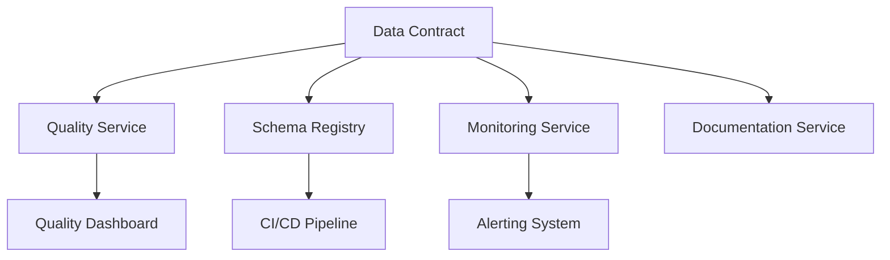

# Cycle de Vie des Data Contracts : Au-delà du YAML

La vision du data contract comme simple fichier YAML est malheureusement trop répandue dans les organisations. Cette vision réductrice limite considérablement la valeur que peuvent apporter les data contracts. En réalité, un data contract est un composant architectural complexe avec son propre cycle de vie, ses dépendances et ses responsabilités.

## Distinction Version Contrat vs Version Modèle

L'une des confusions les plus courantes concerne la gestion des versions. Il est crucial de comprendre qu'un data contract possède deux dimensions de versioning distinctes, chacune avec son propre cycle de vie et ses impacts :

```yaml
metadata:
  contract_version: 2.1.0  # Version du contrat lui-même
  schema_version: 1.0.0    # Version du modèle de données
  last_updated: "2024-03-15"
  changelog:
    - type: "contract_update"
      version: "2.1.0"
      description: "Ajout de règles de qualité sur email"
      schema_impact: false
    - type: "schema_update"
      version: "1.0.0"
      description: "Structure initiale du modèle"
      breaking_change: true
```

### Version du Contrat
La version du contrat reflète l'évolution de la gouvernance et des engagements autour des données. Elle peut changer fréquemment sans nécessiter de modifications dans les données elles-mêmes. Par exemple :
- L'ajout de nouvelles règles de qualité
- Le renforcement des SLAs
- La clarification de la documentation
- La modification des responsabilités

Ces changements sont généralement non-disruptifs et peuvent être déployés rapidement, mais ils nécessitent une communication claire avec les parties prenantes.

### Version du Modèle
La version du modèle, en revanche, concerne la structure physique des données. Ces changements sont plus délicats car ils peuvent avoir un impact direct sur les consommateurs. Ils incluent :
- L'ajout ou la suppression de champs
- La modification des types de données
- La restructuration des relations
- Les changements de format

Ces évolutions nécessitent une planification minutieuse et souvent une période de transition où plusieurs versions coexistent.

## Responsabilités et Dépendances

Un data contract n'existe pas en isolation - il est au cœur d'un écosystème de services et de responsabilités :



Cette architecture distribuée reflète un principe fondamental : le data contract définit les engagements, mais leur mise en œuvre est déléguée à des services spécialisés.

### Services Associés

1. **Quality Service**
Le service de qualité est responsable de l'exécution et du suivi des règles de qualité définies dans le contrat. Il ne s'agit pas simplement de validation technique, mais d'une véritable gouvernance de la qualité :
- Exécution régulière des règles de qualité
- Historisation des métriques pour analyse de tendances
- Détection proactive des dégradations
- Alerting intelligent avec contexte

2. **Schema Registry**
   - Validation des schémas
   - Gestion des migrations
   - Compatibilité versions

3. **Monitoring Service**
   - Suivi des SLAs
   - Métriques d'utilisation
   - Performance des transformations

4. **Documentation Service**
   - Génération automatique
   - Traçabilité des changements
   - Exemples et cas d'usage

## Cycle de Vie Complet

Le cycle de vie d'un data contract s'articule autour de plusieurs phases :

### 1. Initialisation
```python
class ContractLifecycle:
    def initialize_contract(self, domain, name):
        """Création d'un nouveau contract"""
        contract = self.create_base_structure()
        self.register_dependencies()
        self.setup_monitoring()
        self.initialize_quality_rules()
        return contract

    def register_dependencies(self):
        """Enregistrement des services associés"""
        self.quality_service.register()
        self.schema_registry.register()
        self.monitoring_service.register()
```

### 2. Evolution
```python
def evolve_contract(self, contract, change_type):
    """Gestion de l'évolution du contract"""
    if change_type == 'contract_only':
        # Mise à jour sans impact schéma
        self.update_contract_version()
        self.update_documentation()
        self.notify_stakeholders()
    elif change_type == 'schema_update':
        # Evolution avec impact données
        self.validate_schema_compatibility()
        self.plan_migration()
        self.update_dependencies()
```

### 3. Monitoring et Maintenance
```python
class ContractMonitoring:
    def monitor_health(self):
        """Suivi de la santé du contract"""
        quality_metrics = self.quality_service.get_metrics()
        usage_stats = self.monitoring_service.get_stats()
        dependencies_status = self.check_dependencies()
        
        if self.needs_attention(quality_metrics, usage_stats):
            self.trigger_maintenance_workflow()
```

## Bonnes Pratiques

1. **Séparation des Responsabilités**
   - Le contract définit le "quoi"
   - Les services implémentent le "comment"
   - Chaque composant a une responsabilité unique

2. **Automatisation**
   - Génération des services associés
   - Validation continue
   - Mise à jour documentation

3. **Gouvernance**
   - Processus de revue clair
   - Matrice de responsabilités
   - Plan de communication

## Implémentation de Référence

```python
class DataContractSystem:
    def __init__(self):
        self.contract_registry = ContractRegistry()
        self.quality_service = QualityService()
        self.schema_registry = SchemaRegistry()
        self.monitoring = MonitoringService()
        
    def deploy_contract(self, contract_def):
        """Déploiement complet d'un contract"""
        # Validation du contract
        contract = self.contract_registry.register(contract_def)
        
        # Setup des services
        self.quality_service.setup(contract)
        self.schema_registry.register_schema(contract)
        self.monitoring.initialize(contract)
        
        # Configuration monitoring
        self.setup_dashboards(contract)
        self.setup_alerts(contract)
        
        return contract.id
```

## Conclusion

Un data contract est bien plus qu'un simple fichier YAML - c'est un composant central de l'architecture data qui orchestre de nombreux services et responsabilités. Sa gestion efficace nécessite une compréhension claire de son cycle de vie complet et de son écosystème. 