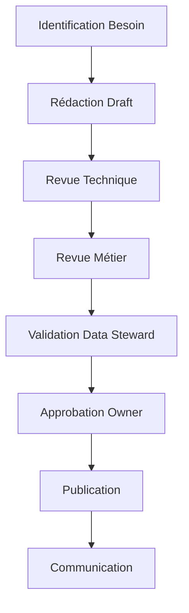

# Gouvernance et Adoption des Data Contracts : L'Aspect Humain

Le succès d'une initiative de data contracts ne repose pas uniquement sur les aspects techniques. L'organisation humaine, la gouvernance et l'adoption par les équipes sont des facteurs critiques de réussite. L'expérience montre que même les implémentations techniquement parfaites échouent sans une gouvernance appropriée et une stratégie d'adoption bien réfléchie.

## Organisation et Rôles

La clarté des rôles est essentielle pour une gouvernance efficace des data contracts. Au-delà des responsabilités formelles, c'est tout un écosystème de collaboration qui doit être mis en place. Examinons les rôles clés et leur articulation.

Le Responsable des Data Contracts, rattaché au Chief Data Officer, est le garant de la vision et de la cohérence d'ensemble. Il définit la stratégie des data contracts, résout les conflits, valide les changements majeurs et supervise la qualité globale. Son rôle est particulièrement crucial dans les moments de tension, par exemple lors de désaccords entre producteurs et consommateurs sur l'évolution des schémas. Il doit savoir équilibrer les besoins court terme des équipes avec la vision long terme de l'architecture data.

L'Architecte Data joue un rôle pivot entre vision technique et besoins métiers. Rattaché au Directeur Technique, il assure la cohérence technique des contrats entre domaines, anticipe les impacts des changements sur l'architecture globale et guide les équipes dans l'adoption des patterns appropriés. Sa forte expertise technique et sa vision transverse des domaines lui permettent d'établir les standards techniques et de gérer l'évolution architecturale de manière cohérente.

Le Product Manager apporte une dimension essentielle souvent négligée : la vision produit. Les data contracts ne sont pas que des artefacts techniques, ce sont des produits qui doivent créer de la valeur pour leurs utilisateurs. Rattaché au Responsable Produits Data, il analyse les besoins des consommateurs de données, priorise les évolutions selon la valeur business et assure l'alignement avec la stratégie produit globale. Sa compréhension des enjeux métiers et sa capacité à dialoguer avec les équipes techniques en font un acteur clé de la réussite du projet.

## Processus de Gouvernance

Le processus de création et d'approbation des contrats suit un workflow structuré :

Chaque étape de ce processus a sa raison d'être. L'identification du besoin permet de s'assurer que le contrat répond à un besoin réel. La rédaction du draft implique une collaboration étroite entre équipes techniques et métiers. Les phases de revue technique et métier permettent de valider la faisabilité et la pertinence du contrat. La validation par le Data Steward garantit le respect des standards de qualité, tandis que l'approbation finale par l'owner assure l'alignement stratégique.

## Stratégies d'Adoption

La mise en place d'un Centre d'Excellence (CoE) est cruciale. Ce n'est pas qu'une structure organisationnelle, c'est le moteur de l'adoption et de la diffusion des bonnes pratiques. Le CoE doit fournir des modèles standardisés adaptés aux différents cas d'usage, un programme de formation structuré et un support continu aux équipes.

La formation n'est pas une étape optionnelle mais un pilier du succès. L'expérience montre qu'un programme de formation efficace doit s'adapter aux différents profils et niveaux de maturité. Pour les débutants, une formation d'une journée sur les fondamentaux permet de comprendre la valeur business des contrats et les concepts essentiels. Les data engineers bénéficient d'une formation technique approfondie de deux jours, tandis que les data stewards se concentrent sur les aspects de gouvernance et de qualité. Les consommateurs de données reçoivent une formation ciblée sur l'usage des contrats et la conformité.

## Le Chemin vers le Succès

Le succès de l'adoption des data contracts repose sur une approche progressive et itérative. Il est crucial de commencer avec un périmètre limité mais significatif, où la valeur peut être rapidement démontrée. Les early adopters doivent être choisis avec soin : des équipes motivées, sur des cas d'usage critiques mais maîtrisés.

Le suivi du succès ne doit pas se limiter aux métriques techniques. Il est crucial de mesurer également l'impact business et organisationnel à travers la couverture des données critiques par des contrats, l'amélioration de la qualité des données, la réduction du temps de mise sur le marché des nouvelles analyses, la diminution des incidents liés aux données et la satisfaction des équipes. Ces métriques doivent être analysées dans leur contexte et servir de base à l'amélioration continue du programme.

## Conclusion

La gouvernance et l'adoption des data contracts est un voyage, pas une destination. Le succès repose sur un équilibre entre structure et flexibilité, entre contrôle et autonomie. L'investissement dans l'aspect humain est aussi important que l'excellence technique.

Cette série d'articles sur les data contracts s'achève ici, mais votre voyage ne fait que commencer. Utilisez ces principes comme point de départ et adaptez-les à votre contexte spécifique. La réussite de votre initiative data contracts dépendra de votre capacité à créer une véritable culture data au sein de votre organisation, où la qualité et la fiabilité des données sont l'affaire de tous.