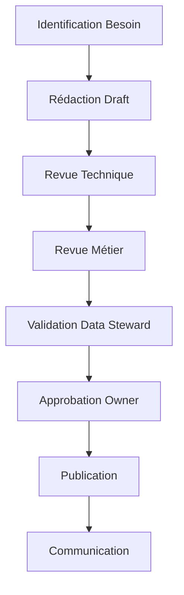

# Gouvernance et adoption des data contracts : l'aspect humain

L'équipe data science vient de terminer une présentation tendue devant le comité exécutif. Leurs prévisions de ventes pour le Black Friday étaient largement surestimées, causant un surstock coûteux. L'analyse révèle que le changement des règles de calcul du panier moyen, bien que documenté dans un ticket Jira, n'avait jamais été communiqué aux équipes d'analyse. Cette situation, malheureusement courante dans le retail, illustre pourquoi la gouvernance des data contracts ne peut pas se résumer à des aspects purement techniques.

## Pourquoi commencer par la gouvernance ?

Le succès d'une initiative de data contracts ne repose pas uniquement sur les aspects techniques. L'expérience montre que la plupart des échecs ne sont pas dus à des problèmes techniques, mais à des facteurs humains et organisationnels. Voici les patterns d'échec les plus fréquents :

- **Le contournement silencieux** : Les équipes, pressées par les délais, créent des "solutions de contournement" en dehors du système de contracts. Ces chemins parallèles deviennent progressivement la norme, rendant les contracts obsolètes.

- **La résistance passive** : Les équipes suivent les processus à minima, remplissant les contracts de manière superficielle sans réelle adhésion aux principes de qualité et de documentation.

- **L'absence d'ownership** : Sans responsabilités clairement définies, les contracts deviennent des documents orphelins que personne ne maintient ni ne fait évoluer.

- **La bureaucratie excessive** : À l'inverse, une gouvernance trop rigide pousse les équipes à voir les contracts comme un frein plutôt qu'un outil d'amélioration.

Prenons un exemple concret dans le retail : une équipe marketing a besoin urgent d'analyser le comportement client pour une campagne Black Friday. Le processus officiel de modification du contract prendrait deux semaines. Que se passe-t-il souvent ? L'équipe créé une copie locale des données, modifie les schémas sans documentation, et le travail est fait en urgence. Cette "exception" devient rapidement la règle, créant une dette technique invisible mais croissante.

C'est pourquoi la gouvernance doit être pensée dès le début, non pas comme un cadre restrictif, mais comme un facilitateur qui :
- Rend le "chemin vertueux" plus facile que les contournements
- Équilibre agilité et contrôle
- Responsabilise plutôt que restreint
- Valorise la collaboration plutôt que la contrainte

## Organisation et rôles

La clarté des rôles est essentielle pour une gouvernance efficace des data contracts. Au-delà des responsabilités formelles, c'est tout un écosystème de collaboration qui doit être mis en place. Examinons les rôles clés et leur articulation.

Dans un contexte de data mesh, où chaque domaine est autonome dans la production et la consommation de données, cette clarté des rôles devient encore plus critique :

Le Responsable des Data Contracts, rattaché au Chief Data Officer, est le garant de la vision et de la cohérence d'ensemble. Il définit la stratégie des data contracts, résout les conflits, valide les changements majeurs et supervise la qualité globale. Son rôle est particulièrement crucial dans les moments de tension, par exemple lors de désaccords entre producteurs et consommateurs sur l'évolution des schémas. Il doit savoir équilibrer les besoins court terme des équipes avec la vision long terme de l'architecture data.

L'Architecte Data joue un rôle pivot entre vision technique et besoins métiers. Rattaché au Directeur Technique, il assure la cohérence technique des contrats entre domaines, anticipe les impacts des changements sur l'architecture globale et guide les équipes dans l'adoption des patterns appropriés. Sa forte expertise technique et sa vision transverse des domaines lui permettent d'établir les standards techniques et de gérer l'évolution architecturale de manière cohérente.

Le Product Manager apporte une dimension essentielle souvent négligée : la vision produit. Les data contracts ne sont pas que des artefacts techniques, ce sont des produits qui doivent créer de la valeur pour leurs utilisateurs. Rattaché au Responsable Produits Data, il analyse les besoins des consommateurs de données, priorise les évolutions selon la valeur business et assure l'alignement avec la stratégie produit globale. Sa compréhension des enjeux métiers et sa capacité à dialoguer avec les équipes techniques en font un acteur clé de la réussite du projet.

En résume, les rôles clés sont :
- Le **Data Engineer** implémente les contrats et assure leur intégration technique.
- Le **Data Architect** garantit la cohérence globale des contrats avec l'architecture data.
- Le **Data Quality Analyst** surveille et analyse la conformité aux contrats.
- Le **Data Governance Officer** supervise l'application des politiques de gouvernance.
- Le **Contract Registry Admin** gère l'infrastructure du registry et les accès.

## Processus de Gouvernance

Le processus de gouvernance est le cœur battant d'une stratégie de data contracts réussie. Dans un data mesh, où les contrats deviennent l'interface principale entre les domaines, ce processus prend une importance particulière. Il ne s'agit pas d'une simple suite d'étapes administratives, mais d'un parcours collaboratif qui garantit la qualité et la pertinence des contrats.

Prenons l'exemple d'un nouveau contrat pour les données de ventes en retail :

Le processus commence par l'**identification du besoin**. L'équipe marketing souhaite analyser les patterns d'achat par région. Cette demande déclenche une phase de découverte où les besoins sont précisément documentés et les impacts évalués.

La **rédaction du draft** est un exercice collaboratif qui commence par l'intervention du Data Architect. Celui-ci travaille avec l'équipe marketing pour :
- Comprendre les besoins d'analyse et les traduire en exigences techniques
- Évaluer l'impact sur l'architecture data existante
- Identifier les patterns à appliquer et les contrats similaires
- Définir les règles de qualité et les SLAs appropriés

Une fois ce cadre posé, les Data Engineers peuvent implémenter le contrat en suivant les directives architecturales. Cette collaboration précoce avec l'architecte évite les problèmes d'intégration ultérieurs et garantit la cohérence avec le reste du système.

Les phases de **revue technique et métier** sont cruciales. L'équipe technique vérifie la faisabilité, les performances et la compatibilité avec l'architecture existante. Les experts métier s'assurent que les définitions sont correctes et que toutes les dimensions d'analyse nécessaires sont présentes.

La **validation par le Data Steward** va au-delà d'une simple vérification. Le Data Steward examine la cohérence avec les autres contrats du domaine, vérifie l'alignement avec les standards de l'entreprise et évalue l'impact sur la gouvernance des données.

L'**approbation finale** par l'owner n'est pas qu'une formalité. C'est une validation stratégique qui confirme que le contrat s'aligne avec les objectifs de l'organisation et respecte les contraintes budgétaires et réglementaires.

Enfin, la **phase de communication** est souvent sous-estimée mais essentielle. Elle inclut la notification aux parties prenantes, la mise à jour de la documentation et l'organisation de sessions d'information si nécessaire.

## Stratégies d'adoption

La mise en place d'un Centre d'Excellence (CoE) est cruciale. Ce n'est pas qu'une structure organisationnelle, c'est le moteur de l'adoption et de la diffusion des bonnes pratiques. Le CoE doit fournir des modèles standardisés adaptés aux différents cas d'usage, un programme de formation structuré et un support continu aux équipes.

Dans l'architecture data mesh, le CoE joue un rôle particulier :
- Il établit les standards interdomaines pour garantir l'interopérabilité
- Il facilite le partage des bonnes pratiques entre domaines autonomes
- Il assure la cohérence globale tout en respectant l'autonomie des domaines
- Il promeut la réutilisation des patterns qui ont fait leurs preuves

La formation n'est pas une étape optionnelle mais un pilier du succès. L'expérience montre qu'un programme de formation efficace doit s'adapter aux différents profils et niveaux de maturité. Pour les débutants, une formation d'une journée sur les fondamentaux permet de comprendre la valeur business des contrats et les concepts essentiels. Les data engineers bénéficient d'une formation technique approfondie de deux jours, tandis que les data stewards se concentrent sur les aspects de gouvernance et de qualité. Les consommateurs de données reçoivent une formation ciblée sur l'usage des contrats et la conformité.

## Le chemin vers le succès

Le succès de l'adoption des data contracts repose sur une approche progressive et itérative. Il est crucial de commencer avec un périmètre limité mais significatif, où la valeur peut être rapidement démontrée. Les early adopters doivent être choisis avec soin : des équipes motivées, sur des cas d'usage critiques mais maîtrisés.

Dans un data mesh, il est recommandé de :
- Commencer avec un domaine pilote bien défini
- Établir des success stories avant d'étendre à d'autres domaines
- Utiliser les retours d'expérience pour affiner la gouvernance
- Encourager l'émulation positive entre domaines

Le suivi du succès ne doit pas se limiter aux métriques techniques. Il est crucial de mesurer également l'impact business et organisationnel à travers la couverture des données critiques par des contrats, l'amélioration de la qualité des données, la réduction du temps de mise sur le marché des nouvelles analyses, la diminution des incidents liés aux données et la satisfaction des équipes. Ces métriques doivent être analysées dans leur contexte et servir de base à l'amélioration continue du programme.

## Conclusion

La gouvernance et l'adoption des data contracts est un voyage, pas une destination. Le succès repose sur un équilibre entre structure et flexibilité, entre contrôle et autonomie. L'investissement dans l'aspect humain est aussi important que l'excellence technique.

Cette série d'articles sur les data contracts s'achève pour l'instant ici, mais votre voyage ne fait que commencer. Utilisez ces principes comme point de départ et adaptez-les à votre contexte spécifique. Si le besoin s'en fait ressentir, nous pourrons enrichir cette série avec d'autres articles explorant des aspects spécifiques ou de nouveaux retours d'expérience. La réussite de votre initiative data contracts dépendra de votre capacité à créer une véritable culture data au sein de votre organisation, où la qualité et la fiabilité des données sont l'affaire de tous.