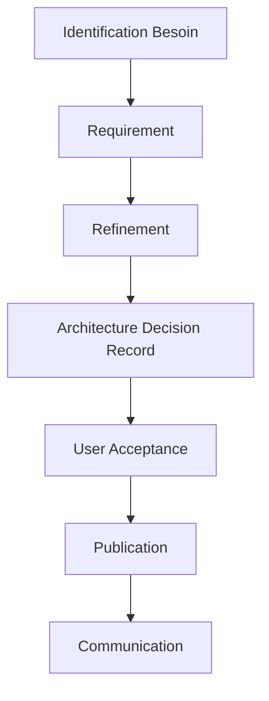

# Garantir l'adoption des data contracts à l'échelle d'une organisation

L'équipe data science vient de terminer une présentation tendue devant le comité exécutif. Leurs prévisions de ventes pour le Black Friday étaient largement surestimées, causant un surstock coûteux. L'analyse révèle que le changement des règles de calcul du panier moyen, bien que documenté dans un ticket Jira, n'avait jamais été communiqué aux équipes d'analyse. Dans cette situation, un bon contrat aurait permis de :

- Documenter le changement de manière explicite : le contrat formalise l’évolution du modèle.
- Notifier les consommateurs : un processus structuré d’information aurait obligé l’équipe productrice à alerter les consommateurs des données.
- Gérer l’impact opérationnel : la responsabilité du producteur aurait inclus une évaluation des conséquences et un accompagnement pour adapter les usages.

Dans ce contexte, le contrat intègre des mécanismes de gouvernance essentiels, comme le contrôle et la communication. Il les ancre dès la conception, directement au sein des outils utilisés par les équipes. En théorie, cela facilite l’adoption naturelle des bonnes pratiques de gouvernance, en les rendant accessibles et intuitives. En pratique, commencer par la gouvernance peut permettre de structurer les interactions entre producteurs et consommateurs de données, dans certaines conditions.

## Pourquoi et comment commencer par la gouvernance ?

Le succès d'une initiative de data contracts ne repose pas uniquement sur les aspects techniques. L'expérience montre que la plupart des échecs ne sont pas dus à des problèmes techniques, mais à des facteurs humains et organisationnels. Voici les patterns d'échec les plus fréquents :

- **Le contournement silencieux** : Les équipes, pressées par les délais, créent des "solutions de contournement" en dehors du système de contracts. Ces chemins parallèles deviennent progressivement la norme, rendant les contracts obsolètes.

- **La résistance passive** : Les équipes suivent les processus à minima, remplissant les contracts de manière superficielle sans réelle adhésion aux principes de qualité et de documentation.

- **L'absence d'ownership** : Sans responsabilités fonctionnelles clairement définies, les contracts deviennent des documents orphelins que personne ne maintient ni ne fait évoluer.

- **La bureaucratie excessive** : À l'inverse, une gouvernance trop rigide pousse les équipes à voir les contracts comme un frein plutôt qu'un outil d'amélioration.

Prenons un exemple concret : une équipe marketing a besoin urgent d'analyser le comportement client pour une campagne Black Friday. Travailler en transverse en suivant le processus officiel prend deux semaines. Que se passe-t-il souvent ? L'équipe créé une copie locale des données, choisi de ne pas consommer les contrats de la source et modifie les schémas sans documentation. Cette "exception" devient rapidement la règle, créant une dette fonctionnelle et technique croissante.

Le contrat doit être pensé dès sa conception, par un organe facilitateur (governance-as-a-service) qui :
- Rend le "chemin vertueux" plus facile que les contournements
- Répond à un besoin opérationnel
- Facilite la collaboration entre producteurs et consommateurs
- Responsabilise

Une équipe de governance-as-a-service doit travailler sur deux axes clés pour démontrer l’intérêt du contrat : la stratégie organisationnelle et les processus opérationnels.

Sur le plan stratégique, elle doit clarifier les rôles et responsabilités entre producteurs et consommateurs de données, en instaurant des standards clairs sur la documentation, la communication des changements et la gestion des impacts. Cela implique d’accompagner les équipes dans l’adoption de pratiques comme les contrats de données, qui garantissent un alignement explicite entre production et usage. 

Côté processus, l’équipe doit intégrer ces contrats directement dans les workflows des équipes métiers et tech, via des outils et automatisations qui rendent la gouvernance fluide et non contraignante. En structurant ces mécanismes, la gouvernance devient un levier d’efficacité plutôt qu’une contrainte administrative.

# Fondements pratiques de l'approche

## Organisation et rôles

Une gouvernance efficace des data contracts repose avant tout sur une définition claire des rôles. Au-delà des responsabilités formelles, il s’agit de structurer un véritable écosystème collaboratif, où chaque acteur joue un rôle clé dans la fiabilité et l’évolution des contrats. Dans un environnement décentralisé, où chaque domaine gère de manière autonome la production et la consommation de données, une articulation précise des rôles et de leurs interactions devient essentielle.

En ce qui concerne la vision autour du produit:
- Le **Data Product Owner** s'assure de l'alignement entre usages et réalité opérationnelle.
- Le **Data Architect** s’assure que les produits s’intègrent de manière cohérente à l’architecture globale des données.
- Le **Product Manager** du producteur de la donnée pilote les évolutions des processus métiers.

En ce qui concerne la vision autour du contrat:
- Le **Data Engineer** implémente les contrats et assure leur intégration technique.
- Le **Data Owner** définit la stratégie data du domaine, veille à ce que les contrats répondent aux enjeux business et arbitre en cas de conflits entre producteurs et consommateurs.
- Le **Data Quality Analyst** surveille la conformité des données aux exigences définies dans les contrats et analyse les écarts.

En ce qui concerne l'implémentation et l'évolution du framework de contrat: 
- Le **Data Governance Officer** supervise l'application des politiques de gouvernance.
- Le **Contract Registry Admin** administre l’infrastructure du registre des contrats et gère les accès pour assurer une utilisation sécurisée et efficace.

## Processus de Gouvernance

Le processus de gouvernance est le cœur battant d'une stratégie de data contracts réussie. Dans un data mesh, où les contrats deviennent l'interface principale entre les domaines, ce processus prend une importance particulière. Il ne s'agit pas d'une simple suite d'étapes administratives, mais d'un parcours collaboratif qui garantit la qualité et la pertinence des contrats.

Prenons l'exemple d'un nouveau contrat pour les données de ventes dans le retail :

Le processus commence par l'**identification du besoin**. L'équipe marketing souhaite analyser les patterns d'achat par région. Cette demande déclenche une phase de découverte où les besoins sont précisément documentés et les impacts évalués.

La **rédaction du requirement** est un exercice collaboratif qui commence par l'intervention du Data Product Owner. Celui-ci travaille avec l'équipe marketing pour :
- Comprendre les besoins d'analyse et les traduire en exigences techniques
- Évaluer l'impact sur l'architecture data existante
- Identifier les patterns à appliquer et les contrats similaires
- Définir les règles de qualité et les SLAs appropriés

Une **phase de refinement** permet aux Data Engineers, Data Stewards, Data Quality Analysts et aux Data Architects de s'assurer de la compréhension du domaine métier et de la faisabilité du requirement. Le Data Steward examine la cohérence avec les autres contrats du domaine, vérifie l'alignement avec les standards de l'entreprise et évalue l'impact sur la gouvernance des données. Le Data Owner confirme que le contrat s'aligne avec les objectifs et contraintes de l'organisation.

Une fois ce cadre posé, les Data Engineers peuvent implémenter le contrat en suivant les directives architecturales (Architecture Decision Record). Cette collaboration précoce avec l'architecte évite les problèmes d'intégration ultérieurs et garantit la cohérence avec le reste du système.

L' **approbation** par les utilisateurs n'est pas qu'une formalité. C'est une validation stratégique qui confirme l'usage et permet aux consommateurs d'explorer la donnée. On compte Stewards et Owners comme consommateurs de la donnée.

Enfin, la **phase de communication** est souvent sous-estimée mais essentielle. Elle inclut la notification aux parties prenantes, la mise à jour de la documentation et l'organisation de sessions d'information si nécessaire.

## Stratégies d'adoption

La mise en place d'une équipe d'enabling est cruciale. Ce n'est pas qu'une structure organisationnelle, c'est le moteur de l'adoption et de la diffusion des bonnes pratiques. L'enabling team doit fournir des modèles standardisés adaptés aux différents cas d'usage, un programme de formation structuré et un support continu aux équipes.

Pour construire une architecture décentralisée, l'enabling team joue un rôle particulier :
- Il établit les standards interdomaines pour garantir l'interopérabilité
- Il facilite le partage des bonnes pratiques entre domaines autonomes
- Il assure la cohérence globale tout en respectant l'autonomie des domaines
- Il promeut la réutilisation des patterns qui ont fait leurs preuves

La formation n'est pas une étape optionnelle mais un pilier du succès. L'expérience montre qu'un programme de formation efficace doit s'adapter aux différents profils et niveaux de maturité. Pour les débutants, une formation d'une journée sur les fondamentaux permet de comprendre la valeur business des contrats et les concepts essentiels. Les data engineers bénéficient d'une formation technique approfondie de deux jours, tandis que les data stewards se concentrent sur les aspects de gouvernance et de qualité. Les consommateurs de données reçoivent une formation ciblée sur l'usage des contrats et la conformité.

## Le chemin vers le succès

Le succès de l'adoption des data contracts repose sur une approche progressive et itérative. Il est crucial de commencer avec un périmètre limité mais significatif, où la valeur peut être rapidement démontrée. Les early adopters doivent être choisis avec soin : des équipes motivées, sur des cas d'usage critiques mais maîtrisés.

Dans un data mesh, il est recommandé de :
- Commencer avec un domaine pilote bien défini
- Établir des success stories avant d'étendre à d'autres domaines
- Utiliser les retours d'expérience pour affiner la gouvernance
- Encourager l'émulation positive entre domaines

Le suivi du succès ne doit pas se limiter aux métriques techniques. Il est crucial de mesurer également l'impact business et organisationnel à travers la couverture des données critiques par des contrats, l'amélioration de la qualité des données, la réduction du temps de mise sur le marché des nouvelles analyses, la diminution des incidents liés aux données et la satisfaction des équipes. Ces métriques doivent être analysées dans leur contexte et servir de base à l'amélioration continue du programme.

## Conclusion

La gouvernance et l'adoption des data contracts est un voyage, pas une destination. Le succès repose sur un équilibre entre structure et flexibilité, entre contrôle et autonomie. L'investissement dans l'aspect humain est aussi important que l'excellence technique.

Cette série d'articles sur les data contracts s'achève pour l'instant ici, mais votre voyage ne fait que commencer. Utilisez ces principes comme point de départ et adaptez-les à votre contexte spécifique. Si le besoin s'en fait ressentir, nous pourrons enrichir cette série avec d'autres articles explorant des aspects spécifiques ou de nouveaux retours d'expérience. La réussite de votre initiative data contracts dépendra de votre capacité à créer une véritable culture data au sein de votre organisation, où la qualité et la fiabilité des données sont l'affaire de tous.
